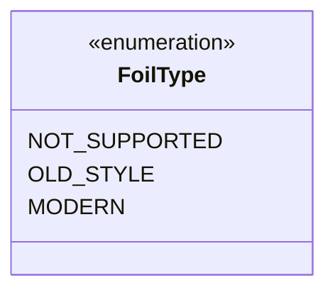

---
aliases:
  - FoilType
tags:
  - java/enum
  - module/forge-core
  - pkg/forge/card
fqn: forge.card.CardEdition.FoilType
package: forge.card
module: forge-core
kind: Enum
---

# FoilType

**Package:** `forge.card`   **Module:** `forge-core`   **Kind:** Enum



## Design Description

The `FoilType` enum classifies the foil-printing convention available for a Magic card edition, mapping each set to one of three eras: `NOT_SUPPORTED` for sets predating Urza's Legacy, `OLD_STYLE` for sets up through 8th Edition, and `MODERN` for 8th Edition and newer. Nested within `CardEdition`, it serves as a small, fixed type-safe vocabulary that lets the enclosing class record and reason about how foils are rendered for a given edition rather than relying on raw flags or magic constants. Its inline comments anchor each constant to a concrete historical boundary in the game's printing history, encoding domain knowledge directly into the type so callers can branch on foil behavior with compile-time safety.

## Source
`forge-core/src/main/java/forge/card/CardEdition.java` — declaration excerpt

```java
    public enum FoilType {
        NOT_SUPPORTED, // sets before Urza's Legacy
        OLD_STYLE, // sets between Urza's Legacy and 8th Edition
        MODERN // 8th Edition and newer
    }
```
