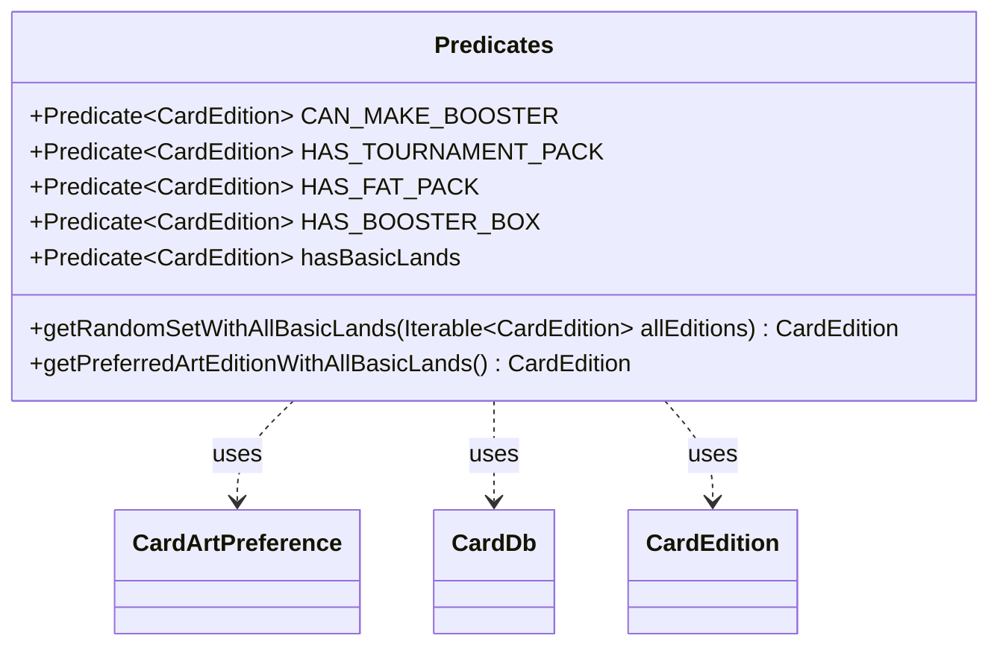

---
aliases:
  - Predicates
tags:
  - java/class
  - module/forge-core
  - pkg/forge/card
fqn: forge.card.CardEdition.Predicates
package: forge.card
module: forge-core
kind: Class
---

# Predicates

**Package:** `forge.card`   **Module:** `forge-core`   **Kind:** Class



## Relationships
**Uses:**
- [[forge.card.CardDb|CardDb]]
- [[forge.card.CardDb.CardArtPreference|CardArtPreference]]
- [[forge.card.CardEdition|CardEdition]]

## Design Description

Predicates is a static nested utility class within `CardEdition` that centralizes reusable selection logic over card sets. It exposes a family of `Predicate<CardEdition>` constants — `CAN_MAKE_BOOSTER`, `HAS_TOURNAMENT_PACK`, `HAS_FAT_PACK`, `HAS_BOOSTER_BOX`, and the deprecated `hasBasicLands` — that test whether an edition supports a given product type, intended for use as filters over collections of editions. Alongside these, it provides helper methods that resolve concrete editions: a random basic-land set, and the art-preference-aware `getPreferredArtEditionWithAllBasicLands`.

Acting as a stateless namespace rather than an instantiable type, it collaborates with `StaticData` to reach the global edition registry and with `CardDb.CardArtPreference` to honor the user's latest-first/oldest-first art ordering when choosing a basic-land source. The deprecation of `hasBasicLands` in favor of a direct `CardEdition::hasBasicLands` call with an explicit null check signals an intended migration away from null-tolerant predicates toward clearer null handling at call sites.

## Source
`forge-core/src/main/java/forge/card/CardEdition.java` — declaration excerpt

```java
    public static class Predicates {
        public static final Predicate<CardEdition> CAN_MAKE_BOOSTER = CardEdition::hasBoosterTemplate;

        public static CardEdition getRandomSetWithAllBasicLands(Iterable<CardEdition> allEditions) {
            return Aggregates.random(IterableUtil.filter(allEditions, hasBasicLands));
        }

        public static CardEdition getPreferredArtEditionWithAllBasicLands() {
            CardDb.CardArtPreference artPreference = StaticData.instance().getCardArtPreference();
            Iterable<CardEdition> editionsWithBasicLands = IterableUtil.filter(
                    StaticData.instance().getEditions().getOrderedEditions(),
                    hasBasicLands.and(artPreference::accept));
            Iterator<CardEdition> editionsIterator = editionsWithBasicLands.iterator();
            List<CardEdition> selectedEditions = new ArrayList<>();
            while (editionsIterator.hasNext())
                selectedEditions.add(editionsIterator.next());
            if (selectedEditions.isEmpty())
                return null;
            int editionIndex = artPreference.latestFirst ? 0 : selectedEditions.size() - 1;
            return selectedEditions.get(editionIndex);
        }

        public static final Predicate<CardEdition> HAS_TOURNAMENT_PACK = edition -> StaticData.instance().getTournamentPacks().contains(edition.getCode());

        public static final Predicate<CardEdition> HAS_FAT_PACK = edition -> edition.getFatPackCount() > 0;

        public static final Predicate<CardEdition> HAS_BOOSTER_BOX = edition -> edition.getBoosterBoxCount() > 0;

        @Deprecated //Use CardEdition::hasBasicLands and a nonnull test.
        public static final Predicate<CardEdition> hasBasicLands = ed -> {
            if (ed == null) {
                // Happens for new sets with "???" code
                return false;
            }
            return ed.hasBasicLands();
        };
    }
```
