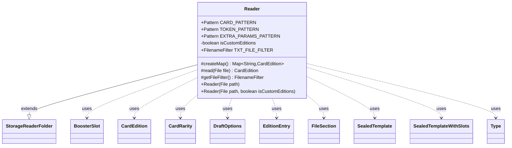

---
aliases:
  - Reader
tags:
  - java/class
  - module/forge-core
  - pkg/forge/card
fqn: forge.card.CardEdition.Reader
package: forge.card
module: forge-core
kind: Class
---

# Reader

**Package:** `forge.card`   **Module:** `forge-core`   **Kind:** Class



## Relationships
**Extends:**
- [[forge.util.storage.StorageReaderFolder|StorageReaderFolder]]
**Uses:**
- [[forge.card.CardEdition|CardEdition]]
- [[forge.card.CardEdition.EditionEntry|EditionEntry]]
- [[forge.card.CardEdition.Type|Type]]
- [[forge.card.CardRarity|CardRarity]]
- [[forge.card.DraftOptions|DraftOptions]]
- [[forge.item.BoosterSlot|BoosterSlot]]
- [[forge.item.SealedTemplate|SealedTemplate]]
- [[forge.item.SealedTemplateWithSlots|SealedTemplateWithSlots]]
- [[forge.util.FileSection|FileSection]]

## Design Description

`CardEdition.Reader` is a nested concrete reader that loads set definitions from the filesystem into `CardEdition` objects. Extending `StorageReaderFolder<CardEdition>`, it scans a folder for `.txt` files (via `TXT_FILE_FILTER`) and keys each parsed edition by its set code, overriding `createMap()` to store them in a case-insensitive `TreeMap`. Its core `read(File)` method parses Forge's sectioned set-definition format: precompiled regexes (`CARD_PATTERN`, `TOKEN_PATTERN`, `EXTRA_PARAMS_PATTERN`) split each line into collector number, rarity, name, artist, and JSON-style extra parameters, building `EditionEntry` collections for cards, tokens, and other printings.

Beyond card lists, it interprets a metadata section to populate booster, foil, draft, and packaging configuration — constructing `SealedTemplate`/`SealedTemplateWithSlots` booster templates, `BoosterSlot` definitions, `DraftOptions`, and resolving the edition `Type`. The `isCustomEditions` flag forces third-party sets to `CUSTOM_SET`, isolating user content from official data. Notably, the regexes deliberately use numbered rather than named groups to remain compatible with older Android runtimes, and parsing is defensively lenient, skipping or warning on malformed lines rather than failing the load.

## Source
`forge-core/src/main/java/forge/card/CardEdition.java` — declaration excerpt

```java
    public static class Reader extends StorageReaderFolder<CardEdition> {

        public static final Pattern CARD_PATTERN = Pattern.compile(
            /*
            The following pattern will match the WAR Japanese art entries,
            it should also match the Un-set and older alternate art cards
            like Merseine from FEM.
             */
                /*  Ideally we'd use the named group above, but Android *25* and
                earlier doesn't appear to support named groups.
                So, until support for those devices is officially dropped,
                we'll have to suffice with numbered groups.
                We are looking for:
                    * cnum - grouping #2
                    * rarity - grouping #4
                    * name - grouping #5
                    * artist name - grouping #7
                    * extra parameters - grouping #9
                */
                // Collector numbers now should allow hyphens for Planeswalker Championship Promos
                "(^(.?[0-9A-Z-]+\\S*[A-Z]*)\\s)?(([SCURML])\\s)?([^@$]+)( @([^$]*))?( \\$\\{(.+)\\})?$"
                //"(?:^(?<cnum>.?[0-9A-Z-]+\\S*[A-Z]*)\\s)?(?:(?<rarity>[SCURML])\\s)?(?<name>[^@$]*)(?: @(?<artist>[^$]*))?(?: \\$\\{(?<params>.+)})?$"
        );

        public static final Pattern TOKEN_PATTERN = Pattern.compile(
                /*
                 * cnum - grouping #2
                 * name - grouping #3
                 * artist name - grouping #5
                 */
                //"(?:^(?<cnum>.?[0-9A-Z-]+\\S?[A-Z☇]*)\\s)?(?<name>[^@]*)(?: @(?<artist>.*))?$"
                "(^(.?[0-9A-Z-]+\\S?[A-Z☇]*)\\s)?([^@]+)( @(.*))?$"
        );

        public static final Pattern EXTRA_PARAMS_PATTERN = Pattern.compile(
                //Simple JSON string map parser - "key": "value". No support for escaping quotation marks or anything fancy.
                "\"([^\"]+)\"\\s*:\\s*\"([^\"]+)\",?"
        );

        private final boolean isCustomEditions;

        public Reader(File path) {
            this(path, false);
        }
        public Reader(File path, boolean isCustomEditions) {
            super(path, CardEdition::getCode);
            this.isCustomEditions = isCustomEditions;
        }

        protected Map<String, CardEdition> createMap() {
            // Create our own map to make it case-insensitive for set codes.
            return new TreeMap<>(String.CASE_INSENSITIVE_ORDER);
        }

        @Override
        protected CardEdition read(File file) {
            ListMultimap<String, EditionEntry> cardMap = ArrayListMultimap.create();
            Map<String, List<String>> customPrintSheetsToParse = new HashMap<>();
            List<String> editionSectionsWithCollectorNumbers = EditionSectionWithCollectorNumbers.getNames();

            final Map<String, List<String>> contents = FileSection.parseSections(FileUtil.readFile(file));
            FileSection metadata = FileSection.parse(contents.get("metadata"), FileSection.EQUALS_KV_SEPARATOR);

            List<String> boosterSlotsToParse = Lists.newArrayList();
            List<BoosterSlot> boosterSlots = null;
            if (metadata.contains("BoosterSlots")) {
                boosterSlotsToParse = Lists.newArrayList(metadata.get("BoosterSlots").split(","));
                boosterSlots = Lists.newArrayList();
            }

            for (String sectionName : contents.keySet()) {
                // skip reserved section names like 'metadata' and 'tokens' that are handled separately
                if (reservedSectionNames.contains(sectionName)) {
                    continue;
                }

                if (sectionName.endsWith("Types")) {
                    CardType.Helper.parseTypes(sectionName, contents.get(sectionName));
                } else if (editionSectionsWithCollectorNumbers.contains(sectionName)) {
                    // parse sections of the format "<collector number> <rarity> <name>"
                    for (String line : contents.get(sectionName)) {
                        Matcher matcher = CARD_PATTERN.matcher(line);

                        if (!matcher.matches()) {
                            continue;
                        }

                        String collectorNumber = matcher.group(2);
                        CardRarity r = CardRarity.smartValueOf(matcher.group(4));
                        String cardName = matcher.group(5);
                        String artistName = matcher.group(7);
                        String extraParamText = matcher.group(9);
                        Map<String, String> extraParams = null;
                        if(!StringUtils.isBlank(extraParamText)) {
                            Matcher paramMatcher = EXTRA_PARAMS_PATTERN.matcher(extraParamText);
                            if(!paramMatcher.lookingAt())
                                System.err.println("Ignoring malformed parameter text: " + extraParamText);
                            else {
                                extraParams = new HashMap<>(2);
                                do {
                                    String k = paramMatcher.group(1).trim().toLowerCase();
                                    String v = paramMatcher.group(2).trim();
                                    if(k.isEmpty() || v.isEmpty())
                                        continue;
                                    extraParams.put(k, v);
                                } while(paramMatcher.find());
                            }
                        }

                        EditionEntry cis = new EditionEntry(cardName, collectorNumber, r, artistName, extraParams);
                        cardMap.put(sectionName, cis);
                    }
                } else if (boosterSlotsToParse.contains(sectionName)) {
                    // parse booster slots of the format "Base=N\n|Replace=<amount> <sheet>"
                    boosterSlots.add(BoosterSlot.parseSlot(sectionName, contents.get(sectionName)));
                } else {
                    // save custom print sheets of the format "<amount> <name>|<setcode>|<art index>"
                    // to parse later when printsheets are loaded lazily (and the cardpool is already initialized)
                    customPrintSheetsToParse.put(sectionName, contents.get(sectionName));
                }
            }

            ListMultimap<String, EditionEntry> tokenMap = ArrayListMultimap.create();
            ListMultimap<String, EditionEntry> otherMap = ArrayListMultimap.create();
            // parse tokens section
            if (contents.containsKey("tokens")) {
                for (String line : contents.get("tokens")) {
                    if (StringUtils.isBlank(line))
                        continue;
                    Matcher matcher = TOKEN_PATTERN.matcher(line);

                    if (!matcher.matches()) {
                        continue;
                    }

                    String collectorNumber = matcher.group(2);
                    String cardName = matcher.group(3);
                    String artistName = matcher.group(5);
                    // rarity isn't used for this anyway
                    EditionEntry tis = new EditionEntry(cardName, collectorNumber, CardRarity.Token, artistName, null);
                    tokenMap.put(cardName, tis);
                }
            }
            if (contents.containsKey("other")) {
                for (String line : contents.get("other")) {
                    if (StringUtils.isBlank(line))
                        continue;
                    Matcher matcher = TOKEN_PATTERN.matcher(line);

                    if (!matcher.matches()) {
                        continue;
                    }
                    String collectorNumber = matcher.group(2);
                    String cardName = matcher.group(3);
                    String artistName = matcher.group(5);
                    EditionEntry tis = new EditionEntry(cardName, collectorNumber, CardRarity.Unknown, artistName, null);
                    otherMap.put(cardName, tis);
                }
            }

            CardEdition res = new CardEdition(cardMap, tokenMap, customPrintSheetsToParse);
            // parse metadata section
            res.name  = metadata.get("name");
            res.date  = parseDate(metadata.get("date"));
            res.code  = metadata.get("code");
            res.code2 = metadata.get("code2", res.code);
            res.scryfallCode = metadata.get("ScryfallCode", res.code);
            res.tokensCode = metadata.get("TokensCode", "T" + res.scryfallCode);
            res.tokenFallbackCode = metadata.get("TokenFallbackCode");
            res.cardsLanguage = metadata.get("CardLang", "en");
            res.boosterArts = metadata.getInt("BoosterCovers", 1);

            res.otherMap = otherMap;

            res.boosterSlots = boosterSlots;
            String boosterDesc = metadata.get("Booster");

            if (metadata.contains("Booster")) {
                // Historical naming convention in Forge for "DraftBooster"
                if (res.boosterSlots != null) {
                    res.boosterTpl = new SealedTemplateWithSlots(res.code, SealedTemplate.Reader.parseSlots(boosterDesc), res.boosterSlots);
                } else {
                    res.boosterTpl = new SealedTemplate(res.code, SealedTemplate.Reader.parseSlots(boosterDesc));
                }

                res.boosterTemplates.put("Draft", res.boosterTpl);
            }

            String[] boostertype = { "Draft", "Collector", "Set" };
            // Theme boosters aren't here because they are closer to preconstructed decks, and should be treated as such
            for (String type : boostertype) {
                String name = type + "Booster";
                if (metadata.contains(name)) {
                    res.boosterTemplates.put(type, new SealedTemplate(res.code, SealedTemplate.Reader.parseSlots(metadata.get(name))));
                }
            }

            Type enumType = Type.UNKNOWN;
            if (this.isCustomEditions) {
                enumType = Type.CUSTOM_SET; // Forcing ThirdParty Edition Type to avoid inconsistencies
            } else {
                String type = metadata.get("type");
                if (null != type && !type.isEmpty()) {
                    try {
                        enumType = Type.valueOf(type.toUpperCase(Locale.ENGLISH));
                    } catch (IllegalArgumentException ignored) {
                        // ignore; type will get UNKNOWN
                        System.err.println("Ignoring unknown type in set definitions: name: " + res.name + "; type: " + type);
                    }
                }

            }
            res.type = enumType;
            if (res.hasBoosterTemplate()) {
                res.boosterBoxCount = Integer.parseInt(metadata.get("BoosterBox", enumType.getBoosterBoxDefault()));
                res.fatPackCount = Integer.parseInt(metadata.get("FatPack", enumType.getFatPackDefault()));
                res.fatPackExtraSlots = metadata.get("FatPackExtraSlots", "");
            }

            switch (metadata.get("foil", "newstyle").toLowerCase()) {
                case "oldstyle":
                case "classic":
                    res.foilType = FoilType.OLD_STYLE;
                    break;
                case "newstyle":
                case "modern":
                    res.foilType = FoilType.MODERN;
                    break;
                case "notsupported":
                default:
                    res.foilType = FoilType.NOT_SUPPORTED;
                    break;
            }
            String[] replaceCommon = metadata.get("ChanceReplaceCommonWith", "0F Common").split(" ", 2);
            res.chanceReplaceCommonWith = Double.parseDouble(replaceCommon[0]);
            res.slotReplaceCommonWith = replaceCommon[1];

            res.foilChanceInBooster = metadata.getDouble("FoilChanceInBooster", 21.43F) / 100.0F;

            res.foilAlwaysInCommonSlot = metadata.getBoolean("FoilAlwaysInCommonSlot", true);
            res.additionalSheetForFoils = metadata.get("AdditionalSheetForFoils", "");

            res.additionalUnlockSet = metadata.get("AdditionalSetUnlockedInQuest", ""); // e.g. Time Spiral Timeshifted (TSB) for Time Spiral

            res.smallSetOverride = metadata.getBoolean("TreatAsSmallSet", false); // for "small" sets with over 200 cards (e.g. Eldritch Moon)

            res.boosterMustContain = metadata.get("BoosterMustContain", ""); // e.g. Dominaria guaranteed legendary creature
            res.boosterReplaceSlotFromPrintSheet = metadata.get("BoosterReplaceSlotFromPrintSheet", ""); // e.g. Zendikar Rising guaranteed double-faced card
            res.sheetReplaceCardFromSheet = metadata.get("SheetReplaceCardFromSheet", "");
            res.sheetReplaceCardFromSheet2 = metadata.get("SheetReplaceCardFromSheet2", "");
            res.chaosDraftThemes = metadata.get("ChaosDraftThemes", "").split(";"); // semicolon separated list of theme names

            res.alias = metadata.get("alias");
            res.borderColor = BorderColor.valueOf(metadata.get("border", "Black").toUpperCase(Locale.ENGLISH));
            res.prerelease = metadata.get("Prerelease", null);

            // Draft options
            String doublePick = metadata.get("DoublePick", "Never");
            int maxPodSize = metadata.getInt("MaxPodSize", 8);
            int recommendedPodSize = metadata.getInt("RecommendedPodSize", 8);
            int maxMatchPlayers = metadata.getInt("MaxMatchPlayers", 2);
            String deckType = metadata.get("DeckType", "Normal");
            String freeCommander = metadata.get("FreeCommander", "");

            res.draftOptions = new DraftOptions(
                    doublePick,
                    maxPodSize,
                    recommendedPodSize,
                    maxMatchPlayers,
                    deckType,
                    freeCommander
            );

            return res;
        }

        @Override
        protected FilenameFilter getFileFilter() {
            return TXT_FILE_FILTER;
        }

        public static final FilenameFilter TXT_FILE_FILTER = (dir, name) -> name.endsWith(".txt");
    }
```

## Python
`forge/card/CardEdition/Reader.py`

```python
import re
import sys
from collections import defaultdict

from forge.util.storage.StorageReaderFolder import StorageReaderFolder
from forge.card.CardEdition import CardEdition
from forge.card.CardEdition.EditionEntry import EditionEntry
from forge.card.CardEdition.Type import Type
from forge.card.CardRarity import CardRarity
from forge.card.DraftOptions import DraftOptions
from forge.card.CardType import CardType
from forge.item.BoosterSlot import BoosterSlot
from forge.item.SealedTemplate import SealedTemplate
from forge.item.SealedTemplateWithSlots import SealedTemplateWithSlots
from forge.util.FileSection import FileSection
from forge.util.FileUtil import FileUtil


class Reader(StorageReaderFolder):

    CARD_PATTERN = re.compile(
        # The following pattern will match the WAR Japanese art entries,
        # it should also match the Un-set and older alternate art cards
        # like Merseine from FEM.
        #
        # Ideally we'd use the named group above, but Android *25* and
        # earlier doesn't appear to support named groups.
        # So, until support for those devices is officially dropped,
        # we'll have to suffice with numbered groups.
        # We are looking for:
        #     * cnum - grouping #2
        #     * rarity - grouping #4
        #     * name - grouping #5
        #     * artist name - grouping #7
        #     * extra parameters - grouping #9
        # Collector numbers now should allow hyphens for Planeswalker Championship Promos
        r"(^(.?[0-9A-Z-]+\S*[A-Z]*)\s)?(([SCURML])\s)?([^@$]+)( @([^$]*))?( \$\{(.+)\})?$"
    )

    TOKEN_PATTERN = re.compile(
        # cnum - grouping #2
        # name - grouping #3
        # artist name - grouping #5
        r"(^(.?[0-9A-Z-]+\S?[A-Z???????]*)\s)?([^@]+)( @(.*))?$"
    )

    EXTRA_PARAMS_PATTERN = re.compile(
        # Simple JSON string map parser - "key": "value". No support for escaping quotation marks or anything fancy.
        r'"([^"]+)"\s*:\s*"([^"]+)",?'
    )

    TXT_FILE_FILTER = staticmethod(lambda dir, name: name.endswith(".txt"))

    def __init__(self, path, isCustomEditions: bool = False):
        super().__init__(path, CardEdition.getCode)
        self.isCustomEditions = isCustomEditions

    def createMap(self) -> dict:
        # Create our own map to make it case-insensitive for set codes.
        return {}

    def read(self, file) -> CardEdition:
        cardMap = defaultdict(list)
        customPrintSheetsToParse = {}
        editionSectionsWithCollectorNumbers = CardEdition.EditionSectionWithCollectorNumbers.getNames()

        contents = FileSection.parseSections(FileUtil.readFile(file))
        metadata = FileSection.parse(contents.get("metadata"), FileSection.EQUALS_KV_SEPARATOR)

        boosterSlotsToParse = []
        boosterSlots = None
        if metadata.contains("BoosterSlots"):
            boosterSlotsToParse = list(metadata.get("BoosterSlots").split(","))
            boosterSlots = []

        for sectionName in contents.keys():
            # skip reserved section names like 'metadata' and 'tokens' that are handled separately
            if sectionName in CardEdition.reservedSectionNames:
                continue

            if sectionName.endswith("Types"):
                CardType.Helper.parseTypes(sectionName, contents.get(sectionName))
            elif sectionName in editionSectionsWithCollectorNumbers:
                # parse sections of the format "<collector number> <rarity> <name>"
                for line in contents.get(sectionName):
                    matcher = Reader.CARD_PATTERN.fullmatch(line)

                    if not matcher:
                        continue

                    collectorNumber = matcher.group(2)
                    r = CardRarity.smartValueOf(matcher.group(4))
                    cardName = matcher.group(5)
                    artistName = matcher.group(7)
                    extraParamText = matcher.group(9)
                    extraParams = None
                    if extraParamText is not None and extraParamText.strip() != "":
                        paramMatcher = Reader.EXTRA_PARAMS_PATTERN.match(extraParamText)
                        if paramMatcher is None:
                            print("Ignoring malformed parameter text: " + extraParamText, file=sys.stderr)
                        else:
                            extraParams = {}
                            while paramMatcher is not None:
                                k = paramMatcher.group(1).strip().lower()
                                v = paramMatcher.group(2).strip()
                                if not (k == "" or v == ""):
                                    extraParams[k] = v
                                paramMatcher = Reader.EXTRA_PARAMS_PATTERN.search(extraParamText, paramMatcher.end())

                    cis = EditionEntry(cardName, collectorNumber, r, artistName, extraParams)
                    cardMap[sectionName].append(cis)
            elif sectionName in boosterSlotsToParse:
                # parse booster slots of the format "Base=N\n|Replace=<amount> <sheet>"
                boosterSlots.append(BoosterSlot.parseSlot(sectionName, contents.get(sectionName)))
            else:
                # save custom print sheets of the format "<amount> <name>|<setcode>|<art index>"
                # to parse later when printsheets are loaded lazily (and the cardpool is already initialized)
                customPrintSheetsToParse[sectionName] = contents.get(sectionName)

        tokenMap = defaultdict(list)
        otherMap = defaultdict(list)
        # parse tokens section
        if "tokens" in contents:
            for line in contents.get("tokens"):
                if line is None or line.strip() == "":
                    continue
                matcher = Reader.TOKEN_PATTERN.fullmatch(line)

                if not matcher:
                    continue

                collectorNumber = matcher.group(2)
                cardName = matcher.group(3)
                artistName = matcher.group(5)
                # rarity isn't used for this anyway
                tis = EditionEntry(cardName, collectorNumber, CardRarity.Token, artistName, None)
                tokenMap[cardName].append(tis)
        if "other" in contents:
            for line in contents.get("other"):
                if line is None or line.strip() == "":
                    continue
                matcher = Reader.TOKEN_PATTERN.fullmatch(line)

                if not matcher:
                    continue
                collectorNumber = matcher.group(2)
                cardName = matcher.group(3)
                artistName = matcher.group(5)
                tis = EditionEntry(cardName, collectorNumber, CardRarity.Unknown, artistName, None)
                otherMap[cardName].append(tis)

        res = CardEdition(cardMap, tokenMap, customPrintSheetsToParse)
        # parse metadata section
        res.name = metadata.get("name")
        res.date = CardEdition.parseDate(metadata.get("date"))
        res.code = metadata.get("code")
        res.code2 = metadata.get("code2", res.code)
        res.scryfallCode = metadata.get("ScryfallCode", res.code)
        res.tokensCode = metadata.get("TokensCode", "T" + res.scryfallCode)
        res.tokenFallbackCode = metadata.get("TokenFallbackCode")
        res.cardsLanguage = metadata.get("CardLang", "en")
        res.boosterArts = metadata.getInt("BoosterCovers", 1)

        res.otherMap = otherMap

        res.boosterSlots = boosterSlots
        boosterDesc = metadata.get("Booster")

        if metadata.contains("Booster"):
            # Historical naming convention in Forge for "DraftBooster"
            if res.boosterSlots is not None:
                res.boosterTpl = SealedTemplateWithSlots(res.code, SealedTemplate.Reader.parseSlots(boosterDesc), res.boosterSlots)
            else:
                res.boosterTpl = SealedTemplate(res.code, SealedTemplate.Reader.parseSlots(boosterDesc))

            res.boosterTemplates["Draft"] = res.boosterTpl

        boostertype = ["Draft", "Collector", "Set"]
        # Theme boosters aren't here because they are closer to preconstructed decks, and should be treated as such
        for type in boostertype:
            name = type + "Booster"
            if metadata.contains(name):
                res.boosterTemplates[type] = SealedTemplate(res.code, SealedTemplate.Reader.parseSlots(metadata.get(name)))

        enumType = Type.UNKNOWN
        if self.isCustomEditions:
            enumType = Type.CUSTOM_SET  # Forcing ThirdParty Edition Type to avoid inconsistencies
        else:
            type = metadata.get("type")
            if type is not None and type != "":
                try:
                    enumType = Type.valueOf(type.upper())
                except Exception:
                    # ignore; type will get UNKNOWN
                    print("Ignoring unknown type in set definitions: name: " + res.name + "; type: " + type, file=sys.stderr)

        res.type = enumType
        if res.hasBoosterTemplate():
            res.boosterBoxCount = int(metadata.get("BoosterBox", enumType.getBoosterBoxDefault()))
            res.fatPackCount = int(metadata.get("FatPack", enumType.getFatPackDefault()))
            res.fatPackExtraSlots = metadata.get("FatPackExtraSlots", "")

        foil = metadata.get("foil", "newstyle").lower()
        if foil in ("oldstyle", "classic"):
            res.foilType = CardEdition.FoilType.OLD_STYLE
        elif foil in ("newstyle", "modern"):
            res.foilType = CardEdition.FoilType.MODERN
        else:
            res.foilType = CardEdition.FoilType.NOT_SUPPORTED

        replaceCommon = metadata.get("ChanceReplaceCommonWith", "0F Common").split(" ", 1)
        res.chanceReplaceCommonWith = float(replaceCommon[0])
        res.slotReplaceCommonWith = replaceCommon[1]

        res.foilChanceInBooster = metadata.getDouble("FoilChanceInBooster", 21.43) / 100.0

        res.foilAlwaysInCommonSlot = metadata.getBoolean("FoilAlwaysInCommonSlot", True)
        res.additionalSheetForFoils = metadata.get("AdditionalSheetForFoils", "")

        res.additionalUnlockSet = metadata.get("AdditionalSetUnlockedInQuest", "")  # e.g. Time Spiral Timeshifted (TSB) for Time Spiral

        res.smallSetOverride = metadata.getBoolean("TreatAsSmallSet", False)  # for "small" sets with over 200 cards (e.g. Eldritch Moon)

        res.boosterMustContain = metadata.get("BoosterMustContain", "")  # e.g. Dominaria guaranteed legendary creature
        res.boosterReplaceSlotFromPrintSheet = metadata.get("BoosterReplaceSlotFromPrintSheet", "")  # e.g. Zendikar Rising guaranteed double-faced card
        res.sheetReplaceCardFromSheet = metadata.get("SheetReplaceCardFromSheet", "")
        res.sheetReplaceCardFromSheet2 = metadata.get("SheetReplaceCardFromSheet2", "")
        res.chaosDraftThemes = metadata.get("ChaosDraftThemes", "").split(";")  # semicolon separated list of theme names

        res.alias = metadata.get("alias")
        res.borderColor = CardEdition.BorderColor.valueOf(metadata.get("border", "Black").upper())
        res.prerelease = metadata.get("Prerelease", None)

        # Draft options
        doublePick = metadata.get("DoublePick", "Never")
        maxPodSize = metadata.getInt("MaxPodSize", 8)
        recommendedPodSize = metadata.getInt("RecommendedPodSize", 8)
        maxMatchPlayers = metadata.getInt("MaxMatchPlayers", 2)
        deckType = metadata.get("DeckType", "Normal")
        freeCommander = metadata.get("FreeCommander", "")

        res.draftOptions = DraftOptions(
            doublePick,
            maxPodSize,
            recommendedPodSize,
            maxMatchPlayers,
            deckType,
            freeCommander
        )

        return res

    def getFileFilter(self):
        return Reader.TXT_FILE_FILTER
```
