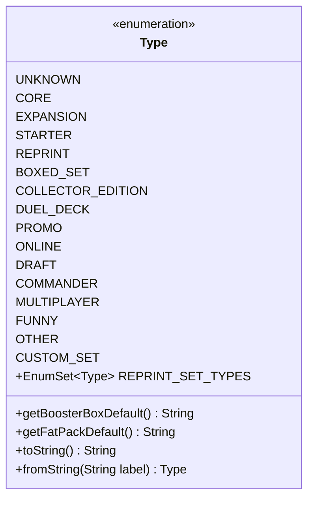

---
aliases:
  - Type
tags:
  - java/enum
  - module/forge-core
  - pkg/forge/card
fqn: forge.card.CardEdition.Type
package: forge.card
module: forge-core
kind: Enum
---

# Type

**Package:** `forge.card`   **Module:** `forge-core`   **Kind:** Enum



## Design Description

The `Type` enum classifies card editions (sets) within Forge's card model, enumerating the categories a Magic set can fall into—from `CORE` and `EXPANSION` through promotional, digital, and themed variants—with `OTHER` and `CUSTOM_SET` serving as fallback and extensibility slots. As a nested enum of `CardEdition`, it gives that class a closed, type-safe vocabulary for describing a set's nature rather than relying on free-form strings.

Beyond pure classification, the enum encodes set-category business rules directly: `getBoosterBoxDefault()` and `getFatPackDefault()` use switch expressions to supply sensible product-quantity defaults for `CORE`/`EXPANSION` sets, while the static `REPRINT_SET_TYPES` set groups categories treated as reprints. Symmetric `toString()`/`fromString()` methods, both delegating to `TextUtil`, convert between the `UNDERSCORE_CASE` constant names and human-readable "Title Case" labels, enabling round-trip persistence and display without external mapping tables.

## Source
`forge-core/src/main/java/forge/card/CardEdition.java` — declaration excerpt

```java
    public enum Type {
        UNKNOWN,
        CORE,
        EXPANSION,
        STARTER,
        REPRINT,
        BOXED_SET,
        COLLECTOR_EDITION,
        DUEL_DECK,
        PROMO,
        ONLINE,
        DRAFT,
        COMMANDER,
        MULTIPLAYER,
        FUNNY,
        OTHER,  // FALLBACK CATEGORY
        CUSTOM_SET; // custom sets

        public static final EnumSet<Type> REPRINT_SET_TYPES = EnumSet.of(REPRINT, PROMO, COLLECTOR_EDITION);

        public String getBoosterBoxDefault() {
            return switch (this) {
                case CORE, EXPANSION -> "36";
                default -> "0";
            };
        }

        public String getFatPackDefault() {
            return switch (this) {
                case CORE, EXPANSION -> "10";
                default -> "0";
            };
        }

        public String toString(){
            String[] names = TextUtil.splitWithParenthesis(this.name().toLowerCase(), '_');
            for (int i = 0; i < names.length; i++)
                names[i] = TextUtil.capitalize(names[i]);
            return TextUtil.join(Arrays.asList(names), " ");
        }

        public static Type fromString(String label){
            List<String> names = Arrays.asList(TextUtil.splitWithParenthesis(label.toUpperCase(), ' '));
            String value = TextUtil.join(names, "_");
            return Type.valueOf(value);
        }
    }
```
