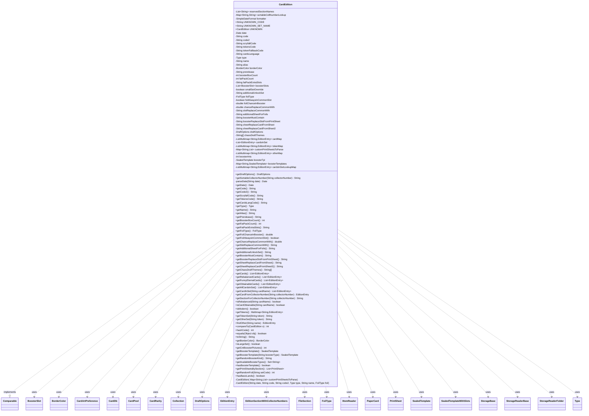

---
aliases:
  - CardEdition
tags:
  - java/class
  - module/forge-core
  - pkg/forge/card
fqn: forge.card.CardEdition
package: forge.card
module: forge-core
kind: Class
---

# CardEdition

**Package:** `forge.card`   **Module:** `forge-core`   **Kind:** Class



## Relationships
**Uses:**
- [[forge.card.CardDb|CardDb]]
- [[forge.card.CardDb.CardArtPreference|CardArtPreference]]
- [[forge.card.CardEdition.BorderColor|BorderColor]]
- [[forge.card.CardEdition.Collection|Collection]]
- [[forge.card.CardEdition.EditionEntry|EditionEntry]]
- [[forge.card.CardEdition.EditionSectionWithCollectorNumbers|EditionSectionWithCollectorNumbers]]
- [[forge.card.CardEdition.FoilType|FoilType]]
- [[forge.card.CardEdition.Type|Type]]
- [[forge.card.CardRarity|CardRarity]]
- [[forge.card.DraftOptions|DraftOptions]]
- [[forge.card.PrintSheet|PrintSheet]]
- [[forge.deck.CardPool|CardPool]]
- [[forge.item.BoosterSlot|BoosterSlot]]
- [[forge.item.PaperCard|PaperCard]]
- [[forge.item.SealedTemplate|SealedTemplate]]
- [[forge.item.SealedTemplateWithSlots|SealedTemplateWithSlots]]
- [[forge.util.FileSection|FileSection]]
- [[forge.util.IItemReader|IItemReader]]
- [[forge.util.storage.StorageBase|StorageBase]]
- [[forge.util.storage.StorageReaderBase|StorageReaderBase]]
- [[forge.util.storage.StorageReaderFolder|StorageReaderFolder]]


## Design Description

CardEdition is an immutable, final value object in the `forge-core` module representing a single Magic: The Gathering set. It holds release metadata (date, set codes, type, border, foil style) and the set's contents—cards, tokens, and "other" entries stored as `EditionEntry` records in case-insensitive `ListMultimap`s keyed by section—alongside booster and draft configuration via `SealedTemplate`s, `BoosterSlot`s, and `DraftOptions`. Beyond accessors it provides domain queries such as obtainable/rebalanced-card filtering, collector-number lookup, and natural collector-number sorting through a cached zero-padding transform.

Implementing `Comparable`, it orders editions by release date then name, with equality on code and name. Its private constructors are driven by a nested `Reader` (a `StorageReaderFolder` that parses edition `.txt` files via regex) and exposed through the nested `Collection` storage, which adds alias/code2 resolution and read-only locking. It collaborates with `CardDb`, `CardPool`, `PaperCard`, and `StaticData` to resolve cards and build print sheets, with `UNKNOWN` serving as a sentinel.

## Source
`forge-core/src/main/java/forge/card/CardEdition.java`

```java
/*
 * Forge: Play Magic: the Gathering.
 * Copyright (C) 2011  Forge Team
 *
 * This program is free software: you can redistribute it and/or modify
 * it under the terms of the GNU General Public License as published by
 * the Free Software Foundation, either version 3 of the License, or
 * (at your option) any later version.
 *
 * This program is distributed in the hope that it will be useful,
 * but WITHOUT ANY WARRANTY; without even the implied warranty of
 * MERCHANTABILITY or FITNESS FOR A PARTICULAR PURPOSE.  See the
 * GNU General Public License for more details.
 *
 * You should have received a copy of the GNU General Public License
 * along with this program.  If not, see <http://www.gnu.org/licenses/>.
 */
package forge.card;

import com.google.common.collect.*;

import forge.StaticData;
import forge.card.CardDb.CardArtPreference;
import forge.deck.CardPool;
import forge.item.BoosterSlot;
import forge.item.PaperCard;
import forge.item.SealedTemplate;
import forge.item.SealedTemplateWithSlots;
import forge.util.*;
import forge.util.storage.StorageBase;
import forge.util.storage.StorageReaderBase;
import forge.util.storage.StorageReaderFolder;
import org.apache.commons.lang3.StringUtils;

import java.io.File;
import java.io.FilenameFilter;
import java.text.SimpleDateFormat;
import java.util.*;
import java.util.Map.Entry;
import java.util.function.Predicate;
import java.util.regex.Matcher;
import java.util.regex.Pattern;
import java.util.stream.Collectors;

/**
 * <p>
 * CardSet class.
 * </p>
 *
 * @author Forge
 * @version $Id: CardSet.java 9708 2011-08-09 19:34:12Z jendave $
 */
public final class CardEdition implements Comparable<CardEdition> {

    public enum Type {
        UNKNOWN,
        CORE,
        EXPANSION,
        STARTER,
        REPRINT,
        BOXED_SET,
        COLLECTOR_EDITION,
        DUEL_DECK,
        PROMO,
        ONLINE,
        DRAFT,
        COMMANDER,
        MULTIPLAYER,
        FUNNY,
        OTHER,  // FALLBACK CATEGORY
        CUSTOM_SET; // custom sets

        public static final EnumSet<Type> REPRINT_SET_TYPES = EnumSet.of(REPRINT, PROMO, COLLECTOR_EDITION);

        public String getBoosterBoxDefault() {
            return switch (this) {
                case CORE, EXPANSION -> "36";
                default -> "0";
            };
        }

        public String getFatPackDefault() {
            return switch (this) {
                case CORE, EXPANSION -> "10";
                default -> "0";
            };
        }

        public String toString(){
            String[] names = TextUtil.splitWithParenthesis(this.name().toLowerCase(), '_');
            for (int i = 0; i < names.length; i++)
                names[i] = TextUtil.capitalize(names[i]);
            return TextUtil.join(Arrays.asList(names), " ");
        }

        public static Type fromString(String label){
            List<String> names = Arrays.asList(TextUtil.splitWithParenthesis(label.toUpperCase(), ' '));
            String value = TextUtil.join(names, "_");
            return Type.valueOf(value);
        }
    }

    public enum FoilType {
        NOT_SUPPORTED, // sets before Urza's Legacy
        OLD_STYLE, // sets between Urza's Legacy and 8th Edition
        MODERN // 8th Edition and newer
    }

    public enum BorderColor {
        WHITE,
        BLACK,
        SILVER,
        GOLD
    }

    // reserved names of sections inside edition files, that are not parsed as cards
    private static final List<String> reservedSectionNames = ImmutableList.of("metadata", "tokens", "other");

    // commonly used printsheets with collector number
    public enum EditionSectionWithCollectorNumbers {
        CARDS("cards"),
        SPECIAL_SLOT("special slot"), //to help with convoluted boosters
        PRECON_PRODUCT("precon product"),
        BORDERLESS("borderless"),
        ETCHED("etched"),
        SHOWCASE("showcase"),
        FULL_ART("full art"),
        EXTENDED_ART("extended art"),
        ALTERNATE_ART("alternate art"),
        RETRO_FRAME("retro frame"),
        BUY_A_BOX("buy a box"),
        PROMO("promo"),
        PRERELEASE_PROMO("prerelease promo"),
        BUNDLE("bundle"),
        BOX_TOPPER("box topper"),
        JUMPSTART("jumpstart"),
        REBALANCED("rebalanced"),
        ETERNAL("eternal"),
        CONJURED("conjured"),
        SCHEME("scheme"),
        PRINTSHEETS("printsheets");

        private final String name;

        EditionSectionWithCollectorNumbers(final String n) { this.name = n; }

        public String getName() {
            return name;
        }

        public static List<String> getNames() {
            List<String> list = new ArrayList<>();
            for (EditionSectionWithCollectorNumbers s : EditionSectionWithCollectorNumbers.values()) {
                String sName = s.getName();
                list.add(sName);
            }
            return list;
        }
    }

    public DraftOptions getDraftOptions() {
        return draftOptions;
    }

    private static final Map<String, String> sortableCollNumberLookup = new HashMap<>();
    /**
     * This method implements the main strategy to allow for natural ordering of collectorNumber
     * (i.e. "1" < "10"), overloading the default lexicographic order (i.e. "10" < "1").
     * Any non-numerical parts in the input collectorNumber will be also accounted for, and attached to the
     * resulting sorting key, accordingly.
     *
     * @param collectorNumber: Input collectorNumber tro transform in a Sorting Key
     * @return A 5-digits zero-padded collector number + any non-numerical parts attached.
     */
    public static String getSortableCollectorNumber(final String collectorNumber){
        String inputCollNumber = collectorNumber;
        if (collectorNumber == null || collectorNumber.isEmpty())
            inputCollNumber = "50000";  // very big number of 5 digits to have them in last positions

        String matchedCollNr = sortableCollNumberLookup.getOrDefault(inputCollNumber, null);
        if (matchedCollNr != null)
            return  matchedCollNr;

        // Now, for proper sorting, let's zero-pad the collector number (if integer)
        int collNr;
        String sortableCollNr;
        try {
            collNr = Integer.parseInt(inputCollNumber);
            sortableCollNr = String.format("%05d", collNr);
        } catch (NumberFormatException ex) {
            String nonNumSub = inputCollNumber.replaceAll("[0-9]", "");
            String onlyNumSub = inputCollNumber.replaceAll("[^0-9]", "");
            try {
                collNr = Integer.parseInt(onlyNumSub);
            } catch (NumberFormatException exon) {
                collNr = 0; // this is the case of ONLY-letters collector numbers
            }
            if ((collNr > 0) && (inputCollNumber.startsWith(onlyNumSub))) // e.g. 12a, 37+, 2018f,
                sortableCollNr = String.format("%05d", collNr) + nonNumSub;
            else // e.g. WS6, S1
                sortableCollNr = nonNumSub + String.format("%05d", collNr);
        }
        sortableCollNumberLookup.put(inputCollNumber, sortableCollNr);
        return sortableCollNr;
    }

    public record EditionEntry(String name, String collectorNumber, CardRarity rarity, String artistName, Map<String, String> extraParams) implements Comparable<EditionEntry> {

        public String toString() {
            StringBuilder sb = new StringBuilder();
            if (collectorNumber != null) {
                sb.append(collectorNumber);
                sb.append(' ');
            }
            if (rarity != CardRarity.Unknown && rarity != CardRarity.Token) {
                sb.append(rarity);
                sb.append(' ');
            }
            sb.append(name);
            if (artistName != null) {
                sb.append(" @");
                sb.append(artistName);
            }
            if (extraParams != null) {
                sb.append(" $");
                sb.append(extraParams.entrySet().stream().map(e -> String.format("\"%s\"=\"%s\"", e.getKey(), e.getValue())).collect(Collectors.joining(", ")));
            }
            return sb.toString();
        }

        @Override
        public int compareTo(EditionEntry o) {
            final int nameCmp = name.compareToIgnoreCase(o.name);
            if (0 != nameCmp) {
                return nameCmp;
            }
            String thisCollNr = getSortableCollectorNumber(collectorNumber);
            String othrCollNr = getSortableCollectorNumber(o.collectorNumber);
            final int collNrCmp = thisCollNr.compareTo(othrCollNr);
            if (0 != collNrCmp) {
                return collNrCmp;
            }
            return rarity.compareTo(o.rarity);
        }

        public String getFlavorName() {
            if (extraParams == null)
                return null;
            return extraParams.get("flavorname");
        }

        public String getFunctionalVariantName() {
            if (extraParams == null)
                return null;
            return extraParams.get("variant");
        }
    }

    private final static SimpleDateFormat formatter = new SimpleDateFormat("yyyy-MM-dd");

    /**
     * Equivalent to the set code of CardEdition.UNKNOWN
     */
    public static final String UNKNOWN_CODE = "???";
    public static final String UNKNOWN_SET_NAME = "UNKNOWN";
    public static final CardEdition UNKNOWN = new CardEdition("1990-01-01", UNKNOWN_CODE, "??", Type.UNKNOWN, UNKNOWN_SET_NAME, FoilType.NOT_SUPPORTED);
    private Date date;
    private String code;
    private String code2;
    private String scryfallCode;
    private String tokensCode;
    private String tokenFallbackCode;
    private String cardsLanguage;
    private Type   type;
    private String name;
    private String alias = null;
    private BorderColor borderColor = BorderColor.BLACK;

    // SealedProduct
    private String prerelease = null;
    private int boosterBoxCount;
    private int fatPackCount;
    private String fatPackExtraSlots = "";

    // Booster/draft info
    private List<BoosterSlot> boosterSlots = null;
    private boolean smallSetOverride = false;
    private String additionalUnlockSet = "";
    private FoilType foilType = FoilType.NOT_SUPPORTED;

    // Replace all of these things with booster slots
    private boolean foilAlwaysInCommonSlot = false;
    private double foilChanceInBooster = 0;
    private double chanceReplaceCommonWith = 0;
    private String slotReplaceCommonWith = "Common";
    private String additionalSheetForFoils = "";
    private String boosterMustContain = "";
    private String boosterReplaceSlotFromPrintSheet = "";
    private String sheetReplaceCardFromSheet = "";
    private String sheetReplaceCardFromSheet2 = "";

    // Draft options
    private DraftOptions draftOptions = null;
    private String[] chaosDraftThemes = new String[0];

    private final ListMultimap<String, EditionEntry> cardMap;
    private final List<EditionEntry> cardsInSet;
    private final ListMultimap<String, EditionEntry> tokenMap;
    // custom print sheets that will be loaded lazily
    private final Map<String, List<String>> customPrintSheetsToParse;
    private ListMultimap<String, EditionEntry> otherMap = ArrayListMultimap.create();

    private int boosterArts = 1;
    private SealedTemplate boosterTpl = null;
    private final Map<String, SealedTemplate> boosterTemplates = new HashMap<>();

    private CardEdition(ListMultimap<String, EditionEntry> cardMap, ListMultimap<String, EditionEntry> tokens, Map<String, List<String>> customPrintSheetsToParse) {
        this.cardMap = cardMap;
        this.cardsInSet = new ArrayList<>(cardMap.values());
        Collections.sort(cardsInSet);
        this.cardsInSetLookupMap = cardsInSet.stream().collect(
            Multimaps.toMultimap(
                e -> e.name,
                e -> e,
                MultimapBuilder.treeKeys(String.CASE_INSENSITIVE_ORDER).arrayListValues()::build
            )
        );
        this.tokenMap = tokens;
        this.customPrintSheetsToParse = customPrintSheetsToParse;
    }

    /**
     * Instantiates a new card set.
     *
     * @param date indicates order of set release date
     * @param code the MTG 3-letter set code
     * @param code2 the 2 (usually) letter code used for image filenames/URLs distributed by the HQ pics team that
     *   use Magic Workstation-type edition codes. Older sets only had 2-letter codes, and some of the 3-letter
     *   codes they use now aren't the same as the official list of 3-letter codes.  When Forge downloads set-pics,
     *   it uses the 3-letter codes for the folder no matter the age of the set.
     * @param type the set type
     * @param name the name of the set
     */
    private CardEdition(String date, String code, String code2, Type type, String name, FoilType foil) {
        this(ArrayListMultimap.create(), ArrayListMultimap.create(), new HashMap<>());
        this.code  = code;
        this.code2 = code2;
        this.type  = type;
        this.name  = name;
        this.date = parseDate(date);
        this.foilType = foil;
    }

    private static Date parseDate(String date) {
        if( date.length() <= 7 )
            date = date + "-01";
        try {
            return formatter.parse(date);
        } catch (Exception e) {
            return new Date();
        }
    }

    public Date getDate()  { return date;  }
    public String getCode()  { return code;  }
    public String getCode2() { return code2; }
    public String getScryfallCode() { return scryfallCode.toLowerCase(); }
    public String getTokensCode() { return tokensCode.toLowerCase(); }
    public String getCardsLangCode() { return cardsLanguage.toLowerCase(); }
    public Type   getType()  { return type;  }
    public String getName()  { return name;  }
    public String getAlias() { return alias; }

    public String getPrerelease() { return prerelease; }
    public int getBoosterBoxCount() { return boosterBoxCount; }
    public int getFatPackCount() { return fatPackCount; }
    public String getFatPackExtraSlots() { return fatPackExtraSlots; }

    public FoilType getFoilType() { return foilType; }
    public double getFoilChanceInBooster() { return foilChanceInBooster; }
    public boolean getFoilAlwaysInCommonSlot() { return foilAlwaysInCommonSlot; }
    public double getChanceReplaceCommonWith() { return chanceReplaceCommonWith; }
    public String getSlotReplaceCommonWith() { return slotReplaceCommonWith; }
    public String getAdditionalSheetForFoils() { return additionalSheetForFoils; }
    public String getAdditionalUnlockSet() { return additionalUnlockSet; }
    public String getBoosterMustContain() { return boosterMustContain; }
    public String getBoosterReplaceSlotFromPrintSheet() { return boosterReplaceSlotFromPrintSheet; }
    public String getSheetReplaceCardFromSheet() { return sheetReplaceCardFromSheet; }
    public String getSheetReplaceCardFromSheet2() { return sheetReplaceCardFromSheet2; }
    public String[] getChaosDraftThemes() { return chaosDraftThemes; }

    public List<EditionEntry> getCards() { return cardMap.get(EditionSectionWithCollectorNumbers.CARDS.getName()); }
    public List<EditionEntry> getRebalancedCards() { return cardMap.get(EditionSectionWithCollectorNumbers.REBALANCED.getName()); }
    public List<EditionEntry> getFunnyEternalCards() { return cardMap.get(EditionSectionWithCollectorNumbers.ETERNAL.getName()); }
    public List<EditionEntry> getObtainableCards() { 
        List<EditionEntry> allCards = new ArrayList<>(getAllCardsInSet());
        List<EditionEntry> conjuredCards = cardMap.get(EditionSectionWithCollectorNumbers.CONJURED.getName());
        if (conjuredCards != null) {
            allCards.removeAll(conjuredCards);
        }

        return allCards; 
    }
    public List<EditionEntry> getAllCardsInSet() {
        return cardsInSet;
    }

    private final ListMultimap<String, EditionEntry> cardsInSetLookupMap;

    /**
     * Get all the CardInSet instances with the input card name.
     * @param cardName Name of the Card to look for.
     * @return A List of all the CardInSet instances for a given name.
     * If not found, an Empty sequence (view) will be returned instead!
     */
    public List<EditionEntry> getCardInSet(String cardName) {
        return cardsInSetLookupMap.get(cardName);
    }

    public EditionEntry getCardFromCollectorNumber(String collectorNumber) {
        if(collectorNumber == null || collectorNumber.isEmpty())
            return null;
        for(EditionEntry c : this.cardsInSet) {
            //Could build a map for this one too if it's used for more than one-offs.
            if (c.collectorNumber.equalsIgnoreCase(collectorNumber))
                return c;
        }
        return null;
    }

    /** Returns the section name (e.g. "cards", "full art", "borderless") that contains the given collector number, or null. */
    public String getSectionForCollectorNumber(String collectorNumber) {
        if (collectorNumber == null || collectorNumber.isEmpty())
            return null;
        for (Entry<String, java.util.Collection<EditionEntry>> section : cardMap.asMap().entrySet()) {
            for (EditionEntry ee : section.getValue()) {
                if (collectorNumber.equalsIgnoreCase(ee.collectorNumber)) {
                    return section.getKey();
                }
            }
        }
        return null;
    }

    public boolean isRebalanced(String cardName) {
        for (EditionEntry cis : getRebalancedCards()) {
            if (cis.name.equals(cardName)) {
                return true;
            }
        }
        return false;
    }

    public boolean isCardObtainable(String cardName) {
        for (EditionEntry ee : cardMap.get(EditionSectionWithCollectorNumbers.CONJURED.getName())) {
            if (ee.name.equals(cardName)) {
                return false;
            }
        }
        return true;
    }

    public boolean isModern() { return getDate().after(parseDate("2003-07-27")); } //8ED and above are modern except some promo cards and others

    public Multimap<String, EditionEntry> getTokens() { return tokenMap; }

    public String getTokenSet(String token) {
        if (tokenMap.containsKey(token)) {
            return this.getCode();
        }
        if (this.tokenFallbackCode != null) {
            return StaticData.instance().getCardEdition(this.tokenFallbackCode).getTokenSet(token);
        }
        return null;
    }
    public String getOtherSet(String token) {
        if (otherMap.containsKey(token)) {
            return this.getCode();
        }
        if (this.tokenFallbackCode != null) {
            return StaticData.instance().getCardEdition(this.tokenFallbackCode).getOtherSet(token);
        }
        return null;
    }

    public EditionEntry findOther(String name) {
        if (otherMap.containsKey(name)) {
            return Aggregates.random(otherMap.get(name));
        }
        return null;
    }

    @Override
    public int compareTo(final CardEdition o) {
        if (o == null) {
            return 1;
        }
        int dateComp = date.compareTo(o.date);
        if (0 != dateComp)
            return dateComp;
        return name.compareTo(o.name);
    }

    @Override
    public int hashCode() {
        return (this.code.hashCode() * 17) + this.name.hashCode();
    }

    @Override
    public boolean equals(final Object obj) {
        if (this == obj) {
            return true;
        }
        if (obj == null) {
            return false;
        }
        if (this.getClass() != obj.getClass()) {
            return false;
        }

        final CardEdition other = (CardEdition) obj;
        return other.name.equals(this.name) && this.code.equals(other.code);
    }

    @Override
    public String toString() {
        return this.name + " (" + this.code + ")";
    }

    public BorderColor getBorderColor() {
        return borderColor;
    }

    public boolean isLargeSet() {
        return this.cardsInSet.size() > 200 && !smallSetOverride;
    }

    public int getCntBoosterPictures() {
        return boosterArts;
    }

    public SealedTemplate getBoosterTemplate() {
        return getBoosterTemplate("Draft");
    }
    public SealedTemplate getBoosterTemplate(String boosterType) {
        return boosterTemplates.get(boosterType);
    }
    public String getRandomBoosterKind() {
        return Aggregates.random(boosterTemplates.keySet());
    }

    public Set<String> getAvailableBoosterTypes() {
        return boosterTemplates.keySet();
    }

    public boolean hasBoosterTemplate() {
        return boosterTemplates.containsKey("Draft");
    }

    public List<PrintSheet> getPrintSheetsBySection() {
        final CardDb cardDb = StaticData.instance().getCommonCards();

        List<PrintSheet> sheets = Lists.newArrayList();
        for (Map.Entry<String, java.util.Collection<EditionEntry>> section : cardMap.asMap().entrySet()) {
            if (section.getKey().equals(EditionSectionWithCollectorNumbers.CONJURED.getName())) {
                continue;
            }
            PrintSheet sheet = new PrintSheet(String.format("%s %s", this.getCode(), section.getKey()));

            for (EditionEntry card : section.getValue()) {
                sheet.add(cardDb.getCard(card.name, this.getCode(), card.collectorNumber));
            }

            sheets.add(sheet);
        }

        for (String sheetName : customPrintSheetsToParse.keySet()) {
            List<String> sheetToParse = customPrintSheetsToParse.get(sheetName);
            CardPool sheetPool = CardPool.fromCardList(sheetToParse);
            PrintSheet sheet = new PrintSheet(String.format("%s %s", this.getCode(), sheetName), sheetPool);
            sheets.add(sheet);
        }

        return sheets;
    }

    public static class Reader extends StorageReaderFolder<CardEdition> {

        public static final Pattern CARD_PATTERN = Pattern.compile(
            /*
            The following pattern will match the WAR Japanese art entries,
            it should also match the Un-set and older alternate art cards
            like Merseine from FEM.
             */
                /*  Ideally we'd use the named group above, but Android *25* and
                earlier doesn't appear to support named groups.
                So, until support for those devices is officially dropped,
                we'll have to suffice with numbered groups.
                We are looking for:
                    * cnum - grouping #2
                    * rarity - grouping #4
                    * name - grouping #5
                    * artist name - grouping #7
                    * extra parameters - grouping #9
                */
                // Collector numbers now should allow hyphens for Planeswalker Championship Promos
                "(^(.?[0-9A-Z-]+\\S*[A-Z]*)\\s)?(([SCURML])\\s)?([^@$]+)( @([^$]*))?( \\$\\{(.+)\\})?$"
                //"(?:^(?<cnum>.?[0-9A-Z-]+\\S*[A-Z]*)\\s)?(?:(?<rarity>[SCURML])\\s)?(?<name>[^@$]*)(?: @(?<artist>[^$]*))?(?: \\$\\{(?<params>.+)})?$"
        );

        public static final Pattern TOKEN_PATTERN = Pattern.compile(
                /*
                 * cnum - grouping #2
                 * name - grouping #3
                 * artist name - grouping #5
                 */
                //"(?:^(?<cnum>.?[0-9A-Z-]+\\S?[A-Z☇]*)\\s)?(?<name>[^@]*)(?: @(?<artist>.*))?$"
                "(^(.?[0-9A-Z-]+\\S?[A-Z☇]*)\\s)?([^@]+)( @(.*))?$"
        );

        public static final Pattern EXTRA_PARAMS_PATTERN = Pattern.compile(
                //Simple JSON string map parser - "key": "value". No support for escaping quotation marks or anything fancy.
                "\"([^\"]+)\"\\s*:\\s*\"([^\"]+)\",?"
        );

        private final boolean isCustomEditions;

        public Reader(File path) {
            this(path, false);
        }
        public Reader(File path, boolean isCustomEditions) {
            super(path, CardEdition::getCode);
            this.isCustomEditions = isCustomEditions;
        }

        protected Map<String, CardEdition> createMap() {
            // Create our own map to make it case-insensitive for set codes.
            return new TreeMap<>(String.CASE_INSENSITIVE_ORDER);
        }

        @Override
        protected CardEdition read(File file) {
            ListMultimap<String, EditionEntry> cardMap = ArrayListMultimap.create();
            Map<String, List<String>> customPrintSheetsToParse = new HashMap<>();
            List<String> editionSectionsWithCollectorNumbers = EditionSectionWithCollectorNumbers.getNames();

            final Map<String, List<String>> contents = FileSection.parseSections(FileUtil.readFile(file));
            FileSection metadata = FileSection.parse(contents.get("metadata"), FileSection.EQUALS_KV_SEPARATOR);

            List<String> boosterSlotsToParse = Lists.newArrayList();
            List<BoosterSlot> boosterSlots = null;
            if (metadata.contains("BoosterSlots")) {
                boosterSlotsToParse = Lists.newArrayList(metadata.get("BoosterSlots").split(","));
                boosterSlots = Lists.newArrayList();
            }

            for (String sectionName : contents.keySet()) {
                // skip reserved section names like 'metadata' and 'tokens' that are handled separately
                if (reservedSectionNames.contains(sectionName)) {
                    continue;
                }

                if (sectionName.endsWith("Types")) {
                    CardType.Helper.parseTypes(sectionName, contents.get(sectionName));
                } else if (editionSectionsWithCollectorNumbers.contains(sectionName)) {
                    // parse sections of the format "<collector number> <rarity> <name>"
                    for (String line : contents.get(sectionName)) {
                        Matcher matcher = CARD_PATTERN.matcher(line);

                        if (!matcher.matches()) {
                            continue;
                        }

                        String collectorNumber = matcher.group(2);
                        CardRarity r = CardRarity.smartValueOf(matcher.group(4));
                        String cardName = matcher.group(5);
                        String artistName = matcher.group(7);
                        String extraParamText = matcher.group(9);
                        Map<String, String> extraParams = null;
                        if(!StringUtils.isBlank(extraParamText)) {
                            Matcher paramMatcher = EXTRA_PARAMS_PATTERN.matcher(extraParamText);
                            if(!paramMatcher.lookingAt())
                                System.err.println("Ignoring malformed parameter text: " + extraParamText);
                            else {
                                extraParams = new HashMap<>(2);
                                do {
                                    String k = paramMatcher.group(1).trim().toLowerCase();
                                    String v = paramMatcher.group(2).trim();
                                    if(k.isEmpty() || v.isEmpty())
                                        continue;
                                    extraParams.put(k, v);
                                } while(paramMatcher.find());
                            }
                        }

                        EditionEntry cis = new EditionEntry(cardName, collectorNumber, r, artistName, extraParams);
                        cardMap.put(sectionName, cis);
                    }
                } else if (boosterSlotsToParse.contains(sectionName)) {
                    // parse booster slots of the format "Base=N\n|Replace=<amount> <sheet>"
                    boosterSlots.add(BoosterSlot.parseSlot(sectionName, contents.get(sectionName)));
                } else {
                    // save custom print sheets of the format "<amount> <name>|<setcode>|<art index>"
                    // to parse later when printsheets are loaded lazily (and the cardpool is already initialized)
                    customPrintSheetsToParse.put(sectionName, contents.get(sectionName));
                }
            }

            ListMultimap<String, EditionEntry> tokenMap = ArrayListMultimap.create();
            ListMultimap<String, EditionEntry> otherMap = ArrayListMultimap.create();
            // parse tokens section
            if (contents.containsKey("tokens")) {
                for (String line : contents.get("tokens")) {
                    if (StringUtils.isBlank(line))
                        continue;
                    Matcher matcher = TOKEN_PATTERN.matcher(line);

                    if (!matcher.matches()) {
                        continue;
                    }

                    String collectorNumber = matcher.group(2);
                    String cardName = matcher.group(3);
                    String artistName = matcher.group(5);
                    // rarity isn't used for this anyway
                    EditionEntry tis = new EditionEntry(cardName, collectorNumber, CardRarity.Token, artistName, null);
                    tokenMap.put(cardName, tis);
                }
            }
            if (contents.containsKey("other")) {
                for (String line : contents.get("other")) {
                    if (StringUtils.isBlank(line))
                        continue;
                    Matcher matcher = TOKEN_PATTERN.matcher(line);

                    if (!matcher.matches()) {
                        continue;
                    }
                    String collectorNumber = matcher.group(2);
                    String cardName = matcher.group(3);
                    String artistName = matcher.group(5);
                    EditionEntry tis = new EditionEntry(cardName, collectorNumber, CardRarity.Unknown, artistName, null);
                    otherMap.put(cardName, tis);
                }
            }

            CardEdition res = new CardEdition(cardMap, tokenMap, customPrintSheetsToParse);
            // parse metadata section
            res.name  = metadata.get("name");
            res.date  = parseDate(metadata.get("date"));
            res.code  = metadata.get("code");
            res.code2 = metadata.get("code2", res.code);
            res.scryfallCode = metadata.get("ScryfallCode", res.code);
            res.tokensCode = metadata.get("TokensCode", "T" + res.scryfallCode);
            res.tokenFallbackCode = metadata.get("TokenFallbackCode");
            res.cardsLanguage = metadata.get("CardLang", "en");
            res.boosterArts = metadata.getInt("BoosterCovers", 1);

            res.otherMap = otherMap;

            res.boosterSlots = boosterSlots;
            String boosterDesc = metadata.get("Booster");

            if (metadata.contains("Booster")) {
                // Historical naming convention in Forge for "DraftBooster"
                if (res.boosterSlots != null) {
                    res.boosterTpl = new SealedTemplateWithSlots(res.code, SealedTemplate.Reader.parseSlots(boosterDesc), res.boosterSlots);
                } else {
                    res.boosterTpl = new SealedTemplate(res.code, SealedTemplate.Reader.parseSlots(boosterDesc));
                }

                res.boosterTemplates.put("Draft", res.boosterTpl);
            }

            String[] boostertype = { "Draft", "Collector", "Set" };
            // Theme boosters aren't here because they are closer to preconstructed decks, and should be treated as such
            for (String type : boostertype) {
                String name = type + "Booster";
                if (metadata.contains(name)) {
                    res.boosterTemplates.put(type, new SealedTemplate(res.code, SealedTemplate.Reader.parseSlots(metadata.get(name))));
                }
            }

            Type enumType = Type.UNKNOWN;
            if (this.isCustomEditions) {
                enumType = Type.CUSTOM_SET; // Forcing ThirdParty Edition Type to avoid inconsistencies
            } else {
                String type = metadata.get("type");
                if (null != type && !type.isEmpty()) {
                    try {
                        enumType = Type.valueOf(type.toUpperCase(Locale.ENGLISH));
                    } catch (IllegalArgumentException ignored) {
                        // ignore; type will get UNKNOWN
                        System.err.println("Ignoring unknown type in set definitions: name: " + res.name + "; type: " + type);
                    }
                }

            }
            res.type = enumType;
            if (res.hasBoosterTemplate()) {
                res.boosterBoxCount = Integer.parseInt(metadata.get("BoosterBox", enumType.getBoosterBoxDefault()));
                res.fatPackCount = Integer.parseInt(metadata.get("FatPack", enumType.getFatPackDefault()));
                res.fatPackExtraSlots = metadata.get("FatPackExtraSlots", "");
            }

            switch (metadata.get("foil", "newstyle").toLowerCase()) {
                case "oldstyle":
                case "classic":
                    res.foilType = FoilType.OLD_STYLE;
                    break;
                case "newstyle":
                case "modern":
                    res.foilType = FoilType.MODERN;
                    break;
                case "notsupported":
                default:
                    res.foilType = FoilType.NOT_SUPPORTED;
                    break;
            }
            String[] replaceCommon = metadata.get("ChanceReplaceCommonWith", "0F Common").split(" ", 2);
            res.chanceReplaceCommonWith = Double.parseDouble(replaceCommon[0]);
            res.slotReplaceCommonWith = replaceCommon[1];

            res.foilChanceInBooster = metadata.getDouble("FoilChanceInBooster", 21.43F) / 100.0F;

            res.foilAlwaysInCommonSlot = metadata.getBoolean("FoilAlwaysInCommonSlot", true);
            res.additionalSheetForFoils = metadata.get("AdditionalSheetForFoils", "");

            res.additionalUnlockSet = metadata.get("AdditionalSetUnlockedInQuest", ""); // e.g. Time Spiral Timeshifted (TSB) for Time Spiral

            res.smallSetOverride = metadata.getBoolean("TreatAsSmallSet", false); // for "small" sets with over 200 cards (e.g. Eldritch Moon)

            res.boosterMustContain = metadata.get("BoosterMustContain", ""); // e.g. Dominaria guaranteed legendary creature
            res.boosterReplaceSlotFromPrintSheet = metadata.get("BoosterReplaceSlotFromPrintSheet", ""); // e.g. Zendikar Rising guaranteed double-faced card
            res.sheetReplaceCardFromSheet = metadata.get("SheetReplaceCardFromSheet", "");
            res.sheetReplaceCardFromSheet2 = metadata.get("SheetReplaceCardFromSheet2", "");
            res.chaosDraftThemes = metadata.get("ChaosDraftThemes", "").split(";"); // semicolon separated list of theme names

            res.alias = metadata.get("alias");
            res.borderColor = BorderColor.valueOf(metadata.get("border", "Black").toUpperCase(Locale.ENGLISH));
            res.prerelease = metadata.get("Prerelease", null);

            // Draft options
            String doublePick = metadata.get("DoublePick", "Never");
            int maxPodSize = metadata.getInt("MaxPodSize", 8);
            int recommendedPodSize = metadata.getInt("RecommendedPodSize", 8);
            int maxMatchPlayers = metadata.getInt("MaxMatchPlayers", 2);
            String deckType = metadata.get("DeckType", "Normal");
            String freeCommander = metadata.get("FreeCommander", "");

            res.draftOptions = new DraftOptions(
                    doublePick,
                    maxPodSize,
                    recommendedPodSize,
                    maxMatchPlayers,
                    deckType,
                    freeCommander
            );

            return res;
        }

        @Override
        protected FilenameFilter getFileFilter() {
            return TXT_FILE_FILTER;
        }

        public static final FilenameFilter TXT_FILE_FILTER = (dir, name) -> name.endsWith(".txt");
    }

    public static class Collection extends StorageBase<CardEdition> {
        private final Map<String, CardEdition> aliasToEdition = new TreeMap<>(String.CASE_INSENSITIVE_ORDER);
        private boolean lock = false; //Lock once custom content has been added.
        public Collection(IItemReader<CardEdition> reader) {
            super("Card editions", reader);

            for (CardEdition ee : this) {
                initAliases(ee);
            }
        }
        private void initAliases(CardEdition E) { //Add the alias to the edition here, to ensure it's always done equally.
            String alias = E.getAlias();
            if (null != alias)
                aliasToEdition.put(alias, E);
            aliasToEdition.put(E.getCode2(), E);
        }
        @Override
        public void add(CardEdition item) { //Even though we want it to be read only, make an exception for custom content.
            if (lock) throw new UnsupportedOperationException("This is a read-only storage");
            else map.put(item.getCode(), item);
        }
        public void append(CardEdition.Collection C) { //Append custom editions
            if (lock) throw new UnsupportedOperationException("This is a read-only storage");
            for (CardEdition E : C) { //Update the alias list as above or else it'll fail to look up.
                this.add(E);
                initAliases(E); //Made a method in case the system changes, so it's consistent.
            }
            CardEdition customBucket = new CardEdition("2990-01-01", "USER", "USER", Type.CUSTOM_SET, "USER", FoilType.NOT_SUPPORTED);
            this.add(customBucket);
            initAliases(customBucket);
            this.lock = true; //Consider it initialized and prevent from writing any more data.
        }

        //Gets a sets by code.  It will search first by three letter codes, then by aliases and two-letter codes.
        @Override
        public CardEdition get(final String code) {
            if (code == null) {
                return null;
            }

            CardEdition baseResult = super.get(code);
            return baseResult == null ? aliasToEdition.get(code) : baseResult;
        }

        public Iterable<CardEdition> getOrderedEditions() {
            List<CardEdition> res = Lists.newArrayList(this);
            Collections.sort(res);
            Collections.reverse(res);
            return res;
        }

        public Iterable<CardEdition> getPrereleaseEditions() {
            return this.stream()
                    .filter(edition -> edition.getPrerelease() != null)
                    .collect(Collectors.toList());
        }

        public CardEdition getEditionByCodeOrThrow(final String code) {
            final CardEdition set = this.get(code);
            if (null == set && code.equals(UNKNOWN_CODE)) //Hardcoded set ??? is not with the others, needs special check.
                return UNKNOWN;
            if (null == set) {
                throw new RuntimeException("Edition with code '" + code + "' not found");
            }
            return set;
        }

        // used by image generating code
        public String getCode2ByCode(final String code) {
            final CardEdition set = this.get(code);
            return set == null ? "" : set.getCode2();
        }

        public final Comparator<PaperCard> CARD_EDITION_COMPARATOR = Comparator.comparing(c -> Collection.this.get(c.getEdition()));

        public IItemReader<SealedTemplate> getBoosterGenerator() {
            return new StorageReaderBase<>(null) {
                @Override
                public Map<String, SealedTemplate> readAll() {
                    Map<String, SealedTemplate> map = new TreeMap<>(String.CASE_INSENSITIVE_ORDER);
                    for (CardEdition ce : Collection.this) {
                        List<String> boosterTypes = Lists.newArrayList(ce.getAvailableBoosterTypes());
                        for (String type : boosterTypes) {
                            String setAffix = type.equals("Draft") ? "" : type;

                            map.put(ce.getCode() + setAffix, ce.getBoosterTemplate(type));
                        }
                    }
                    return map;
                }

                @Override
                public String getItemKey(SealedTemplate item) {
                    return item.getEdition();
                }

                @Override
                public String getFullPath() {
                    return null;
                }
            };
        }

        /* @leriomaggio
          The original name "getEarliestEditionWithAllCards" was completely misleading, as it did
          not reflect at all what the method really does (and what's the original goal).

          What the method does is to return the **latest** (as in the most recent)
          Card Edition among all the different "Original" sets (as in "first print") were cards
          in the Pool can be found.
          Therefore, nothing to do with an Edition "including" all the cards.
         */
        public CardEdition getTheLatestOfAllTheOriginalEditionsOfCardsIn(CardPool cards) {
            Set<String> minEditions = new HashSet<>();
            CardDb db = StaticData.instance().getCommonCards();
            for (Entry<PaperCard, Integer> k : cards) {
                // NOTE: Even if we do force a very stringent Policy on Editions
                // (which only considers core, expansions, and reprint editions), the fetch method
                // is flexible enough to relax the constraint automatically, if no card can be found
                // under those conditions (i.e. ORIGINAL_ART_ALL_EDITIONS will be automatically used instead).
                PaperCard cp = db.getCardFromEditions(k.getKey().getName(),
                                                      CardArtPreference.ORIGINAL_ART_CORE_EXPANSIONS_REPRINT_ONLY);
                if (cp == null)   // it's unlikely, this code will ever run. Only Happens if card does not exist.
                    cp = k.getKey();
                minEditions.add(cp.getEdition());
            }
            for (CardEdition ed : getOrderedEditions()) {
                if (minEditions.contains(ed.getCode()))
                    return ed;
            }
            return UNKNOWN;
        }
    }

    public static class Predicates {
        public static final Predicate<CardEdition> CAN_MAKE_BOOSTER = CardEdition::hasBoosterTemplate;

        public static CardEdition getRandomSetWithAllBasicLands(Iterable<CardEdition> allEditions) {
            return Aggregates.random(IterableUtil.filter(allEditions, hasBasicLands));
        }

        public static CardEdition getPreferredArtEditionWithAllBasicLands() {
            CardDb.CardArtPreference artPreference = StaticData.instance().getCardArtPreference();
            Iterable<CardEdition> editionsWithBasicLands = IterableUtil.filter(
                    StaticData.instance().getEditions().getOrderedEditions(),
                    hasBasicLands.and(artPreference::accept));
            Iterator<CardEdition> editionsIterator = editionsWithBasicLands.iterator();
            List<CardEdition> selectedEditions = new ArrayList<>();
            while (editionsIterator.hasNext())
                selectedEditions.add(editionsIterator.next());
            if (selectedEditions.isEmpty())
                return null;
            int editionIndex = artPreference.latestFirst ? 0 : selectedEditions.size() - 1;
            return selectedEditions.get(editionIndex);
        }

        public static final Predicate<CardEdition> HAS_TOURNAMENT_PACK = edition -> StaticData.instance().getTournamentPacks().contains(edition.getCode());

        public static final Predicate<CardEdition> HAS_FAT_PACK = edition -> edition.getFatPackCount() > 0;

        public static final Predicate<CardEdition> HAS_BOOSTER_BOX = edition -> edition.getBoosterBoxCount() > 0;

        @Deprecated //Use CardEdition::hasBasicLands and a nonnull test.
        public static final Predicate<CardEdition> hasBasicLands = ed -> {
            if (ed == null) {
                // Happens for new sets with "???" code
                return false;
            }
            return ed.hasBasicLands();
        };
    }

    public static int getRandomFoil(final String setCode) {
        FoilType foilType = FoilType.NOT_SUPPORTED;
        if (setCode != null
                && StaticData.instance().getEditions().get(setCode) != null) {
            foilType = StaticData.instance().getEditions().get(setCode)
                    .getFoilType();
        }
        if (foilType != FoilType.NOT_SUPPORTED) {
            return foilType == FoilType.MODERN
                    ? MyRandom.getRandom().nextInt(9) +  1
                    : MyRandom.getRandom().nextInt(9) + 11;
        }
        return 0;
    }

    public boolean hasBasicLands() {
        for(String landName : MagicColor.Constant.BASIC_LANDS) {
            if (this.getCardInSet(landName).isEmpty())
                return false;
        }
        return true;
    }
}
```

## Python
`forge/card/CardEdition.py`

```python
from forge.StaticData import StaticData
from forge.card.CardDb import CardDb
from forge.card.CardDb.CardArtPreference import CardArtPreference
from forge.card.CardRarity import CardRarity
from forge.card.CardType import CardType
from forge.card.DraftOptions import DraftOptions
from forge.card.MagicColor import MagicColor
from forge.card.PrintSheet import PrintSheet
from forge.deck.CardPool import CardPool
from forge.item.BoosterSlot import BoosterSlot
from forge.item.PaperCard import PaperCard
from forge.item.SealedTemplate import SealedTemplate
from forge.item.SealedTemplateWithSlots import SealedTemplateWithSlots
from forge.util.Aggregates import Aggregates
from forge.util.FileSection import FileSection
from forge.util.FileUtil import FileUtil
from forge.util.IItemReader import IItemReader
from forge.util.IterableUtil import IterableUtil
from forge.util.MyRandom import MyRandom
from forge.util.TextUtil import TextUtil
from forge.util.storage.StorageBase import StorageBase
from forge.util.storage.StorageReaderBase import StorageReaderBase
from forge.util.storage.StorageReaderFolder import StorageReaderFolder

import enum
import functools
import re
import sys
from datetime import datetime


class _CaseInsensitiveMap(dict):
    """Mirror of a java.util.TreeMap with String.CASE_INSENSITIVE_ORDER."""

    @staticmethod
    def _k(key):
        return key.lower() if isinstance(key, str) else key

    def __setitem__(self, key, value):
        super().__setitem__(_CaseInsensitiveMap._k(key), value)

    def __getitem__(self, key):
        return super().__getitem__(_CaseInsensitiveMap._k(key))

    def get(self, key, default=None):
        return super().get(_CaseInsensitiveMap._k(key), default)

    def __contains__(self, key):
        return super().__contains__(_CaseInsensitiveMap._k(key))


class ListMultimap:
    """Minimal stand-in for com.google.common.collect.ListMultimap."""

    def __init__(self, case_insensitive=False):
        self._ci = case_insensitive
        self._data = {}
        self._orig = {}

    def _norm(self, key):
        if self._ci and isinstance(key, str):
            return key.lower()
        return key

    def put(self, key, value):
        nk = self._norm(key)
        if nk not in self._data:
            self._data[nk] = []
            self._orig[nk] = key
        self._data[nk].append(value)

    def get(self, key):
        return self._data.get(self._norm(key), [])

    def containsKey(self, key):
        return self._norm(key) in self._data

    def keySet(self):
        return [self._orig[k] for k in self._data]

    def values(self):
        result = []
        for v in self._data.values():
            result.extend(v)
        return result

    def asMap(self):
        return {self._orig[k]: v for k, v in self._data.items()}


class CardEdition:
    """CardSet class."""

    class Type(enum.Enum):
        UNKNOWN = enum.auto()
        CORE = enum.auto()
        EXPANSION = enum.auto()
        STARTER = enum.auto()
        REPRINT = enum.auto()
        BOXED_SET = enum.auto()
        COLLECTOR_EDITION = enum.auto()
        DUEL_DECK = enum.auto()
        PROMO = enum.auto()
        ONLINE = enum.auto()
        DRAFT = enum.auto()
        COMMANDER = enum.auto()
        MULTIPLAYER = enum.auto()
        FUNNY = enum.auto()
        OTHER = enum.auto()  # FALLBACK CATEGORY
        CUSTOM_SET = enum.auto()  # custom sets

        def getBoosterBoxDefault(self):
            if self in (CardEdition.Type.CORE, CardEdition.Type.EXPANSION):
                return "36"
            return "0"

        def getFatPackDefault(self):
            if self in (CardEdition.Type.CORE, CardEdition.Type.EXPANSION):
                return "10"
            return "0"

        def __str__(self):
            names = TextUtil.splitWithParenthesis(self.name.lower(), '_')
            for i in range(len(names)):
                names[i] = TextUtil.capitalize(names[i])
            return TextUtil.join(list(names), " ")

        @staticmethod
        def fromString(label):
            names = list(TextUtil.splitWithParenthesis(label.upper(), ' '))
            value = TextUtil.join(names, "_")
            return CardEdition.Type[value]

    class FoilType(enum.Enum):
        NOT_SUPPORTED = enum.auto()  # sets before Urza's Legacy
        OLD_STYLE = enum.auto()  # sets between Urza's Legacy and 8th Edition
        MODERN = enum.auto()  # 8th Edition and newer

    class BorderColor(enum.Enum):
        WHITE = enum.auto()
        BLACK = enum.auto()
        SILVER = enum.auto()
        GOLD = enum.auto()

    # reserved names of sections inside edition files, that are not parsed as cards
    reservedSectionNames = ["metadata", "tokens", "other"]

    # commonly used printsheets with collector number
    class EditionSectionWithCollectorNumbers(enum.Enum):
        CARDS = "cards"
        SPECIAL_SLOT = "special slot"  # to help with convoluted boosters
        PRECON_PRODUCT = "precon product"
        BORDERLESS = "borderless"
        ETCHED = "etched"
        SHOWCASE = "showcase"
        FULL_ART = "full art"
        EXTENDED_ART = "extended art"
        ALTERNATE_ART = "alternate art"
        RETRO_FRAME = "retro frame"
        BUY_A_BOX = "buy a box"
        PROMO = "promo"
        PRERELEASE_PROMO = "prerelease promo"
        BUNDLE = "bundle"
        BOX_TOPPER = "box topper"
        JUMPSTART = "jumpstart"
        REBALANCED = "rebalanced"
        ETERNAL = "eternal"
        CONJURED = "conjured"
        SCHEME = "scheme"
        PRINTSHEETS = "printsheets"

        def __init__(self, n):
            self._section_name = n

        def getName(self):
            return self._section_name

        @staticmethod
        def getNames():
            list_ = []
            for s in CardEdition.EditionSectionWithCollectorNumbers:
                sName = s.getName()
                list_.append(sName)
            return list_

    def getDraftOptions(self):
        return self.draftOptions

    sortableCollNumberLookup = {}

    @staticmethod
    def getSortableCollectorNumber(collectorNumber):
        inputCollNumber = collectorNumber
        if collectorNumber is None or collectorNumber == "":
            inputCollNumber = "50000"  # very big number of 5 digits to have them in last positions

        matchedCollNr = CardEdition.sortableCollNumberLookup.get(inputCollNumber, None)
        if matchedCollNr is not None:
            return matchedCollNr

        # Now, for proper sorting, let's zero-pad the collector number (if integer)
        try:
            collNr = int(inputCollNumber)
            sortableCollNr = "%05d" % collNr
        except ValueError:
            nonNumSub = re.sub(r"[0-9]", "", inputCollNumber)
            onlyNumSub = re.sub(r"[^0-9]", "", inputCollNumber)
            try:
                collNr = int(onlyNumSub)
            except ValueError:
                collNr = 0  # this is the case of ONLY-letters collector numbers
            if (collNr > 0) and inputCollNumber.startswith(onlyNumSub):  # e.g. 12a, 37+, 2018f,
                sortableCollNr = ("%05d" % collNr) + nonNumSub
            else:  # e.g. WS6, S1
                sortableCollNr = nonNumSub + ("%05d" % collNr)
        CardEdition.sortableCollNumberLookup[inputCollNumber] = sortableCollNr
        return sortableCollNr

    class EditionEntry:
        def __init__(self, name, collectorNumber, rarity, artistName, extraParams):
            self.name = name
            self.collectorNumber = collectorNumber
            self.rarity = rarity
            self.artistName = artistName
            self.extraParams = extraParams

        def __str__(self):
            sb = []
            if self.collectorNumber is not None:
                sb.append(self.collectorNumber)
                sb.append(' ')
            if self.rarity != CardRarity.Unknown and self.rarity != CardRarity.Token:
                sb.append(str(self.rarity))
                sb.append(' ')
            sb.append(self.name)
            if self.artistName is not None:
                sb.append(" @")
                sb.append(self.artistName)
            if self.extraParams is not None:
                sb.append(" $")
                sb.append(", ".join('"%s"="%s"' % (k, v) for k, v in self.extraParams.items()))
            return "".join(sb)

        def compareTo(self, o):
            al, bl = self.name.lower(), o.name.lower()
            nameCmp = (al > bl) - (al < bl)
            if 0 != nameCmp:
                return nameCmp
            thisCollNr = CardEdition.getSortableCollectorNumber(self.collectorNumber)
            othrCollNr = CardEdition.getSortableCollectorNumber(o.collectorNumber)
            collNrCmp = (thisCollNr > othrCollNr) - (thisCollNr < othrCollNr)
            if 0 != collNrCmp:
                return collNrCmp
            return self.rarity.compareTo(o.rarity)

        def getFlavorName(self):
            if self.extraParams is None:
                return None
            return self.extraParams.get("flavorname")

        def getFunctionalVariantName(self):
            if self.extraParams is None:
                return None
            return self.extraParams.get("variant")

    # Equivalent to the set code of CardEdition.UNKNOWN
    UNKNOWN_CODE = "???"
    UNKNOWN_SET_NAME = "UNKNOWN"
    UNKNOWN = None  # assigned after class definition

    def _set_defaults(self):
        self.date = None
        self.code = None
        self.code2 = None
        self.scryfallCode = None
        self.tokensCode = None
        self.tokenFallbackCode = None
        self.cardsLanguage = None
        self.type = None
        self.name = None
        self.alias = None
        self.borderColor = CardEdition.BorderColor.BLACK

        # SealedProduct
        self.prerelease = None
        self.boosterBoxCount = 0
        self.fatPackCount = 0
        self.fatPackExtraSlots = ""

        # Booster/draft info
        self.boosterSlots = None
        self.smallSetOverride = False
        self.additionalUnlockSet = ""
        self.foilType = CardEdition.FoilType.NOT_SUPPORTED

        # Replace all of these things with booster slots
        self.foilAlwaysInCommonSlot = False
        self.foilChanceInBooster = 0
        self.chanceReplaceCommonWith = 0
        self.slotReplaceCommonWith = "Common"
        self.additionalSheetForFoils = ""
        self.boosterMustContain = ""
        self.boosterReplaceSlotFromPrintSheet = ""
        self.sheetReplaceCardFromSheet = ""
        self.sheetReplaceCardFromSheet2 = ""

        # Draft options
        self.draftOptions = None
        self.chaosDraftThemes = []

        self.otherMap = ListMultimap()

        self.boosterArts = 1
        self.boosterTpl = None
        self.boosterTemplates = {}

    def _init_from_maps(self, cardMap, tokens, customPrintSheetsToParse):
        self.cardMap = cardMap
        self.cardsInSet = list(cardMap.values())
        self.cardsInSet.sort(key=functools.cmp_to_key(lambda a, b: a.compareTo(b)))
        self.cardsInSetLookupMap = ListMultimap(case_insensitive=True)
        for e in self.cardsInSet:
            self.cardsInSetLookupMap.put(e.name, e)
        self.tokenMap = tokens
        self.customPrintSheetsToParse = customPrintSheetsToParse

    def __init__(self, *args):
        self._set_defaults()
        if len(args) == 3:
            cardMap, tokens, customPrintSheetsToParse = args
            self._init_from_maps(cardMap, tokens, customPrintSheetsToParse)
        elif len(args) == 6:
            # date, code, code2, type, name, foil
            date, code, code2, type_, name, foil = args
            self._init_from_maps(ListMultimap(), ListMultimap(), {})
            self.code = code
            self.code2 = code2
            self.type = type_
            self.name = name
            self.date = CardEdition.parseDate(date)
            self.foilType = foil
        else:
            raise TypeError("Unsupported CardEdition constructor arguments")

    @staticmethod
    def parseDate(date):
        if len(date) <= 7:
            date = date + "-01"
        try:
            return datetime.strptime(date, "%Y-%m-%d")
        except Exception:
            return datetime.now()

    def getDate(self):
        return self.date

    def getCode(self):
        return self.code

    def getCode2(self):
        return self.code2

    def getScryfallCode(self):
        return self.scryfallCode.lower()

    def getTokensCode(self):
        return self.tokensCode.lower()

    def getCardsLangCode(self):
        return self.cardsLanguage.lower()

    def getType(self):
        return self.type

    def getName(self):
        return self.name

    def getAlias(self):
        return self.alias

    def getPrerelease(self):
        return self.prerelease

    def getBoosterBoxCount(self):
        return self.boosterBoxCount

    def getFatPackCount(self):
        return self.fatPackCount

    def getFatPackExtraSlots(self):
        return self.fatPackExtraSlots

    def getFoilType(self):
        return self.foilType

    def getFoilChanceInBooster(self):
        return self.foilChanceInBooster

    def getFoilAlwaysInCommonSlot(self):
        return self.foilAlwaysInCommonSlot

    def getChanceReplaceCommonWith(self):
        return self.chanceReplaceCommonWith

    def getSlotReplaceCommonWith(self):
        return self.slotReplaceCommonWith

    def getAdditionalSheetForFoils(self):
        return self.additionalSheetForFoils

    def getAdditionalUnlockSet(self):
        return self.additionalUnlockSet

    def getBoosterMustContain(self):
        return self.boosterMustContain

    def getBoosterReplaceSlotFromPrintSheet(self):
        return self.boosterReplaceSlotFromPrintSheet

    def getSheetReplaceCardFromSheet(self):
        return self.sheetReplaceCardFromSheet

    def getSheetReplaceCardFromSheet2(self):
        return self.sheetReplaceCardFromSheet2

    def getChaosDraftThemes(self):
        return self.chaosDraftThemes

    def getCards(self):
        return self.cardMap.get(CardEdition.EditionSectionWithCollectorNumbers.CARDS.getName())

    def getRebalancedCards(self):
        return self.cardMap.get(CardEdition.EditionSectionWithCollectorNumbers.REBALANCED.getName())

    def getFunnyEternalCards(self):
        return self.cardMap.get(CardEdition.EditionSectionWithCollectorNumbers.ETERNAL.getName())

    def getObtainableCards(self):
        allCards = list(self.getAllCardsInSet())
        conjuredCards = self.cardMap.get(CardEdition.EditionSectionWithCollectorNumbers.CONJURED.getName())
        if conjuredCards is not None:
            allCards = [c for c in allCards if c not in conjuredCards]
        return allCards

    def getAllCardsInSet(self):
        return self.cardsInSet

    def getCardInSet(self, cardName):
        return self.cardsInSetLookupMap.get(cardName)

    def getCardFromCollectorNumber(self, collectorNumber):
        if collectorNumber is None or collectorNumber == "":
            return None
        for c in self.cardsInSet:
            # Could build a map for this one too if it's used for more than one-offs.
            if c.collectorNumber is not None and c.collectorNumber.lower() == collectorNumber.lower():
                return c
        return None

    def getSectionForCollectorNumber(self, collectorNumber):
        """Returns the section name (e.g. "cards", "full art", "borderless") that contains the given collector number, or None."""
        if collectorNumber is None or collectorNumber == "":
            return None
        for key, value in self.cardMap.asMap().items():
            for ee in value:
                if ee.collectorNumber is not None and collectorNumber.lower() == ee.collectorNumber.lower():
                    return key
        return None

    def isRebalanced(self, cardName):
        for cis in self.getRebalancedCards():
            if cis.name == cardName:
                return True
        return False

    def isCardObtainable(self, cardName):
        for ee in self.cardMap.get(CardEdition.EditionSectionWithCollectorNumbers.CONJURED.getName()):
            if ee.name == cardName:
                return False
        return True

    def isModern(self):
        return self.getDate() > CardEdition.parseDate("2003-07-27")  # 8ED and above are modern except some promo cards and others

    def getTokens(self):
        return self.tokenMap

    def getTokenSet(self, token):
        if self.tokenMap.containsKey(token):
            return self.getCode()
        if self.tokenFallbackCode is not None:
            return StaticData.instance().getCardEdition(self.tokenFallbackCode).getTokenSet(token)
        return None

    def getOtherSet(self, token):
        if self.otherMap.containsKey(token):
            return self.getCode()
        if self.tokenFallbackCode is not None:
            return StaticData.instance().getCardEdition(self.tokenFallbackCode).getOtherSet(token)
        return None

    def findOther(self, name):
        if self.otherMap.containsKey(name):
            return Aggregates.random(self.otherMap.get(name))
        return None

    def compareTo(self, o):
        if o is None:
            return 1
        dateComp = (self.date > o.date) - (self.date < o.date)
        if 0 != dateComp:
            return dateComp
        return (self.name > o.name) - (self.name < o.name)

    def __hash__(self):
        return (hash(self.code) * 17) + hash(self.name)

    def __eq__(self, obj):
        if self is obj:
            return True
        if obj is None:
            return False
        if type(self) is not type(obj):
            return False
        other = obj
        return other.name == self.name and self.code == other.code

    def __str__(self):
        return self.name + " (" + self.code + ")"

    def getBorderColor(self):
        return self.borderColor

    def isLargeSet(self):
        return len(self.cardsInSet) > 200 and not self.smallSetOverride

    def getCntBoosterPictures(self):
        return self.boosterArts

    def getBoosterTemplate(self, boosterType="Draft"):
        return self.boosterTemplates.get(boosterType)

    def getRandomBoosterKind(self):
        return Aggregates.random(list(self.boosterTemplates.keys()))

    def getAvailableBoosterTypes(self):
        return set(self.boosterTemplates.keys())

    def hasBoosterTemplate(self):
        return "Draft" in self.boosterTemplates

    def getPrintSheetsBySection(self):
        cardDb = StaticData.instance().getCommonCards()

        sheets = []
        for key, value in self.cardMap.asMap().items():
            if key == CardEdition.EditionSectionWithCollectorNumbers.CONJURED.getName():
                continue
            sheet = PrintSheet("%s %s" % (self.getCode(), key))

            for card in value:
                sheet.add(cardDb.getCard(card.name, self.getCode(), card.collectorNumber))

            sheets.append(sheet)

        for sheetName in self.customPrintSheetsToParse.keys():
            sheetToParse = self.customPrintSheetsToParse.get(sheetName)
            sheetPool = CardPool.fromCardList(sheetToParse)
            sheet = PrintSheet("%s %s" % (self.getCode(), sheetName), sheetPool)
            sheets.append(sheet)

        return sheets

    class Reader(StorageReaderFolder):

        CARD_PATTERN = re.compile(
            # Collector numbers now should allow hyphens for Planeswalker Championship Promos
            #   * cnum - grouping #2
            #   * rarity - grouping #4
            #   * name - grouping #5
            #   * artist name - grouping #7
            #   * extra parameters - grouping #9
            r"(^(.?[0-9A-Z-]+\S*[A-Z]*)\s)?(([SCURML])\s)?([^@$]+)( @([^$]*))?( \$\{(.+)\})?$"
        )

        TOKEN_PATTERN = re.compile(
            # cnum - grouping #2
            # name - grouping #3
            # artist name - grouping #5
            r"(^(.?[0-9A-Z-]+\S?[A-Z???????????????]*)\s)?([^@]+)( @(.*))?$"
        )

        EXTRA_PARAMS_PATTERN = re.compile(
            # Simple JSON string map parser - "key": "value". No support for escaping quotation marks or anything fancy.
            r'"([^"]+)"\s*:\s*"([^"]+)",?'
        )

        def __init__(self, path, isCustomEditions=False):
            super().__init__(path, CardEdition.getCode)
            self.isCustomEditions = isCustomEditions

        def createMap(self):
            # Create our own map to make it case-insensitive for set codes.
            return _CaseInsensitiveMap()

        def read(self, file):
            cardMap = ListMultimap()
            customPrintSheetsToParse = {}
            editionSectionsWithCollectorNumbers = CardEdition.EditionSectionWithCollectorNumbers.getNames()

            contents = FileSection.parseSections(FileUtil.readFile(file))
            metadata = FileSection.parse(contents.get("metadata"), FileSection.EQUALS_KV_SEPARATOR)

            boosterSlotsToParse = []
            boosterSlots = None
            if metadata.contains("BoosterSlots"):
                boosterSlotsToParse = list(metadata.get("BoosterSlots").split(","))
                boosterSlots = []

            for sectionName in contents.keys():
                # skip reserved section names like 'metadata' and 'tokens' that are handled separately
                if sectionName in CardEdition.reservedSectionNames:
                    continue

                if sectionName.endswith("Types"):
                    CardType.Helper.parseTypes(sectionName, contents.get(sectionName))
                elif sectionName in editionSectionsWithCollectorNumbers:
                    # parse sections of the format "<collector number> <rarity> <name>"
                    for line in contents.get(sectionName):
                        matcher = CardEdition.Reader.CARD_PATTERN.fullmatch(line)

                        if not matcher:
                            continue

                        collectorNumber = matcher.group(2)
                        r = CardRarity.smartValueOf(matcher.group(4))
                        cardName = matcher.group(5)
                        artistName = matcher.group(7)
                        extraParamText = matcher.group(9)
                        extraParams = None
                        if not (extraParamText is None or extraParamText.strip() == ""):
                            if not CardEdition.Reader.EXTRA_PARAMS_PATTERN.match(extraParamText):
                                print("Ignoring malformed parameter text: " + extraParamText, file=sys.stderr)
                            else:
                                extraParams = {}
                                for paramMatcher in CardEdition.Reader.EXTRA_PARAMS_PATTERN.finditer(extraParamText):
                                    k = paramMatcher.group(1).strip().lower()
                                    v = paramMatcher.group(2).strip()
                                    if k == "" or v == "":
                                        continue
                                    extraParams[k] = v

                        cis = CardEdition.EditionEntry(cardName, collectorNumber, r, artistName, extraParams)
                        cardMap.put(sectionName, cis)
                elif sectionName in boosterSlotsToParse:
                    # parse booster slots of the format "Base=N\n|Replace=<amount> <sheet>"
                    boosterSlots.append(BoosterSlot.parseSlot(sectionName, contents.get(sectionName)))
                else:
                    # save custom print sheets of the format "<amount> <name>|<setcode>|<art index>"
                    # to parse later when printsheets are loaded lazily (and the cardpool is already initialized)
                    customPrintSheetsToParse[sectionName] = contents.get(sectionName)

            tokenMap = ListMultimap()
            otherMap = ListMultimap()
            # parse tokens section
            if "tokens" in contents:
                for line in contents.get("tokens"):
                    if line is None or line.strip() == "":
                        continue
                    matcher = CardEdition.Reader.TOKEN_PATTERN.fullmatch(line)

                    if not matcher:
                        continue

                    collectorNumber = matcher.group(2)
                    cardName = matcher.group(3)
                    artistName = matcher.group(5)
                    # rarity isn't used for this anyway
                    tis = CardEdition.EditionEntry(cardName, collectorNumber, CardRarity.Token, artistName, None)
                    tokenMap.put(cardName, tis)
            if "other" in contents:
                for line in contents.get("other"):
                    if line is None or line.strip() == "":
                        continue
                    matcher = CardEdition.Reader.TOKEN_PATTERN.fullmatch(line)

                    if not matcher:
                        continue
                    collectorNumber = matcher.group(2)
                    cardName = matcher.group(3)
                    artistName = matcher.group(5)
                    tis = CardEdition.EditionEntry(cardName, collectorNumber, CardRarity.Unknown, artistName, None)
                    otherMap.put(cardName, tis)

            res = CardEdition(cardMap, tokenMap, customPrintSheetsToParse)
            # parse metadata section
            res.name = metadata.get("name")
            res.date = CardEdition.parseDate(metadata.get("date"))
            res.code = metadata.get("code")
            res.code2 = metadata.get("code2", res.code)
            res.scryfallCode = metadata.get("ScryfallCode", res.code)
            res.tokensCode = metadata.get("TokensCode", "T" + res.scryfallCode)
            res.tokenFallbackCode = metadata.get("TokenFallbackCode")
            res.cardsLanguage = metadata.get("CardLang", "en")
            res.boosterArts = metadata.getInt("BoosterCovers", 1)

            res.otherMap = otherMap

            res.boosterSlots = boosterSlots
            boosterDesc = metadata.get("Booster")

            if metadata.contains("Booster"):
                # Historical naming convention in Forge for "DraftBooster"
                if res.boosterSlots is not None:
                    res.boosterTpl = SealedTemplateWithSlots(res.code, SealedTemplate.Reader.parseSlots(boosterDesc), res.boosterSlots)
                else:
                    res.boosterTpl = SealedTemplate(res.code, SealedTemplate.Reader.parseSlots(boosterDesc))

                res.boosterTemplates["Draft"] = res.boosterTpl

            boostertype = ["Draft", "Collector", "Set"]
            # Theme boosters aren't here because they are closer to preconstructed decks, and should be treated as such
            for type in boostertype:
                name = type + "Booster"
                if metadata.contains(name):
                    res.boosterTemplates[type] = SealedTemplate(res.code, SealedTemplate.Reader.parseSlots(metadata.get(name)))

            enumType = CardEdition.Type.UNKNOWN
            if self.isCustomEditions:
                enumType = CardEdition.Type.CUSTOM_SET  # Forcing ThirdParty Edition Type to avoid inconsistencies
            else:
                type = metadata.get("type")
                if type is not None and type != "":
                    try:
                        enumType = CardEdition.Type[type.upper()]
                    except KeyError:
                        # ignore; type will get UNKNOWN
                        print("Ignoring unknown type in set definitions: name: " + res.name + "; type: " + type, file=sys.stderr)

            res.type = enumType
            if res.hasBoosterTemplate():
                res.boosterBoxCount = int(metadata.get("BoosterBox", enumType.getBoosterBoxDefault()))
                res.fatPackCount = int(metadata.get("FatPack", enumType.getFatPackDefault()))
                res.fatPackExtraSlots = metadata.get("FatPackExtraSlots", "")

            foilValue = metadata.get("foil", "newstyle").lower()
            if foilValue in ("oldstyle", "classic"):
                res.foilType = CardEdition.FoilType.OLD_STYLE
            elif foilValue in ("newstyle", "modern"):
                res.foilType = CardEdition.FoilType.MODERN
            else:
                res.foilType = CardEdition.FoilType.NOT_SUPPORTED

            replaceCommon = metadata.get("ChanceReplaceCommonWith", "0F Common").split(" ", 1)
            res.chanceReplaceCommonWith = float(replaceCommon[0])
            res.slotReplaceCommonWith = replaceCommon[1]

            res.foilChanceInBooster = metadata.getDouble("FoilChanceInBooster", 21.43) / 100.0

            res.foilAlwaysInCommonSlot = metadata.getBoolean("FoilAlwaysInCommonSlot", True)
            res.additionalSheetForFoils = metadata.get("AdditionalSheetForFoils", "")

            res.additionalUnlockSet = metadata.get("AdditionalSetUnlockedInQuest", "")  # e.g. Time Spiral Timeshifted (TSB) for Time Spiral

            res.smallSetOverride = metadata.getBoolean("TreatAsSmallSet", False)  # for "small" sets with over 200 cards (e.g. Eldritch Moon)

            res.boosterMustContain = metadata.get("BoosterMustContain", "")  # e.g. Dominaria guaranteed legendary creature
            res.boosterReplaceSlotFromPrintSheet = metadata.get("BoosterReplaceSlotFromPrintSheet", "")  # e.g. Zendikar Rising guaranteed double-faced card
            res.sheetReplaceCardFromSheet = metadata.get("SheetReplaceCardFromSheet", "")
            res.sheetReplaceCardFromSheet2 = metadata.get("SheetReplaceCardFromSheet2", "")
            res.chaosDraftThemes = metadata.get("ChaosDraftThemes", "").split(";")  # semicolon separated list of theme names

            res.alias = metadata.get("alias")
            res.borderColor = CardEdition.BorderColor[metadata.get("border", "Black").upper()]
            res.prerelease = metadata.get("Prerelease", None)

            # Draft options
            doublePick = metadata.get("DoublePick", "Never")
            maxPodSize = metadata.getInt("MaxPodSize", 8)
            recommendedPodSize = metadata.getInt("RecommendedPodSize", 8)
            maxMatchPlayers = metadata.getInt("MaxMatchPlayers", 2)
            deckType = metadata.get("DeckType", "Normal")
            freeCommander = metadata.get("FreeCommander", "")

            res.draftOptions = DraftOptions(
                doublePick,
                maxPodSize,
                recommendedPodSize,
                maxMatchPlayers,
                deckType,
                freeCommander
            )

            return res

        def getFileFilter(self):
            return CardEdition.Reader.TXT_FILE_FILTER

        TXT_FILE_FILTER = staticmethod(lambda dir, name: name.endswith(".txt"))

    class Collection(StorageBase):
        def __init__(self, reader):
            super().__init__("Card editions", reader)
            self.aliasToEdition = _CaseInsensitiveMap()
            self.lock = False  # Lock once custom content has been added.
            self.CARD_EDITION_COMPARATOR = lambda c: self.get(c.getEdition())

            for ee in self:
                self.initAliases(ee)

        def initAliases(self, E):  # Add the alias to the edition here, to ensure it's always done equally.
            alias = E.getAlias()
            if alias is not None:
                self.aliasToEdition[alias] = E
            self.aliasToEdition[E.getCode2()] = E

        def add(self, item):  # Even though we want it to be read only, make an exception for custom content.
            if self.lock:
                raise Exception("This is a read-only storage")
            else:
                self.map[item.getCode()] = item

        def append(self, C):  # Append custom editions
            if self.lock:
                raise Exception("This is a read-only storage")
            for E in C:  # Update the alias list as above or else it'll fail to look up.
                self.add(E)
                self.initAliases(E)  # Made a method in case the system changes, so it's consistent.
            customBucket = CardEdition("2990-01-01", "USER", "USER", CardEdition.Type.CUSTOM_SET, "USER", CardEdition.FoilType.NOT_SUPPORTED)
            self.add(customBucket)
            self.initAliases(customBucket)
            self.lock = True  # Consider it initialized and prevent from writing any more data.

        # Gets a sets by code.  It will search first by three letter codes, then by aliases and two-letter codes.
        def get(self, code):
            if code is None:
                return None

            baseResult = super().get(code)
            return self.aliasToEdition.get(code) if baseResult is None else baseResult

        def getOrderedEditions(self):
            res = list(self)
            res.sort(key=functools.cmp_to_key(lambda a, b: a.compareTo(b)))
            res.reverse()
            return res

        def getPrereleaseEditions(self):
            return [edition for edition in self if edition.getPrerelease() is not None]

        def getEditionByCodeOrThrow(self, code):
            set_ = self.get(code)
            if set_ is None and code == CardEdition.UNKNOWN_CODE:  # Hardcoded set ??? is not with the others, needs special check.
                return CardEdition.UNKNOWN
            if set_ is None:
                raise RuntimeError("Edition with code '" + code + "' not found")
            return set_

        # used by image generating code
        def getCode2ByCode(self, code):
            set_ = self.get(code)
            return "" if set_ is None else set_.getCode2()

        def getBoosterGenerator(self):
            outer = self

            class _BoosterGenerator(StorageReaderBase):
                def __init__(self):
                    super().__init__(None)

                def readAll(self):
                    map = _CaseInsensitiveMap()
                    for ce in outer:
                        boosterTypes = list(ce.getAvailableBoosterTypes())
                        for type in boosterTypes:
                            setAffix = "" if type == "Draft" else type

                            map[ce.getCode() + setAffix] = ce.getBoosterTemplate(type)
                    return map

                def getItemKey(self, item):
                    return item.getEdition()

                def getFullPath(self):
                    return None

            return _BoosterGenerator()

        # @leriomaggio
        #   What the method does is to return the **latest** (as in the most recent)
        #   Card Edition among all the different "Original" sets (as in "first print") were cards
        #   in the Pool can be found.
        def getTheLatestOfAllTheOriginalEditionsOfCardsIn(self, cards):
            minEditions = set()
            db = StaticData.instance().getCommonCards()
            for k in cards:
                # NOTE: Even if we do force a very stringent Policy on Editions
                # (which only considers core, expansions, and reprint editions), the fetch method
                # is flexible enough to relax the constraint automatically, if no card can be found
                # under those conditions (i.e. ORIGINAL_ART_ALL_EDITIONS will be automatically used instead).
                cp = db.getCardFromEditions(k.getKey().getName(),
                                            CardArtPreference.ORIGINAL_ART_CORE_EXPANSIONS_REPRINT_ONLY)
                if cp is None:  # it's unlikely, this code will ever run. Only Happens if card does not exist.
                    cp = k.getKey()
                minEditions.add(cp.getEdition())
            for ed in self.getOrderedEditions():
                if ed.getCode() in minEditions:
                    return ed
            return CardEdition.UNKNOWN

    class Predicates:
        CAN_MAKE_BOOSTER = staticmethod(lambda ce: ce.hasBoosterTemplate())

        @staticmethod
        def getRandomSetWithAllBasicLands(allEditions):
            return Aggregates.random(IterableUtil.filter(allEditions, CardEdition.Predicates.hasBasicLands))

        @staticmethod
        def getPreferredArtEditionWithAllBasicLands():
            artPreference = StaticData.instance().getCardArtPreference()
            editionsWithBasicLands = IterableUtil.filter(
                StaticData.instance().getEditions().getOrderedEditions(),
                lambda ed: CardEdition.Predicates.hasBasicLands(ed) and artPreference.accept(ed))
            editionsIterator = iter(editionsWithBasicLands)
            selectedEditions = []
            for edition in editionsIterator:
                selectedEditions.append(edition)
            if len(selectedEditions) == 0:
                return None
            editionIndex = 0 if artPreference.latestFirst else len(selectedEditions) - 1
            return selectedEditions[editionIndex]

        HAS_TOURNAMENT_PACK = staticmethod(lambda edition: StaticData.instance().getTournamentPacks().contains(edition.getCode()))

        HAS_FAT_PACK = staticmethod(lambda edition: edition.getFatPackCount() > 0)

        HAS_BOOSTER_BOX = staticmethod(lambda edition: edition.getBoosterBoxCount() > 0)

        # Deprecated: Use CardEdition.hasBasicLands and a nonnull test.
        hasBasicLands = staticmethod(lambda ed: False if ed is None else ed.hasBasicLands())

    @staticmethod
    def getRandomFoil(setCode):
        foilType = CardEdition.FoilType.NOT_SUPPORTED
        if setCode is not None \
                and StaticData.instance().getEditions().get(setCode) is not None:
            foilType = StaticData.instance().getEditions().get(setCode).getFoilType()
        if foilType != CardEdition.FoilType.NOT_SUPPORTED:
            return MyRandom.getRandom().nextInt(9) + 1 \
                if foilType == CardEdition.FoilType.MODERN \
                else MyRandom.getRandom().nextInt(9) + 11
        return 0

    def hasBasicLands(self):
        for landName in MagicColor.Constant.BASIC_LANDS:
            if len(self.getCardInSet(landName)) == 0:
                return False
        return True


CardEdition.Type.REPRINT_SET_TYPES = frozenset({
    CardEdition.Type.REPRINT,
    CardEdition.Type.PROMO,
    CardEdition.Type.COLLECTOR_EDITION,
})

CardEdition.UNKNOWN = CardEdition("1990-01-01", CardEdition.UNKNOWN_CODE, "??", CardEdition.Type.UNKNOWN, CardEdition.UNKNOWN_SET_NAME, CardEdition.FoilType.NOT_SUPPORTED)
```
