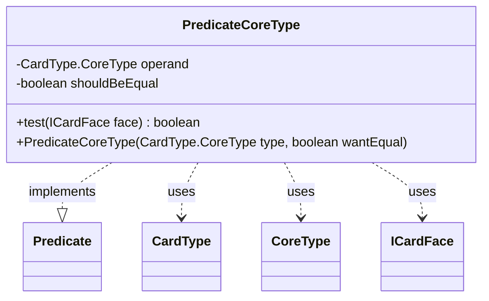

---
aliases:
  - PredicateCoreType
tags:
  - java/class
  - module/forge-core
  - pkg/forge/card
fqn: forge.card.CardFacePredicates.PredicateCoreType
package: forge.card
module: forge-core
kind: Class
---

# PredicateCoreType

**Package:** `forge.card`   **Module:** `forge-core`   **Kind:** Class



## Relationships
**Uses:**
- [[forge.card.CardType|CardType]]
- [[forge.card.CardType.CoreType|CoreType]]
- [[forge.card.ICardFace|ICardFace]]

## Design Description

PredicateCoreType is a private, immutable helper that implements `Predicate<ICardFace>` to test whether a card face matches a given core type (e.g. Creature, Land, Artifact). It is one of several nested predicate classes within `CardFacePredicates`, which acts as a factory exposing reusable filters over `ICardFace` instances.

Each instance captures a target `CardType.CoreType` operand and a `shouldBeEqual` flag, allowing the same class to express both "has this type" and "lacks this type" queries. Its `test` method null-guards the face, then delegates to the face's `CardType` via `hasType`, comparing the result against the desired polarity. The `private`/`final` design and constructor-only initialization signal that instances are meant to be created internally and treated as stateless, thread-safe value objects collaborating with the `forge.card` type model.

## Source
`forge-core/src/main/java/forge/card/CardFacePredicates.java` — declaration excerpt

```java
    private static class PredicateCoreType implements Predicate<ICardFace> {
        private final CardType.CoreType operand;
        private final boolean shouldBeEqual;

        @Override
        public boolean test(final ICardFace face) {
            if (null == face) {
                return false;
            }
            return this.shouldBeEqual == face.getType().hasType(this.operand);
        }

        public PredicateCoreType(final CardType.CoreType type, final boolean wantEqual) {
            this.operand = type;
            this.shouldBeEqual = wantEqual;
        }
    }
```
