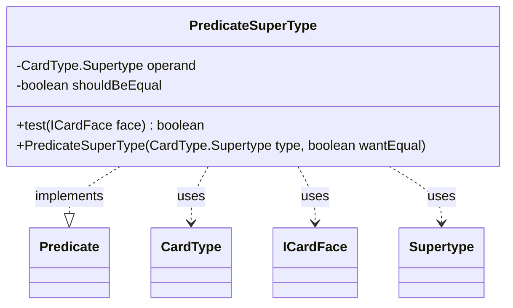

---
aliases:
  - PredicateSuperType
tags:
  - java/class
  - module/forge-core
  - pkg/forge/card
fqn: forge.card.CardFacePredicates.PredicateSuperType
package: forge.card
module: forge-core
kind: Class
---

# PredicateSuperType

**Package:** `forge.card`   **Module:** `forge-core`   **Kind:** Class



## Relationships
**Uses:**
- [[forge.card.CardType|CardType]]
- [[forge.card.CardType.Supertype|Supertype]]
- [[forge.card.ICardFace|ICardFace]]

## Design Description

PredicateSuperType is a private, immutable helper class within CardFacePredicates that implements `Predicate<ICardFace>` to filter card faces by a single supertype (such as Legendary, Basic, or Snow). It captures a target `CardType.Supertype` operand together with a `shouldBeEqual` flag, allowing the same predicate to express either inclusion or exclusion of the given supertype.

As a Predicate implementation, it slots into Forge's functional filtering pipelines over `ICardFace` collections, collaborating with `CardType` to inspect a face's supertypes via `getType().hasSupertype()`. Both fields are `final`, reflecting a deliberately stateless, side-effect-free design whose `test` method reduces the supertype check to a single boolean comparison; the polarity flag is a compact idiom that avoids needing a separate negating predicate.

## Source
`forge-core/src/main/java/forge/card/CardFacePredicates.java` — declaration excerpt

```java
    private static class PredicateSuperType implements Predicate<ICardFace> {
        private final CardType.Supertype operand;
        private final boolean shouldBeEqual;

        @Override
        public boolean test(final ICardFace face) {
            return this.shouldBeEqual == face.getType().hasSupertype(this.operand);
        }

        public PredicateSuperType(final CardType.Supertype type, final boolean wantEqual) {
            this.operand = type;
            this.shouldBeEqual = wantEqual;
        }
    }
```

## Python
`forge/card/CardFacePredicates/PredicateSuperType.py`

```python
from forge.card.CardType import CardType
from forge.card.ICardFace import ICardFace
from forge.util.Predicate import Predicate


class PredicateSuperType(Predicate[ICardFace]):
    def __init__(self, type: CardType.Supertype, wantEqual: bool):
        self.operand: CardType.Supertype = type
        self.shouldBeEqual: bool = wantEqual

    def test(self, face: ICardFace) -> bool:
        return self.shouldBeEqual == face.getType().hasSupertype(self.operand)
```
