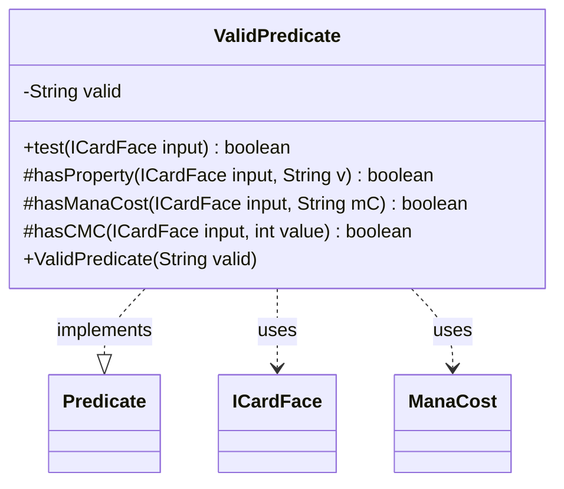

---
aliases:
  - ValidPredicate
tags:
  - java/class
  - module/forge-core
  - pkg/forge/card
fqn: forge.card.CardFacePredicates.ValidPredicate
package: forge.card
module: forge-core
kind: Class
---

# ValidPredicate

**Package:** `forge.card`   **Module:** `forge-core`   **Kind:** Class



## Relationships
**Uses:**
- [[forge.card.ICardFace|ICardFace]]
- [[forge.card.mana.ManaCost|ManaCost]]

## Design Description

The `ValidPredicate` class is a private static inner class of `CardFacePredicates` that implements `Predicate<ICardFace>`, encapsulating the logic for matching a card face against a string-encoded validity expression. Its responsibility is to parse a `valid` specification—split on a dot into a type clause (e.g. `Card`, `Permanent`, or a concrete card type) and an optional `+`-delimited list of property constraints—and report via `test` whether a given `ICardFace` satisfies it.

It collaborates with `ICardFace` to inspect type, mana cost, and string properties, and with `ManaCost` to compare short-string mana costs and converted mana cost. Protected static helpers (`hasProperty`, `hasManaCost`, `hasCMC`) decompose the predicate's sub-checks, with `hasProperty` recursively handling `non`-prefixed negation. The design reflects a lightweight domain-specific query language for card faces, keeping parsing and matching self-contained behind the standard `Predicate` interface so instances compose cleanly with filtering pipelines.

## Source
`forge-core/src/main/java/forge/card/CardFacePredicates.java` — declaration excerpt

```java
    static class ValidPredicate implements Predicate<ICardFace> {
        private String valid;

        public ValidPredicate(final String valid) {
            this.valid = valid;
        }

        @Override
        public boolean test(ICardFace input) {
            String[] k = valid.split("\\.", 2);

            if ("Card".equals(k[0])) {
                // okay
            } else if ("Permanent".equals(k[0])) {
                if (input.getType().isInstant() || input.getType().isSorcery()) {
                    return false;
                }
            } else if (!input.getType().hasStringType(k[0])) {
                return false;
            }
            if (k.length > 1) {
                for (final String m : k[1].split("\\+")) {
                    if (m.contains("ManaCost")) {
                        String manaCost = m.substring(8);
                        if (!hasManaCost(input, manaCost)) {
                            return false;
                        }
                    } else if (m.contains("cmcEQ")) {
                        int i = Integer.parseInt(m.substring(5));
                        if (!hasCMC(input, i)) return false;
                    } else if (!hasProperty(input, m)) {
                        return false;
                    }
                }
            }

            return true;
        }

        static protected boolean hasProperty(ICardFace input, final String v) {
            if (v.startsWith("non")) {
                return !hasProperty(input, v.substring(3));
            } else return input.getType().hasStringType(v);
        }

        static protected boolean hasManaCost(ICardFace input, final String mC) {
            return mC.equals(input.getManaCost().getShortString());
        }

        static protected boolean hasCMC(ICardFace input, final int value) {
            ManaCost cost = input.getManaCost();
            return cost != null && cost.getCMC() == value;
        }

    }
```
