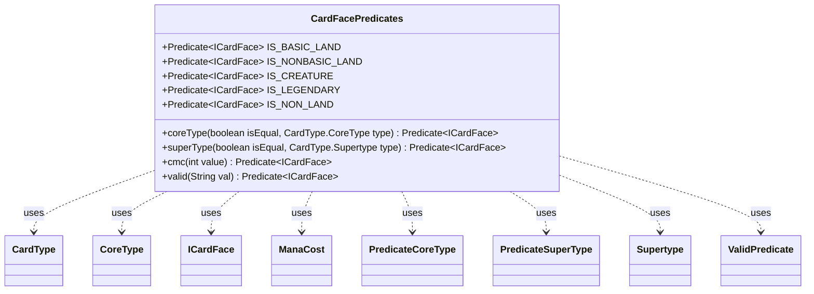

---
aliases:
  - CardFacePredicates
tags:
  - java/class
  - module/forge-core
  - pkg/forge/card
fqn: forge.card.CardFacePredicates
package: forge.card
module: forge-core
kind: Class
---

# CardFacePredicates

**Package:** `forge.card`   **Module:** `forge-core`   **Kind:** Class



## Relationships
**Uses:**
- [[forge.card.CardFacePredicates.PredicateCoreType|PredicateCoreType]]
- [[forge.card.CardFacePredicates.PredicateSuperType|PredicateSuperType]]
- [[forge.card.CardFacePredicates.ValidPredicate|ValidPredicate]]
- [[forge.card.CardType|CardType]]
- [[forge.card.CardType.CoreType|CoreType]]
- [[forge.card.CardType.Supertype|Supertype]]
- [[forge.card.ICardFace|ICardFace]]
- [[forge.card.mana.ManaCost|ManaCost]]


## Design Description

CardFacePredicates is a final, non-instantiable utility class that centralizes reusable `Predicate<ICardFace>` instances and factory methods for filtering Magic card faces by their intrinsic characteristics—core type, supertype, converted mana cost, and a flexible string-based "valid" expression. It publishes ready-made constants such as `IS_BASIC_LAND`, `IS_CREATURE`, `IS_LEGENDARY`, and `IS_NON_LAND`, alongside factories (`coreType`, `superType`, `cmc`, `valid`) that let callers build card-face queries without depending on concrete predicate types.

Operating purely against the `ICardFace` abstraction, the class delegates type tests to `CardType` and its nested `CoreType`/`Supertype` enums and compares costs through `ManaCost`. Its design intent is encapsulation and reuse: non-trivial logic lives in private static implementations (`PredicateCoreType`, `PredicateSuperType`, `ValidPredicate`), hidden behind static factories, while lambdas cover the simpler constants. The `ValidPredicate` parses a structured rule string (e.g., `Permanent.Creature+cmcEQ3`) into composable type and cost checks, making the toolkit a stateless, side-effect-free hub for card-face filtering.

## Source
`forge-core/src/main/java/forge/card/CardFacePredicates.java`

```java
package forge.card;

import forge.card.mana.ManaCost;

import java.util.function.Predicate;


public final class CardFacePredicates {

    private static class PredicateCoreType implements Predicate<ICardFace> {
        private final CardType.CoreType operand;
        private final boolean shouldBeEqual;

        @Override
        public boolean test(final ICardFace face) {
            if (null == face) {
                return false;
            }
            return this.shouldBeEqual == face.getType().hasType(this.operand);
        }

        public PredicateCoreType(final CardType.CoreType type, final boolean wantEqual) {
            this.operand = type;
            this.shouldBeEqual = wantEqual;
        }
    }

    private static class PredicateSuperType implements Predicate<ICardFace> {
        private final CardType.Supertype operand;
        private final boolean shouldBeEqual;

        @Override
        public boolean test(final ICardFace face) {
            return this.shouldBeEqual == face.getType().hasSupertype(this.operand);
        }

        public PredicateSuperType(final CardType.Supertype type, final boolean wantEqual) {
            this.operand = type;
            this.shouldBeEqual = wantEqual;
        }
    }

    /**
     * Core type.
     *
     * @param isEqual
     *            the is equal
     * @param type
     *            the type
     * @return the predicate
     */
    public static Predicate<ICardFace> coreType(final boolean isEqual, final CardType.CoreType type) {
        return new PredicateCoreType(type, isEqual);
    }

    /**
     * Super type.
     *
     * @param isEqual
     *            the is equal
     * @param type
     *            the type
     * @return the predicate
     */
    public static Predicate<ICardFace> superType(final boolean isEqual, final CardType.Supertype type) {
        return new PredicateSuperType(type, isEqual);
    }

    public static Predicate<ICardFace> cmc(final int value) {
        return input -> {
            ManaCost cost = input.getManaCost();
            return cost != null && cost.getCMC() == value;
        };
    }

    static class ValidPredicate implements Predicate<ICardFace> {
        private String valid;

        public ValidPredicate(final String valid) {
            this.valid = valid;
        }

        @Override
        public boolean test(ICardFace input) {
            String[] k = valid.split("\\.", 2);

            if ("Card".equals(k[0])) {
                // okay
            } else if ("Permanent".equals(k[0])) {
                if (input.getType().isInstant() || input.getType().isSorcery()) {
                    return false;
                }
            } else if (!input.getType().hasStringType(k[0])) {
                return false;
            }
            if (k.length > 1) {
                for (final String m : k[1].split("\\+")) {
                    if (m.contains("ManaCost")) {
                        String manaCost = m.substring(8);
                        if (!hasManaCost(input, manaCost)) {
                            return false;
                        }
                    } else if (m.contains("cmcEQ")) {
                        int i = Integer.parseInt(m.substring(5));
                        if (!hasCMC(input, i)) return false;
                    } else if (!hasProperty(input, m)) {
                        return false;
                    }
                }
            }

            return true;
        }

        static protected boolean hasProperty(ICardFace input, final String v) {
            if (v.startsWith("non")) {
                return !hasProperty(input, v.substring(3));
            } else return input.getType().hasStringType(v);
        }

        static protected boolean hasManaCost(ICardFace input, final String mC) {
            return mC.equals(input.getManaCost().getShortString());
        }

        static protected boolean hasCMC(ICardFace input, final int value) {
            ManaCost cost = input.getManaCost();
            return cost != null && cost.getCMC() == value;
        }

    }

    public static Predicate<ICardFace> valid(final String val) {
        return new ValidPredicate(val);
    }

    public static final Predicate<ICardFace> IS_BASIC_LAND = subject -> subject.getType().isBasicLand();
    public static final Predicate<ICardFace> IS_NONBASIC_LAND = subject -> subject.getType().isLand() && !subject.getType().isBasicLand();
    public static final Predicate<ICardFace> IS_CREATURE = CardFacePredicates.coreType(true, CardType.CoreType.Creature);
    public static final Predicate<ICardFace> IS_LEGENDARY = CardFacePredicates.superType(true, CardType.Supertype.Legendary);
    public static final Predicate<ICardFace> IS_NON_LAND = CardFacePredicates.coreType(false, CardType.CoreType.Land);
}
```

## Python
`forge/card/CardFacePredicates.py`

```python
from forge.card.CardType import CardType
from forge.card.ICardFace import ICardFace
from forge.card.mana.ManaCost import ManaCost

from typing import Callable


class CardFacePredicates:

    class PredicateCoreType:
        def __init__(self, type: CardType.CoreType, wantEqual: bool):
            self.operand = type
            self.shouldBeEqual = wantEqual

        def test(self, face: ICardFace) -> bool:
            if face is None:
                return False
            return self.shouldBeEqual == face.getType().hasType(self.operand)

    class PredicateSuperType:
        def __init__(self, type: CardType.Supertype, wantEqual: bool):
            self.operand = type
            self.shouldBeEqual = wantEqual

        def test(self, face: ICardFace) -> bool:
            return self.shouldBeEqual == face.getType().hasSupertype(self.operand)

    @staticmethod
    def coreType(isEqual: bool, type: CardType.CoreType) -> Callable[[ICardFace], bool]:
        return CardFacePredicates.PredicateCoreType(type, isEqual)

    @staticmethod
    def superType(isEqual: bool, type: CardType.Supertype) -> Callable[[ICardFace], bool]:
        return CardFacePredicates.PredicateSuperType(type, isEqual)

    @staticmethod
    def cmc(value: int) -> Callable[[ICardFace], bool]:
        def predicate(input):
            cost = input.getManaCost()
            return cost is not None and cost.getCMC() == value
        return predicate

    class ValidPredicate:
        def __init__(self, valid: str):
            self.valid = valid

        def test(self, input: ICardFace) -> bool:
            k = self.valid.split(".", 1)

            if "Card" == k[0]:
                # okay
                pass
            elif "Permanent" == k[0]:
                if input.getType().isInstant() or input.getType().isSorcery():
                    return False
            elif not input.getType().hasStringType(k[0]):
                return False
            if len(k) > 1:
                for m in k[1].split("+"):
                    if "ManaCost" in m:
                        manaCost = m[8:]
                        if not CardFacePredicates.ValidPredicate.hasManaCost(input, manaCost):
                            return False
                    elif "cmcEQ" in m:
                        i = int(m[5:])
                        if not CardFacePredicates.ValidPredicate.hasCMC(input, i):
                            return False
                    elif not CardFacePredicates.ValidPredicate.hasProperty(input, m):
                        return False

            return True

        @staticmethod
        def hasProperty(input: ICardFace, v: str) -> bool:
            if v.startswith("non"):
                return not CardFacePredicates.ValidPredicate.hasProperty(input, v[3:])
            else:
                return input.getType().hasStringType(v)

        @staticmethod
        def hasManaCost(input: ICardFace, mC: str) -> bool:
            return mC == input.getManaCost().getShortString()

        @staticmethod
        def hasCMC(input: ICardFace, value: int) -> bool:
            cost = input.getManaCost()
            return cost is not None and cost.getCMC() == value

    @staticmethod
    def valid(val: str) -> Callable[[ICardFace], bool]:
        return CardFacePredicates.ValidPredicate(val)


CardFacePredicates.IS_BASIC_LAND = lambda subject: subject.getType().isBasicLand()
CardFacePredicates.IS_NONBASIC_LAND = lambda subject: subject.getType().isLand() and not subject.getType().isBasicLand()
CardFacePredicates.IS_CREATURE = CardFacePredicates.coreType(True, CardType.CoreType.Creature)
CardFacePredicates.IS_LEGENDARY = CardFacePredicates.superType(True, CardType.Supertype.Legendary)
CardFacePredicates.IS_NON_LAND = CardFacePredicates.coreType(False, CardType.CoreType.Land)
```
