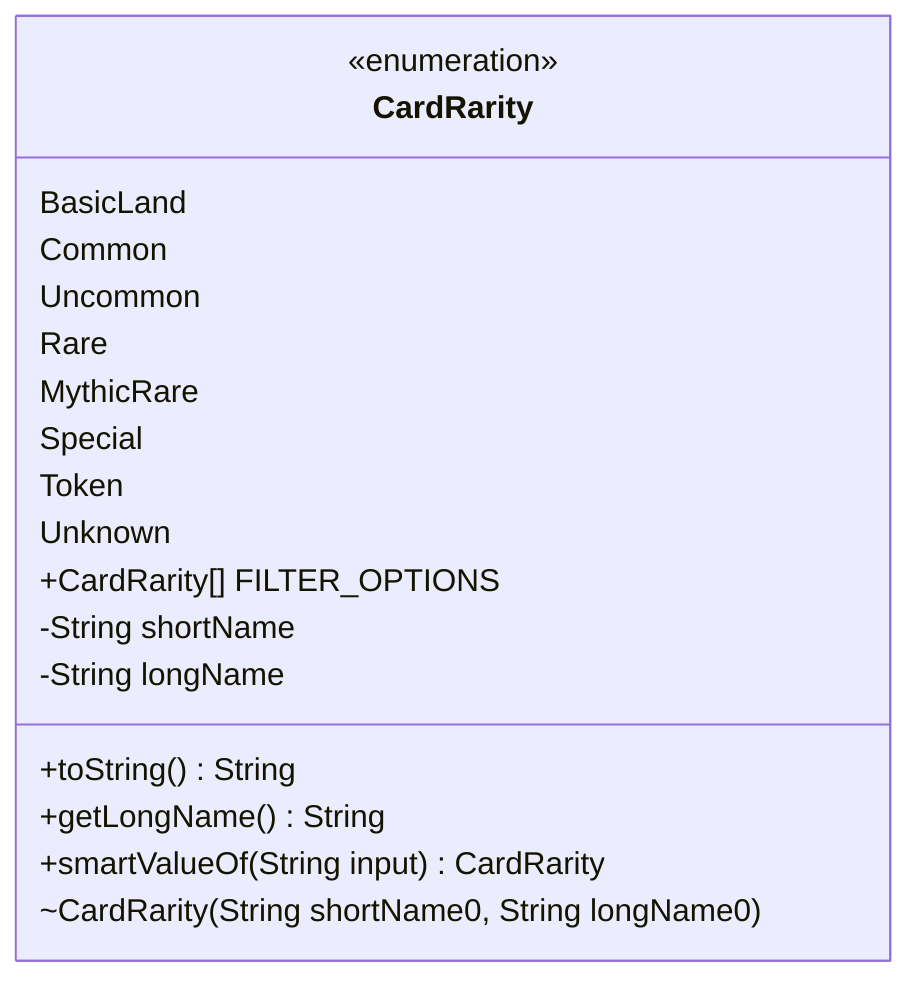

---
aliases:
  - CardRarity
tags:
  - java/enum
  - module/forge-core
  - pkg/forge/card
fqn: forge.card.CardRarity
package: forge.card
module: forge-core
kind: Enum
---

# CardRarity

**Package:** `forge.card`   **Module:** `forge-core`   **Kind:** Enum




## Design Description

CardRarity is a fixed enumeration of the rarity tiers a Magic card can occupy, spanning the standard BasicLand, Common, Uncommon, Rare, and MythicRare values alongside the non-standard Special, Token, and Unknown categories. Each constant binds a single-character `shortName`, returned by the overridden `toString`, to a human-readable `longName` exposed through `getLongName`, so callers get both a compact code suited to serialization or display and a descriptive label. Residing in `forge-core`'s `forge.card` package, it functions as a shared domain vocabulary referenced across card definitions and deck-building code rather than as a behavioral collaborator.

The design emphasizes lenient, defensive parsing: `smartValueOf` matches input case-insensitively against each constant's enum name, short name, or long name, returning `Unknown` instead of throwing so malformed or in-development data degrades gracefully. The static `FILTER_OPTIONS` array curates the user-facing subset of rarities—omitting BasicLand, Token, and Unknown—to drive filtering in card-browsing interfaces.

## Source
`forge-core/src/main/java/forge/card/CardRarity.java`

```java
/*
 * Forge: Play Magic: the Gathering.
 * Copyright (C) 2011  Forge Team
 *
 * This program is free software: you can redistribute it and/or modify
 * it under the terms of the GNU General Public License as published by
 * the Free Software Foundation, either version 3 of the License, or
 * (at your option) any later version.
 * 
 * This program is distributed in the hope that it will be useful,
 * but WITHOUT ANY WARRANTY; without even the implied warranty of
 * MERCHANTABILITY or FITNESS FOR A PARTICULAR PURPOSE.  See the
 * GNU General Public License for more details.
 * 
 * You should have received a copy of the GNU General Public License
 * along with this program.  If not, see <http://www.gnu.org/licenses/>.
 */
package forge.card;

public enum CardRarity {
    BasicLand("L", "Basic Land"),
    Common("C", "Common"),
    Uncommon("U", "Uncommon"),
    Rare("R", "Rare"),
    MythicRare("M", "Mythic Rare"),
    Special("S", "Special"), // Timeshifted
    Token("T", "Token"),     // Tokens
    Unknown("?", "Unknown"); // In development

    public static final CardRarity[] FILTER_OPTIONS = new CardRarity[] {
        Common, Uncommon, Rare, MythicRare, Special
    };

    private final String shortName, longName;

    CardRarity(final String shortName0, final String longName0) {
        shortName = shortName0;
        longName = longName0;
    }

    @Override
    public String toString() {
        return shortName;
    }

    public String getLongName() {
        return longName;
    }

    public static CardRarity smartValueOf(String input) {
        for (CardRarity r : CardRarity.values()) {
            if (r.name().equalsIgnoreCase(input) || r.shortName.equalsIgnoreCase(input) || r.longName.equalsIgnoreCase(input)) {
                return r;
            }
        }
        return Unknown;
    }
}
```

## Python
`forge/card/CardRarity.py`

```python
from enum import Enum


class CardRarity(Enum):
    BasicLand = ("L", "Basic Land")
    Common = ("C", "Common")
    Uncommon = ("U", "Uncommon")
    Rare = ("R", "Rare")
    MythicRare = ("M", "Mythic Rare")
    Special = ("S", "Special")  # Timeshifted
    Token = ("T", "Token")      # Tokens
    Unknown = ("?", "Unknown")  # In development

    def __init__(self, shortName0: str, longName0: str):
        self.shortName = shortName0
        self.longName = longName0

    def __str__(self) -> str:
        return self.shortName

    def getLongName(self) -> str:
        return self.longName

    @staticmethod
    def smartValueOf(input: str) -> "CardRarity":
        for r in CardRarity:
            if (r.name.lower() == input.lower()
                    or r.shortName.lower() == input.lower()
                    or r.longName.lower() == input.lower()):
                return r
        return CardRarity.Unknown


CardRarity.FILTER_OPTIONS = [
    CardRarity.Common,
    CardRarity.Uncommon,
    CardRarity.Rare,
    CardRarity.MythicRare,
    CardRarity.Special,
]
```
