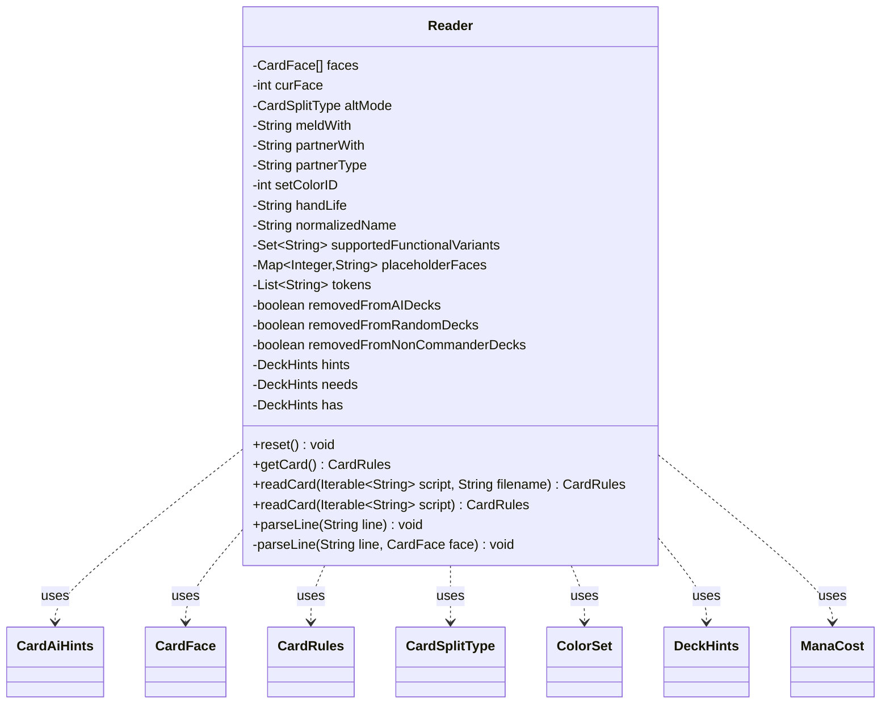

---
aliases:
  - Reader
tags:
  - java/class
  - module/forge-core
  - pkg/forge/card
fqn: forge.card.CardRules.Reader
package: forge.card
module: forge-core
kind: Class
---

# Reader

**Package:** `forge.card`   **Module:** `forge-core`   **Kind:** Class



## Relationships
**Uses:**
- [[forge.card.CardAiHints|CardAiHints]]
- [[forge.card.CardFace|CardFace]]
- [[forge.card.CardRules|CardRules]]
- [[forge.card.CardSplitType|CardSplitType]]
- [[forge.card.ColorSet|ColorSet]]
- [[forge.card.DeckHints|DeckHints]]
- [[forge.card.mana.ManaCost|ManaCost]]

## Design Description

`CardRules.Reader` is a static nested builder/parser that translates a Forge card-script file (`cardname.txt`) into an immutable `CardRules` instance. It accumulates parse state across mutable fields — up to seven `CardFace` slots (for alternate, split, meld, and specialize faces), AI deck restrictions, mana cost, colors, and deck-hint metadata — then assembles them in `getCard()`. Its central routine, `parseLine`, dispatches on each line's leading character and key to populate the appropriate face or builder field, recursing for functional variants.

By design it is reusable: `reset()` clears all fields so a single Reader can parse many cards without reallocating, and `readCard` drives the full reset-parse-build cycle. It collaborates with `CardFace` (per-face data), `CardAiHints` and `DeckHints` (AI/deck guidance), and value types like `ColorSet`, `ManaCost`, and `CardSplitType` to interpret script tokens, keeping all parsing logic encapsulated away from the `CardRules` it produces.

## Source
`forge-core/src/main/java/forge/card/CardRules.java` — declaration excerpt

```java
    // Reads cardname.txt
    public static class Reader {
        // fields to build
        private CardFace[] faces = new CardFace[] { null, null, null, null, null, null, null };
        private int curFace = 0;
        private CardSplitType altMode = CardSplitType.None;
        private String meldWith = "";
        private String partnerWith = "";
        private String partnerType = "";
        private int setColorID = 0;
        private String handLife = null;
        private String normalizedName = "";
        private Set<String> supportedFunctionalVariants = null;
        private Map<Integer, String> placeholderFaces = null;

        private List<String> tokens = Lists.newArrayList();

        // fields to build CardAiHints
        private boolean removedFromAIDecks = false;
        private boolean removedFromRandomDecks = false;
        private boolean removedFromNonCommanderDecks = false;
        private DeckHints hints = null;
        private DeckHints needs = null;
        private DeckHints has = null;

        /**
         * Reset all fields to parse next card (to avoid allocating new CardRulesReader N times)
         */
        public final void reset() {
            this.setColorID = 0;
            this.curFace = 0;
            this.faces[0] = null;
            this.faces[1] = null;
            this.faces[2] = null;
            this.faces[3] = null;
            this.faces[4] = null;
            this.faces[5] = null;
            this.faces[6] = null;

            this.handLife = null;
            this.altMode = CardSplitType.None;

            this.removedFromAIDecks = false;
            this.removedFromRandomDecks = false;
            this.removedFromNonCommanderDecks = false;
            this.needs = null;
            this.hints = null;
            this.has = null;
            this.meldWith = "";
            this.partnerWith = "";
            this.partnerType = "";
            this.normalizedName = "";
            this.supportedFunctionalVariants = null;
            this.placeholderFaces = null;
            this.tokens = Lists.newArrayList();
        }

        /**
         * Gets the card.
         *
         * @return the card
         */
        public final CardRules getCard() {
            CardAiHints cah = new CardAiHints(removedFromAIDecks, removedFromRandomDecks, removedFromNonCommanderDecks, hints, needs, has);
            if (null != faces[0]) faces[0].assignMissingFields();
            else assert(placeholderFaces != null);
            if (null != faces[1]) faces[1].assignMissingFields();
            if (null != faces[2]) faces[2].assignMissingFields();
            if (null != faces[3]) faces[3].assignMissingFields();
            if (null != faces[4]) faces[4].assignMissingFields();
            if (null != faces[5]) faces[5].assignMissingFields();
            if (null != faces[6]) faces[6].assignMissingFields();
            final CardRules result = new CardRules(faces, altMode, cah);

            result.normalizedName = this.normalizedName;
            result.meldWith = this.meldWith;
            result.partnerWith = this.partnerWith;
            result.partnerType = this.partnerType;
            result.setColorID = this.setColorID;
            if (!tokens.isEmpty()) {
                result.tokens = tokens;
            }
            if (StringUtils.isNotBlank(handLife))
                result.setVanguardProperties(handLife);
            result.supportedFunctionalVariants = this.supportedFunctionalVariants;
            result.placeholderFaces = this.placeholderFaces;
            return result;
        }

        public final CardRules readCard(final Iterable<String> script, String filename) {
            this.reset();
            for (String line : script) {
                if (line.isEmpty() || line.charAt(0) == '#') {
                    continue;
                }
                this.parseLine(line, this.faces[curFace]);
            }
            this.normalizedName = filename;
            return this.getCard();
        }

        public final CardRules readCard(final Iterable<String> script) {
            return readCard(script, null);
        }

        /**
         * Parses a single line of a card script.
         *
         * @param line Line of text to parse.
         */
        public final void parseLine(final String line) {
            this.parseLine(line, this.faces[curFace]);
        }

        private void parseLine(final String line, CardFace face) {
            int colonPos = line.indexOf(':');
            String key = colonPos > 0 ? line.substring(0, colonPos) : line;
            String value = colonPos > 0 ? line.substring(1+colonPos).trim() : null;

            if (value != null) {
                int tokIdx = value.indexOf("TokenScript$");
                if (tokIdx > 0) {
                    String tokenParam = value.substring(tokIdx + 12).trim();
                    int endIdx = tokenParam.indexOf("|");
                    if (endIdx > 0) {
                        tokenParam = tokenParam.substring(0, endIdx).trim();
                    }
                    this.tokens.addAll(Arrays.asList(tokenParam.split(",")));
                }
            }

            switch (key.charAt(0)) {
                case 'A':
                    if ("A".equals(key)) {
                        face.addAbility(value);
                    } else if ("AI".equals(key)) {
                        colonPos = value.indexOf(':');
                        String variable = colonPos > 0 ? value.substring(0, colonPos) : value;
                        value = colonPos > 0 ? value.substring(1+colonPos) : null;

                        if ("RemoveDeck".equals(variable)) {
                            this.removedFromAIDecks |= "All".equalsIgnoreCase(value);
                            this.removedFromRandomDecks |= "Random".equalsIgnoreCase(value);
                            this.removedFromNonCommanderDecks |= "NonCommander".equalsIgnoreCase(value);
                        }
                    } else if ("AlternateMode".equals(key)) {
                        this.altMode = CardSplitType.smartValueOf(value);
                    } else if ("ALTERNATE".equals(key)) {
                        this.curFace = 1;
                    }
                    break;

                case 'C':
                    if ("Colors".equals(key)) {
                        ColorSet newCol = ColorSet.fromNames(value.split(","));
                        face.setColor(newCol);
                    } else if ("CopyFaceFrom".equals(key)) {
                        if (placeholderFaces == null)
                            placeholderFaces = new HashMap<>(2);
                        assert(this.faces[this.curFace] == null);
                        placeholderFaces.put(this.curFace, value);
                    }
                    break;

                case 'D':
                    if ("DeckHints".equals(key)) {
                        hints = new DeckHints(value);
                    } else if ("DeckNeeds".equals(key)) {
                        needs = new DeckHints(value);
                    } else if ("DeckHas".equals(key)) {
                        has = new DeckHints(value);
                    } else if ("Defense".equals(key)) {
                        face.setDefense(value);
                    } else if ("Draft".equals(key)) {
                        face.addDraftAction(value);
                    }
                    break;

                case 'F':
                    if("FlavorName".equals(key)) {
                        face.setFlavorName(value);
                    }

                case 'H':
                    if ("HandLifeModifier".equals(key)) {
                        handLife = value;
                    }
                    break;

                case 'K':
                    if ("K".equals(key)) {
                        face.addKeyword(value);
                        if (value.startsWith("Partner with:")) {
                            this.partnerWith = value.split(":")[1];
                        }
                        if (value.startsWith("Partner:")) {
                            this.partnerType = value.split(":")[1];
                        }
                    }
                    break;

                case 'L':
                    if ("Loyalty".equals(key)) {
                        face.setInitialLoyalty(value);
                    }
                    if ("Lights".equals(key)) {
                        face.setAttractionLights(value);
                    }
                    break;

                case 'M':
                    if ("ManaCost".equals(key)) {
                        face.setManaCost("no cost".equals(value) ? ManaCost.NO_COST : new ManaCost(value));
                    } else if ("MeldPair".equals(key)) {
                        this.meldWith = value;
                    }
                    break;

                case 'N':
                    if ("Name".equals(key)) {
                        assert(this.placeholderFaces == null || !this.placeholderFaces.containsKey(this.curFace));
                        this.faces[this.curFace] = new CardFace(value);
                    }
                    break;

                case 'O':
                    if ("Oracle".equals(key)) {
                        face.setOracleText(value);
                    }
                    break;

                case 'P':
                    if ("PT".equals(key)) {
                        face.setPtText(value);
                    }
                    break;

                case 'R':
                    if ("R".equals(key)) {
                        face.addReplacementEffect(value);
                    }
                    break;

                case 'S':
                    if ("S".equals(key)) {
                        face.addStaticAbility(value);
                    } else if (key.startsWith("SPECIALIZE")) {
                        if (value.equals("WHITE")) {
                            this.curFace = 2;
                        } else if (value.equals("BLUE")) {
                            this.curFace = 3;
                        } else if (value.equals("BLACK")) {
                            this.curFace = 4;
                        } else if (value.equals("RED")) {
                            this.curFace = 5;
                        } else if (value.equals("GREEN")) {
                            this.curFace = 6;
                        }
                    } else if ("SVar".equals(key)) {
                        if (null == value) throw new IllegalArgumentException("SVar has no variable name");

                        colonPos = value.indexOf(':');
                        String variable = colonPos > 0 ? value.substring(0, colonPos) : value;
                        value = colonPos > 0 ? value.substring(1+colonPos) : null;

                        face.addSVar(variable, value);
                    } else if (key.startsWith("SETCOLORID")) {
                        this.setColorID = Integer.parseInt(value);
                    }
                    break;

                case 'T':
                    if ("T".equals(key)) {
                        face.addTrigger(value);
                    } else if ("Types".equals(key)) {
                        face.setType(CardType.parse(value, false));
                    } else if ("Text".equals(key) && StringUtils.isNotBlank(value)) {
                        face.setNonAbilityText(value);
                    }
                    break;

                case 'V':
                    if("Variant".equals(key)) {
                        if (value == null) value = "";
                        colonPos = value.indexOf(':');
                        if(colonPos <= 0) throw new IllegalArgumentException("Missing variant name");
                        String variantName = value.substring(0, colonPos);
                        CardFace varFace = face.getOrCreateFunctionalVariant(variantName);
                        String variantLine = value.substring(1 + colonPos);
                        this.parseLine(variantLine, varFace);
                        if(this.supportedFunctionalVariants == null)
                            this.supportedFunctionalVariants = new HashSet<>();
                        this.supportedFunctionalVariants.add(variantName);
                    }
                    break;
            }
        }
    }
```
