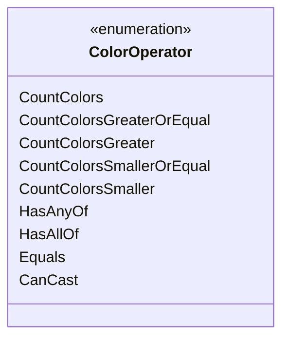

---
aliases:
  - ColorOperator
tags:
  - java/enum
  - module/forge-core
  - pkg/forge/card
fqn: forge.card.CardRulesPredicates.LeafColor.ColorOperator
package: forge.card
module: forge-core
kind: Enum
---

# ColorOperator

**Package:** `forge.card`   **Module:** `forge-core`   **Kind:** Enum



## Design Description

The `ColorOperator` enum is a private member of `LeafColor` (itself a nested predicate within `CardRulesPredicates`), enumerating the comparison and matching strategies used to evaluate a card's color identity against a target color set. Its constants split into three intents: cardinality tests on the number of colors present (`CountColors` and its greater/smaller/-or-equal variants), set-membership tests (`HasAnyOf`, `HasAllOf`, `Equals`), and a castability test (`CanCast`). As a pure enum it carries no behavior of its own; instead it acts as a discriminator that the enclosing `LeafColor` predicate switches on to select the appropriate filtering logic when testing `CardRules`. This keeps the variety of color-query operations expressed declaratively in one type, decoupling the choice of operation from its implementation and making the predicate's construction self-documenting.

## Source
`forge-core/src/main/java/forge/card/CardRulesPredicates.java` — declaration excerpt

```java
        public enum ColorOperator {
            CountColors,
            CountColorsGreaterOrEqual,
            CountColorsGreater,
            CountColorsSmallerOrEqual,
            CountColorsSmaller,
            HasAnyOf,
            HasAllOf,
            Equals,
            CanCast
        }
```

## Python
`forge/card/CardRulesPredicates/LeafColor/ColorOperator.py`

```python
from enum import Enum, auto


class ColorOperator(Enum):
    CountColors = auto()
    CountColorsGreaterOrEqual = auto()
    CountColorsGreater = auto()
    CountColorsSmallerOrEqual = auto()
    CountColorsSmaller = auto()
    HasAnyOf = auto()
    HasAllOf = auto()
    Equals = auto()
    CanCast = auto()
```
