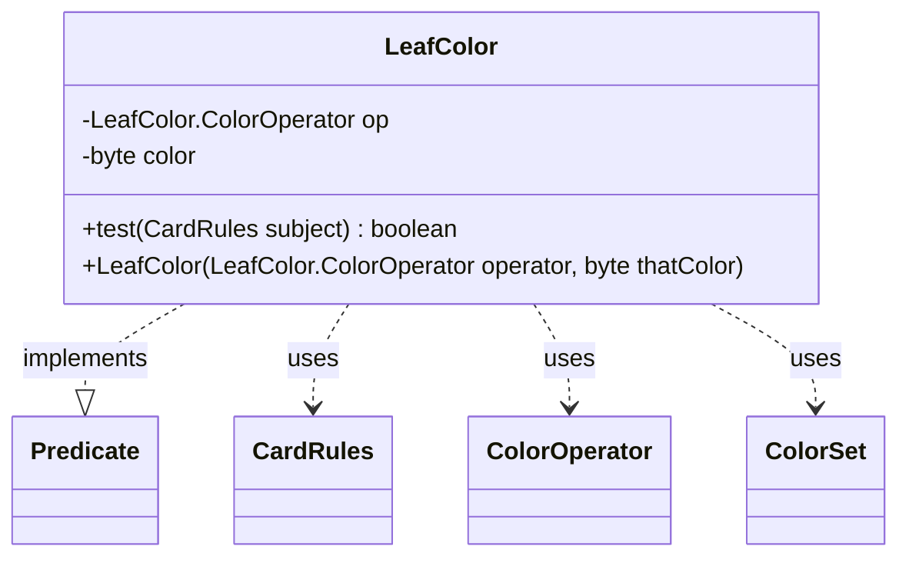

---
aliases:
  - LeafColor
tags:
  - java/class
  - module/forge-core
  - pkg/forge/card
fqn: forge.card.CardRulesPredicates.LeafColor
package: forge.card
module: forge-core
kind: Class
---

# LeafColor

**Package:** `forge.card`   **Module:** `forge-core`   **Kind:** Class



## Relationships
**Uses:**
- [[forge.card.CardRules|CardRules]]
- [[forge.card.CardRulesPredicates.LeafColor.ColorOperator|ColorOperator]]
- [[forge.card.ColorSet|ColorSet]]

## Design Description

`LeafColor` is a private, immutable predicate that tests a single card's color characteristics against a configured criterion. It pairs a `ColorOperator` enum constant with a packed `byte` color mask, and its `test` method dispatches on that operator to evaluate the candidate `CardRules`. As a nested helper within `CardRulesPredicates`, it implements Guava's `Predicate<CardRules>`, making it composable with other filtering predicates used to query the card database.

Its design intent is to consolidate many distinct color queries—color count comparisons, subset/superset membership, exact equality, and castability—into one parameterized leaf rather than a proliferation of separate predicate classes. It delegates the actual logic to `ColorSet` (via `CardRules.getColor()`) and to `CardRules.canCastWithAvailable`, keeping the predicate a thin dispatcher. Null subjects fail safely, and the `final` fields make instances cheap, shareable, and side-effect free.

## Source
`forge-core/src/main/java/forge/card/CardRulesPredicates.java` — declaration excerpt

```java
    private static class LeafColor implements Predicate<CardRules> {
        public enum ColorOperator {
            CountColors,
            CountColorsGreaterOrEqual,
            CountColorsGreater,
            CountColorsSmallerOrEqual,
            CountColorsSmaller,
            HasAnyOf,
            HasAllOf,
            Equals,
            CanCast
        }

        private final LeafColor.ColorOperator op;
        private final byte color;

        public LeafColor(final LeafColor.ColorOperator operator, final byte thatColor) {
            this.op = operator;
            this.color = thatColor;
        }

        @Override
        public boolean test(final CardRules subject) {
            if (null == subject) {
                return false;
            }
            ColorSet cardColor = subject.getColor();
            switch (this.op) {
            case CountColors:
                return cardColor.countColors() == this.color;
            case CountColorsGreaterOrEqual:
                return cardColor.countColors() >= this.color;
            case CountColorsGreater:
                return cardColor.countColors() > this.color;
            case CountColorsSmallerOrEqual:
                return cardColor.countColors() <= this.color;
            case CountColorsSmaller:
                return cardColor.countColors() < this.color;
            case Equals:
                return cardColor.isEqual(this.color);
            case HasAllOf:
                return cardColor.hasAllColors(this.color);
            case HasAnyOf:
                return cardColor.hasAnyColor(this.color);
            case CanCast:
                return subject.canCastWithAvailable(this.color);
            default:
                return false;
            }
        }
    }
```
