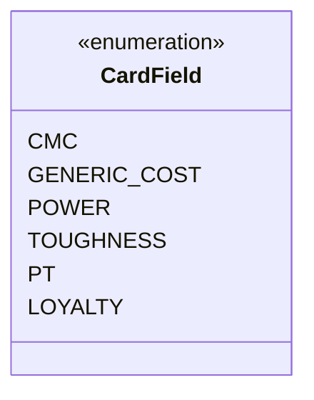

---
aliases:
  - CardField
tags:
  - java/enum
  - module/forge-core
  - pkg/forge/card
fqn: forge.card.CardRulesPredicates.LeafNumber.CardField
package: forge.card
module: forge-core
kind: Enum
---

# CardField

**Package:** `forge.card`   **Module:** `forge-core`   **Kind:** Enum



## Design Description

Forge's `CardRulesPredicates` uses `CardField` as a small nested enumeration that names the numeric attributes of a Magic card a `LeafNumber` predicate can test. Each constant—`CMC`, `GENERIC_COST`, `POWER`, `TOUGHNESS`, `PT`, and `LOYALTY`—identifies one quantitative field whose integer value the enclosing predicate compares against a threshold.

As a pure enum it carries no behavior or state of its own; its responsibility is to give the surrounding `LeafNumber` logic a type-safe selector, replacing magic strings or constants when dispatching field-specific value extraction from a `CardRules` instance. Defining it inside `LeafNumber` keeps the field vocabulary tightly scoped to the predicate that consumes it, signaling that these values are an implementation detail of card-attribute filtering rather than a broadly shared API.

## Source
`forge-core/src/main/java/forge/card/CardRulesPredicates.java` — declaration excerpt

```java
        public enum CardField {
            CMC, GENERIC_COST, POWER, TOUGHNESS, PT, LOYALTY
        }
```

## Python
`forge/card/CardRulesPredicates/LeafNumber/CardField.py`

```python
from enum import Enum


class CardField(Enum):
    CMC = "CMC"
    GENERIC_COST = "GENERIC_COST"
    POWER = "POWER"
    TOUGHNESS = "TOUGHNESS"
    PT = "PT"
    LOYALTY = "LOYALTY"
```
