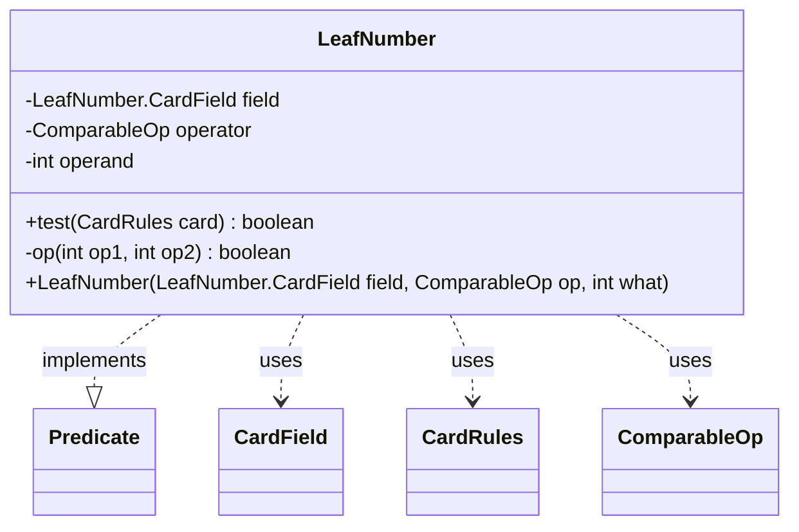

---
aliases:
  - LeafNumber
tags:
  - java/class
  - module/forge-core
  - pkg/forge/card
fqn: forge.card.CardRulesPredicates.LeafNumber
package: forge.card
module: forge-core
kind: Class
---

# LeafNumber

**Package:** `forge.card`   **Module:** `forge-core`   **Kind:** Class



## Relationships
**Uses:**
- [[forge.card.CardRules|CardRules]]
- [[forge.card.CardRulesPredicates.LeafNumber.CardField|CardField]]
- [[forge.util.ComparableOp|ComparableOp]]

## Design Description

LeafNumber is a static nested `Predicate<CardRules>` that evaluates a single numeric comparison against a card's rules data. It pairs three immutable fields — a `CardField` enum selecting which numeric attribute to inspect (CMC, generic cost, power, toughness, combined P/T, or loyalty), a `ComparableOp` defining the comparison, and an integer operand — to answer whether a given `CardRules` satisfies the predicate. Its `test` method dispatches on the field to extract the relevant value, then delegates to a private `op` helper that maps each `ComparableOp` to the corresponding integer relation.

As a leaf node in `CardRulesPredicates`, it serves as the atomic building block from which larger, composable card-filtering predicates are assembled. The design favors immutability and defensive parsing: loyalty values are validated and parsed guardedly, and sentinel `Integer.MAX_VALUE` power/toughness results are treated as non-matching rather than producing spurious comparisons.

## Source
`forge-core/src/main/java/forge/card/CardRulesPredicates.java` — declaration excerpt

```java
    public static class LeafNumber implements Predicate<CardRules> {
        public enum CardField {
            CMC, GENERIC_COST, POWER, TOUGHNESS, PT, LOYALTY
        }

        private final LeafNumber.CardField field;
        private final ComparableOp operator;
        private final int operand;

        public LeafNumber(final LeafNumber.CardField field, final ComparableOp op, final int what) {
            this.field = field;
            this.operand = what;
            this.operator = op;
        }

        @Override
        public boolean test(final CardRules card) {
            int value;
            switch (this.field) {
            case CMC:
                return this.op(card.getManaCost().getCMC(), this.operand);
            case GENERIC_COST:
                return this.op(card.getManaCost().getGenericCost(), this.operand);
            case LOYALTY:
                String sLoyalty = card.getInitialLoyalty();
                if (StringUtils.isBlank(sLoyalty) || !sLoyalty.matches("\\d+")) {
                    return false;
                }
                try {
                    value = Integer.parseInt(sLoyalty) ;
                }
                catch (NumberFormatException ignored) {
                    return false;
                }
                return this.op(value, this.operand);
            case POWER:
                value = card.getIntPower();
                return value != Integer.MAX_VALUE && this.op(value, this.operand);
            case TOUGHNESS:
                value = card.getIntToughness();
                return value != Integer.MAX_VALUE && this.op(value, this.operand);
            case PT:
                value = card.getIntPower() + card.getIntToughness();
                return value != Integer.MAX_VALUE && this.op(value, this.operand);
            default:
                return false;
            }
        }

        private boolean op(final int op1, final int op2) {
            switch (this.operator) {
            case EQUALS:
                return op1 == op2;
            case GREATER_THAN:
                return op1 > op2;
            case GT_OR_EQUAL:
                return op1 >= op2;
            case LESS_THAN:
                return op1 < op2;
            case LT_OR_EQUAL:
                return op1 <= op2;
            case NOT_EQUALS:
                return op1 != op2;
            default:
                return false;
            }
        }
    }
```

## Python
`forge/card/CardRulesPredicates/LeafNumber.py`

```python
from forge.card.CardRules import CardRules
from forge.card.CardRulesPredicates.LeafNumber.CardField import CardField
from forge.util.ComparableOp import ComparableOp
import re


class LeafNumber:
    def __init__(self, field: CardField, op: ComparableOp, what: int):
        self.field = field
        self.operand = what
        self.operator = op

    def test(self, card: CardRules) -> bool:
        if self.field == CardField.CMC:
            return self.op(card.getManaCost().getCMC(), self.operand)
        elif self.field == CardField.GENERIC_COST:
            return self.op(card.getManaCost().getGenericCost(), self.operand)
        elif self.field == CardField.LOYALTY:
            sLoyalty = card.getInitialLoyalty()
            if sLoyalty is None or sLoyalty.strip() == "" or not re.fullmatch(r"\d+", sLoyalty):
                return False
            try:
                value = int(sLoyalty)
            except ValueError:
                return False
            return self.op(value, self.operand)
        elif self.field == CardField.POWER:
            value = card.getIntPower()
            return value != 2147483647 and self.op(value, self.operand)
        elif self.field == CardField.TOUGHNESS:
            value = card.getIntToughness()
            return value != 2147483647 and self.op(value, self.operand)
        elif self.field == CardField.PT:
            value = card.getIntPower() + card.getIntToughness()
            return value != 2147483647 and self.op(value, self.operand)
        else:
            return False

    def op(self, op1: int, op2: int) -> bool:
        if self.operator == ComparableOp.EQUALS:
            return op1 == op2
        elif self.operator == ComparableOp.GREATER_THAN:
            return op1 > op2
        elif self.operator == ComparableOp.GT_OR_EQUAL:
            return op1 >= op2
        elif self.operator == ComparableOp.LESS_THAN:
            return op1 < op2
        elif self.operator == ComparableOp.LT_OR_EQUAL:
            return op1 <= op2
        elif self.operator == ComparableOp.NOT_EQUALS:
            return op1 != op2
        else:
            return False
```
