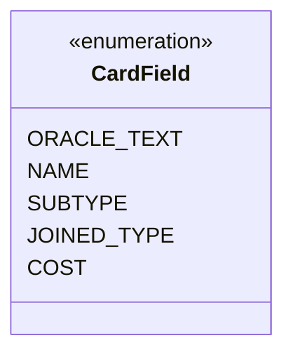

---
aliases:
  - CardField
tags:
  - java/enum
  - module/forge-core
  - pkg/forge/card
fqn: forge.card.CardRulesPredicates.LeafString.CardField
package: forge.card
module: forge-core
kind: Enum
---

# CardField

**Package:** `forge.card`   **Module:** `forge-core`   **Kind:** Enum



## Design Description

The CardField enum is a nested type within `CardRulesPredicates.LeafString`, enumerating the textual fields of a Magic card that string-based predicates can target: oracle text, name, subtype, the joined type line, and mana cost. It serves as a type-safe selector that tells the enclosing `LeafString` predicate which attribute of a `CardRules` instance to extract and test against a query string. By modeling these fields as enum constants rather than raw strings, the design constrains predicate construction to a fixed, valid set of searchable attributes and lets the predicate's evaluation logic dispatch via a clean switch over the constant, keeping card-filtering and search functionality both readable and resistant to typos.

## Source
`forge-core/src/main/java/forge/card/CardRulesPredicates.java` — declaration excerpt

```java
        public enum CardField {
            ORACLE_TEXT, NAME, SUBTYPE, JOINED_TYPE, COST
        }
```
