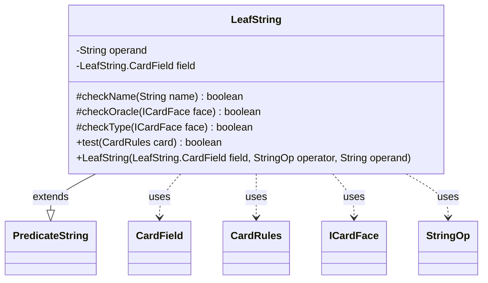

---
aliases:
  - LeafString
tags:
  - java/class
  - module/forge-core
  - pkg/forge/card
fqn: forge.card.CardRulesPredicates.LeafString
package: forge.card
module: forge-core
kind: Class
---

# LeafString

**Package:** `forge.card`   **Module:** `forge-core`   **Kind:** Class



## Relationships
**Extends:**
- [[forge.util.PredicateString|PredicateString]]
**Uses:**
- [[forge.card.CardRules|CardRules]]
- [[forge.card.CardRulesPredicates.LeafString.CardField|CardField]]
- [[forge.card.ICardFace|ICardFace]]
- [[forge.util.PredicateString.StringOp|StringOp]]

## Design Description

`LeafString` is a private leaf predicate within `CardRulesPredicates` that tests whether a single `CardRules` instance matches a string criterion against one of several searchable fields—name, oracle text, subtype, joined type, or mana cost—as designated by its `CardField` enum. Extending `PredicateString<CardRules>`, it inherits the configured `StringOp` operator (contains, equals, etc.) and applies it through the shared `op` helper, pairing a target `field` with a literal `operand`.

Its `test` method dispatches on the field, iterating each `ICardFace` of the card so multi-faced cards match on any face. Notable design intent appears in its tolerance for localization and variants: name, oracle, and type checks also compare against `CardTranslation` translations and accent-stripped forms, and functional variants are each examined while flavor-named variants are deliberately excluded from oracle matching so flavor-name searches stay precise. A TODO acknowledges this variant handling as a known compromise pending a `PaperCard`-based rewrite.

## Source
`forge-core/src/main/java/forge/card/CardRulesPredicates.java` — declaration excerpt

```java
    private static class LeafString extends PredicateString<CardRules> {
        public enum CardField {
            ORACLE_TEXT, NAME, SUBTYPE, JOINED_TYPE, COST
        }

        private final String operand;
        private final LeafString.CardField field;

        protected boolean checkName(String name) {
            return op(name, this.operand)
            || op(CardTranslation.getTranslatedName(name), this.operand)
            || op(StringUtils.stripAccents(name), this.operand);
        }
        protected boolean checkOracle(ICardFace face) {
            if (face == null) {
                return false;
            }
            if (face.hasFunctionalVariants()) {
                //Couple quirks here - an ICardFace doesn't have a specific variant, so they all need to be checked.
                //This means text matching the rules of one variant will match prints with any variant. In the case of
                //flavor names though, we exclude their oracle modified text from matching, so that searching a flavor
                //name will return only the card matching that name.
                //TODO: Fix all that someday by doing rules searches by the PaperCard rather than the CardRules.
                for (Map.Entry<String, ? extends ICardFace> v : face.getFunctionalVariants().entrySet()) {
                    ICardFace vFace = v.getValue();
                    if(vFace.getFlavorName() != null)
                        continue;
                    String origOracle = vFace.getOracleText();
                    if(op(origOracle, operand))
                        return true;
                    String name = vFace.getFlavorName() != null ? vFace.getFlavorName() : vFace.getName() + " $" + v.getKey();
                    if(op(CardTranslation.getTranslatedOracle(name), operand))
                        return true;
                }
            }
            if (op(face.getOracleText(), operand) || op(CardTranslation.getTranslatedOracle(face.getName()), operand)) {
                return true;
            }
            return false;
        }
        protected boolean checkType(ICardFace face) {
            if (face == null) {
                return false;
            }
            if (face.hasFunctionalVariants()) {
                for (Map.Entry<String, ? extends ICardFace> v : face.getFunctionalVariants().entrySet()) {
                    ICardFace vFace = v.getValue();
                    String origType = vFace.getType().toString();
                    if(op(origType, operand))
                        return true;
                    String name = vFace.getFlavorName() != null ? vFace.getFlavorName() : vFace.getName() + " $" + v.getKey();
                    if(op(CardTranslation.getTranslatedType(name, origType), operand))
                        return true;
                }
            }
            return (op(CardTranslation.getTranslatedType(face.getName(), face.getType().toString()), operand) || op(face.getType().toString(), operand));
        }

        @Override
        public boolean test(final CardRules card) {
            boolean shouldContain;
            switch (this.field) {
            case NAME:
                for (ICardFace face : card.getAllFaces()) {
                    if (checkName(face.getName())) {
                        return true;
                    }
                }
                return false;
            case SUBTYPE:
                shouldContain = (this.getOperator() == StringOp.CONTAINS) || (this.getOperator() == StringOp.EQUALS);
                return shouldContain == card.getType().hasSubtype(this.operand);
            case ORACLE_TEXT:
                for (ICardFace face : card.getAllFaces()) {
                    if (checkOracle(face)) {
                        return true;
                    }
                }
                return false;
            case JOINED_TYPE:
                if ((op(CardTranslation.getTranslatedType(card.getName(), card.getType().toString()), operand) || op(card.getType().toString(), operand))) {
                    return true;
                }
                for (ICardFace face : card.getAllFaces()) {
                    if (checkType(face)) {
                        return true;
                    }
                }

                return false;
            case COST:
                final String cost = card.getManaCost().toString();
                return op(cost, operand);
            default:
                return false;
            }
        }

        public LeafString(final LeafString.CardField field, final StringOp operator, final String operand) {
            super(operator);
            this.field = field;
            this.operand = operand;
        }
    }
```

## Python
`forge/card/CardRulesPredicates/LeafString.py`

```python
from forge.card.CardRules import CardRules
from forge.card.CardRulesPredicates.LeafString.CardField import CardField
from forge.card.ICardFace import ICardFace
from forge.util.PredicateString import PredicateString
from forge.util.PredicateString.StringOp import StringOp


class LeafString(PredicateString):
    class CardField:
        ORACLE_TEXT = "ORACLE_TEXT"
        NAME = "NAME"
        SUBTYPE = "SUBTYPE"
        JOINED_TYPE = "JOINED_TYPE"
        COST = "COST"

    def __init__(self, field: "CardField", operator: StringOp, operand: str):
        super().__init__(operator)
        self.field = field
        self.operand = operand

    def checkName(self, name: str) -> bool:
        return (self.op(name, self.operand)
                or self.op(CardTranslation.getTranslatedName(name), self.operand)
                or self.op(StringUtils.stripAccents(name), self.operand))

    def checkOracle(self, face: ICardFace) -> bool:
        if face is None:
            return False
        if face.hasFunctionalVariants():
            # Couple quirks here - an ICardFace doesn't have a specific variant, so they all need to be checked.
            # This means text matching the rules of one variant will match prints with any variant. In the case of
            # flavor names though, we exclude their oracle modified text from matching, so that searching a flavor
            # name will return only the card matching that name.
            # TODO: Fix all that someday by doing rules searches by the PaperCard rather than the CardRules.
            for key, vFace in face.getFunctionalVariants().items():
                if vFace.getFlavorName() is not None:
                    continue
                origOracle = vFace.getOracleText()
                if self.op(origOracle, self.operand):
                    return True
                name = vFace.getFlavorName() if vFace.getFlavorName() is not None else vFace.getName() + " $" + key
                if self.op(CardTranslation.getTranslatedOracle(name), self.operand):
                    return True
        if self.op(face.getOracleText(), self.operand) or self.op(CardTranslation.getTranslatedOracle(face.getName()), self.operand):
            return True
        return False

    def checkType(self, face: ICardFace) -> bool:
        if face is None:
            return False
        if face.hasFunctionalVariants():
            for key, vFace in face.getFunctionalVariants().items():
                origType = vFace.getType().toString()
                if self.op(origType, self.operand):
                    return True
                name = vFace.getFlavorName() if vFace.getFlavorName() is not None else vFace.getName() + " $" + key
                if self.op(CardTranslation.getTranslatedType(name, origType), self.operand):
                    return True
        return (self.op(CardTranslation.getTranslatedType(face.getName(), face.getType().toString()), self.operand)
                or self.op(face.getType().toString(), self.operand))

    def test(self, card: CardRules) -> bool:
        if self.field == LeafString.CardField.NAME:
            for face in card.getAllFaces():
                if self.checkName(face.getName()):
                    return True
            return False
        elif self.field == LeafString.CardField.SUBTYPE:
            shouldContain = (self.getOperator() == StringOp.CONTAINS) or (self.getOperator() == StringOp.EQUALS)
            return shouldContain == card.getType().hasSubtype(self.operand)
        elif self.field == LeafString.CardField.ORACLE_TEXT:
            for face in card.getAllFaces():
                if self.checkOracle(face):
                    return True
            return False
        elif self.field == LeafString.CardField.JOINED_TYPE:
            if (self.op(CardTranslation.getTranslatedType(card.getName(), card.getType().toString()), self.operand)
                    or self.op(card.getType().toString(), self.operand)):
                return True
            for face in card.getAllFaces():
                if self.checkType(face):
                    return True
            return False
        elif self.field == LeafString.CardField.COST:
            cost = card.getManaCost().toString()
            return self.op(cost, self.operand)
        else:
            return False
```
