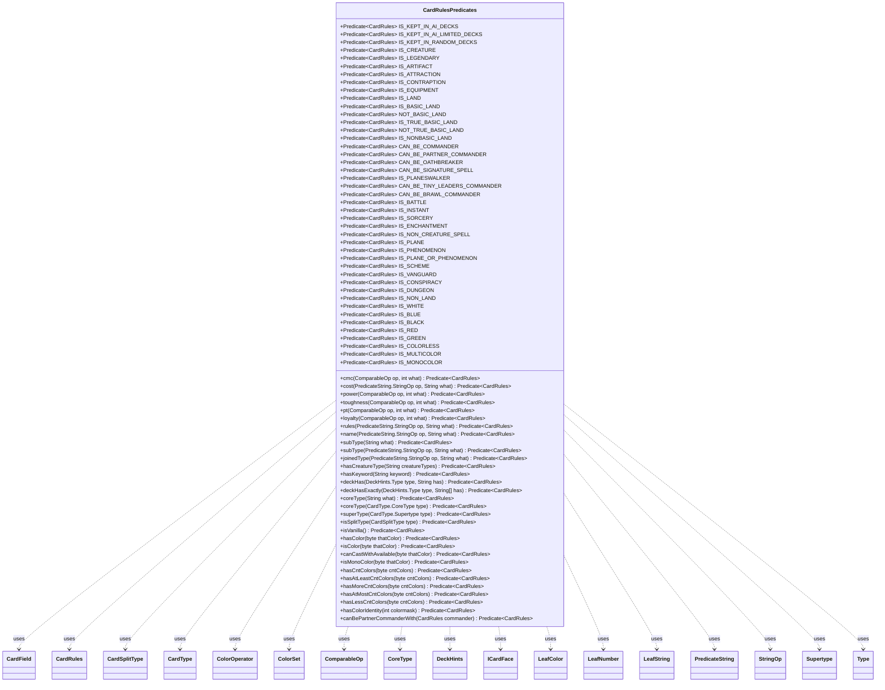

---
aliases:
  - CardRulesPredicates
tags:
  - java/class
  - module/forge-core
  - pkg/forge/card
fqn: forge.card.CardRulesPredicates
package: forge.card
module: forge-core
kind: Class
---

# CardRulesPredicates

**Package:** `forge.card`   **Module:** `forge-core`   **Kind:** Class



## Relationships
**Uses:**
- [[forge.card.CardRules|CardRules]]
- [[forge.card.CardRulesPredicates.LeafColor|LeafColor]]
- [[forge.card.CardRulesPredicates.LeafColor.ColorOperator|ColorOperator]]
- [[forge.card.CardRulesPredicates.LeafNumber|LeafNumber]]
- [[forge.card.CardRulesPredicates.LeafNumber.CardField|CardField]]
- [[forge.card.CardRulesPredicates.LeafString|LeafString]]
- [[forge.card.CardRulesPredicates.LeafString.CardField|CardField]]
- [[forge.card.CardSplitType|CardSplitType]]
- [[forge.card.CardType|CardType]]
- [[forge.card.CardType.CoreType|CoreType]]
- [[forge.card.CardType.Supertype|Supertype]]
- [[forge.card.ColorSet|ColorSet]]
- [[forge.card.DeckHints|DeckHints]]
- [[forge.card.DeckHints.Type|Type]]
- [[forge.card.ICardFace|ICardFace]]
- [[forge.util.ComparableOp|ComparableOp]]
- [[forge.util.PredicateString|PredicateString]]
- [[forge.util.PredicateString.StringOp|StringOp]]

## Design Description

CardRulesPredicates is a final, non-instantiable utility class that centralizes the filtering logic for querying `CardRules` objects. It publishes a broad catalogue of ready-made `Predicate<CardRules>` constants—covering core types, supertypes, colors, color counts, deck-eligibility, and commander/format legality—plus static builder methods that construct predicates over numeric fields, text, types, and colors. It thereby acts as the canonical predicate library backing card search, deck-building filters, and AI deck construction across forge-core.

Its design favors composition and encapsulation: builders return the standard `Predicate` interface while hiding three nested leaf classes—`LeafString`, `LeafColor`, and `LeafNumber`—that each interpret an operator-plus-field enum to evaluate one category of condition. Preset constants are themselves assembled from these primitives via `and`/`or`/`not`. The leaves collaborate with `CardRules`, `CardType`, `ColorSet`, and `CardTranslation`, deliberately matching across all card faces and functional variants for localization-aware queries.

## Source
`forge-core/src/main/java/forge/card/CardRulesPredicates.java`

```java
package forge.card;

import forge.util.CardTranslation;
import forge.util.ComparableOp;
import forge.util.IterableUtil;
import forge.util.PredicateString;
import org.apache.commons.lang3.StringUtils;

import java.util.Arrays;
import java.util.Collections;
import java.util.Map;
import java.util.function.Predicate;

/**
 * Filtering conditions specific for CardRules class, defined here along with
 * some presets.
 */
public final class CardRulesPredicates {

    public static final Predicate<CardRules> IS_KEPT_IN_AI_DECKS = card -> !card.getAiHints().getRemAIDecks();
    public static final Predicate<CardRules> IS_KEPT_IN_AI_LIMITED_DECKS = card -> !card.getAiHints().getRemAIDecks() && !card.getAiHints().getRemNonCommanderDecks();
    public static final Predicate<CardRules> IS_KEPT_IN_RANDOM_DECKS = card -> !card.getAiHints().getRemRandomDecks();

    // Static builder methods - they choose concrete implementation by themselves
    /**
     * Cmc.
     *
     * @param op
     *            the op
     * @param what
     *            the what
     * @return the predicate
     */
    public static Predicate<CardRules> cmc(final ComparableOp op, final int what) {
        return new LeafNumber(LeafNumber.CardField.CMC, op, what);
    }

    public static Predicate<CardRules> cost(final PredicateString.StringOp op, final String what) {
        return new LeafString(LeafString.CardField.COST, op, what);
    }

    /**
     *
     * @param op
     *            the op
     * @param what
     *            the what
     * @return the predicate
     */
    public static Predicate<CardRules> power(final ComparableOp op, final int what) {
        return new LeafNumber(LeafNumber.CardField.POWER, op, what);
    }

    /**
     *
     * @param op
     *            the op
     * @param what
     *            the what
     * @return the predicate
     */
    public static Predicate<CardRules> toughness(final ComparableOp op, final int what) {
        return new LeafNumber(LeafNumber.CardField.TOUGHNESS, op, what);
    }

    public static Predicate<CardRules> pt(final ComparableOp op, final int what) {
        return new LeafNumber(LeafNumber.CardField.PT, op, what);
    }

    public static Predicate<CardRules> loyalty(final ComparableOp op, final int what) {
        return new LeafNumber(LeafNumber.CardField.LOYALTY, op, what);
    }

    /**
     * Rules.
     *
     * @param op
     *            the op
     * @param what
     *            the what
     * @return the predicate
     */
    public static Predicate<CardRules> rules(final PredicateString.StringOp op, final String what) {
        return new LeafString(LeafString.CardField.ORACLE_TEXT, op, what);
    }

    /**
     * Name.
     *
     * @param op
     *            the op
     * @param what
     *            the what
     * @return the predicate
     */
    public static Predicate<CardRules> name(final PredicateString.StringOp op, final String what) {
        return new LeafString(LeafString.CardField.NAME, op, what);
    }


    /**
     * Sub type.
     *
     * @param what
     *            the what
     * @return the predicate
     */
    public static Predicate<CardRules> subType(final String what) {
        return new LeafString(LeafString.CardField.SUBTYPE, PredicateString.StringOp.CONTAINS, what);
    }

    public static Predicate<CardRules> subType(final PredicateString.StringOp op, final String what) {
        return new LeafString(LeafString.CardField.SUBTYPE, op, what);
    }

    /**
     * Joined type.
     *
     * @param op
     *            the op
     * @param what
     *            the what
     * @return the predicate
     */
    public static Predicate<CardRules> joinedType(final PredicateString.StringOp op, final String what) {
        return new LeafString(LeafString.CardField.JOINED_TYPE, op, what);
    }

    public static Predicate<CardRules> hasCreatureType(final String... creatureTypes) {
        return card -> {
            if (!card.getType().isCreature()) { return false; }
            return !Collections.disjoint(card.getType().getCreatureTypes(), Arrays.asList(creatureTypes));
        };
    }

    /**
     * Has Keyword.
     *
     * @param keyword
     *            the keyword
     * @return the predicate
     */
    public static Predicate<CardRules> hasKeyword(final String keyword) {
        return card -> IterableUtil.any(card.getAllFaces(), cf -> card.hasStartOfKeyword(keyword, cf));
    }

    /**
     * Has matching DeckHas hint.
     *
     * @param type
     *            the DeckHints.Type
     * @param has
     *            the hint
     * @return the predicate
     */
    public static Predicate<CardRules> deckHas(final DeckHints.Type type, final String has) {
        return card -> {
            DeckHints deckHas = card.getAiHints().getDeckHas();
            return deckHas != null && deckHas.isValid() && deckHas.contains(type, has);
        };
    }

    public static Predicate<CardRules> deckHasExactly(final DeckHints.Type type, final String has[]) {
        return card -> {
            DeckHints deckHas = card.getAiHints().getDeckHas();
            return deckHas != null && deckHas.isValid() && deckHas.is(type, has);
        };
    }

    public static Predicate<CardRules> coreType(final String what) {
        try {
            return CardRulesPredicates.coreType(Enum.valueOf(CardType.CoreType.class, what));
        } catch (final Exception e) {
            return x -> false;
        }
    }

    /**
     * @return a Predicate that matches cards that have the specified core type.
     */
    public static Predicate<CardRules> coreType(final CardType.CoreType type) {
        return card -> card.getType().hasType(type);
    }

    /**
     * @return a Predicate that matches cards that have the specified supertype.
     */
    public static Predicate<CardRules> superType(final CardType.Supertype type) {
        return card -> card.getType().hasSupertype(type);
    }

    /**
     * @return a Predicate that matches cards that are of the split type.
     */
    public static Predicate<CardRules> isSplitType(final CardSplitType type) {
        return card -> card.getSplitType().equals(type);
    }

    /**
     * @return a Predicate that matches cards that are vanilla.
     */
    public static Predicate<CardRules> isVanilla() {
        return card -> {
            if (!(card.getType().isCreature() || card.getType().isLand()) ||
                card.getSplitType() != CardSplitType.None ||
                card.hasFunctionalVariants()) {
                return false;
            }

            ICardFace mainPart = card.getMainPart();

            boolean hasAny =
                mainPart.getKeywords().iterator().hasNext() ||
                mainPart.getAbilities().iterator().hasNext() ||
                mainPart.getStaticAbilities().iterator().hasNext() ||
                mainPart.getTriggers().iterator().hasNext() ||
                (mainPart.getDraftActions() != null && mainPart.getDraftActions().iterator().hasNext()) ||
                mainPart.getReplacements().iterator().hasNext();

            return !hasAny;
        };
    }

    /**
     * Checks for color.
     *
     * @param thatColor
     *            color to check
     * @return the predicate
     */
    public static Predicate<CardRules> hasColor(final byte thatColor) {
        return new LeafColor(LeafColor.ColorOperator.HasAllOf, thatColor);
    }

    /**
     * Checks if is color.
     *
     * @param thatColor
     *            color to check
     * @return the predicate
     */
    public static Predicate<CardRules> isColor(final byte thatColor) {
        return new LeafColor(LeafColor.ColorOperator.HasAnyOf, thatColor);
    }

    /**
     * Checks if card can be cast with unlimited mana of given color set.
     *
     * @param thatColor
     *            color to check
     * @return the predicate
     */
    public static Predicate<CardRules> canCastWithAvailable(final byte thatColor) {
        return new LeafColor(LeafColor.ColorOperator.CanCast, thatColor);
    }

    /**
     * Checks if is exactly that color.
     *
     * @param thatColor
     *            color to check
     * @return the predicate
     */
    public static Predicate<CardRules> isMonoColor(final byte thatColor) {
        return new LeafColor(LeafColor.ColorOperator.Equals, thatColor);
    }

    /**
     * Checks for cnt colors.
     *
     * @param cntColors
     *            the cnt colors
     * @return the predicate
     */
    public static Predicate<CardRules> hasCntColors(final byte cntColors) {
        return new LeafColor(LeafColor.ColorOperator.CountColors, cntColors);
    }

    /**
     * Checks for at least cnt colors.
     *
     * @param cntColors
     *            the cnt colors
     * @return the predicate
     */
    public static Predicate<CardRules> hasAtLeastCntColors(final byte cntColors) {
        return new LeafColor(LeafColor.ColorOperator.CountColorsGreaterOrEqual, cntColors);
    }

    public static Predicate<CardRules> hasMoreCntColors(final byte cntColors) {
        return new LeafColor(LeafColor.ColorOperator.CountColorsGreater, cntColors);
    }

    public static Predicate<CardRules> hasAtMostCntColors(final byte cntColors) {
        return new LeafColor(LeafColor.ColorOperator.CountColorsSmallerOrEqual, cntColors);
    }

    public static Predicate<CardRules> hasLessCntColors(final byte cntColors) {
        return new LeafColor(LeafColor.ColorOperator.CountColorsSmaller, cntColors);
    }

    public static Predicate<CardRules> hasColorIdentity(final int colormask) {
        return rules -> rules.getColorIdentity().hasNoColorsExcept(colormask);
    }

    public static Predicate<CardRules> canBePartnerCommanderWith(final CardRules commander) {
        return rules -> rules.canBePartnerCommanders(commander);
    }

    private static class LeafString extends PredicateString<CardRules> {
        public enum CardField {
            ORACLE_TEXT, NAME, SUBTYPE, JOINED_TYPE, COST
        }

        private final String operand;
        private final LeafString.CardField field;

        protected boolean checkName(String name) {
            return op(name, this.operand)
            || op(CardTranslation.getTranslatedName(name), this.operand)
            || op(StringUtils.stripAccents(name), this.operand);
        }
        protected boolean checkOracle(ICardFace face) {
            if (face == null) {
                return false;
            }
            if (face.hasFunctionalVariants()) {
                //Couple quirks here - an ICardFace doesn't have a specific variant, so they all need to be checked.
                //This means text matching the rules of one variant will match prints with any variant. In the case of
                //flavor names though, we exclude their oracle modified text from matching, so that searching a flavor
                //name will return only the card matching that name.
                //TODO: Fix all that someday by doing rules searches by the PaperCard rather than the CardRules.
                for (Map.Entry<String, ? extends ICardFace> v : face.getFunctionalVariants().entrySet()) {
                    ICardFace vFace = v.getValue();
                    if(vFace.getFlavorName() != null)
                        continue;
                    String origOracle = vFace.getOracleText();
                    if(op(origOracle, operand))
                        return true;
                    String name = vFace.getFlavorName() != null ? vFace.getFlavorName() : vFace.getName() + " $" + v.getKey();
                    if(op(CardTranslation.getTranslatedOracle(name), operand))
                        return true;
                }
            }
            if (op(face.getOracleText(), operand) || op(CardTranslation.getTranslatedOracle(face.getName()), operand)) {
                return true;
            }
            return false;
        }
        protected boolean checkType(ICardFace face) {
            if (face == null) {
                return false;
            }
            if (face.hasFunctionalVariants()) {
                for (Map.Entry<String, ? extends ICardFace> v : face.getFunctionalVariants().entrySet()) {
                    ICardFace vFace = v.getValue();
                    String origType = vFace.getType().toString();
                    if(op(origType, operand))
                        return true;
                    String name = vFace.getFlavorName() != null ? vFace.getFlavorName() : vFace.getName() + " $" + v.getKey();
                    if(op(CardTranslation.getTranslatedType(name, origType), operand))
                        return true;
                }
            }
            return (op(CardTranslation.getTranslatedType(face.getName(), face.getType().toString()), operand) || op(face.getType().toString(), operand));
        }

        @Override
        public boolean test(final CardRules card) {
            boolean shouldContain;
            switch (this.field) {
            case NAME:
                for (ICardFace face : card.getAllFaces()) {
                    if (checkName(face.getName())) {
                        return true;
                    }
                }
                return false;
            case SUBTYPE:
                shouldContain = (this.getOperator() == StringOp.CONTAINS) || (this.getOperator() == StringOp.EQUALS);
                return shouldContain == card.getType().hasSubtype(this.operand);
            case ORACLE_TEXT:
                for (ICardFace face : card.getAllFaces()) {
                    if (checkOracle(face)) {
                        return true;
                    }
                }
                return false;
            case JOINED_TYPE:
                if ((op(CardTranslation.getTranslatedType(card.getName(), card.getType().toString()), operand) || op(card.getType().toString(), operand))) {
                    return true;
                }
                for (ICardFace face : card.getAllFaces()) {
                    if (checkType(face)) {
                        return true;
                    }
                }

                return false;
            case COST:
                final String cost = card.getManaCost().toString();
                return op(cost, operand);
            default:
                return false;
            }
        }

        public LeafString(final LeafString.CardField field, final StringOp operator, final String operand) {
            super(operator);
            this.field = field;
            this.operand = operand;
        }
    }

    private static class LeafColor implements Predicate<CardRules> {
        public enum ColorOperator {
            CountColors,
            CountColorsGreaterOrEqual,
            CountColorsGreater,
            CountColorsSmallerOrEqual,
            CountColorsSmaller,
            HasAnyOf,
            HasAllOf,
            Equals,
            CanCast
        }

        private final LeafColor.ColorOperator op;
        private final byte color;

        public LeafColor(final LeafColor.ColorOperator operator, final byte thatColor) {
            this.op = operator;
            this.color = thatColor;
        }

        @Override
        public boolean test(final CardRules subject) {
            if (null == subject) {
                return false;
            }
            ColorSet cardColor = subject.getColor();
            switch (this.op) {
            case CountColors:
                return cardColor.countColors() == this.color;
            case CountColorsGreaterOrEqual:
                return cardColor.countColors() >= this.color;
            case CountColorsGreater:
                return cardColor.countColors() > this.color;
            case CountColorsSmallerOrEqual:
                return cardColor.countColors() <= this.color;
            case CountColorsSmaller:
                return cardColor.countColors() < this.color;
            case Equals:
                return cardColor.isEqual(this.color);
            case HasAllOf:
                return cardColor.hasAllColors(this.color);
            case HasAnyOf:
                return cardColor.hasAnyColor(this.color);
            case CanCast:
                return subject.canCastWithAvailable(this.color);
            default:
                return false;
            }
        }
    }

    public static class LeafNumber implements Predicate<CardRules> {
        public enum CardField {
            CMC, GENERIC_COST, POWER, TOUGHNESS, PT, LOYALTY
        }

        private final LeafNumber.CardField field;
        private final ComparableOp operator;
        private final int operand;

        public LeafNumber(final LeafNumber.CardField field, final ComparableOp op, final int what) {
            this.field = field;
            this.operand = what;
            this.operator = op;
        }

        @Override
        public boolean test(final CardRules card) {
            int value;
            switch (this.field) {
            case CMC:
                return this.op(card.getManaCost().getCMC(), this.operand);
            case GENERIC_COST:
                return this.op(card.getManaCost().getGenericCost(), this.operand);
            case LOYALTY:
                String sLoyalty = card.getInitialLoyalty();
                if (StringUtils.isBlank(sLoyalty) || !sLoyalty.matches("\\d+")) {
                    return false;
                }
                try {
                    value = Integer.parseInt(sLoyalty) ;
                }
                catch (NumberFormatException ignored) {
                    return false;
                }
                return this.op(value, this.operand);
            case POWER:
                value = card.getIntPower();
                return value != Integer.MAX_VALUE && this.op(value, this.operand);
            case TOUGHNESS:
                value = card.getIntToughness();
                return value != Integer.MAX_VALUE && this.op(value, this.operand);
            case PT:
                value = card.getIntPower() + card.getIntToughness();
                return value != Integer.MAX_VALUE && this.op(value, this.operand);
            default:
                return false;
            }
        }

        private boolean op(final int op1, final int op2) {
            switch (this.operator) {
            case EQUALS:
                return op1 == op2;
            case GREATER_THAN:
                return op1 > op2;
            case GT_OR_EQUAL:
                return op1 >= op2;
            case LESS_THAN:
                return op1 < op2;
            case LT_OR_EQUAL:
                return op1 <= op2;
            case NOT_EQUALS:
                return op1 != op2;
            default:
                return false;
            }
        }
    }

    public static final Predicate<CardRules> IS_CREATURE = CardRulesPredicates.coreType(CardType.CoreType.Creature);
    public static final Predicate<CardRules> IS_LEGENDARY = CardRulesPredicates.superType(CardType.Supertype.Legendary);
    public static final Predicate<CardRules> IS_ARTIFACT = CardRulesPredicates.coreType(CardType.CoreType.Artifact);
    public static final Predicate<CardRules> IS_ATTRACTION = CardRulesPredicates.IS_ARTIFACT.and(CardRulesPredicates.subType("Attraction"));
    public static final Predicate<CardRules> IS_CONTRAPTION = CardRulesPredicates.IS_ARTIFACT.and(CardRulesPredicates.subType("Contraption"));
    public static final Predicate<CardRules> IS_EQUIPMENT = CardRulesPredicates.subType("Equipment");
    public static final Predicate<CardRules> IS_LAND = CardRulesPredicates.coreType(CardType.CoreType.Land);
    public static final Predicate<CardRules> IS_BASIC_LAND = subject -> subject.getType().isBasicLand();
    public static final Predicate<CardRules> NOT_BASIC_LAND = subject -> !subject.getType().isBasicLand();
    /** Matches only Plains, Island, Swamp, Mountain, or Forest. */
    public static final Predicate<CardRules> IS_TRUE_BASIC_LAND = subject -> !subject.getName().equals("Wastes")&&subject.getType().isBasicLand();
    /** Matches any card except Plains, Island, Swamp, Mountain, or Forest. */
    public static final Predicate<CardRules> NOT_TRUE_BASIC_LAND = subject -> !subject.getType().isBasicLand() || subject.getName().equals("Wastes");
    public static final Predicate<CardRules> IS_NONBASIC_LAND = subject -> subject.getType().isLand() && !subject.getType().isBasicLand();
    public static final Predicate<CardRules> CAN_BE_COMMANDER = CardRules::canBeCommander;
    public static final Predicate<CardRules> CAN_BE_PARTNER_COMMANDER = CardRules::canBePartnerCommander;
    public static final Predicate<CardRules> CAN_BE_OATHBREAKER = CardRules::canBeOathbreaker;
    public static final Predicate<CardRules> CAN_BE_SIGNATURE_SPELL = CardRules::canBeSignatureSpell;
    public static final Predicate<CardRules> IS_PLANESWALKER = CardRulesPredicates.coreType(CardType.CoreType.Planeswalker);
    public static final Predicate<CardRules> CAN_BE_TINY_LEADERS_COMMANDER = CardRulesPredicates.IS_LEGENDARY.and(CardRulesPredicates.IS_CREATURE.or(CardRulesPredicates.IS_PLANESWALKER));
    public static final Predicate<CardRules> CAN_BE_BRAWL_COMMANDER = CardRulesPredicates.IS_LEGENDARY.and(CardRulesPredicates.IS_CREATURE.or(CardRulesPredicates.IS_PLANESWALKER));
    public static final Predicate<CardRules> IS_BATTLE = CardRulesPredicates.coreType(CardType.CoreType.Battle);
    public static final Predicate<CardRules> IS_INSTANT = CardRulesPredicates.coreType(CardType.CoreType.Instant);
    public static final Predicate<CardRules> IS_SORCERY = CardRulesPredicates.coreType(CardType.CoreType.Sorcery);
    public static final Predicate<CardRules> IS_ENCHANTMENT = CardRulesPredicates.coreType(CardType.CoreType.Enchantment);
    public static final Predicate<CardRules> IS_NON_CREATURE_SPELL = Predicate.not(
            CardRulesPredicates.IS_CREATURE.or(CardRulesPredicates.IS_LAND).or(CardRules::isVariant)
    );

    public static final Predicate<CardRules> IS_PLANE = CardRulesPredicates.coreType(CardType.CoreType.Plane);
    public static final Predicate<CardRules> IS_PHENOMENON = CardRulesPredicates.coreType(CardType.CoreType.Phenomenon);
    public static final Predicate<CardRules> IS_PLANE_OR_PHENOMENON = IS_PLANE.or(IS_PHENOMENON);
    public static final Predicate<CardRules> IS_SCHEME = CardRulesPredicates.coreType(CardType.CoreType.Scheme);
    public static final Predicate<CardRules> IS_VANGUARD = CardRulesPredicates.coreType(CardType.CoreType.Vanguard);
    public static final Predicate<CardRules> IS_CONSPIRACY = CardRulesPredicates.coreType(CardType.CoreType.Conspiracy);
    public static final Predicate<CardRules> IS_DUNGEON = CardRulesPredicates.coreType(CardType.CoreType.Dungeon);
    public static final Predicate<CardRules> IS_NON_LAND = CardRulesPredicates.coreType(CardType.CoreType.Land);
    public static final Predicate<CardRules> IS_WHITE = CardRulesPredicates.isColor(MagicColor.WHITE);
    public static final Predicate<CardRules> IS_BLUE = CardRulesPredicates.isColor(MagicColor.BLUE);
    public static final Predicate<CardRules> IS_BLACK = CardRulesPredicates.isColor(MagicColor.BLACK);
    public static final Predicate<CardRules> IS_RED = CardRulesPredicates.isColor(MagicColor.RED);
    public static final Predicate<CardRules> IS_GREEN = CardRulesPredicates.isColor(MagicColor.GREEN);
    public static final Predicate<CardRules> IS_COLORLESS = CardRulesPredicates.hasCntColors((byte) 0);
    public static final Predicate<CardRules> IS_MULTICOLOR = CardRulesPredicates.hasAtLeastCntColors((byte) 2);
    public static final Predicate<CardRules> IS_MONOCOLOR = CardRulesPredicates.hasCntColors((byte) 1);
}
```

## Python
`forge/card/CardRulesPredicates.py`

```python
from __future__ import annotations

import re
import unicodedata
from enum import Enum, auto
from typing import Callable

from forge.card.CardRules import CardRules
from forge.card.CardSplitType import CardSplitType
from forge.card.CardType import CardType
from forge.card.CardType.CoreType import CoreType
from forge.card.CardType.Supertype import Supertype
from forge.card.ColorSet import ColorSet
from forge.card.DeckHints import DeckHints
from forge.card.DeckHints.Type import Type
from forge.card.ICardFace import ICardFace
from forge.card.MagicColor import MagicColor
from forge.util.CardTranslation import CardTranslation
from forge.util.ComparableOp import ComparableOp
from forge.util.IterableUtil import IterableUtil
from forge.util.PredicateString import PredicateString
from forge.util.PredicateString.StringOp import StringOp

# java.util.function.Predicate<CardRules> mapped idiomatically to a callable.
Predicate = Callable[[CardRules], bool]

_INTEGER_MAX_VALUE = 2147483647


def _strip_accents(s: str) -> str:
    if s is None:
        return s
    return ''.join(c for c in unicodedata.normalize('NFD', s) if unicodedata.category(c) != 'Mn')


def _is_blank(s: str) -> bool:
    return s is None or len(s.strip()) == 0


def _and(*predicates: Predicate) -> Predicate:
    return lambda card: all(p(card) for p in predicates)


def _or(*predicates: Predicate) -> Predicate:
    return lambda card: any(p(card) for p in predicates)


def _not(predicate: Predicate) -> Predicate:
    return lambda card: not predicate(card)


class CardRulesPredicates:
    """Filtering conditions specific for CardRules class, defined here along with
    some presets."""

    IS_KEPT_IN_AI_DECKS: Predicate = lambda card: not card.getAiHints().getRemAIDecks()
    IS_KEPT_IN_AI_LIMITED_DECKS: Predicate = lambda card: not card.getAiHints().getRemAIDecks() and not card.getAiHints().getRemNonCommanderDecks()
    IS_KEPT_IN_RANDOM_DECKS: Predicate = lambda card: not card.getAiHints().getRemRandomDecks()

    # Static builder methods - they choose concrete implementation by themselves
    @staticmethod
    def cmc(op: ComparableOp, what: int) -> Predicate:
        return CardRulesPredicates.LeafNumber(CardRulesPredicates.LeafNumber.CardField.CMC, op, what)

    @staticmethod
    def cost(op: StringOp, what: str) -> Predicate:
        return CardRulesPredicates.LeafString(CardRulesPredicates.LeafString.CardField.COST, op, what)

    @staticmethod
    def power(op: ComparableOp, what: int) -> Predicate:
        return CardRulesPredicates.LeafNumber(CardRulesPredicates.LeafNumber.CardField.POWER, op, what)

    @staticmethod
    def toughness(op: ComparableOp, what: int) -> Predicate:
        return CardRulesPredicates.LeafNumber(CardRulesPredicates.LeafNumber.CardField.TOUGHNESS, op, what)

    @staticmethod
    def pt(op: ComparableOp, what: int) -> Predicate:
        return CardRulesPredicates.LeafNumber(CardRulesPredicates.LeafNumber.CardField.PT, op, what)

    @staticmethod
    def loyalty(op: ComparableOp, what: int) -> Predicate:
        return CardRulesPredicates.LeafNumber(CardRulesPredicates.LeafNumber.CardField.LOYALTY, op, what)

    @staticmethod
    def rules(op: StringOp, what: str) -> Predicate:
        return CardRulesPredicates.LeafString(CardRulesPredicates.LeafString.CardField.ORACLE_TEXT, op, what)

    @staticmethod
    def name(op: StringOp, what: str) -> Predicate:
        return CardRulesPredicates.LeafString(CardRulesPredicates.LeafString.CardField.NAME, op, what)

    @staticmethod
    def subType(op, what=None) -> Predicate:
        if what is None:
            return CardRulesPredicates.LeafString(
                CardRulesPredicates.LeafString.CardField.SUBTYPE, StringOp.CONTAINS, op)
        return CardRulesPredicates.LeafString(CardRulesPredicates.LeafString.CardField.SUBTYPE, op, what)

    @staticmethod
    def joinedType(op: StringOp, what: str) -> Predicate:
        return CardRulesPredicates.LeafString(CardRulesPredicates.LeafString.CardField.JOINED_TYPE, op, what)

    @staticmethod
    def hasCreatureType(*creatureTypes: str) -> Predicate:
        def pred(card):
            if not card.getType().isCreature():
                return False
            return not set(card.getType().getCreatureTypes()).isdisjoint(creatureTypes)
        return pred

    @staticmethod
    def hasKeyword(keyword: str) -> Predicate:
        return lambda card: IterableUtil.any(card.getAllFaces(), lambda cf: card.hasStartOfKeyword(keyword, cf))

    @staticmethod
    def deckHas(type: Type, has: str) -> Predicate:
        def pred(card):
            deckHas = card.getAiHints().getDeckHas()
            return deckHas is not None and deckHas.isValid() and deckHas.contains(type, has)
        return pred

    @staticmethod
    def deckHasExactly(type: Type, has: list[str]) -> Predicate:
        def pred(card):
            deckHas = card.getAiHints().getDeckHas()
            return deckHas is not None and deckHas.isValid() and getattr(deckHas, "is")(type, has)
        return pred

    @staticmethod
    def coreType(what) -> Predicate:
        if isinstance(what, str):
            try:
                return CardRulesPredicates.coreType(CoreType[what])
            except Exception:
                return lambda x: False
        type = what
        return lambda card: card.getType().hasType(type)

    @staticmethod
    def superType(type: Supertype) -> Predicate:
        return lambda card: card.getType().hasSupertype(type)

    @staticmethod
    def isSplitType(type: CardSplitType) -> Predicate:
        return lambda card: card.getSplitType().equals(type)

    @staticmethod
    def isVanilla() -> Predicate:
        def pred(card):
            if (not (card.getType().isCreature() or card.getType().isLand()) or
                    card.getSplitType() != getattr(CardSplitType, "None") or
                    card.hasFunctionalVariants()):
                return False

            mainPart = card.getMainPart()

            hasAny = (
                mainPart.getKeywords().iterator().hasNext() or
                mainPart.getAbilities().iterator().hasNext() or
                mainPart.getStaticAbilities().iterator().hasNext() or
                mainPart.getTriggers().iterator().hasNext() or
                (mainPart.getDraftActions() is not None and mainPart.getDraftActions().iterator().hasNext()) or
                mainPart.getReplacements().iterator().hasNext()
            )

            return not hasAny
        return pred

    @staticmethod
    def hasColor(thatColor: int) -> Predicate:
        return CardRulesPredicates.LeafColor(CardRulesPredicates.LeafColor.ColorOperator.HasAllOf, thatColor)

    @staticmethod
    def isColor(thatColor: int) -> Predicate:
        return CardRulesPredicates.LeafColor(CardRulesPredicates.LeafColor.ColorOperator.HasAnyOf, thatColor)

    @staticmethod
    def canCastWithAvailable(thatColor: int) -> Predicate:
        return CardRulesPredicates.LeafColor(CardRulesPredicates.LeafColor.ColorOperator.CanCast, thatColor)

    @staticmethod
    def isMonoColor(thatColor: int) -> Predicate:
        return CardRulesPredicates.LeafColor(CardRulesPredicates.LeafColor.ColorOperator.Equals, thatColor)

    @staticmethod
    def hasCntColors(cntColors: int) -> Predicate:
        return CardRulesPredicates.LeafColor(CardRulesPredicates.LeafColor.ColorOperator.CountColors, cntColors)

    @staticmethod
    def hasAtLeastCntColors(cntColors: int) -> Predicate:
        return CardRulesPredicates.LeafColor(CardRulesPredicates.LeafColor.ColorOperator.CountColorsGreaterOrEqual, cntColors)

    @staticmethod
    def hasMoreCntColors(cntColors: int) -> Predicate:
        return CardRulesPredicates.LeafColor(CardRulesPredicates.LeafColor.ColorOperator.CountColorsGreater, cntColors)

    @staticmethod
    def hasAtMostCntColors(cntColors: int) -> Predicate:
        return CardRulesPredicates.LeafColor(CardRulesPredicates.LeafColor.ColorOperator.CountColorsSmallerOrEqual, cntColors)

    @staticmethod
    def hasLessCntColors(cntColors: int) -> Predicate:
        return CardRulesPredicates.LeafColor(CardRulesPredicates.LeafColor.ColorOperator.CountColorsSmaller, cntColors)

    @staticmethod
    def hasColorIdentity(colormask: int) -> Predicate:
        return lambda rules: rules.getColorIdentity().hasNoColorsExcept(colormask)

    @staticmethod
    def canBePartnerCommanderWith(commander: CardRules) -> Predicate:
        return lambda rules: rules.canBePartnerCommanders(commander)

    class LeafString(PredicateString):
        class CardField(Enum):
            ORACLE_TEXT = auto()
            NAME = auto()
            SUBTYPE = auto()
            JOINED_TYPE = auto()
            COST = auto()

        def __init__(self, field, operator: StringOp, operand: str):
            super().__init__(operator)
            self.field = field
            self.operand = operand

        def checkName(self, name: str) -> bool:
            return (self.op(name, self.operand)
                    or self.op(CardTranslation.getTranslatedName(name), self.operand)
                    or self.op(_strip_accents(name), self.operand))

        def checkOracle(self, face: ICardFace) -> bool:
            if face is None:
                return False
            if face.hasFunctionalVariants():
                # Couple quirks here - an ICardFace doesn't have a specific variant, so they all need to be checked.
                # This means text matching the rules of one variant will match prints with any variant. In the case of
                # flavor names though, we exclude their oracle modified text from matching, so that searching a flavor
                # name will return only the card matching that name.
                # TODO: Fix all that someday by doing rules searches by the PaperCard rather than the CardRules.
                for vKey, vFace in face.getFunctionalVariants().items():
                    if vFace.getFlavorName() is not None:
                        continue
                    origOracle = vFace.getOracleText()
                    if self.op(origOracle, self.operand):
                        return True
                    name = vFace.getFlavorName() if vFace.getFlavorName() is not None else vFace.getName() + " $" + vKey
                    if self.op(CardTranslation.getTranslatedOracle(name), self.operand):
                        return True
            if self.op(face.getOracleText(), self.operand) or self.op(CardTranslation.getTranslatedOracle(face.getName()), self.operand):
                return True
            return False

        def checkType(self, face: ICardFace) -> bool:
            if face is None:
                return False
            if face.hasFunctionalVariants():
                for vKey, vFace in face.getFunctionalVariants().items():
                    origType = vFace.getType().toString()
                    if self.op(origType, self.operand):
                        return True
                    name = vFace.getFlavorName() if vFace.getFlavorName() is not None else vFace.getName() + " $" + vKey
                    if self.op(CardTranslation.getTranslatedType(name, origType), self.operand):
                        return True
            return (self.op(CardTranslation.getTranslatedType(face.getName(), face.getType().toString()), self.operand)
                    or self.op(face.getType().toString(), self.operand))

        def test(self, card: CardRules) -> bool:
            if self.field == self.CardField.NAME:
                for face in card.getAllFaces():
                    if self.checkName(face.getName()):
                        return True
                return False
            elif self.field == self.CardField.SUBTYPE:
                shouldContain = (self.getOperator() == StringOp.CONTAINS) or (self.getOperator() == StringOp.EQUALS)
                return shouldContain == card.getType().hasSubtype(self.operand)
            elif self.field == self.CardField.ORACLE_TEXT:
                for face in card.getAllFaces():
                    if self.checkOracle(face):
                        return True
                return False
            elif self.field == self.CardField.JOINED_TYPE:
                if (self.op(CardTranslation.getTranslatedType(card.getName(), card.getType().toString()), self.operand)
                        or self.op(card.getType().toString(), self.operand)):
                    return True
                for face in card.getAllFaces():
                    if self.checkType(face):
                        return True
                return False
            elif self.field == self.CardField.COST:
                cost = card.getManaCost().toString()
                return self.op(cost, self.operand)
            else:
                return False

        def __call__(self, card: CardRules) -> bool:
            return self.test(card)

    class LeafColor:
        class ColorOperator(Enum):
            CountColors = auto()
            CountColorsGreaterOrEqual = auto()
            CountColorsGreater = auto()
            CountColorsSmallerOrEqual = auto()
            CountColorsSmaller = auto()
            HasAnyOf = auto()
            HasAllOf = auto()
            Equals = auto()
            CanCast = auto()

        def __init__(self, operator, thatColor: int):
            self.op = operator
            self.color = thatColor

        def test(self, subject: CardRules) -> bool:
            if subject is None:
                return False
            cardColor = subject.getColor()
            if self.op == CardRulesPredicates.LeafColor.ColorOperator.CountColors:
                return cardColor.countColors() == self.color
            elif self.op == CardRulesPredicates.LeafColor.ColorOperator.CountColorsGreaterOrEqual:
                return cardColor.countColors() >= self.color
            elif self.op == CardRulesPredicates.LeafColor.ColorOperator.CountColorsGreater:
                return cardColor.countColors() > self.color
            elif self.op == CardRulesPredicates.LeafColor.ColorOperator.CountColorsSmallerOrEqual:
                return cardColor.countColors() <= self.color
            elif self.op == CardRulesPredicates.LeafColor.ColorOperator.CountColorsSmaller:
                return cardColor.countColors() < self.color
            elif self.op == CardRulesPredicates.LeafColor.ColorOperator.Equals:
                return cardColor.isEqual(self.color)
            elif self.op == CardRulesPredicates.LeafColor.ColorOperator.HasAllOf:
                return cardColor.hasAllColors(self.color)
            elif self.op == CardRulesPredicates.LeafColor.ColorOperator.HasAnyOf:
                return cardColor.hasAnyColor(self.color)
            elif self.op == CardRulesPredicates.LeafColor.ColorOperator.CanCast:
                return subject.canCastWithAvailable(self.color)
            else:
                return False

        def __call__(self, subject: CardRules) -> bool:
            return self.test(subject)

    class LeafNumber:
        class CardField(Enum):
            CMC = auto()
            GENERIC_COST = auto()
            POWER = auto()
            TOUGHNESS = auto()
            PT = auto()
            LOYALTY = auto()

        def __init__(self, field, op: ComparableOp, what: int):
            self.field = field
            self.operand = what
            self.operator = op

        def test(self, card: CardRules) -> bool:
            if self.field == CardRulesPredicates.LeafNumber.CardField.CMC:
                return self.op(card.getManaCost().getCMC(), self.operand)
            elif self.field == CardRulesPredicates.LeafNumber.CardField.GENERIC_COST:
                return self.op(card.getManaCost().getGenericCost(), self.operand)
            elif self.field == CardRulesPredicates.LeafNumber.CardField.LOYALTY:
                sLoyalty = card.getInitialLoyalty()
                if _is_blank(sLoyalty) or not re.fullmatch(r"\d+", sLoyalty):
                    return False
                try:
                    value = int(sLoyalty)
                except ValueError:
                    return False
                return self.op(value, self.operand)
            elif self.field == CardRulesPredicates.LeafNumber.CardField.POWER:
                value = card.getIntPower()
                return value != _INTEGER_MAX_VALUE and self.op(value, self.operand)
            elif self.field == CardRulesPredicates.LeafNumber.CardField.TOUGHNESS:
                value = card.getIntToughness()
                return value != _INTEGER_MAX_VALUE and self.op(value, self.operand)
            elif self.field == CardRulesPredicates.LeafNumber.CardField.PT:
                value = card.getIntPower() + card.getIntToughness()
                return value != _INTEGER_MAX_VALUE and self.op(value, self.operand)
            else:
                return False

        def op(self, op1: int, op2: int) -> bool:
            if self.operator == ComparableOp.EQUALS:
                return op1 == op2
            elif self.operator == ComparableOp.GREATER_THAN:
                return op1 > op2
            elif self.operator == ComparableOp.GT_OR_EQUAL:
                return op1 >= op2
            elif self.operator == ComparableOp.LESS_THAN:
                return op1 < op2
            elif self.operator == ComparableOp.LT_OR_EQUAL:
                return op1 <= op2
            elif self.operator == ComparableOp.NOT_EQUALS:
                return op1 != op2
            else:
                return False

        def __call__(self, card: CardRules) -> bool:
            return self.test(card)


CardRulesPredicates.IS_CREATURE = CardRulesPredicates.coreType(CardType.CoreType.Creature)
CardRulesPredicates.IS_LEGENDARY = CardRulesPredicates.superType(CardType.Supertype.Legendary)
CardRulesPredicates.IS_ARTIFACT = CardRulesPredicates.coreType(CardType.CoreType.Artifact)
CardRulesPredicates.IS_ATTRACTION = _and(CardRulesPredicates.IS_ARTIFACT, CardRulesPredicates.subType("Attraction"))
CardRulesPredicates.IS_CONTRAPTION = _and(CardRulesPredicates.IS_ARTIFACT, CardRulesPredicates.subType("Contraption"))
CardRulesPredicates.IS_EQUIPMENT = CardRulesPredicates.subType("Equipment")
CardRulesPredicates.IS_LAND = CardRulesPredicates.coreType(CardType.CoreType.Land)
CardRulesPredicates.IS_BASIC_LAND = lambda subject: subject.getType().isBasicLand()
CardRulesPredicates.NOT_BASIC_LAND = lambda subject: not subject.getType().isBasicLand()
# Matches only Plains, Island, Swamp, Mountain, or Forest.
CardRulesPredicates.IS_TRUE_BASIC_LAND = lambda subject: subject.getName() != "Wastes" and subject.getType().isBasicLand()
# Matches any card except Plains, Island, Swamp, Mountain, or Forest.
CardRulesPredicates.NOT_TRUE_BASIC_LAND = lambda subject: (not subject.getType().isBasicLand()) or subject.getName() == "Wastes"
CardRulesPredicates.IS_NONBASIC_LAND = lambda subject: subject.getType().isLand() and not subject.getType().isBasicLand()
CardRulesPredicates.CAN_BE_COMMANDER = lambda card: card.canBeCommander()
CardRulesPredicates.CAN_BE_PARTNER_COMMANDER = lambda card: card.canBePartnerCommander()
CardRulesPredicates.CAN_BE_OATHBREAKER = lambda card: card.canBeOathbreaker()
CardRulesPredicates.CAN_BE_SIGNATURE_SPELL = lambda card: card.canBeSignatureSpell()
CardRulesPredicates.IS_PLANESWALKER = CardRulesPredicates.coreType(CardType.CoreType.Planeswalker)
CardRulesPredicates.CAN_BE_TINY_LEADERS_COMMANDER = _and(CardRulesPredicates.IS_LEGENDARY, _or(CardRulesPredicates.IS_CREATURE, CardRulesPredicates.IS_PLANESWALKER))
CardRulesPredicates.CAN_BE_BRAWL_COMMANDER = _and(CardRulesPredicates.IS_LEGENDARY, _or(CardRulesPredicates.IS_CREATURE, CardRulesPredicates.IS_PLANESWALKER))
CardRulesPredicates.IS_BATTLE = CardRulesPredicates.coreType(CardType.CoreType.Battle)
CardRulesPredicates.IS_INSTANT = CardRulesPredicates.coreType(CardType.CoreType.Instant)
CardRulesPredicates.IS_SORCERY = CardRulesPredicates.coreType(CardType.CoreType.Sorcery)
CardRulesPredicates.IS_ENCHANTMENT = CardRulesPredicates.coreType(CardType.CoreType.Enchantment)
CardRulesPredicates.IS_NON_CREATURE_SPELL = _not(
    _or(CardRulesPredicates.IS_CREATURE, CardRulesPredicates.IS_LAND, lambda card: card.isVariant())
)

CardRulesPredicates.IS_PLANE = CardRulesPredicates.coreType(CardType.CoreType.Plane)
CardRulesPredicates.IS_PHENOMENON = CardRulesPredicates.coreType(CardType.CoreType.Phenomenon)
CardRulesPredicates.IS_PLANE_OR_PHENOMENON = _or(CardRulesPredicates.IS_PLANE, CardRulesPredicates.IS_PHENOMENON)
CardRulesPredicates.IS_SCHEME = CardRulesPredicates.coreType(CardType.CoreType.Scheme)
CardRulesPredicates.IS_VANGUARD = CardRulesPredicates.coreType(CardType.CoreType.Vanguard)
CardRulesPredicates.IS_CONSPIRACY = CardRulesPredicates.coreType(CardType.CoreType.Conspiracy)
CardRulesPredicates.IS_DUNGEON = CardRulesPredicates.coreType(CardType.CoreType.Dungeon)
CardRulesPredicates.IS_NON_LAND = CardRulesPredicates.coreType(CardType.CoreType.Land)
CardRulesPredicates.IS_WHITE = CardRulesPredicates.isColor(MagicColor.WHITE)
CardRulesPredicates.IS_BLUE = CardRulesPredicates.isColor(MagicColor.BLUE)
CardRulesPredicates.IS_BLACK = CardRulesPredicates.isColor(MagicColor.BLACK)
CardRulesPredicates.IS_RED = CardRulesPredicates.isColor(MagicColor.RED)
CardRulesPredicates.IS_GREEN = CardRulesPredicates.isColor(MagicColor.GREEN)
CardRulesPredicates.IS_COLORLESS = CardRulesPredicates.hasCntColors(0)
CardRulesPredicates.IS_MULTICOLOR = CardRulesPredicates.hasAtLeastCntColors(2)
CardRulesPredicates.IS_MONOCOLOR = CardRulesPredicates.hasCntColors(1)
```
