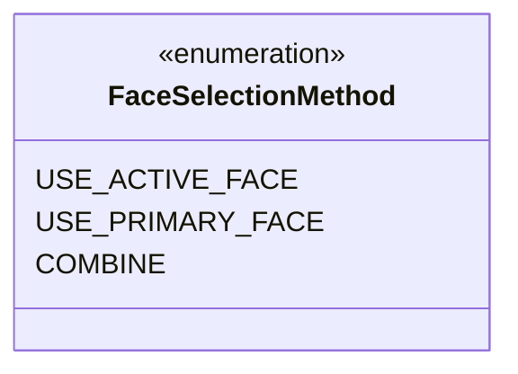

---
aliases:
  - FaceSelectionMethod
tags:
  - java/enum
  - module/forge-core
  - pkg/forge/card
fqn: forge.card.CardSplitType.FaceSelectionMethod
package: forge.card
module: forge-core
kind: Enum
---

# FaceSelectionMethod

**Package:** `forge.card`   **Module:** `forge-core`   **Kind:** Enum



## Design Description

`FaceSelectionMethod` is a small nested enumeration within `CardSplitType` that names the strategies for resolving which face of a multi-faced card (split, transforming, modal, or adventure cards) should supply a given property when the card is queried. Its three constants encode distinct policies: `USE_ACTIVE_FACE` defers to whichever face is currently presented, `USE_PRIMARY_FACE` always reads the canonical front face, and `COMBINE` merges data from both faces. As an enum it serves as a type-safe selector consumed by `CardSplitType` and card-view logic, replacing ad hoc flags or booleans with a closed, self-documenting set of options. Nesting it inside `CardSplitType` signals that face-selection behavior is conceptually bound to a card's layout/split classification, keeping the policy choice colocated with the type that determines how many faces exist.

## Source
`forge-core/src/main/java/forge/card/CardSplitType.java` — declaration excerpt

```java
    public enum FaceSelectionMethod {
        USE_ACTIVE_FACE,
        USE_PRIMARY_FACE,
        COMBINE
    }
```
