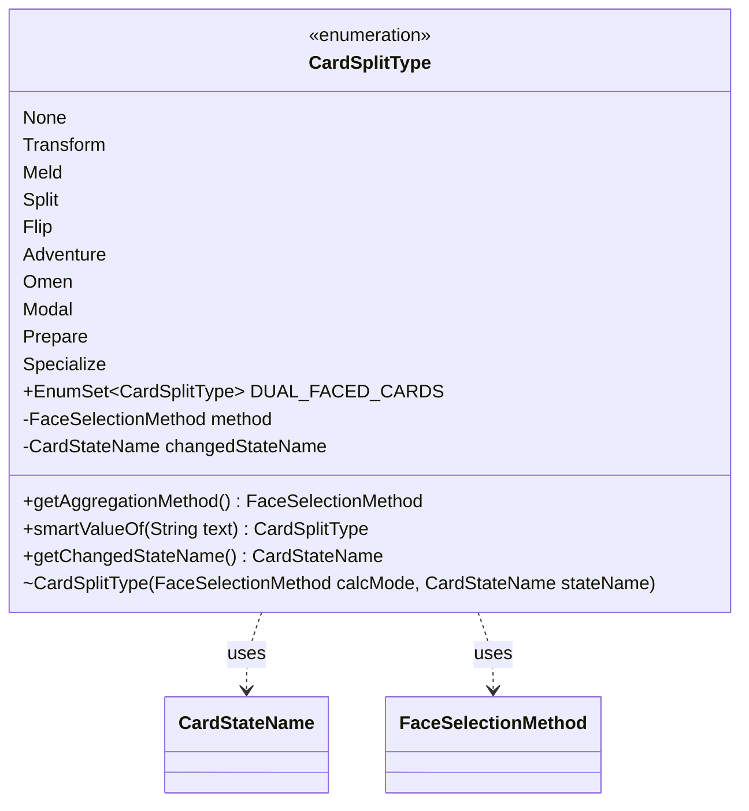

---
aliases:
  - CardSplitType
tags:
  - java/enum
  - module/forge-core
  - pkg/forge/card
fqn: forge.card.CardSplitType
package: forge.card
module: forge-core
kind: Enum
---

# CardSplitType

**Package:** `forge.card` &nbsp; **Module:** `forge-core` &nbsp; **Kind:** Enum



## Relationships
**Uses:**
- [[forge.card.CardSplitType.FaceSelectionMethod|FaceSelectionMethod]]
- [[forge.card.CardStateName|CardStateName]]

## Design Description

CardSplitType enumerates the multi-face card layouts the engine supports — single-faced (`None`), transforming, melding, split, flip, adventure, omen, modal, prepare, and specialize. Each constant pairs a `FaceSelectionMethod` (how a card's faces aggregate into its effective characteristics — active face, primary face, or combined) with the `CardStateName` the card changes into, encoding per-layout behavior in the enum definition itself rather than scattering it across conditional logic elsewhere.

As a plain, immutable `forge-core` enum, it acts as a lightweight classification consumed throughout card construction and state handling. The `DUAL_FACED_CARDS` set flags layouts with two physical faces; the accessors expose the configured aggregation method and changed state; and `smartValueOf` adds tolerant parsing by mapping the legacy `"DoubleFaced"` label onto `Transform` before delegating to the standard `valueOf`, easing backward-compatible loading of card data.

## Source
`forge-core/src/main/java/forge/card/CardSplitType.java`

```java
package forge.card;

import java.util.EnumSet;

public enum CardSplitType
{
    None(FaceSelectionMethod.USE_PRIMARY_FACE, null),
    Transform(FaceSelectionMethod.USE_ACTIVE_FACE, CardStateName.Backside),
    Meld(FaceSelectionMethod.USE_ACTIVE_FACE, CardStateName.Meld),
    Split(FaceSelectionMethod.COMBINE, CardStateName.RightSplit),
    Flip(FaceSelectionMethod.USE_PRIMARY_FACE, CardStateName.Flipped),
    Adventure(FaceSelectionMethod.USE_PRIMARY_FACE, CardStateName.Secondary),
    Omen(FaceSelectionMethod.USE_PRIMARY_FACE, CardStateName.Secondary),
    Modal(FaceSelectionMethod.USE_ACTIVE_FACE, CardStateName.Backside),
    Prepare(FaceSelectionMethod.USE_ACTIVE_FACE, CardStateName.PreparedSpell),
    Specialize(FaceSelectionMethod.USE_ACTIVE_FACE, null);

    public static final EnumSet<CardSplitType> DUAL_FACED_CARDS = EnumSet.of(
            CardSplitType.Transform, CardSplitType.Meld, CardSplitType.Modal);

    CardSplitType(FaceSelectionMethod calcMode, CardStateName stateName) {
        method = calcMode;
        this.changedStateName = stateName;
    }

    public FaceSelectionMethod getAggregationMethod() {
        return method;
    }

    private final FaceSelectionMethod method;
    private final CardStateName changedStateName;
    
    public static CardSplitType smartValueOf(String text) {
        if ("DoubleFaced".equals(text)) return Transform;
        // Will throw exceptions here if bad text passed
        CardSplitType res = CardSplitType.valueOf(text);
        return res;
    }

    public CardStateName getChangedStateName() {
        return changedStateName;
    }

    public enum FaceSelectionMethod {
        USE_ACTIVE_FACE,
        USE_PRIMARY_FACE,
        COMBINE
    }
}
```
