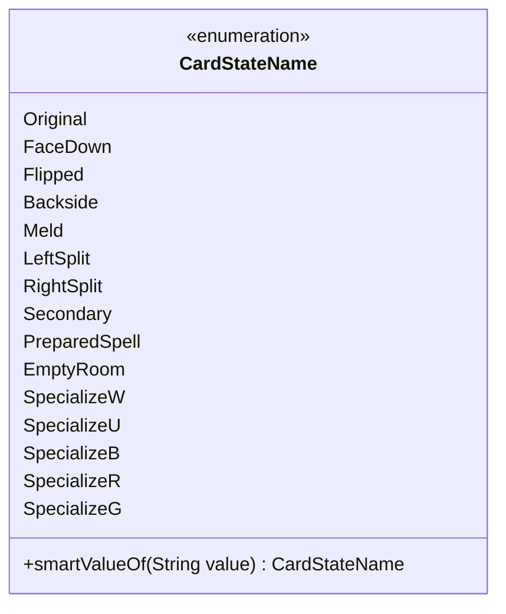

---
aliases:
  - CardStateName
tags:
  - java/enum
  - module/forge-core
  - pkg/forge/card
fqn: forge.card.CardStateName
package: forge.card
module: forge-core
kind: Enum
---

# CardStateName

**Package:** `forge.card`   **Module:** `forge-core`   **Kind:** Enum



## Design Description

CardStateName is an enumeration in the `forge.card` package (forge-core module) that enumerates the distinct visual and functional states a Magic card can occupy—`Original`, `FaceDown`, `Flipped`, `Backside`, `Meld`, the split-card halves (`LeftSplit`/`RightSplit`), and the five color-keyed specialization states (`SpecializeW` through `SpecializeG`). It supplies a stable, type-safe vocabulary so collaborating card and game-state code can identify which face or aspect of a multi-state card is in play.

Its only behavior is the static `smartValueOf` factory, which leniently resolves a string to a constant: it null-guards, treats `"All"` as null, trims whitespace, matches case-insensitively, and maps legacy aliases (`"Flip"`→`Flipped`, `"DoubleFaced"`→`Backside`), throwing `IllegalArgumentException` for anything unrecognized. This design tolerates loose, human-authored card-script text while preserving enum safety for downstream consumers.

## Source
`forge-core/src/main/java/forge/card/CardStateName.java`

```java
package forge.card;


public enum CardStateName {
    Original,
    FaceDown,
    Flipped,
    Backside,
    Meld,
    LeftSplit,
    RightSplit,
    Secondary,
    PreparedSpell,
    EmptyRoom,
    SpecializeW,
    SpecializeU,
    SpecializeB,
    SpecializeR,
    SpecializeG

    ;

    /**
     * TODO: Write javadoc for this method.
     * @param value
     * @return
     */
    public static CardStateName smartValueOf(String value) {
        if (value == null) {
            return null;
        }
        if ("All".equals(value)) {
            return null;
        }
        final String valToCompate = value.trim();
        for (final CardStateName v : CardStateName.values()) {
            if (v.name().compareToIgnoreCase(valToCompate) == 0) {
                return v;
            }
        }
        if ("Flip".equalsIgnoreCase(value)) {
            return CardStateName.Flipped;
        }
        if ("DoubleFaced".equalsIgnoreCase(value)) {
            return CardStateName.Backside;
        }

        throw new IllegalArgumentException("No element named " + value + " in enum CardCharactersticName");
    }
}
```

## Python
`forge/card/CardStateName.py`

```python
from enum import Enum


class CardStateName(Enum):
    Original = "Original"
    FaceDown = "FaceDown"
    Flipped = "Flipped"
    Backside = "Backside"
    Meld = "Meld"
    LeftSplit = "LeftSplit"
    RightSplit = "RightSplit"
    Secondary = "Secondary"
    PreparedSpell = "PreparedSpell"
    EmptyRoom = "EmptyRoom"
    SpecializeW = "SpecializeW"
    SpecializeU = "SpecializeU"
    SpecializeB = "SpecializeB"
    SpecializeR = "SpecializeR"
    SpecializeG = "SpecializeG"

    # TODO: Write javadoc for this method.
    # @param value
    # @return
    @staticmethod
    def smartValueOf(value: str) -> "CardStateName":
        if value is None:
            return None
        if value == "All":
            return None
        valToCompate = value.strip()
        for v in CardStateName:
            if v.name.lower() == valToCompate.lower():
                return v
        if value.lower() == "Flip".lower():
            return CardStateName.Flipped
        if value.lower() == "DoubleFaced".lower():
            return CardStateName.Backside

        raise ValueError("No element named " + value + " in enum CardCharactersticName")
```
