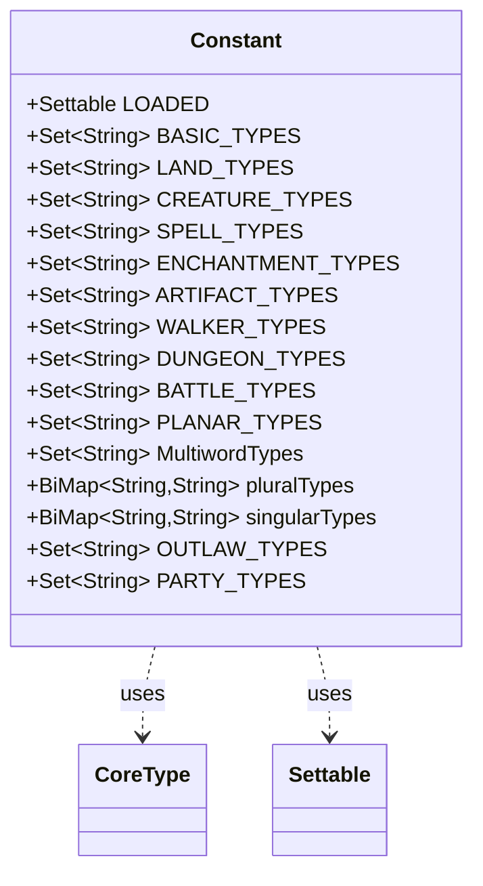

---
aliases:
  - Constant
tags:
  - java/class
  - module/forge-core
  - pkg/forge/card
fqn: forge.card.CardType.Constant
package: forge.card
module: forge-core
kind: Class
---

# Constant

**Package:** `forge.card`   **Module:** `forge-core`   **Kind:** Class



## Relationships
**Uses:**
- [[forge.card.CardType.CoreType|CoreType]]
- [[forge.util.Settable|Settable]]

## Design Description

A nested static holder class within `CardType` that centralizes the canonical vocabulary of Magic card types as a set of shared, immutable-reference constants. It exposes categorized `Set<String>` collections (basic, land, creature, spell, enchantment, artifact, planeswalker, dungeon, battle, planar types) plus thematic groupings such as `OUTLAW_TYPES` and `PARTY_TYPES`, and a `LOADED` `Settable` flag signaling when the type tables have been populated from card data.

As a pure constants container, it has no supertype and is never instantiated; collaborators read its static fields directly. It maintains bidirectional `BiMap` mappings between singular and plural type names, seeded in a static initializer from `CoreType.values()`, so callers can translate either direction from a single source of truth. The design intent is to provide one globally shared, lazily-loaded registry of type metadata that the rest of the card subtype system queries rather than duplicating.

## Source
`forge-core/src/main/java/forge/card/CardType.java` — declaration excerpt

```java
    public static class Constant {
        public static final Settable LOADED = new Settable();
        public static final Set<String> BASIC_TYPES = Sets.newHashSet();
        public static final Set<String> LAND_TYPES = Sets.newHashSet();
        public static final Set<String> CREATURE_TYPES = Sets.newHashSet();
        public static final Set<String> SPELL_TYPES = Sets.newHashSet();
        public static final Set<String> ENCHANTMENT_TYPES = Sets.newHashSet();
        public static final Set<String> ARTIFACT_TYPES = Sets.newHashSet();
        public static final Set<String> WALKER_TYPES = Sets.newHashSet();
        public static final Set<String> DUNGEON_TYPES = Sets.newHashSet();
        public static final Set<String> BATTLE_TYPES = Sets.newHashSet();
        public static final Set<String> PLANAR_TYPES = Sets.newHashSet();

        public static final Set<String> MultiwordTypes = Sets.newHashSet();

        // singular -> plural
        public static final BiMap<String,String> pluralTypes = HashBiMap.create();
        // plural -> singular
        public static final BiMap<String,String> singularTypes = pluralTypes.inverse();

        static {
            for (CoreType c : CoreType.values()) {
                pluralTypes.put(c.name(), c.pluralName);
            }
        }


        public static final Set<String> OUTLAW_TYPES = Sets.newHashSet(
                "Assassin",
                "Mercenary",
                "Pirate",
                "Rogue",
                "Warlock");

        public static final Set<String> PARTY_TYPES = Sets.newHashSet(
                "Cleric",
                "Rogue",
                "Warrior",
                "Wizard");
    }
```
