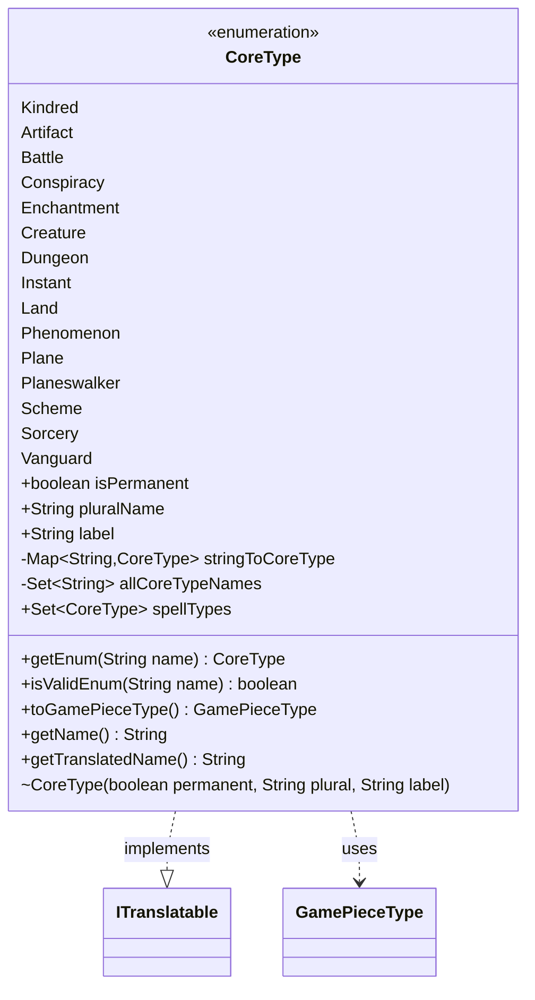

---
aliases:
  - CoreType
tags:
  - java/enum
  - module/forge-core
  - pkg/forge/card
fqn: forge.card.CardType.CoreType
package: forge.card
module: forge-core
kind: Enum
---

# CoreType

**Package:** `forge.card`   **Module:** `forge-core`   **Kind:** Enum



## Relationships
**Implements:**
- [[forge.util.ITranslatable|ITranslatable]]
**Uses:**
- [[forge.card.GamePieceType|GamePieceType]]

## Design Description

`CoreType` is an enumeration that models the fundamental card types in Magic: The Gathering's rules engine, naming each canonical type (Creature, Instant, Land, etc.) and pairing it with intrinsic metadata: whether it denotes a permanent, its pluralized form, and a localization label key. By implementing `ITranslatable`, each constant exposes both its raw and translated display name, integrating the type system with Forge's localization layer.

The enum is designed as a lightweight, immutable value catalog: constructor-supplied final fields, a static name-to-constant lookup map, and a precomputed `spellTypes` set support fast validation and classification without instantiation. Its `toGamePieceType()` method bridges to `GamePieceType`, mapping each core type to the game-piece category it typically produces—while the documentation candidly notes this coarse mapping ignores subtype-derived pieces. The result is a central, authoritative reference that other card-handling code consults rather than reimplementing type semantics.

## Source
`forge-core/src/main/java/forge/card/CardType.java` — declaration excerpt

```java
    public enum CoreType implements ITranslatable {
        Kindred(false, "kindreds", "lblKindred"), // always printed first
        Artifact(true, "artifacts", "lblArtifact"),
        Battle(true, "battles", "lblBattle"),
        Conspiracy(false, "conspiracies", "lblConspiracy"),
        Enchantment(true, "enchantments", "lblEnchantment"),
        Creature(true, "creatures", "lblCreature"),
        Dungeon(false, "dungeons", "lblDungeon"),
        Instant(false, "instants", "lblInstant"),
        Land(true, "lands", "lblLand"),
        Phenomenon(false, "phenomenons", "lblPhenomenon"),
        Plane(false, "planes", "lblPlane"),
        Planeswalker(true, "planeswalkers", "lblPlaneswalker"),
        Scheme(false, "schemes", "lblScheme"),
        Sorcery(false, "sorceries", "lblSorcery"),
        Vanguard(false, "vanguards", "lblVanguard");

        public final boolean isPermanent;
        public final String pluralName;
        public final String label;
        private static Map<String, CoreType> stringToCoreType = EnumUtils.getEnumMap(CoreType.class);
        private static final Set<String> allCoreTypeNames = stringToCoreType.keySet();
        public static final Set<CoreType> spellTypes = ImmutableSet.of(Instant, Sorcery);

        public static CoreType getEnum(String name) {
            return stringToCoreType.get(name);
        }

        public static boolean isValidEnum(String name) {
            return stringToCoreType.containsKey(name);
        }

        CoreType(final boolean permanent, final String plural, final String label) {
            isPermanent = permanent;
            pluralName = plural;
            this.label = label;
        }

        /**
         * Converts this core type to whichever GamePieceType is typical of it.
         * Be aware that this will not catch GamePieceTypes derived from subtypes,
         * such as Attractions.
         * @return a GamePieceType appropriate for this core type.
         */
        public GamePieceType toGamePieceType() {
            return switch (this) {
            case Plane, Phenomenon -> GamePieceType.PLANAR;
            case Scheme -> GamePieceType.SCHEME;
            case Dungeon -> GamePieceType.DUNGEON;
            case Vanguard -> GamePieceType.AVATAR;
            default -> GamePieceType.CARD;
            };
        }

        @Override
        public String getName() {
            return this.name();
        }

        @Override
        public String getTranslatedName() {
            return Localizer.getInstance().getMessage(label);
        }
    }
```
