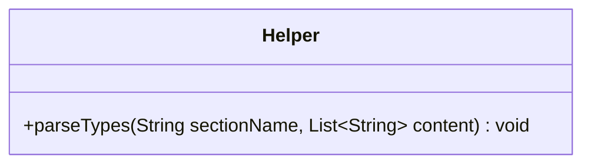

---
aliases:
  - Helper
tags:
  - java/class
  - module/forge-core
  - pkg/forge/card
fqn: forge.card.CardType.Helper
package: forge.card
module: forge-core
kind: Class
---

# Helper

**Package:** `forge.card`   **Module:** `forge-core`   **Kind:** Class



## Design Description

The `Helper` class is a static nested utility within `CardType` that parses raw card-type definition data into the engine's canonical type registries. Its sole responsibility is `parseTypes`, which dispatches on a section name (e.g. `BasicTypes`, `CreatureTypes`, `LandTypes`) to select the matching `CardType.Constant` set, then populates that set from a list of text lines, deduplicating entries and recording singular-to-plural mappings in `Constant.pluralTypes` and any space-containing names in `Constant.MultiwordTypes`.

As a stateless, package-level helper it collaborates exclusively with `CardType.Constant`, acting as the loader that translates external configuration text into the in-memory type vocabulary the rest of `CardType` relies on. The all-static, side-effecting design and silent no-op on unrecognized sections reflect its intent as a one-time initialization routine driven by data files rather than a reusable object.

## Source
`forge-core/src/main/java/forge/card/CardType.java` — declaration excerpt

```java
    public static class Helper {
        public static final void parseTypes(String sectionName, List<String> content) {
            Set<String> addToSection = null;

            switch (sectionName) {
                case "BasicTypes":
                    addToSection = CardType.Constant.BASIC_TYPES;
                    break;
                case "LandTypes":
                    addToSection = CardType.Constant.LAND_TYPES;
                    break;
                case "CreatureTypes":
                    addToSection = CardType.Constant.CREATURE_TYPES;
                    break;
                case "SpellTypes":
                    addToSection = CardType.Constant.SPELL_TYPES;
                    break;
                case "EnchantmentTypes":
                    addToSection = CardType.Constant.ENCHANTMENT_TYPES;
                    break;
                case "ArtifactTypes":
                    addToSection = CardType.Constant.ARTIFACT_TYPES;
                    break;
                case "WalkerTypes":
                    addToSection = CardType.Constant.WALKER_TYPES;
                    break;
                case "DungeonTypes":
                    addToSection = CardType.Constant.DUNGEON_TYPES;
                    break;
                case "BattleTypes":
                    addToSection = CardType.Constant.BATTLE_TYPES;
                    break;
                case "PlanarTypes":
                    addToSection = CardType.Constant.PLANAR_TYPES;
                    break;
            }

            if (addToSection == null) {
                return;
            }

            for(String line : content) {
                if (line.length() == 0) continue;

                if (line.contains(":")) {
                    String[] k = line.split(":");

                    if (addToSection.contains(k[0])) {
                        continue;
                    }

                    addToSection.add(k[0]);
                    CardType.Constant.pluralTypes.put(k[0], k[1]);

                    if (k[0].contains(" ")) {
                        CardType.Constant.MultiwordTypes.add(k[0]);
                    }
                } else {
                    if (addToSection.contains(line)) {
                        continue;
                    }

                    addToSection.add(line);
                    if (line.contains(" ")) {
                        CardType.Constant.MultiwordTypes.add(line);
                    }
                }
            }
        }
    }
```
