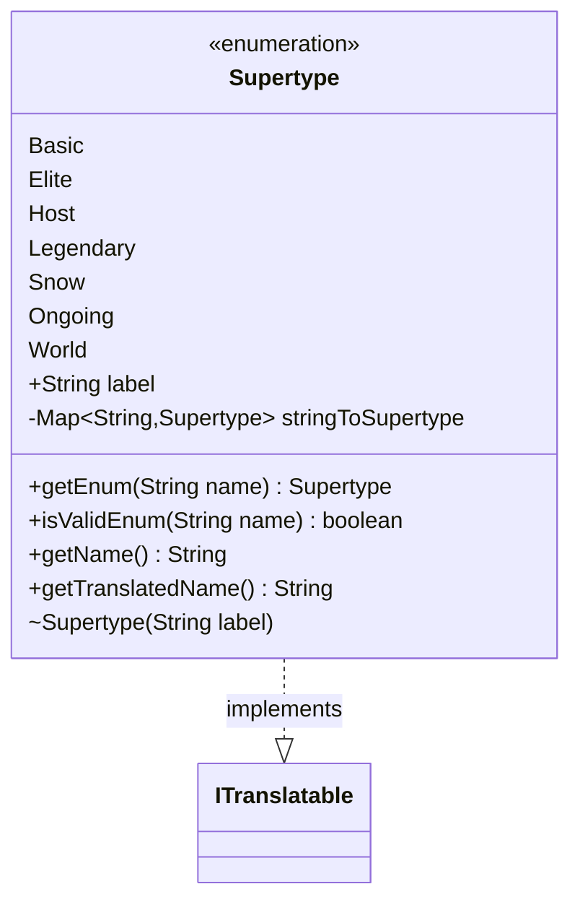

---
aliases:
  - Supertype
tags:
  - java/enum
  - module/forge-core
  - pkg/forge/card
fqn: forge.card.CardType.Supertype
package: forge.card
module: forge-core
kind: Enum
---

# Supertype

**Package:** `forge.card`   **Module:** `forge-core`   **Kind:** Enum



## Relationships
**Implements:**
- [[forge.util.ITranslatable|ITranslatable]]

## Design Description

Supertype enumerates Magic: The Gathering card supertypes (Basic, Elite, Host, Legendary, Snow, Ongoing, World) as a nested enum within `CardType`. Each constant carries a `label` key that maps to a localization message. By implementing `ITranslatable`, it commits to exposing both a stable internal `getName()` (the enum constant's own name) and a `getTranslatedName()` that resolves the label through the `Localizer` singleton, letting UI code display supertypes in the user's language while game logic keys off the invariant name.

The class also provides a static lookup facility: a precomputed `stringToSupertype` map (built via `EnumUtils.getEnumMap`) backs `getEnum` and `isValidEnum`, giving callers cheap, null-tolerant parsing of supertype names from card data rather than relying on exception-throwing `valueOf`. The immutable `final label` field and package-private constructor reflect the enum's intent as a fixed, read-only vocabulary.

## Source
`forge-core/src/main/java/forge/card/CardType.java` — declaration excerpt

```java
    public enum Supertype implements ITranslatable {
        Basic("lblBasic"),
        Elite("lblElite"),
        Host("lblHost"),
        Legendary("lblLegendary"),
        Snow("lblSnow"),
        Ongoing("lblOngoing"),
        World("lblWorld");

        public final String label;

        private static Map<String, Supertype> stringToSupertype = EnumUtils.getEnumMap(Supertype.class);

        public static Supertype getEnum(String name) {
            return stringToSupertype.get(name);
        }

        public static boolean isValidEnum(String name) {
            return stringToSupertype.containsKey(name);
        }

        Supertype(final String label) {
            this.label = label;
        }


        @Override
        public String getName() {
            return this.name();
        }

        @Override
        public String getTranslatedName() {
            return Localizer.getInstance().getMessage(label);
        }
    }
```

## Python
`forge/card/CardType/Supertype.py`

```python
from forge.util.ITranslatable import ITranslatable
from forge.util.EnumUtils import EnumUtils
from forge.util.Localizer import Localizer


class Supertype(ITranslatable):
    Basic = ("lblBasic",)
    Elite = ("lblElite",)
    Host = ("lblHost",)
    Legendary = ("lblLegendary",)
    Snow = ("lblSnow",)
    Ongoing = ("lblOngoing",)
    World = ("lblWorld",)

    def __init__(self, label: str):
        self.label = label

    @staticmethod
    def getEnum(name: str) -> "Supertype":
        return stringToSupertype.get(name)

    @staticmethod
    def isValidEnum(name: str) -> bool:
        return name in stringToSupertype

    def getName(self) -> str:
        return self.name()

    def getTranslatedName(self) -> str:
        return Localizer.getInstance().getMessage(self.label)


stringToSupertype: dict[str, Supertype] = EnumUtils.getEnumMap(Supertype)
```
