---
aliases:
  - CardType
tags:
  - java/class
  - module/forge-core
  - pkg/forge/card
fqn: forge.card.CardType
package: forge.card
module: forge-core
kind: Class
---

# CardType

**Package:** `forge.card`   **Module:** `forge-core`   **Kind:** Class



```mermaid
classDiagram
    class CardType {
        -long serialVersionUID
        +CardTypeView EMPTY
        #Set~CoreType~ coreTypes
        #Set~Supertype~ supertypes
        #Set~String~ subtypes
        #boolean allCreatureTypes
        #Set~String~ excludedCreatureSubtypes
        -boolean incomplete
        -String calculatedType
        -List~String~ sortedSubTypes
        +add(String t) boolean
        +addAll(Iterable~String~ types) boolean
        +addAll(CardType type) boolean
        +addAll(CardTypeView type) boolean
        +removeAll(CardTypeView type) boolean
        +clear() void
        +removeCardTypes() void
        +remove(Supertype st) boolean
        +remove(String str) boolean
        +setCreatureTypes(Collection~String~ ctypes) boolean
        +isEmpty() boolean
        +getCoreTypes() Collection~CoreType~
        +getSupertypes() Collection~Supertype~
        +getSubtypes() Collection~String~
        +getExcludedCreatureSubTypes() Iterable~String~
        +getCreatureTypes() Set~String~
        +getLandTypes() Set~String~
        +getBattleTypes() Set~String~
        +hasStringType(String t) boolean
        +hasType(CoreType type) boolean
        +hasSupertype(Supertype supertype) boolean
        +hasAllCreatureTypes() boolean
        +hasSubtype(String subtype) boolean
        +hasCreatureType(String creatureType) boolean
        -toMixedCase(String s) String
        +hasABasicLandType() boolean
        +hasANonBasicLandType() boolean
        +isPermanent() boolean
        +isCreature() boolean
        +isPlaneswalker() boolean
        +isBattle() boolean
        +isLand() boolean
        +isArtifact() boolean
        +isInstant() boolean
        +isSorcery() boolean
        +isConspiracy() boolean
        +isVanguard() boolean
        +isScheme() boolean
        +isEnchantment() boolean
        +isBasic() boolean
        +isLegendary() boolean
        +isSnow() boolean
        +isBasicLand() boolean
        +isPlane() boolean
        +isPhenomenon() boolean
        +isKindred() boolean
        +isDungeon() boolean
        +isAttachment() boolean
        +isAura() boolean
        +isEquipment() boolean
        +isFortification() boolean
        +isAttraction() boolean
        +isContraption() boolean
        +isVehicle() boolean
        +isSpacecraft() boolean
        +isSaga() boolean
        +isHistoric() boolean
        +isOutlaw() boolean
        +isParty() boolean
        +toString() String
        -getTypesBeforeDash() Set~String~
        +getTypeWithChanges(Iterable~ICardChangedType~ changedCardTypes) CardTypeView
        +sanisfySubtypes() void
        +compareTo(CardType o) int
        +sharesCreaturetypeWith(CardTypeView ctOther) boolean
        +sharesLandTypeWith(CardTypeView ctOther) boolean
        +sharesPermanentTypeWith(CardTypeView ctOther) boolean
        +sharesCardTypeWith(CardTypeView ctOther) boolean
        +sharesAllCardTypesWith(CardTypeView ctOther) boolean
        +sharesSubtypeWith(CardTypeView ctOther) boolean
        +getGamePieceType() GamePieceType
        +parse(String typeText, boolean incomplete) CardType
        +combine(CardType a, CardType b) CardType
        -getMultiwordType(String type) String
        +isACardType(String cardType) boolean
        +getAllCardTypes() Set~String~
        +getSortedSubTypes() List~String~
        +getBasicTypes() Collection~String~
        +getNonBasicTypes() Collection~String~
        +getAllCreatureTypes() Collection~String~
        +getAllWalkerTypes() Collection~String~
        +getAllLandTypes() List~String~
        +isASupertype(String cardType) boolean
        +isASubType(String cardType) boolean
        +isAnArtifactType(String cardType) boolean
        +isACreatureType(String cardType) boolean
        +isALandType(String cardType) boolean
        +isAPlaneswalkerType(String cardType) boolean
        +isABasicLandType(String cardType) boolean
        +isAnEnchantmentType(String cardType) boolean
        +isASpellType(String cardType) boolean
        +isADungeonType(String cardType) boolean
        +isABattleType(String cardType) boolean
        +isAPlanarType(String cardType) boolean
        +getSingularType(String type) String
        +getPluralType(String type) String
        +CardType(boolean incomplete)
        +CardType(Iterable~String~ from0, boolean incomplete)
        +CardType(CardType from0)
        +CardType(CardTypeView from0)
    }
    CardType ..|> Comparable : implements
    CardType ..|> CardTypeView : implements
    CardType ..> CoreType : uses
    CardType ..> GamePieceType : uses
    CardType ..> ICardChangedType : uses
    CardType ..> ITranslatable : uses
    CardType ..> Settable : uses
    CardType ..> Supertype : uses
```

## Relationships
**Implements:**
- [[forge.card.CardTypeView|CardTypeView]]
**Uses:**
- [[forge.card.CardType.CoreType|CoreType]]
- [[forge.card.CardType.Supertype|Supertype]]
- [[forge.card.GamePieceType|GamePieceType]]
- [[forge.card.ICardChangedType|ICardChangedType]]
- [[forge.util.ITranslatable|ITranslatable]]
- [[forge.util.Settable|Settable]]

## Design Description

CardType is a final, immutable value class in `forge-core` that models the complete type line of a Magic card—its supertypes (e.g. Legendary, Basic), core card types (the `CoreType` enum, e.g. Creature, Land, Instant), and free-form subtypes (creature, land, artifact, etc.). Instances are built only by parsing a type string or combining/copying existing types, and the class exposes a broad, read-oriented query API: `isCreature()`, `hasSubtype()`, `sharesCreaturetypeWith()`, land/battle/creature-type extraction, and rendering back to canonical text via `toString()`.

It implements `CardTypeView` (its read-only contract) and `Comparable`, collaborating with the nested `CoreType` and `Supertype` enums—both `ITranslatable` for localized names and `GamePieceType` mapping. Notable design intent: type-string tables live in the static `Constant` registry loaded via `Helper`; `sanisfySubtypes()` enforces that subtypes remain consistent with core types (skipped for `incomplete` types used by changing effects); `getTypeWithChanges()` applies layered `ICardChangedType` modifications onto a defensive copy; and `calculatedType` caches the rendered string for efficiency.

## Source
`forge-core/src/main/java/forge/card/CardType.java`

```java
/*
 * Forge: Play Magic: the Gathering.
 * Copyright (C) 2011  Forge Team
 *
 * This program is free software: you can redistribute it and/or modify
 * it under the terms of the GNU General Public License as published by
 * the Free Software Foundation, either version 3 of the License, or
 * (at your option) any later version.
 *
 * This program is distributed in the hope that it will be useful,
 * but WITHOUT ANY WARRANTY; without even the implied warranty of
 * MERCHANTABILITY or FITNESS FOR A PARTICULAR PURPOSE.  See the
 * GNU General Public License for more details.
 *
 * You should have received a copy of the GNU General Public License
 * along with this program.  If not, see <http://www.gnu.org/licenses/>.
 */
package forge.card;

import com.google.common.collect.*;

import forge.util.ITranslatable;
import forge.util.Localizer;
import forge.util.Settable;
import org.apache.commons.lang3.EnumUtils;
import org.apache.commons.lang3.StringUtils;

import java.util.*;
import java.util.function.Predicate;
import java.util.stream.Collectors;

/**
 * <p>
 * Immutable Card type. Can be built only from parsing a string.
 * </p>
 *
 * @author Forge
 */
public final class CardType implements Comparable<CardType>, CardTypeView {
    private static final long serialVersionUID = 4629853583167022151L;

    public static final CardTypeView EMPTY = new CardType(false);

    public enum CoreType implements ITranslatable {
        Kindred(false, "kindreds", "lblKindred"), // always printed first
        Artifact(true, "artifacts", "lblArtifact"),
        Battle(true, "battles", "lblBattle"),
        Conspiracy(false, "conspiracies", "lblConspiracy"),
        Enchantment(true, "enchantments", "lblEnchantment"),
        Creature(true, "creatures", "lblCreature"),
        Dungeon(false, "dungeons", "lblDungeon"),
        Instant(false, "instants", "lblInstant"),
        Land(true, "lands", "lblLand"),
        Phenomenon(false, "phenomenons", "lblPhenomenon"),
        Plane(false, "planes", "lblPlane"),
        Planeswalker(true, "planeswalkers", "lblPlaneswalker"),
        Scheme(false, "schemes", "lblScheme"),
        Sorcery(false, "sorceries", "lblSorcery"),
        Vanguard(false, "vanguards", "lblVanguard");

        public final boolean isPermanent;
        public final String pluralName;
        public final String label;
        private static Map<String, CoreType> stringToCoreType = EnumUtils.getEnumMap(CoreType.class);
        private static final Set<String> allCoreTypeNames = stringToCoreType.keySet();
        public static final Set<CoreType> spellTypes = ImmutableSet.of(Instant, Sorcery);

        public static CoreType getEnum(String name) {
            return stringToCoreType.get(name);
        }

        public static boolean isValidEnum(String name) {
            return stringToCoreType.containsKey(name);
        }

        CoreType(final boolean permanent, final String plural, final String label) {
            isPermanent = permanent;
            pluralName = plural;
            this.label = label;
        }

        /**
         * Converts this core type to whichever GamePieceType is typical of it.
         * Be aware that this will not catch GamePieceTypes derived from subtypes,
         * such as Attractions.
         * @return a GamePieceType appropriate for this core type.
         */
        public GamePieceType toGamePieceType() {
            return switch (this) {
            case Plane, Phenomenon -> GamePieceType.PLANAR;
            case Scheme -> GamePieceType.SCHEME;
            case Dungeon -> GamePieceType.DUNGEON;
            case Vanguard -> GamePieceType.AVATAR;
            default -> GamePieceType.CARD;
            };
        }

        @Override
        public String getName() {
            return this.name();
        }

        @Override
        public String getTranslatedName() {
            return Localizer.getInstance().getMessage(label);
        }
    }

    public enum Supertype implements ITranslatable {
        Basic("lblBasic"),
        Elite("lblElite"),
        Host("lblHost"),
        Legendary("lblLegendary"),
        Snow("lblSnow"),
        Ongoing("lblOngoing"),
        World("lblWorld");

        public final String label;

        private static Map<String, Supertype> stringToSupertype = EnumUtils.getEnumMap(Supertype.class);

        public static Supertype getEnum(String name) {
            return stringToSupertype.get(name);
        }

        public static boolean isValidEnum(String name) {
            return stringToSupertype.containsKey(name);
        }

        Supertype(final String label) {
            this.label = label;
        }


        @Override
        public String getName() {
            return this.name();
        }

        @Override
        public String getTranslatedName() {
            return Localizer.getInstance().getMessage(label);
        }
    }

    protected final Set<CoreType> coreTypes = EnumSet.noneOf(CoreType.class);
    protected final Set<Supertype> supertypes = EnumSet.noneOf(Supertype.class);
    protected final Set<String> subtypes = Sets.newLinkedHashSet();
    protected boolean allCreatureTypes = false;
    protected final Set<String> excludedCreatureSubtypes = Sets.newLinkedHashSet();

    private boolean incomplete = false;
    private transient String calculatedType = null;

    public CardType(boolean incomplete) {
        this.incomplete = incomplete;
    }
    public CardType(final Iterable<String> from0, boolean incomplete) {
        this.incomplete = incomplete;
        addAll(from0);
    }
    public CardType(final CardType from0) {
        addAll(from0);
        allCreatureTypes = from0.allCreatureTypes;
        excludedCreatureSubtypes.addAll(from0.excludedCreatureSubtypes);
    }
    public CardType(final CardTypeView from0) {
        addAll(from0);
    }

    public boolean add(final String t) {
        boolean changed;
        final CoreType ct = CoreType.getEnum(t);
        if (ct != null) {
            changed = coreTypes.add(ct);
        } else {
            final Supertype st = Supertype.getEnum(t);
            if (st != null) {
                changed = supertypes.add(st);
            } else {
                // If not recognized by super- and core- this must be subtype
                changed = subtypes.add(t);
            }
        }
        if (changed) {
            calculatedType = null; //ensure this is recalculated
            return true;
        }
        return false;
    }
    public boolean addAll(final Iterable<String> types) {
        if (types == null) {
            return false;
        }
        boolean changed = false;
        for (final String t : types) {
            if (add(t)) {
                changed = true;
            }
        }
        sanisfySubtypes();
        return changed;
    }
    public boolean addAll(final CardType type) {
        boolean changed = false;
        if (coreTypes.addAll(type.coreTypes)) { changed = true; }
        if (supertypes.addAll(type.supertypes)) { changed = true; }
        if (subtypes.addAll(type.subtypes)) { changed = true; }
        sanisfySubtypes();
        return changed;
    }
    public boolean addAll(final CardTypeView type) {
        boolean changed = false;
        if (Iterables.addAll(coreTypes, type.getCoreTypes())) { changed = true; }
        if (Iterables.addAll(supertypes, type.getSupertypes())) { changed = true; }
        if (Iterables.addAll(subtypes, type.getSubtypes())) { changed = true; }
        sanisfySubtypes();
        return changed;
    }

    public boolean removeAll(final CardTypeView type) {
        boolean changed = false;
        if (coreTypes.removeAll(type.getCoreTypes())) { changed = true; }
        if (supertypes.removeAll(type.getSupertypes())) { changed = true; }
        if (subtypes.removeAll(type.getSubtypes())) { changed = true; }
        if (changed) {
            sanisfySubtypes();
            calculatedType = null;
            return true;
        }
        return false;
    }

    public void clear() {
        if (isEmpty()) { return; }
        coreTypes.clear();
        supertypes.clear();
        subtypes.clear();
        calculatedType = null;
    }

    public void removeCardTypes() {
        coreTypes.clear();
    }

    public boolean remove(final Supertype st) {
        return supertypes.remove(st);
    }

    public boolean remove(final String str) {
        boolean changed = false;

        // try to remove sub type first if able
        if (subtypes.remove(str)) {
            changed = true;
        } else {
            Supertype st = Supertype.getEnum(str);
            if (st != null && supertypes.remove(st)) {
                changed = true;
            }
            CoreType ct = CoreType.getEnum(str);
            if (ct != null && coreTypes.remove(ct)) {
                changed = true;
            }
        }

        if (changed) {
            sanisfySubtypes();
            calculatedType = null;
        }
        return changed;
    }

    public boolean setCreatureTypes(Collection<String> ctypes) {
        // if it isn't a creature then this has no effect
        if (!isCreature() && !isKindred()) {
            return false;
        }
        boolean changed = subtypes.removeIf(CardType::isACreatureType);
        // need to remove AllCreatureTypes too when setting Creature Type
        if (allCreatureTypes) {
            changed = true;
        }
        allCreatureTypes = false;
        subtypes.addAll(ctypes);
        return changed;
    }

    @Override
    public boolean isEmpty() {
        return coreTypes.isEmpty() && supertypes.isEmpty() && subtypes.isEmpty() && excludedCreatureSubtypes.isEmpty();
    }

    @Override
    public Collection<CoreType> getCoreTypes() {
        return coreTypes;
    }
    @Override
    public Collection<Supertype> getSupertypes() {
        return supertypes;
    }
    @Override
    public Collection<String> getSubtypes() {
        return subtypes;
    }

    @Override
    public Iterable<String> getExcludedCreatureSubTypes() {
        return excludedCreatureSubtypes;
    }

    @Override
    public Set<String> getCreatureTypes() {
        final Set<String> creatureTypes = Sets.newLinkedHashSet();
        if (!isCreature() && !isKindred()) {
            return creatureTypes;
        }
        if (hasAllCreatureTypes()) { // it should return list of all creature types
            creatureTypes.addAll(getAllCreatureTypes());
            creatureTypes.removeAll(this.excludedCreatureSubtypes);
        } else {
            subtypes.stream().filter(CardType::isACreatureType).forEach(creatureTypes::add);
        }
        return creatureTypes;
    }

    @Override
    public Set<String> getLandTypes() {
        final Set<String> landTypes = Sets.newLinkedHashSet();
        if (isLand()) {
            for (final String t : subtypes) {
                if (isALandType(t)) {
                    landTypes.add(t);
                }
            }
        }
        return landTypes;
    }

    public Set<String> getBattleTypes() {
        if(!isBattle())
            return Set.of();
        return subtypes.stream().filter(CardType::isABattleType).collect(Collectors.toSet());
    }

    @Override
    public boolean hasStringType(String t) {
        if (t.isEmpty()) {
            return false;
        }
        if (hasSubtype(t)) {
            return true;
        }

        t = StringUtils.capitalize(t);
        final CoreType type = CoreType.getEnum(t);
        if (type != null) {
            return hasType(type);
        }
        final Supertype supertype = Supertype.getEnum(t);
        if (supertype != null) {
            return hasSupertype(supertype);
        }
        return false;
    }

    @Override
    public boolean hasType(final CoreType type) {
        return coreTypes.contains(type);
    }

    @Override
    public boolean hasSupertype(final Supertype supertype) {
        return supertypes.contains(supertype);
    }

    @Override
    public boolean hasAllCreatureTypes() {
        if (!isCreature() && !isKindred()) { return false; }
        return this.allCreatureTypes;
    }

    @Override
    public boolean hasSubtype(final String subtype) {
        if (hasCreatureType(subtype)) {
            return true;
        }
        return subtypes.contains(subtype);
    }

    @Override
    public boolean hasCreatureType(String creatureType) {
        if (!isCreature() && !isKindred()) { return false; }

        creatureType = toMixedCase(creatureType);
        if (!isACreatureType(creatureType)) { return false; }

        if (excludedCreatureSubtypes.contains(creatureType)) {
            return false;
        }
        if (allCreatureTypes) {
            return true;
        }
        return subtypes.contains(creatureType);
    }
    private static String toMixedCase(final String s) {
        if (s.isEmpty()) {
            return s;
        }
        final StringBuilder sb = new StringBuilder();
        // to handle hyphenated Types
        // TODO checkout WordUtils for this
        final String[] types = s.split("-");
        for (int i = 0; i < types.length; i++) {
            if (i != 0) {
                sb.append("-");
            }
            sb.append(StringUtils.capitalize(types[i]));
        }
        return sb.toString();
    }

    @Override
    public boolean hasABasicLandType() {
        return this.subtypes.stream().anyMatch(CardType::isABasicLandType);
    }
    @Override
    public boolean hasANonBasicLandType() {
        return !Collections.disjoint(this.subtypes, getNonBasicTypes());
    }

    @Override
    public boolean isPermanent() {
        for (final CoreType type : coreTypes) {
            if (type.isPermanent) {
                return true;
            }
        }
        return false;
    }

    @Override
    public boolean isCreature() {
        return coreTypes.contains(CoreType.Creature);
    }

    @Override
    public boolean isPlaneswalker() {
        return coreTypes.contains(CoreType.Planeswalker);
    }

    @Override
    public boolean isBattle() {
        return coreTypes.contains(CoreType.Battle);
    }

    @Override
    public boolean isLand() {
        return coreTypes.contains(CoreType.Land);
    }

    @Override
    public boolean isArtifact() {
        return coreTypes.contains(CoreType.Artifact);
    }

    @Override
    public boolean isInstant() {
        return coreTypes.contains(CoreType.Instant);
    }

    @Override
    public boolean isSorcery() {
        return coreTypes.contains(CoreType.Sorcery);
    }

    @Override
    public boolean isConspiracy() {
        return coreTypes.contains(CoreType.Conspiracy);
    }

    @Override
    public boolean isVanguard() {
        return coreTypes.contains(CoreType.Vanguard);
    }

    @Override
    public boolean isScheme() {
        return coreTypes.contains(CoreType.Scheme);
    }

    @Override
    public boolean isEnchantment() {
        return coreTypes.contains(CoreType.Enchantment);
    }

    @Override
    public boolean isBasic() {
        return supertypes.contains(Supertype.Basic);
    }

    @Override
    public boolean isLegendary() {
        return supertypes.contains(Supertype.Legendary);
    }

    @Override
    public boolean isSnow() {
        return supertypes.contains(Supertype.Snow);
    }

    @Override
    public boolean isBasicLand() {
        return isBasic() && isLand();
    }

    @Override
    public boolean isPlane() {
        return coreTypes.contains(CoreType.Plane);
    }

    @Override
    public boolean isPhenomenon() {
        return coreTypes.contains(CoreType.Phenomenon);
    }

    @Override
    public boolean isKindred() {
        return coreTypes.contains(CoreType.Kindred);
    }

    @Override
    public boolean isDungeon() {
        return coreTypes.contains(CoreType.Dungeon);
    }

    @Override
    public boolean isAttachment() { return isAura() || isEquipment() || isFortification(); }
    @Override
    public boolean isAura() { return hasSubtype("Aura"); }
    @Override
    public boolean isEquipment()  { return hasSubtype("Equipment"); }
    @Override
    public boolean isFortification()  { return hasSubtype("Fortification"); }
    public boolean isAttraction() {
        return hasSubtype("Attraction");
    }

    public boolean isContraption() {
        return hasSubtype("Contraption");
    }

    public boolean isVehicle() { return hasSubtype("Vehicle"); }
    public boolean isSpacecraft() { return hasSubtype("Spacecraft"); }

    @Override
    public boolean isSaga() {
        return hasSubtype("Saga");
    }

    @Override
    public boolean isHistoric() {
        return isLegendary() || isArtifact() || isSaga();
    }

    @Override
    public boolean isOutlaw() {
        if (!isCreature() && !isKindred()) {
            return false;
        }
        return Constant.OUTLAW_TYPES.stream().anyMatch(s -> hasCreatureType(s));
    }
    @Override
    public boolean isParty() {
        if (!isCreature() && !isKindred()) {
            return false;
        }
        return Constant.PARTY_TYPES.stream().anyMatch(s -> hasCreatureType(s));
    }

    @Override
    public String toString() {
        if (calculatedType == null) {
            StringBuilder sb = new StringBuilder(StringUtils.join(getTypesBeforeDash(), ' '));
            if (!subtypes.isEmpty() || hasAllCreatureTypes()) {
                sb.append(" - ");
            }
            if (!subtypes.isEmpty()) {
                sb.append(StringUtils.join(subtypes, " "));
            }
            if (hasAllCreatureTypes()) {
                if (!subtypes.isEmpty()) {
                    sb.append(" ");
                }
                sb.append("(All");
                if (!excludedCreatureSubtypes.isEmpty()) {
                    sb.append(" except ").append(StringUtils.join(excludedCreatureSubtypes, " "));
                }
                sb.append(")");
            }

            calculatedType = sb.toString();
        }
        return calculatedType;
    }

    private Set<String> getTypesBeforeDash() {
        final Set<String> types = Sets.newLinkedHashSet();
        for (final Supertype st : supertypes) {
            types.add(st.name());
        }
        for (final CoreType ct : coreTypes) {
            types.add(ct.name());
        }
        return types;
    }

    @Override
    public CardTypeView getTypeWithChanges(final Iterable<ICardChangedType> changedCardTypes) {
        if (Iterables.isEmpty(changedCardTypes)) {
            return this;
        }

        CardType newType = new CardType(CardType.this);
        // we assume that changes are already correctly ordered (taken from TreeMap.values())
        for (final ICardChangedType ct : changedCardTypes) {
            newType = ct.applyChanges(newType);
        }
        // sanisfy subtypes
        if (!newType.subtypes.isEmpty()) {
            newType.sanisfySubtypes();
        }
        return newType;
    }

    public void sanisfySubtypes() {
        // incomplete types are used for changing effects
        if (this.incomplete) {
            return;
        }
        if (!isCreature() && !isKindred()) {
            allCreatureTypes = false;
        }
        if (subtypes.isEmpty()) {
            return;
        }
        Predicate<String> allowedTypes = x -> false;
        if (isCreature() || isKindred()) {
            allowedTypes = allowedTypes.or(CardType::isACreatureType);
        }
        if (isLand()) {
            allowedTypes = allowedTypes.or(CardType::isALandType);
        }
        if (isArtifact()) {
            allowedTypes = allowedTypes.or(CardType::isAnArtifactType);
        }
        if (isEnchantment()) {
            allowedTypes = allowedTypes.or(CardType::isAnEnchantmentType);
        }
        if (isInstant() || isSorcery()) {
            allowedTypes = allowedTypes.or(CardType::isASpellType);
        }
        if (isPlaneswalker()) {
            allowedTypes = allowedTypes.or(CardType::isAPlaneswalkerType);
        }
        if (isDungeon()) {
            allowedTypes = allowedTypes.or(CardType::isADungeonType);
        }
        if (isBattle()) {
            allowedTypes = allowedTypes.or(CardType::isABattleType);
        }
        if (isPlane()) {
            allowedTypes = allowedTypes.or(CardType::isAPlanarType);
        }

        subtypes.removeIf(allowedTypes.negate());
    }

    @Override
    public int compareTo(final CardType o) {
        return toString().compareTo(o.toString());
    }

    public boolean sharesCreaturetypeWith(final CardTypeView ctOther) {
        if (ctOther == null) {
            return false;
        }
        if (!isCreature() && !isKindred()) {
            return false;
        }
        if (!ctOther.isCreature() && !ctOther.isKindred()) {
            return false;
        }

        // special cases for if any of them is all creature types
        if (this.allCreatureTypes && ctOther.hasAllCreatureTypes()) {
            // no type is exluded so they should share all creature types
            if (excludedCreatureSubtypes.isEmpty() && Iterables.isEmpty(ctOther.getExcludedCreatureSubTypes())) {
                return true;
            }
        }

        for (final String type : getCreatureTypes()) {
            if (ctOther.hasCreatureType(type)) {
                return true;
            }
        }
        for (final String type : ctOther.getCreatureTypes()) {
            if (this.hasCreatureType(type)) {
                return true;
            }
        }
        return false;
    }

    public boolean sharesLandTypeWith(final CardTypeView ctOther) {
        if (ctOther == null) {
            return false;
        }

        for (final String type : getLandTypes()) {
            if (ctOther.hasSubtype(type)) {
                return true;
            }
        }
        return false;
    }

    public boolean sharesPermanentTypeWith(final CardTypeView ctOther) {
        if (ctOther == null) {
            return false;
        }

        for (final CoreType type : getCoreTypes()) {
            if (type.isPermanent && ctOther.hasType(type)) {
                return true;
            }
        }
        return false;
    }

    public boolean sharesCardTypeWith(final CardTypeView ctOther) {
        if (ctOther == null) {
            return false;
        }
        for (final CoreType type : getCoreTypes()) {
            if (ctOther.hasType(type)) {
                return true;
            }
        }
        return false;
    }

    public boolean sharesAllCardTypesWith(final CardTypeView ctOther) {
        if (ctOther == null) {
            return false;
        }
        for (final CoreType type : getCoreTypes()) {
            if (!ctOther.hasType(type)) {
                return false;
            }
        }
        for (final CoreType type : ctOther.getCoreTypes()) {
            if (!this.hasType(type)) {
                return false;
            }
        }
        return true;
    }

    public boolean sharesSubtypeWith(final CardTypeView ctOther) {
        if (ctOther == null) {
            return false;
        }
        if (sharesCreaturetypeWith(ctOther)) {
            return true;
        }
        for (final String t : ctOther.getSubtypes()) {
            if (hasSubtype(t)) {
                return true;
            }
        }
        return false;
    }

    public GamePieceType getGamePieceType() {
        if(this.isAttraction())
            return GamePieceType.ATTRACTION;
        if(this.isContraption())
            return GamePieceType.CONTRAPTION;
        for(CoreType type : coreTypes) {
            GamePieceType r = type.toGamePieceType();
            if(r != GamePieceType.CARD)
                return r;
        }
        return GamePieceType.CARD;
    }

    public static CardType parse(final String typeText, boolean incomplete) {
        // Most types and subtypes, except "Serra's Realm" and
        // "Bolas's Meditation Realm" consist of only one word
        final char space = ' ';
        final CardType result = new CardType(incomplete);

        int iTypeStart = 0;
        int max = typeText.length();
        boolean hasMoreTypes = max > 0;
        while (hasMoreTypes) {
            final String rest = typeText.substring(iTypeStart);
            String type = getMultiwordType(rest);
            if (type == null) {
                int iSpace = typeText.indexOf(space, iTypeStart);
                type = typeText.substring(iTypeStart, iSpace == -1 ? max : iSpace);
            }
            result.add(type);
            iTypeStart += type.length() + 1;
            hasMoreTypes = iTypeStart < max;
        }
        return result;
    }

    public static CardType combine(final CardType a, final CardType b) {
        final CardType result = new CardType(false);
        result.supertypes.addAll(a.supertypes);
        result.supertypes.addAll(b.supertypes);
        result.coreTypes.addAll(a.coreTypes);
        result.coreTypes.addAll(b.coreTypes);
        result.subtypes.addAll(a.subtypes);
        result.subtypes.addAll(b.subtypes);
        return result;
    }

    private static String getMultiwordType(final String type) {
        for (String multi : Constant.MultiwordTypes) {
            if (type.startsWith(multi)) {
                return multi;
            }
        }
        return null;
    }

    public static class Constant {
        public static final Settable LOADED = new Settable();
        public static final Set<String> BASIC_TYPES = Sets.newHashSet();
        public static final Set<String> LAND_TYPES = Sets.newHashSet();
        public static final Set<String> CREATURE_TYPES = Sets.newHashSet();
        public static final Set<String> SPELL_TYPES = Sets.newHashSet();
        public static final Set<String> ENCHANTMENT_TYPES = Sets.newHashSet();
        public static final Set<String> ARTIFACT_TYPES = Sets.newHashSet();
        public static final Set<String> WALKER_TYPES = Sets.newHashSet();
        public static final Set<String> DUNGEON_TYPES = Sets.newHashSet();
        public static final Set<String> BATTLE_TYPES = Sets.newHashSet();
        public static final Set<String> PLANAR_TYPES = Sets.newHashSet();

        public static final Set<String> MultiwordTypes = Sets.newHashSet();

        // singular -> plural
        public static final BiMap<String,String> pluralTypes = HashBiMap.create();
        // plural -> singular
        public static final BiMap<String,String> singularTypes = pluralTypes.inverse();

        static {
            for (CoreType c : CoreType.values()) {
                pluralTypes.put(c.name(), c.pluralName);
            }
        }


        public static final Set<String> OUTLAW_TYPES = Sets.newHashSet(
                "Assassin",
                "Mercenary",
                "Pirate",
                "Rogue",
                "Warlock");

        public static final Set<String> PARTY_TYPES = Sets.newHashSet(
                "Cleric",
                "Rogue",
                "Warrior",
                "Wizard");
    }

    ///////// Utility methods
    public static boolean isACardType(final String cardType) {
        return CoreType.isValidEnum(cardType);
    }

    public static Set<String> getAllCardTypes() {
        return CoreType.allCoreTypeNames;
    }

    private static List<String> sortedSubTypes;
    public static List<String> getSortedSubTypes() {
        if (sortedSubTypes == null) {
            sortedSubTypes = Lists.newArrayList();
            sortedSubTypes.addAll(Constant.BASIC_TYPES);
            sortedSubTypes.addAll(Constant.LAND_TYPES);
            sortedSubTypes.addAll(Constant.CREATURE_TYPES);
            sortedSubTypes.addAll(Constant.SPELL_TYPES);
            sortedSubTypes.addAll(Constant.ENCHANTMENT_TYPES);
            sortedSubTypes.addAll(Constant.ARTIFACT_TYPES);
            sortedSubTypes.addAll(Constant.WALKER_TYPES);
            sortedSubTypes.addAll(Constant.DUNGEON_TYPES);
            sortedSubTypes.addAll(Constant.BATTLE_TYPES);
            sortedSubTypes.addAll(Constant.PLANAR_TYPES);
            Collections.sort(sortedSubTypes);
        }
        return sortedSubTypes;
    }

    public static Collection<String> getBasicTypes() {
        return Collections.unmodifiableCollection(Constant.BASIC_TYPES);
    }
    public static Collection<String> getNonBasicTypes() {
        return Collections.unmodifiableCollection(Constant.LAND_TYPES);
    }

    public static Collection<String> getAllCreatureTypes() {
        return Collections.unmodifiableCollection(Constant.CREATURE_TYPES);
    }
    public static Collection<String> getAllWalkerTypes() {
        return Collections.unmodifiableCollection(Constant.WALKER_TYPES);
    }
    public static List<String> getAllLandTypes() {
        return ImmutableList.<String>builder()
                .addAll(getBasicTypes())
                .addAll(Constant.LAND_TYPES)
                .build();
    }

    public static boolean isASupertype(final String cardType) {
        return Supertype.isValidEnum(cardType);
    }

    public static boolean isASubType(final String cardType) {
        return getSortedSubTypes().contains(cardType);
    }

    public static boolean isAnArtifactType(final String cardType) {
        return Constant.ARTIFACT_TYPES.contains(cardType);
    }

    public static boolean isACreatureType(final String cardType) {
        return Constant.CREATURE_TYPES.contains(cardType);
    }

    public static boolean isALandType(final String cardType) {
        return Constant.LAND_TYPES.contains(cardType) || isABasicLandType(cardType);
    }

    public static boolean isAPlaneswalkerType(final String cardType) {
        return Constant.WALKER_TYPES.contains(cardType);
    }

    public static boolean isABasicLandType(final String cardType) {
        return Constant.BASIC_TYPES.contains(cardType);
    }

    public static boolean isAnEnchantmentType(final String cardType) {
        return Constant.ENCHANTMENT_TYPES.contains(cardType);
    }

    public static boolean isASpellType(final String cardType) {
        return Constant.SPELL_TYPES.contains(cardType);
    }

    public static boolean isADungeonType(final String cardType) {
        return Constant.DUNGEON_TYPES.contains(cardType);
    }
    public static boolean isABattleType(final String cardType) {
        return Constant.BATTLE_TYPES.contains(cardType);
    }
    public static boolean isAPlanarType(final String cardType) {
        return Constant.PLANAR_TYPES.contains(cardType);
    }
    /**
     * If the input is a plural type, return the corresponding singular form.
     * Otherwise, simply return the input.
     * @param type a String.
     * @return the corresponding type.
     *
     * @deprecated
     */
    public static String getSingularType(final String type) {
        if (Constant.singularTypes.containsKey(type)) {
            return Constant.singularTypes.get(type);
        }
        return type;
    }

    /**
     * If the input is a singular type, return the corresponding plural form.
     * Otherwise, simply return the input.
     * @param type a String.
     * @return the corresponding type.
     */
    public static String getPluralType(final String type) {
        if (Constant.pluralTypes.containsKey(type)) {
            return Constant.pluralTypes.get(type);
        }
        return type;
    }

    public static class Helper {
        public static final void parseTypes(String sectionName, List<String> content) {
            Set<String> addToSection = null;

            switch (sectionName) {
                case "BasicTypes":
                    addToSection = CardType.Constant.BASIC_TYPES;
                    break;
                case "LandTypes":
                    addToSection = CardType.Constant.LAND_TYPES;
                    break;
                case "CreatureTypes":
                    addToSection = CardType.Constant.CREATURE_TYPES;
                    break;
                case "SpellTypes":
                    addToSection = CardType.Constant.SPELL_TYPES;
                    break;
                case "EnchantmentTypes":
                    addToSection = CardType.Constant.ENCHANTMENT_TYPES;
                    break;
                case "ArtifactTypes":
                    addToSection = CardType.Constant.ARTIFACT_TYPES;
                    break;
                case "WalkerTypes":
                    addToSection = CardType.Constant.WALKER_TYPES;
                    break;
                case "DungeonTypes":
                    addToSection = CardType.Constant.DUNGEON_TYPES;
                    break;
                case "BattleTypes":
                    addToSection = CardType.Constant.BATTLE_TYPES;
                    break;
                case "PlanarTypes":
                    addToSection = CardType.Constant.PLANAR_TYPES;
                    break;
            }

            if (addToSection == null) {
                return;
            }

            for(String line : content) {
                if (line.length() == 0) continue;

                if (line.contains(":")) {
                    String[] k = line.split(":");

                    if (addToSection.contains(k[0])) {
                        continue;
                    }

                    addToSection.add(k[0]);
                    CardType.Constant.pluralTypes.put(k[0], k[1]);

                    if (k[0].contains(" ")) {
                        CardType.Constant.MultiwordTypes.add(k[0]);
                    }
                } else {
                    if (addToSection.contains(line)) {
                        continue;
                    }

                    addToSection.add(line);
                    if (line.contains(" ")) {
                        CardType.Constant.MultiwordTypes.add(line);
                    }
                }
            }
        }
    }
}
```

## Python
`forge/card/CardType.py`

```python
from enum import Enum

from forge.card.CardTypeView import CardTypeView
from forge.card.GamePieceType import GamePieceType
from forge.card.ICardChangedType import ICardChangedType
from forge.util.ITranslatable import ITranslatable
from forge.util.Localizer import Localizer
from forge.util.Settable import Settable


def _capitalize(s):
    if not s:
        return s
    return s[0].upper() + s[1:]


class CardType(CardTypeView):
    serialVersionUID = 4629853583167022151

    class CoreType(ITranslatable, Enum):
        Kindred = (False, "kindreds", "lblKindred")  # always printed first
        Artifact = (True, "artifacts", "lblArtifact")
        Battle = (True, "battles", "lblBattle")
        Conspiracy = (False, "conspiracies", "lblConspiracy")
        Enchantment = (True, "enchantments", "lblEnchantment")
        Creature = (True, "creatures", "lblCreature")
        Dungeon = (False, "dungeons", "lblDungeon")
        Instant = (False, "instants", "lblInstant")
        Land = (True, "lands", "lblLand")
        Phenomenon = (False, "phenomenons", "lblPhenomenon")
        Plane = (False, "planes", "lblPlane")
        Planeswalker = (True, "planeswalkers", "lblPlaneswalker")
        Scheme = (False, "schemes", "lblScheme")
        Sorcery = (False, "sorceries", "lblSorcery")
        Vanguard = (False, "vanguards", "lblVanguard")

        def __init__(self, permanent, plural, label):
            self.isPermanent = permanent
            self.pluralName = plural
            self.label = label

        @classmethod
        def getEnum(cls, name):
            return cls.__members__.get(name)

        @classmethod
        def isValidEnum(cls, name):
            return name in cls.__members__

        def toGamePieceType(self):
            if self in (CardType.CoreType.Plane, CardType.CoreType.Phenomenon):
                return GamePieceType.PLANAR
            if self is CardType.CoreType.Scheme:
                return GamePieceType.SCHEME
            if self is CardType.CoreType.Dungeon:
                return GamePieceType.DUNGEON
            if self is CardType.CoreType.Vanguard:
                return GamePieceType.AVATAR
            return GamePieceType.CARD

        def getName(self):
            return self.name

        def getTranslatedName(self):
            return Localizer.getInstance().getMessage(self.label)

    class Supertype(ITranslatable, Enum):
        Basic = "lblBasic"
        Elite = "lblElite"
        Host = "lblHost"
        Legendary = "lblLegendary"
        Snow = "lblSnow"
        Ongoing = "lblOngoing"
        World = "lblWorld"

        def __init__(self, label):
            self.label = label

        @classmethod
        def getEnum(cls, name):
            return cls.__members__.get(name)

        @classmethod
        def isValidEnum(cls, name):
            return name in cls.__members__

        def getName(self):
            return self.name

        def getTranslatedName(self):
            return Localizer.getInstance().getMessage(self.label)

    def __init__(self, *args):
        self.coreTypes = set()
        self.supertypes = set()
        self.subtypes = []
        self.allCreatureTypes = False
        self.excludedCreatureSubtypes = []
        self.incomplete = False
        self.calculatedType = None
        if len(args) == 2:
            from0, incomplete = args
            self.incomplete = incomplete
            self.addAll(from0)
        elif len(args) == 1:
            a = args[0]
            if isinstance(a, bool):
                self.incomplete = a
            elif isinstance(a, CardType):
                self.addAll(a)
                self.allCreatureTypes = a.allCreatureTypes
                for x in a.excludedCreatureSubtypes:
                    if x not in self.excludedCreatureSubtypes:
                        self.excludedCreatureSubtypes.append(x)
            elif isinstance(a, CardTypeView):
                self.addAll(a)

    def add(self, t):
        ct = CardType.CoreType.getEnum(t)
        if ct is not None:
            before = len(self.coreTypes)
            self.coreTypes.add(ct)
            changed = len(self.coreTypes) != before
        else:
            st = CardType.Supertype.getEnum(t)
            if st is not None:
                before = len(self.supertypes)
                self.supertypes.add(st)
                changed = len(self.supertypes) != before
            else:
                # If not recognized by super- and core- this must be subtype
                if t not in self.subtypes:
                    self.subtypes.append(t)
                    changed = True
                else:
                    changed = False
        if changed:
            self.calculatedType = None  # ensure this is recalculated
            return True
        return False

    def addAll(self, types):
        if isinstance(types, CardType):
            return self._addAll_CardType(types)
        if isinstance(types, CardTypeView):
            return self._addAll_CardTypeView(types)
        return self._addAll_iterable(types)

    def _addAll_iterable(self, types):
        if types is None:
            return False
        changed = False
        for t in types:
            if self.add(t):
                changed = True
        self.sanisfySubtypes()
        return changed

    def _addAll_CardType(self, type):
        changed = False
        before = len(self.coreTypes)
        self.coreTypes.update(type.coreTypes)
        if len(self.coreTypes) != before:
            changed = True
        before = len(self.supertypes)
        self.supertypes.update(type.supertypes)
        if len(self.supertypes) != before:
            changed = True
        for s in type.subtypes:
            if s not in self.subtypes:
                self.subtypes.append(s)
                changed = True
        self.sanisfySubtypes()
        return changed

    def _addAll_CardTypeView(self, type):
        changed = False
        before = len(self.coreTypes)
        self.coreTypes.update(type.getCoreTypes())
        if len(self.coreTypes) != before:
            changed = True
        before = len(self.supertypes)
        self.supertypes.update(type.getSupertypes())
        if len(self.supertypes) != before:
            changed = True
        for s in type.getSubtypes():
            if s not in self.subtypes:
                self.subtypes.append(s)
                changed = True
        self.sanisfySubtypes()
        return changed

    def removeAll(self, type):
        changed = False
        before = len(self.coreTypes)
        self.coreTypes.difference_update(type.getCoreTypes())
        if len(self.coreTypes) != before:
            changed = True
        before = len(self.supertypes)
        self.supertypes.difference_update(type.getSupertypes())
        if len(self.supertypes) != before:
            changed = True
        others = set(type.getSubtypes())
        new = [x for x in self.subtypes if x not in others]
        if len(new) != len(self.subtypes):
            changed = True
        self.subtypes = new
        if changed:
            self.sanisfySubtypes()
            self.calculatedType = None
            return True
        return False

    def clear(self):
        if self.isEmpty():
            return
        self.coreTypes.clear()
        self.supertypes.clear()
        self.subtypes.clear()
        self.calculatedType = None

    def removeCardTypes(self):
        self.coreTypes.clear()

    def remove(self, arg):
        if isinstance(arg, CardType.Supertype):
            st = arg
            if st in self.supertypes:
                self.supertypes.remove(st)
                return True
            return False
        str_ = arg
        changed = False

        # try to remove sub type first if able
        if str_ in self.subtypes:
            self.subtypes.remove(str_)
            changed = True
        else:
            st = CardType.Supertype.getEnum(str_)
            if st is not None and st in self.supertypes:
                self.supertypes.remove(st)
                changed = True
            ct = CardType.CoreType.getEnum(str_)
            if ct is not None and ct in self.coreTypes:
                self.coreTypes.remove(ct)
                changed = True

        if changed:
            self.sanisfySubtypes()
            self.calculatedType = None
        return changed

    def setCreatureTypes(self, ctypes):
        # if it isn't a creature then this has no effect
        if not self.isCreature() and not self.isKindred():
            return False
        new = [x for x in self.subtypes if not CardType.isACreatureType(x)]
        changed = len(new) != len(self.subtypes)
        self.subtypes = new
        # need to remove AllCreatureTypes too when setting Creature Type
        if self.allCreatureTypes:
            changed = True
        self.allCreatureTypes = False
        for c in ctypes:
            if c not in self.subtypes:
                self.subtypes.append(c)
        return changed

    def isEmpty(self):
        return (not self.coreTypes) and (not self.supertypes) and (not self.subtypes) and (not self.excludedCreatureSubtypes)

    def getCoreTypes(self):
        return self.coreTypes

    def getSupertypes(self):
        return self.supertypes

    def getSubtypes(self):
        return self.subtypes

    def getExcludedCreatureSubTypes(self):
        return self.excludedCreatureSubtypes

    def getCreatureTypes(self):
        creatureTypes = []
        if not self.isCreature() and not self.isKindred():
            return creatureTypes
        if self.hasAllCreatureTypes():  # it should return list of all creature types
            for c in CardType.getAllCreatureTypes():
                if c not in creatureTypes:
                    creatureTypes.append(c)
            creatureTypes = [c for c in creatureTypes if c not in self.excludedCreatureSubtypes]
        else:
            for s in self.subtypes:
                if CardType.isACreatureType(s) and s not in creatureTypes:
                    creatureTypes.append(s)
        return creatureTypes

    def getLandTypes(self):
        landTypes = []
        if self.isLand():
            for t in self.subtypes:
                if CardType.isALandType(t) and t not in landTypes:
                    landTypes.append(t)
        return landTypes

    def getBattleTypes(self):
        if not self.isBattle():
            return set()
        return {s for s in self.subtypes if CardType.isABattleType(s)}

    def hasStringType(self, t):
        if not t:
            return False
        if self.hasSubtype(t):
            return True

        t = _capitalize(t)
        type = CardType.CoreType.getEnum(t)
        if type is not None:
            return self.hasType(type)
        supertype = CardType.Supertype.getEnum(t)
        if supertype is not None:
            return self.hasSupertype(supertype)
        return False

    def hasType(self, type):
        return type in self.coreTypes

    def hasSupertype(self, supertype):
        return supertype in self.supertypes

    def hasAllCreatureTypes(self):
        if not self.isCreature() and not self.isKindred():
            return False
        return self.allCreatureTypes

    def hasSubtype(self, subtype):
        if self.hasCreatureType(subtype):
            return True
        return subtype in self.subtypes

    def hasCreatureType(self, creatureType):
        if not self.isCreature() and not self.isKindred():
            return False

        creatureType = CardType.toMixedCase(creatureType)
        if not CardType.isACreatureType(creatureType):
            return False

        if creatureType in self.excludedCreatureSubtypes:
            return False
        if self.allCreatureTypes:
            return True
        return creatureType in self.subtypes

    @staticmethod
    def toMixedCase(s):
        if not s:
            return s
        # to handle hyphenated Types
        # TODO checkout WordUtils for this
        types = s.split("-")
        out = []
        for i in range(len(types)):
            out.append(_capitalize(types[i]))
        return "-".join(out)

    def hasABasicLandType(self):
        return any(CardType.isABasicLandType(s) for s in self.subtypes)

    def hasANonBasicLandType(self):
        return not set(self.subtypes).isdisjoint(CardType.getNonBasicTypes())

    def isPermanent(self):
        for type in self.coreTypes:
            if type.isPermanent:
                return True
        return False

    def isCreature(self):
        return CardType.CoreType.Creature in self.coreTypes

    def isPlaneswalker(self):
        return CardType.CoreType.Planeswalker in self.coreTypes

    def isBattle(self):
        return CardType.CoreType.Battle in self.coreTypes

    def isLand(self):
        return CardType.CoreType.Land in self.coreTypes

    def isArtifact(self):
        return CardType.CoreType.Artifact in self.coreTypes

    def isInstant(self):
        return CardType.CoreType.Instant in self.coreTypes

    def isSorcery(self):
        return CardType.CoreType.Sorcery in self.coreTypes

    def isConspiracy(self):
        return CardType.CoreType.Conspiracy in self.coreTypes

    def isVanguard(self):
        return CardType.CoreType.Vanguard in self.coreTypes

    def isScheme(self):
        return CardType.CoreType.Scheme in self.coreTypes

    def isEnchantment(self):
        return CardType.CoreType.Enchantment in self.coreTypes

    def isBasic(self):
        return CardType.Supertype.Basic in self.supertypes

    def isLegendary(self):
        return CardType.Supertype.Legendary in self.supertypes

    def isSnow(self):
        return CardType.Supertype.Snow in self.supertypes

    def isBasicLand(self):
        return self.isBasic() and self.isLand()

    def isPlane(self):
        return CardType.CoreType.Plane in self.coreTypes

    def isPhenomenon(self):
        return CardType.CoreType.Phenomenon in self.coreTypes

    def isKindred(self):
        return CardType.CoreType.Kindred in self.coreTypes

    def isDungeon(self):
        return CardType.CoreType.Dungeon in self.coreTypes

    def isAttachment(self):
        return self.isAura() or self.isEquipment() or self.isFortification()

    def isAura(self):
        return self.hasSubtype("Aura")

    def isEquipment(self):
        return self.hasSubtype("Equipment")

    def isFortification(self):
        return self.hasSubtype("Fortification")

    def isAttraction(self):
        return self.hasSubtype("Attraction")

    def isContraption(self):
        return self.hasSubtype("Contraption")

    def isVehicle(self):
        return self.hasSubtype("Vehicle")

    def isSpacecraft(self):
        return self.hasSubtype("Spacecraft")

    def isSaga(self):
        return self.hasSubtype("Saga")

    def isHistoric(self):
        return self.isLegendary() or self.isArtifact() or self.isSaga()

    def isOutlaw(self):
        if not self.isCreature() and not self.isKindred():
            return False
        return any(self.hasCreatureType(s) for s in CardType.Constant.OUTLAW_TYPES)

    def isParty(self):
        if not self.isCreature() and not self.isKindred():
            return False
        return any(self.hasCreatureType(s) for s in CardType.Constant.PARTY_TYPES)

    def toString(self):
        if self.calculatedType is None:
            result = " ".join(self.getTypesBeforeDash())
            if self.subtypes or self.hasAllCreatureTypes():
                result += " - "
            if self.subtypes:
                result += " ".join(self.subtypes)
            if self.hasAllCreatureTypes():
                if self.subtypes:
                    result += " "
                result += "(All"
                if self.excludedCreatureSubtypes:
                    result += " except " + " ".join(self.excludedCreatureSubtypes)
                result += ")"

            self.calculatedType = result
        return self.calculatedType

    def __str__(self):
        return self.toString()

    def getTypesBeforeDash(self):
        types = []
        for st in CardType.Supertype:
            if st in self.supertypes:
                types.append(st.name)
        for ct in CardType.CoreType:
            if ct in self.coreTypes:
                types.append(ct.name)
        return types

    def getTypeWithChanges(self, changedCardTypes):
        changes = list(changedCardTypes)
        if not changes:
            return self

        newType = CardType(self)
        # we assume that changes are already correctly ordered (taken from TreeMap.values())
        for ct in changes:
            newType = ct.applyChanges(newType)
        # sanisfy subtypes
        if newType.subtypes:
            newType.sanisfySubtypes()
        return newType

    def sanisfySubtypes(self):
        # incomplete types are used for changing effects
        if self.incomplete:
            return
        if not self.isCreature() and not self.isKindred():
            self.allCreatureTypes = False
        if not self.subtypes:
            return
        preds = []
        if self.isCreature() or self.isKindred():
            preds.append(CardType.isACreatureType)
        if self.isLand():
            preds.append(CardType.isALandType)
        if self.isArtifact():
            preds.append(CardType.isAnArtifactType)
        if self.isEnchantment():
            preds.append(CardType.isAnEnchantmentType)
        if self.isInstant() or self.isSorcery():
            preds.append(CardType.isASpellType)
        if self.isPlaneswalker():
            preds.append(CardType.isAPlaneswalkerType)
        if self.isDungeon():
            preds.append(CardType.isADungeonType)
        if self.isBattle():
            preds.append(CardType.isABattleType)
        if self.isPlane():
            preds.append(CardType.isAPlanarType)

        self.subtypes = [x for x in self.subtypes if any(p(x) for p in preds)]

    def compareTo(self, o):
        a = self.toString()
        b = o.toString()
        return (a > b) - (a < b)

    def __lt__(self, o):
        return self.compareTo(o) < 0

    def sharesCreaturetypeWith(self, ctOther):
        if ctOther is None:
            return False
        if not self.isCreature() and not self.isKindred():
            return False
        if not ctOther.isCreature() and not ctOther.isKindred():
            return False

        # special cases for if any of them is all creature types
        if self.allCreatureTypes and ctOther.hasAllCreatureTypes():
            # no type is exluded so they should share all creature types
            if (not self.excludedCreatureSubtypes) and (not list(ctOther.getExcludedCreatureSubTypes())):
                return True

        for type in self.getCreatureTypes():
            if ctOther.hasCreatureType(type):
                return True
        for type in ctOther.getCreatureTypes():
            if self.hasCreatureType(type):
                return True
        return False

    def sharesLandTypeWith(self, ctOther):
        if ctOther is None:
            return False

        for type in self.getLandTypes():
            if ctOther.hasSubtype(type):
                return True
        return False

    def sharesPermanentTypeWith(self, ctOther):
        if ctOther is None:
            return False

        for type in self.getCoreTypes():
            if type.isPermanent and ctOther.hasType(type):
                return True
        return False

    def sharesCardTypeWith(self, ctOther):
        if ctOther is None:
            return False
        for type in self.getCoreTypes():
            if ctOther.hasType(type):
                return True
        return False

    def sharesAllCardTypesWith(self, ctOther):
        if ctOther is None:
            return False
        for type in self.getCoreTypes():
            if not ctOther.hasType(type):
                return False
        for type in ctOther.getCoreTypes():
            if not self.hasType(type):
                return False
        return True

    def sharesSubtypeWith(self, ctOther):
        if ctOther is None:
            return False
        if self.sharesCreaturetypeWith(ctOther):
            return True
        for t in ctOther.getSubtypes():
            if self.hasSubtype(t):
                return True
        return False

    def getGamePieceType(self):
        if self.isAttraction():
            return GamePieceType.ATTRACTION
        if self.isContraption():
            return GamePieceType.CONTRAPTION
        for type in self.coreTypes:
            r = type.toGamePieceType()
            if r != GamePieceType.CARD:
                return r
        return GamePieceType.CARD

    @staticmethod
    def parse(typeText, incomplete):
        # Most types and subtypes, except "Serra's Realm" and
        # "Bolas's Meditation Realm" consist of only one word
        space = ' '
        result = CardType(incomplete)

        iTypeStart = 0
        max = len(typeText)
        hasMoreTypes = max > 0
        while hasMoreTypes:
            rest = typeText[iTypeStart:]
            type = CardType.getMultiwordType(rest)
            if type is None:
                iSpace = typeText.find(space, iTypeStart)
                type = typeText[iTypeStart:(max if iSpace == -1 else iSpace)]
            result.add(type)
            iTypeStart += len(type) + 1
            hasMoreTypes = iTypeStart < max
        return result

    @staticmethod
    def combine(a, b):
        result = CardType(False)
        result.supertypes.update(a.supertypes)
        result.supertypes.update(b.supertypes)
        result.coreTypes.update(a.coreTypes)
        result.coreTypes.update(b.coreTypes)
        for s in a.subtypes:
            if s not in result.subtypes:
                result.subtypes.append(s)
        for s in b.subtypes:
            if s not in result.subtypes:
                result.subtypes.append(s)
        return result

    @staticmethod
    def getMultiwordType(type):
        for multi in CardType.Constant.MultiwordTypes:
            if type.startswith(multi):
                return multi
        return None

    class Constant:
        LOADED = Settable()
        BASIC_TYPES = set()
        LAND_TYPES = set()
        CREATURE_TYPES = set()
        SPELL_TYPES = set()
        ENCHANTMENT_TYPES = set()
        ARTIFACT_TYPES = set()
        WALKER_TYPES = set()
        DUNGEON_TYPES = set()
        BATTLE_TYPES = set()
        PLANAR_TYPES = set()

        MultiwordTypes = set()

        # singular -> plural
        pluralTypes = {}
        # plural -> singular
        singularTypes = {}

        OUTLAW_TYPES = {
            "Assassin",
            "Mercenary",
            "Pirate",
            "Rogue",
            "Warlock"}

        PARTY_TYPES = {
            "Cleric",
            "Rogue",
            "Warrior",
            "Wizard"}

    ##### Utility methods
    @staticmethod
    def isACardType(cardType):
        return CardType.CoreType.isValidEnum(cardType)

    @staticmethod
    def getAllCardTypes():
        return CardType.CoreType.allCoreTypeNames

    _sortedSubTypes = None

    @staticmethod
    def getSortedSubTypes():
        if CardType._sortedSubTypes is None:
            sortedSubTypes = []
            sortedSubTypes.extend(CardType.Constant.BASIC_TYPES)
            sortedSubTypes.extend(CardType.Constant.LAND_TYPES)
            sortedSubTypes.extend(CardType.Constant.CREATURE_TYPES)
            sortedSubTypes.extend(CardType.Constant.SPELL_TYPES)
            sortedSubTypes.extend(CardType.Constant.ENCHANTMENT_TYPES)
            sortedSubTypes.extend(CardType.Constant.ARTIFACT_TYPES)
            sortedSubTypes.extend(CardType.Constant.WALKER_TYPES)
            sortedSubTypes.extend(CardType.Constant.DUNGEON_TYPES)
            sortedSubTypes.extend(CardType.Constant.BATTLE_TYPES)
            sortedSubTypes.extend(CardType.Constant.PLANAR_TYPES)
            sortedSubTypes.sort()
            CardType._sortedSubTypes = sortedSubTypes
        return CardType._sortedSubTypes

    @staticmethod
    def getBasicTypes():
        return CardType.Constant.BASIC_TYPES

    @staticmethod
    def getNonBasicTypes():
        return CardType.Constant.LAND_TYPES

    @staticmethod
    def getAllCreatureTypes():
        return CardType.Constant.CREATURE_TYPES

    @staticmethod
    def getAllWalkerTypes():
        return CardType.Constant.WALKER_TYPES

    @staticmethod
    def getAllLandTypes():
        result = []
        result.extend(CardType.getBasicTypes())
        result.extend(CardType.Constant.LAND_TYPES)
        return result

    @staticmethod
    def isASupertype(cardType):
        return CardType.Supertype.isValidEnum(cardType)

    @staticmethod
    def isASubType(cardType):
        return cardType in CardType.getSortedSubTypes()

    @staticmethod
    def isAnArtifactType(cardType):
        return cardType in CardType.Constant.ARTIFACT_TYPES

    @staticmethod
    def isACreatureType(cardType):
        return cardType in CardType.Constant.CREATURE_TYPES

    @staticmethod
    def isALandType(cardType):
        return cardType in CardType.Constant.LAND_TYPES or CardType.isABasicLandType(cardType)

    @staticmethod
    def isAPlaneswalkerType(cardType):
        return cardType in CardType.Constant.WALKER_TYPES

    @staticmethod
    def isABasicLandType(cardType):
        return cardType in CardType.Constant.BASIC_TYPES

    @staticmethod
    def isAnEnchantmentType(cardType):
        return cardType in CardType.Constant.ENCHANTMENT_TYPES

    @staticmethod
    def isASpellType(cardType):
        return cardType in CardType.Constant.SPELL_TYPES

    @staticmethod
    def isADungeonType(cardType):
        return cardType in CardType.Constant.DUNGEON_TYPES

    @staticmethod
    def isABattleType(cardType):
        return cardType in CardType.Constant.BATTLE_TYPES

    @staticmethod
    def isAPlanarType(cardType):
        return cardType in CardType.Constant.PLANAR_TYPES

    @staticmethod
    def getSingularType(type):
        """If the input is a plural type, return the corresponding singular form.
        Otherwise, simply return the input.

        @deprecated
        """
        if type in CardType.Constant.singularTypes:
            return CardType.Constant.singularTypes[type]
        return type

    @staticmethod
    def getPluralType(type):
        """If the input is a singular type, return the corresponding plural form.
        Otherwise, simply return the input.
        """
        if type in CardType.Constant.pluralTypes:
            return CardType.Constant.pluralTypes[type]
        return type

    class Helper:
        @staticmethod
        def parseTypes(sectionName, content):
            addToSection = None

            if sectionName == "BasicTypes":
                addToSection = CardType.Constant.BASIC_TYPES
            elif sectionName == "LandTypes":
                addToSection = CardType.Constant.LAND_TYPES
            elif sectionName == "CreatureTypes":
                addToSection = CardType.Constant.CREATURE_TYPES
            elif sectionName == "SpellTypes":
                addToSection = CardType.Constant.SPELL_TYPES
            elif sectionName == "EnchantmentTypes":
                addToSection = CardType.Constant.ENCHANTMENT_TYPES
            elif sectionName == "ArtifactTypes":
                addToSection = CardType.Constant.ARTIFACT_TYPES
            elif sectionName == "WalkerTypes":
                addToSection = CardType.Constant.WALKER_TYPES
            elif sectionName == "DungeonTypes":
                addToSection = CardType.Constant.DUNGEON_TYPES
            elif sectionName == "BattleTypes":
                addToSection = CardType.Constant.BATTLE_TYPES
            elif sectionName == "PlanarTypes":
                addToSection = CardType.Constant.PLANAR_TYPES

            if addToSection is None:
                return

            for line in content:
                if len(line) == 0:
                    continue

                if ":" in line:
                    k = line.split(":")

                    if k[0] in addToSection:
                        continue

                    addToSection.add(k[0])
                    CardType.Constant.pluralTypes[k[0]] = k[1]
                    CardType.Constant.singularTypes[k[1]] = k[0]

                    if " " in k[0]:
                        CardType.Constant.MultiwordTypes.add(k[0])
                else:
                    if line in addToSection:
                        continue

                    addToSection.add(line)
                    if " " in line:
                        CardType.Constant.MultiwordTypes.add(line)


CardType.CoreType.spellTypes = {CardType.CoreType.Instant, CardType.CoreType.Sorcery}
CardType.CoreType.allCoreTypeNames = set(CardType.CoreType.__members__.keys())

for _c in CardType.CoreType:
    CardType.Constant.pluralTypes[_c.name] = _c.pluralName
    CardType.Constant.singularTypes[_c.pluralName] = _c.name

CardType.EMPTY = CardType(False)
```
