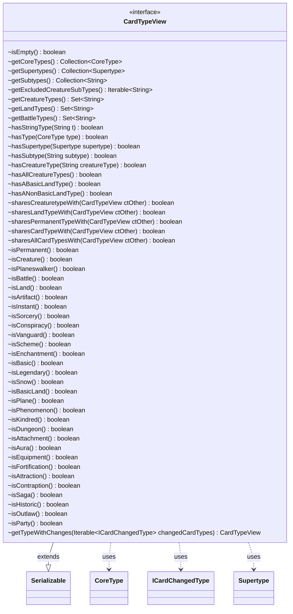

---
aliases:
  - CardTypeView
tags:
  - java/interface
  - module/forge-core
  - pkg/forge/card
fqn: forge.card.CardTypeView
package: forge.card
module: forge-core
kind: Interface
---

# CardTypeView

**Package:** `forge.card`   **Module:** `forge-core`   **Kind:** Interface



## Relationships
**Uses:**
- [[forge.card.CardType.CoreType|CoreType]]
- [[forge.card.CardType.Supertype|Supertype]]
- [[forge.card.ICardChangedType|ICardChangedType]]


## Design Description

CardTypeView is a read-only contract that exposes a Magic card's type information—core types, supertypes, and the subtype categories (creature, land, battle)—without permitting mutation. As its source comment states, it "exposes only the desired functions of CardType without allowing modification," acting as an immutable view facet over the concrete CardType while leaving all modification to that implementation.

Its surface is dominated by predicate methods: membership checks (`hasType`, `hasSubtype`, `hasCreatureType`), convenience `is*` tests for every game-relevant category, and relational `shares*With` comparisons that take another CardTypeView to detect overlapping types. By extending `Serializable`, it supports persistence and network transfer, fitting Forge's client/server model. The `getTypeWithChanges` method folds a sequence of `ICardChangedType` modifications into a *new* view rather than mutating the original, reflecting a functional, immutable design in which continuous-effect type alterations produce derived views—collaborating with the `CoreType` and `Supertype` enums throughout.

## Source
`forge-core/src/main/java/forge/card/CardTypeView.java`

```java
package forge.card;

import forge.card.CardType.CoreType;
import forge.card.CardType.Supertype;

import java.io.Serializable;
import java.util.Collection;
import java.util.Set;

//Interface to expose only the desired functions of CardType without allowing modification
public interface CardTypeView extends Serializable {
    boolean isEmpty();
    Collection<CoreType> getCoreTypes();
    Collection<Supertype> getSupertypes();
    Collection<String> getSubtypes();
    Iterable<String> getExcludedCreatureSubTypes();

    Set<String> getCreatureTypes();
    Set<String> getLandTypes();
    Set<String> getBattleTypes();

    boolean hasStringType(String t);
    boolean hasType(CoreType type);
    boolean hasSupertype(Supertype supertype);
    boolean hasSubtype(String subtype);
    boolean hasCreatureType(String creatureType);
    boolean hasAllCreatureTypes();
    boolean hasABasicLandType();
    boolean hasANonBasicLandType();

    boolean sharesCreaturetypeWith(final CardTypeView ctOther);
    boolean sharesLandTypeWith(final CardTypeView ctOther);
    boolean sharesPermanentTypeWith(final CardTypeView ctOther);
    boolean sharesCardTypeWith(final CardTypeView ctOther);
    boolean sharesAllCardTypesWith(final CardTypeView ctOther);

    boolean isPermanent();
    boolean isCreature();
    boolean isPlaneswalker();
    boolean isBattle();
    boolean isLand();
    boolean isArtifact();
    boolean isInstant();
    boolean isSorcery();
    boolean isConspiracy();
    boolean isVanguard();
    boolean isScheme();
    boolean isEnchantment();
    boolean isBasic();
    boolean isLegendary();
    boolean isSnow();
    boolean isBasicLand();
    boolean isPlane();
    boolean isPhenomenon();
    boolean isKindred();
    boolean isDungeon();

    boolean isAttachment();
    boolean isAura();
    boolean isEquipment();
    boolean isFortification();
    boolean isAttraction();
    boolean isContraption();

    boolean isSaga();
    boolean isHistoric();
    boolean isOutlaw();
    boolean isParty();

    CardTypeView getTypeWithChanges(Iterable<ICardChangedType> changedCardTypes);
}
```

## Python
`forge/card/CardTypeView.py`

```python
from forge.card.CardType.CoreType import CoreType
from forge.card.CardType.Supertype import Supertype
from forge.card.ICardChangedType import ICardChangedType

from abc import ABC, abstractmethod
from typing import Collection, Iterable, Set


# Interface to expose only the desired functions of CardType without allowing modification
class CardTypeView(ABC):
    @abstractmethod
    def isEmpty(self) -> bool: ...

    @abstractmethod
    def getCoreTypes(self) -> Collection[CoreType]: ...

    @abstractmethod
    def getSupertypes(self) -> Collection[Supertype]: ...

    @abstractmethod
    def getSubtypes(self) -> Collection[str]: ...

    @abstractmethod
    def getExcludedCreatureSubTypes(self) -> Iterable[str]: ...

    @abstractmethod
    def getCreatureTypes(self) -> Set[str]: ...

    @abstractmethod
    def getLandTypes(self) -> Set[str]: ...

    @abstractmethod
    def getBattleTypes(self) -> Set[str]: ...

    @abstractmethod
    def hasStringType(self, t: str) -> bool: ...

    @abstractmethod
    def hasType(self, type: CoreType) -> bool: ...

    @abstractmethod
    def hasSupertype(self, supertype: Supertype) -> bool: ...

    @abstractmethod
    def hasSubtype(self, subtype: str) -> bool: ...

    @abstractmethod
    def hasCreatureType(self, creatureType: str) -> bool: ...

    @abstractmethod
    def hasAllCreatureTypes(self) -> bool: ...

    @abstractmethod
    def hasABasicLandType(self) -> bool: ...

    @abstractmethod
    def hasANonBasicLandType(self) -> bool: ...

    @abstractmethod
    def sharesCreaturetypeWith(self, ctOther: "CardTypeView") -> bool: ...

    @abstractmethod
    def sharesLandTypeWith(self, ctOther: "CardTypeView") -> bool: ...

    @abstractmethod
    def sharesPermanentTypeWith(self, ctOther: "CardTypeView") -> bool: ...

    @abstractmethod
    def sharesCardTypeWith(self, ctOther: "CardTypeView") -> bool: ...

    @abstractmethod
    def sharesAllCardTypesWith(self, ctOther: "CardTypeView") -> bool: ...

    @abstractmethod
    def isPermanent(self) -> bool: ...

    @abstractmethod
    def isCreature(self) -> bool: ...

    @abstractmethod
    def isPlaneswalker(self) -> bool: ...

    @abstractmethod
    def isBattle(self) -> bool: ...

    @abstractmethod
    def isLand(self) -> bool: ...

    @abstractmethod
    def isArtifact(self) -> bool: ...

    @abstractmethod
    def isInstant(self) -> bool: ...

    @abstractmethod
    def isSorcery(self) -> bool: ...

    @abstractmethod
    def isConspiracy(self) -> bool: ...

    @abstractmethod
    def isVanguard(self) -> bool: ...

    @abstractmethod
    def isScheme(self) -> bool: ...

    @abstractmethod
    def isEnchantment(self) -> bool: ...

    @abstractmethod
    def isBasic(self) -> bool: ...

    @abstractmethod
    def isLegendary(self) -> bool: ...

    @abstractmethod
    def isSnow(self) -> bool: ...

    @abstractmethod
    def isBasicLand(self) -> bool: ...

    @abstractmethod
    def isPlane(self) -> bool: ...

    @abstractmethod
    def isPhenomenon(self) -> bool: ...

    @abstractmethod
    def isKindred(self) -> bool: ...

    @abstractmethod
    def isDungeon(self) -> bool: ...

    @abstractmethod
    def isAttachment(self) -> bool: ...

    @abstractmethod
    def isAura(self) -> bool: ...

    @abstractmethod
    def isEquipment(self) -> bool: ...

    @abstractmethod
    def isFortification(self) -> bool: ...

    @abstractmethod
    def isAttraction(self) -> bool: ...

    @abstractmethod
    def isContraption(self) -> bool: ...

    @abstractmethod
    def isSaga(self) -> bool: ...

    @abstractmethod
    def isHistoric(self) -> bool: ...

    @abstractmethod
    def isOutlaw(self) -> bool: ...

    @abstractmethod
    def isParty(self) -> bool: ...

    @abstractmethod
    def getTypeWithChanges(self, changedCardTypes: Iterable[ICardChangedType]) -> "CardTypeView": ...
```
