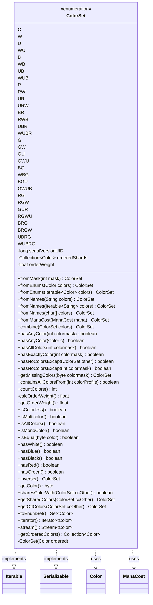

---
aliases:
  - ColorSet
tags:
  - java/enum
  - module/forge-core
  - pkg/forge/card
fqn: forge.card.ColorSet
package: forge.card
module: forge-core
kind: Enum
---

# ColorSet

**Package:** `forge.card` &nbsp; **Module:** `forge-core` &nbsp; **Kind:** Enum



## Relationships
**Uses:**
- [[forge.card.MagicColor.Color|Color]]
- [[forge.card.mana.ManaCost|ManaCost]]


## Design Description

ColorSet is an immutable enum that enumerates all 32 possible combinations of Magic's five colors plus colorless, each constant carrying an ordered `Color` collection whose set bits equal its ordinal. It is the canonical lightweight value type for color identity in forge-core, encoding membership in the ordinal itself so queries like `hasAnyColor`, `hasAllColors`, `sharesColorWith`, `getSharedColors`, and `inverse` reduce to fast bitwise operations. Static factories (`fromMask`, `fromEnums`, `fromNames`, `fromManaCost`, `combine`) normalize diverse inputs into the shared constants.

It implements `Iterable<Color>` and offers `stream()`, `toEnumSet()`, and `getOrderedColors()` to expose its colors in canonical WUBRG order, while a precomputed `orderWeight` float supports consistent card sorting. `Serializable` with a fixed `serialVersionUID` reflects use in persisted game state, and the documented immutability contract makes the shared instances safely reusable engine-wide.

## Source
`forge-core/src/main/java/forge/card/ColorSet.java`

```java
/*
 * Forge: Play Magic: the Gathering.
 * Copyright (C) 2011  Forge Team
 *
 * This program is free software: you can redistribute it and/or modify
 * it under the terms of the GNU General Public License as published by
 * the Free Software Foundation, either version 3 of the License, or
 * (at your option) any later version.
 *
 * This program is distributed in the hope that it will be useful,
 * but WITHOUT ANY WARRANTY; without even the implied warranty of
 * MERCHANTABILITY or FITNESS FOR A PARTICULAR PURPOSE.  See the
 * GNU General Public License for more details.
 *
 * You should have received a copy of the GNU General Public License
 * along with this program.  If not, see <http://www.gnu.org/licenses/>.
 */
package forge.card;

import forge.card.MagicColor.Color;
import forge.card.mana.ManaCost;
import forge.util.BinaryUtil;

import java.io.Serializable;
import java.util.*;
import java.util.stream.Stream;

/**
 * <p>CardColor class.</p>
 * <p>Represents a set of any number of colors out of 5 possible in the game</p>
 * <p><i>This class is immutable, do not generate any setters here</i></p>
 *
 * @author Max mtg
 * @version $Id: CardColor.java 9708 2011-08-09 19:34:12Z jendave $
 *
 *
 */
public enum ColorSet implements Iterable<Color>, Serializable {

    C(Color.COLORLESS),
    W(Color.WHITE),
    U(Color.BLUE),
    WU(Color.WHITE, Color.BLUE),
    B(Color.BLACK),
    WB(Color.WHITE, Color.BLACK),
    UB(Color.BLUE, Color.BLACK),
    WUB(Color.WHITE, Color.BLUE, Color.BLACK),
    R(Color.RED),
    RW(Color.RED, Color.WHITE),
    UR(Color.BLUE, Color.RED),
    URW(Color.BLUE, Color.RED, Color.WHITE),
    BR(Color.BLACK, Color.RED),
    RWB(Color.RED, Color.WHITE, Color.BLACK),
    UBR(Color.BLUE, Color.BLACK, Color.RED),
    WUBR(Color.WHITE, Color.BLUE, Color.BLACK, Color.RED),
    G(Color.GREEN),
    GW(Color.GREEN, Color.WHITE),
    GU(Color.GREEN, Color.BLUE),
    GWU(Color.GREEN, Color.WHITE, Color.BLUE),
    BG(Color.BLACK, Color.GREEN),
    WBG(Color.WHITE, Color.BLACK, Color.GREEN),
    BGU(Color.BLACK, Color.GREEN, Color.BLUE),
    GWUB(Color.GREEN, Color.WHITE, Color.BLUE, Color.BLACK),
    RG(Color.RED, Color.GREEN),
    RGW(Color.RED, Color.GREEN, Color.WHITE),
    GUR(Color.GREEN, Color.BLUE, Color.RED),
    RGWU(Color.RED, Color.GREEN, Color.WHITE, Color.BLUE),
    BRG(Color.BLACK, Color.RED, Color.GREEN),
    BRGW(Color.BLACK, Color.RED, Color.GREEN, Color.WHITE),
    UBRG(Color.BLUE, Color.BLACK, Color.RED, Color.GREEN),
    WUBRG(Color.WHITE, Color.BLUE, Color.BLACK, Color.RED, Color.GREEN)
    ;

    private static final long serialVersionUID = 794691267379929080L;
    // needs to be before other static

    private final Collection<Color> orderedShards;
    private final float orderWeight;

    private ColorSet(final Color... ordered) {
        this.orderedShards = Arrays.asList(ordered);
        this.orderWeight = this.calcOrderWeight();
    }

    public static ColorSet fromMask(final int mask) {
        final int mask32 = mask & MagicColor.ALL_COLORS;
        return values()[mask32];
    }

    public static ColorSet fromEnums(final Color... colors) {
        byte mask = 0;
        for (Color e : colors) {
            mask |= e.getColorMask();
        }
        return fromMask(mask);
    }
    public static ColorSet fromEnums(final Iterable<Color> colors) {
        byte mask = 0;
        for (Color e : colors) {
            mask |= e.getColorMask();
        }
        return fromMask(mask);
    }

    public static ColorSet fromNames(final String... colors) {
        byte mask = 0;
        for (final String s : colors) {
            mask |= MagicColor.fromName(s);
        }
        return fromMask(mask);
    }

    public static ColorSet fromNames(final Iterable<String> colors) {
        byte mask = 0;
        for (final String s : colors) {
            mask |= MagicColor.fromName(s);
        }
        return fromMask(mask);
    }

    public static ColorSet fromNames(final char[] colors) {
        byte mask = 0;
        for (final char s : colors) {
            mask |= MagicColor.fromName(s);
        }
        return fromMask(mask);
    }

    public static ColorSet fromManaCost(final ManaCost mana) {
        return fromMask(mana.getColorProfile());
    }

    public static ColorSet combine(final ColorSet... colors) {
        byte mask = 0;
        for (ColorSet c : colors) {
            mask |= c.getColor();
        }
        return fromMask(mask);
    }

    /**
     * Checks for any color.
     *
     * @param colormask
     *            the colormask
     * @return true, if successful
     */
    public boolean hasAnyColor(final int colormask) {
        return (this.ordinal() & colormask) != 0;
    }
    public boolean hasAnyColor(final Color c) {
        return this.orderedShards.contains(c);
    }

    /**
     * Checks for all colors.
     *
     * @param colormask
     *            the colormask
     * @return true, if successful
     */
    public boolean hasAllColors(final int colormask) {
        return (this.ordinal() & colormask) == colormask;
    }

    /** this has exactly the colors defined by operand.  */
    public boolean hasExactlyColor(final int colormask) {
        return this.ordinal() == colormask;
    }

    /** this has no other colors except defined by operand.  */
    public boolean hasNoColorsExcept(final ColorSet other) {
        return hasNoColorsExcept(other.getColor());
    }

    /** this has no other colors except defined by operand.  */
    public boolean hasNoColorsExcept(final int colormask) {
        return (this.ordinal() & ~colormask) == 0;
    }

    /** This returns the colors that colormask contains that are not in color */
    public ColorSet getMissingColors(final byte colormask) {
        return fromMask(this.ordinal() & ~colormask);
    }

    /** Operand has no other colors except defined by this. */
    public boolean containsAllColorsFrom(final int colorProfile) {
        return (~this.ordinal() & colorProfile) == 0;
    }

    /**
     * Count colors.
     *
     * @return the int
     */
    public int countColors() {
        return BinaryUtil.bitCount(this.ordinal());
    } // bit count

    // order has to be: W U B R G multi colorless - same as cards numbering
    // through a set
    /**
     * Gets the order weight.
     *
     * @return the order weight
     */
    private float calcOrderWeight() {
        float res = this.countColors();
        if (hasWhite()) {
            res += 0.0005f;
        }
        if (hasBlue()) {
            res += 0.0020f;
        }
        if (hasBlack()) {
            res += 0.0080f;
        }
        if (hasRed()) {
            res += 0.0320f;
        }
        if (hasGreen()) {
            res += 0.1280f;
        }
        return res;
    }
    public float getOrderWeight()
    {
        return orderWeight;
    }

    /**
     * Checks if is colorless.
     *
     * @return true, if is colorless
     */
    public boolean isColorless() {
        return this == C;
    }

    /**
     * Checks if is multicolor.
     *
     * @return true, if is multicolor
     */
    public boolean isMulticolor() {
        return this.countColors() > 1;
    }

    /**
     * Checks if is all colors.
     *
     * @return true, if is all colors
     */
    public boolean isAllColors() {
        return this == WUBRG;
    }

    /**
     * Checks if is mono color.
     *
     * @return true, if is mono color
     */
    public boolean isMonoColor() {
        return this.countColors() == 1;
    }

    /**
     * Checks if is equal.
     *
     * @param color
     *            the color
     * @return true, if is equal
     */
    public boolean isEqual(final byte color) {
        return color == this.ordinal();
    }

    // Presets
    /**
     * Checks for white.
     *
     * @return true, if successful
     */
    public boolean hasWhite() {
        return this.hasAnyColor(MagicColor.WHITE);
    }

    /**
     * Checks for blue.
     *
     * @return true, if successful
     */
    public boolean hasBlue() {
        return this.hasAnyColor(MagicColor.BLUE);
    }

    /**
     * Checks for black.
     *
     * @return true, if successful
     */
    public boolean hasBlack() {
        return this.hasAnyColor(MagicColor.BLACK);
    }

    /**
     * Checks for red.
     *
     * @return true, if successful
     */
    public boolean hasRed() {
        return this.hasAnyColor(MagicColor.RED);
    }

    /**
     * Checks for green.
     *
     * @return true, if successful
     */
    public boolean hasGreen() {
        return this.hasAnyColor(MagicColor.GREEN);
    }

    public ColorSet inverse() {
        byte mask = (byte)this.ordinal();
        mask ^= MagicColor.ALL_COLORS;
        return fromMask(mask);
    }

    public byte getColor() {
        return (byte)ordinal();
    }

    /**
     * Shares color with.
     *
     * @param ccOther the cc other
     * @return true, if successful
     */
    public boolean sharesColorWith(final ColorSet ccOther) {
        return (this.ordinal() & ccOther.ordinal()) != 0;
    }

    public ColorSet getSharedColors(final ColorSet ccOther) {
        return fromMask(getColor() & ccOther.getColor());
    }

    public ColorSet getOffColors(final ColorSet ccOther) {
        return fromMask(~this.ordinal() & ccOther.ordinal());
    }

    public Set<Color> toEnumSet() {
        return EnumSet.copyOf(orderedShards);
    }

    //@Override
    public Iterator<Color> iterator() {
        return this.orderedShards.iterator();
    }

    public Stream<Color> stream() {
        return this.orderedShards.stream();
    }

    //Get array of mana cost shards for color set in the proper order
    public Collection<Color> getOrderedColors() {
        return orderedShards;
    }
}
```

## Python
`forge/card/ColorSet.py`

```python
from forge.card.MagicColor.Color import Color
from forge.card.mana.ManaCost import ManaCost
from forge.card.MagicColor import MagicColor
from forge.util.BinaryUtil import BinaryUtil

import enum
from typing import Iterator, List, Set


class ColorSet(enum.Enum):
    """
    Represents a set of any number of colors out of 5 possible in the game.
    This class is immutable, do not generate any setters here.
    Implements Iterable[Color] and is serializable.
    """

    C = (Color.COLORLESS,)
    W = (Color.WHITE,)
    U = (Color.BLUE,)
    WU = (Color.WHITE, Color.BLUE)
    B = (Color.BLACK,)
    WB = (Color.WHITE, Color.BLACK)
    UB = (Color.BLUE, Color.BLACK)
    WUB = (Color.WHITE, Color.BLUE, Color.BLACK)
    R = (Color.RED,)
    RW = (Color.RED, Color.WHITE)
    UR = (Color.BLUE, Color.RED)
    URW = (Color.BLUE, Color.RED, Color.WHITE)
    BR = (Color.BLACK, Color.RED)
    RWB = (Color.RED, Color.WHITE, Color.BLACK)
    UBR = (Color.BLUE, Color.BLACK, Color.RED)
    WUBR = (Color.WHITE, Color.BLUE, Color.BLACK, Color.RED)
    G = (Color.GREEN,)
    GW = (Color.GREEN, Color.WHITE)
    GU = (Color.GREEN, Color.BLUE)
    GWU = (Color.GREEN, Color.WHITE, Color.BLUE)
    BG = (Color.BLACK, Color.GREEN)
    WBG = (Color.WHITE, Color.BLACK, Color.GREEN)
    BGU = (Color.BLACK, Color.GREEN, Color.BLUE)
    GWUB = (Color.GREEN, Color.WHITE, Color.BLUE, Color.BLACK)
    RG = (Color.RED, Color.GREEN)
    RGW = (Color.RED, Color.GREEN, Color.WHITE)
    GUR = (Color.GREEN, Color.BLUE, Color.RED)
    RGWU = (Color.RED, Color.GREEN, Color.WHITE, Color.BLUE)
    BRG = (Color.BLACK, Color.RED, Color.GREEN)
    BRGW = (Color.BLACK, Color.RED, Color.GREEN, Color.WHITE)
    UBRG = (Color.BLUE, Color.BLACK, Color.RED, Color.GREEN)
    WUBRG = (Color.WHITE, Color.BLUE, Color.BLACK, Color.RED, Color.GREEN)

    def __init__(self, *ordered: Color):
        self.orderedShards: List[Color] = list(ordered)
        # The set bits of a constant's ordered colors equal its ordinal/bitmask.
        mask = 0
        for c in ordered:
            mask |= c.getColorMask()
        self._ordinal = mask
        self.orderWeight = self.calcOrderWeight()

    def ordinal(self) -> int:
        return self._ordinal

    @staticmethod
    def fromMask(mask: int) -> "ColorSet":
        mask32 = mask & MagicColor.ALL_COLORS
        return list(ColorSet)[mask32]

    @staticmethod
    def fromEnums(*colors) -> "ColorSet":
        if len(colors) == 1 and not isinstance(colors[0], Color):
            colors = colors[0]
        mask = 0
        for e in colors:
            mask |= e.getColorMask()
        return ColorSet.fromMask(mask)

    @staticmethod
    def fromNames(*colors) -> "ColorSet":
        if len(colors) == 1 and not isinstance(colors[0], str):
            colors = colors[0]
        mask = 0
        for s in colors:
            mask |= MagicColor.fromName(s)
        return ColorSet.fromMask(mask)

    @staticmethod
    def fromManaCost(mana: ManaCost) -> "ColorSet":
        return ColorSet.fromMask(mana.getColorProfile())

    @staticmethod
    def combine(*colors: "ColorSet") -> "ColorSet":
        mask = 0
        for c in colors:
            mask |= c.getColor()
        return ColorSet.fromMask(mask)

    def hasAnyColor(self, colormask) -> bool:
        if isinstance(colormask, Color):
            return colormask in self.orderedShards
        return (self.ordinal() & colormask) != 0

    def hasAllColors(self, colormask: int) -> bool:
        return (self.ordinal() & colormask) == colormask

    def hasExactlyColor(self, colormask: int) -> bool:
        return self.ordinal() == colormask

    def hasNoColorsExcept(self, other) -> bool:
        if isinstance(other, ColorSet):
            return self.hasNoColorsExcept(other.getColor())
        return (self.ordinal() & ~other) == 0

    def getMissingColors(self, colormask: int) -> "ColorSet":
        return ColorSet.fromMask(self.ordinal() & ~colormask)

    def containsAllColorsFrom(self, colorProfile: int) -> bool:
        return (~self.ordinal() & colorProfile) == 0

    def countColors(self) -> int:
        return BinaryUtil.bitCount(self.ordinal())

    # order has to be: W U B R G multi colorless - same as cards numbering
    # through a set
    def calcOrderWeight(self) -> float:
        res = float(self.countColors())
        if self.hasWhite():
            res += 0.0005
        if self.hasBlue():
            res += 0.0020
        if self.hasBlack():
            res += 0.0080
        if self.hasRed():
            res += 0.0320
        if self.hasGreen():
            res += 0.1280
        return res

    def getOrderWeight(self) -> float:
        return self.orderWeight

    def isColorless(self) -> bool:
        return self is ColorSet.C

    def isMulticolor(self) -> bool:
        return self.countColors() > 1

    def isAllColors(self) -> bool:
        return self is ColorSet.WUBRG

    def isMonoColor(self) -> bool:
        return self.countColors() == 1

    def isEqual(self, color: int) -> bool:
        return color == self.ordinal()

    # Presets
    def hasWhite(self) -> bool:
        return self.hasAnyColor(MagicColor.WHITE)

    def hasBlue(self) -> bool:
        return self.hasAnyColor(MagicColor.BLUE)

    def hasBlack(self) -> bool:
        return self.hasAnyColor(MagicColor.BLACK)

    def hasRed(self) -> bool:
        return self.hasAnyColor(MagicColor.RED)

    def hasGreen(self) -> bool:
        return self.hasAnyColor(MagicColor.GREEN)

    def inverse(self) -> "ColorSet":
        mask = self.ordinal()
        mask ^= MagicColor.ALL_COLORS
        return ColorSet.fromMask(mask)

    def getColor(self) -> int:
        return self.ordinal()

    def sharesColorWith(self, ccOther: "ColorSet") -> bool:
        return (self.ordinal() & ccOther.ordinal()) != 0

    def getSharedColors(self, ccOther: "ColorSet") -> "ColorSet":
        return ColorSet.fromMask(self.getColor() & ccOther.getColor())

    def getOffColors(self, ccOther: "ColorSet") -> "ColorSet":
        return ColorSet.fromMask(~self.ordinal() & ccOther.ordinal())

    def toEnumSet(self) -> Set[Color]:
        return set(self.orderedShards)

    def iterator(self) -> Iterator[Color]:
        return iter(self.orderedShards)

    def __iter__(self) -> Iterator[Color]:
        return self.iterator()

    def stream(self) -> Iterator[Color]:
        return iter(self.orderedShards)

    # Get array of mana cost shards for color set in the proper order
    def getOrderedColors(self) -> List[Color]:
        return self.orderedShards


# needs to be before other static (set outside the enum body so it is not
# interpreted as an enum member)
ColorSet.serialVersionUID = 794691267379929080
```
