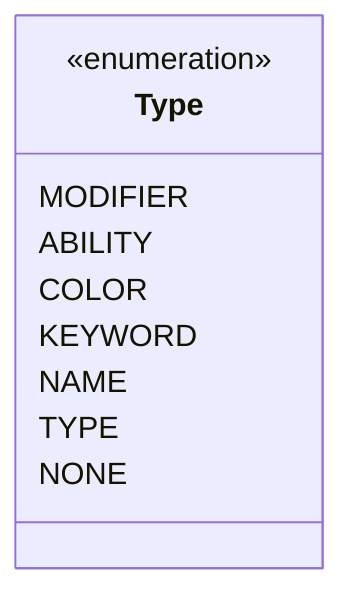

---
aliases:
  - Type
tags:
  - java/enum
  - module/forge-core
  - pkg/forge/card
fqn: forge.card.DeckHints.Type
package: forge.card
module: forge-core
kind: Enum
---

# Type

**Package:** `forge.card`   **Module:** `forge-core`   **Kind:** Enum



## Design Description

Determines how a `DeckHints` entry is matched against a card during deck-building logic. As a nested enumeration of `DeckHints`, each constant names a distinct dimension along which a hint can key off another card — `MODIFIER` for extra custom logic, `ABILITY`, `COLOR`, `KEYWORD`, `NAME`, and `TYPE` for the corresponding card attributes, and `NONE` as the inert default for cards with no hints. By enumerating these categories as a closed type rather than relying on raw strings, the design lets `DeckHints` dispatch matching behavior per category and guarantees only valid hint kinds are ever represented, keeping the parsing and evaluation in the enclosing class type-safe.

## Source
`forge-core/src/main/java/forge/card/DeckHints.java` — declaration excerpt

```java
    /**
     * Enum of types of DeckHints.
     */
    public enum Type {
        /** extra logic */
        MODIFIER,
        /** The Ability */
        ABILITY,
        /** The Color. */
        COLOR,
        /** The Keyword. */
        KEYWORD,
        /** The Name. */
        NAME,
        /** The Type. */
        TYPE,
        /** The None. */
        NONE
    }
```
