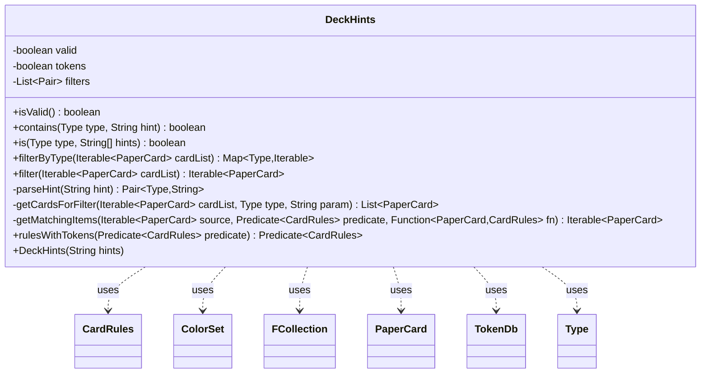

---
aliases:
  - DeckHints
tags:
  - java/class
  - module/forge-core
  - pkg/forge/card
fqn: forge.card.DeckHints
package: forge.card
module: forge-core
kind: Class
---

# DeckHints

**Package:** `forge.card`   **Module:** `forge-core`   **Kind:** Class



## Relationships
**Uses:**
- [[forge.card.CardRules|CardRules]]
- [[forge.card.ColorSet|ColorSet]]
- [[forge.card.DeckHints.Type|Type]]
- [[forge.item.PaperCard|PaperCard]]
- [[forge.token.TokenDb|TokenDb]]
- [[forge.util.collect.FCollection|FCollection]]


## Design Description

`DeckHints` encapsulates a card's expressed preference for which other cards should accompany it in a randomly generated deck. It parses a Forge `SVar` hint string—`Type$value` clauses joined by `&`—into a list of typed filter pairs, recording a `MODIFIER` such as `NoToken` separately and flagging itself valid once at least one real filter is captured.

As a self-contained value object with no supertype, its core responsibility is to take a candidate pool of `PaperCard`s and return those matching its filters, either grouped by `Type` via `filterByType` (intersecting repeats of the same type through `FCollection`) or flattened through `filter`, alongside lightweight predicate queries (`isValid`, `contains`, `is`). It delegates per-category matching logic to `CardRulesPredicates`—resolving colors through `ColorSet` and special-casing creature types with `Changeling`. A notable design intent is token awareness: unless disabled, `rulesWithTokens` recursively consults `TokenDb` so a card that merely generates a wanted token also qualifies.

## Source
`forge-core/src/main/java/forge/card/DeckHints.java`

```java
package forge.card;

import com.google.common.collect.Iterables;
import forge.StaticData;
import forge.item.PaperCard;
import forge.token.TokenDb;
import forge.util.IterableUtil;
import forge.util.PredicateString.StringOp;
import forge.util.collect.FCollection;
import org.apache.commons.lang3.tuple.Pair;

import java.util.ArrayList;
import java.util.HashMap;
import java.util.List;
import java.util.Map;
import java.util.function.Function;
import java.util.function.Predicate;

/**
 * DeckHints provides the ability for a Card to "want" another Card or type of
 * Cards in its random deck.
 * 
 */
public class DeckHints {

    /**
     * Enum of types of DeckHints.
     */
    public enum Type {
        /** extra logic */
        MODIFIER,
        /** The Ability */
        ABILITY,
        /** The Color. */
        COLOR,
        /** The Keyword. */
        KEYWORD,
        /** The Name. */
        NAME,
        /** The Type. */
        TYPE,
        /** The None. */
        NONE
    }

    private boolean valid = false;
    private boolean tokens = true;
    private List<Pair<Type, String>> filters = null;

    /**
     * Construct a DeckHints from the SVar string.
     * 
     * @param hints
     *            SVar for DeckHints
     */
    public DeckHints(String hints) {
        String[] pieces = hints.split("\\&");
        if (pieces.length > 0) {
            for (String piece : pieces) {
                Pair<Type, String> pair = parseHint(piece.trim());
                if (pair != null) {
                    if (pair.getKey() == Type.MODIFIER) {
                        if (pair.getRight().contains("NoToken")) {
                            tokens = false;
                        }
                        continue;
                    }
                    if (filters == null) {
                        filters = new ArrayList<>();
                    }
                    filters.add(pair);
                    valid = true;
                }
            }
        }
    }

    public boolean isValid() {
        return valid;
    }

    public boolean contains(Type type, String hint) {
        if (filters == null) {
            return false;
        }
        for (Pair<Type, String> filter : filters) {
            if (filter.getLeft() == type && filter.getRight().contains(hint)) {
                return true;
            }
        }
        return false;
    }
    public boolean is(Type type, String hints[]) {
        if (filters == null) {
            return false;
        }
        int num = 0;
        for (String hint : hints) {
            for (Pair<Type, String> filter : filters) {
                if (filter.getLeft() == type && filter.getRight().equals(hint)) {
                    num++;
                    if (num == hints.length) {
                        return true;
                    }
                }
            }
        }
        return false;
    }

    /**
     * Returns a Map of Cards by Type from the given Iterable<PaperCard> that match this
     * DeckHints. I.e., other cards that this Card needs in its deck.
     *
     * @param cardList
     *            list of cards to be filtered
     * @return Map of Cards that match this DeckHints by Type.
     */
    public Map<Type, Iterable<PaperCard>> filterByType(Iterable<PaperCard> cardList) {
        Map<Type, Iterable<PaperCard>> ret = new HashMap<>();
        for (Pair<Type, String> pair : filters) {
            Type type = pair.getLeft();
            String param = pair.getRight();
            List<PaperCard> cards = getCardsForFilter(cardList, type, param);
            // if a type is used more than once intersect respective matches
            if (ret.containsKey(type)) {
                cards.retainAll(new FCollection<>(ret.get(type)));
            }
            ret.put(type, cards);
        }
        return ret;
    }

    /**
     * Returns a list of Cards from the given List<PaperCard> that match this
     * DeckHints. I.e., other cards that this Card needs in its deck.
     *
     * @param cardList
     *            list of cards to be filtered
     * @return List<PaperCard> of Cards that match this DeckHints.
     */
    public Iterable<PaperCard> filter(Iterable<PaperCard> cardList) {
        return Iterables.concat(filterByType(cardList).values());
    }

    private Pair<Type, String> parseHint(String hint) {
        Pair<Type, String> pair = null;
        String[] pieces = hint.split("\\$");
        if (pieces.length == 2) {
            try {
                Type typeValue = Type.valueOf(pieces[0].toUpperCase());
                for (Type t : Type.values()) {
                    if (typeValue == t) {
                        pair = Pair.of(t, pieces[1]);
                        break;
                    }
                }
            } catch (IllegalArgumentException e) {
                // will remain null
            }
        }
        return pair;
    }

    private List<PaperCard> getCardsForFilter(Iterable<PaperCard> cardList, Type type, String param) {
        List<PaperCard> cards = new ArrayList<>();

        // this is case ABILITY, but other types can also use this when the implicit parsing would miss
        String[] params = param.split("\\|");
        for (String ability : params) {
            getMatchingItems(cardList, CardRulesPredicates.deckHas(type, ability), PaperCard::getRules).forEach(cards::add);
        }
        // bonus if a DeckHas can satisfy the type with multiple ones
        if (params.length > 1) {
            getMatchingItems(cardList, CardRulesPredicates.deckHasExactly(type, params), PaperCard::getRules).forEach(cards::add);
        }

        for (String p : params) {
            switch (type) {
            case COLOR:
                ColorSet cc = ColorSet.fromNames(p);
                if (cc.isColorless()) {
                    // ignoring Devoid here since having the colored mana symbol might be enough
                    getMatchingItems(cardList, CardRulesPredicates.IS_COLORLESS, PaperCard::getRules).forEach(cards::add);
                } else {
                    getMatchingItems(cardList, CardRulesPredicates.isColor(cc.getColor()), PaperCard::getRules).forEach(cards::add);
                }
                break;
            case KEYWORD:
                getMatchingItems(cardList, CardRulesPredicates.hasKeyword(p), PaperCard::getRules).forEach(cards::add);
                break;
            case NAME:
                getMatchingItems(cardList, CardRulesPredicates.name(StringOp.EQUALS, p), PaperCard::getRules).forEach(cards::add);
                break;
            case TYPE:
                Predicate<CardRules> typePred = CardRulesPredicates.joinedType(StringOp.CONTAINS_IC, p);
                if (CardType.isACreatureType(p)) {
                    typePred = typePred.or(CardRulesPredicates.hasKeyword("Changeling"));
                }
                getMatchingItems(cardList, typePred, PaperCard::getRules).forEach(cards::add);
                break;
            case NONE:
            case ABILITY: // already done above
                break;
            }
        }
        return cards;
    }

    private Iterable<PaperCard> getMatchingItems(Iterable<PaperCard> source, Predicate<CardRules> predicate, Function<PaperCard, CardRules> fn) {
        // TODO should token generators be counted differently for their potential?
        // And would there ever be a circumstance where `fn` should be anything but PaperCard::getRules?
        Predicate<CardRules> predicate1 = tokens ? rulesWithTokens(predicate) : predicate;
        return IterableUtil.filter(source, x -> predicate1.test(fn.apply(x)));
    }

    public static Predicate<CardRules> rulesWithTokens(final Predicate<CardRules> predicate) {
        final TokenDb tdb;
        if (StaticData.instance() != null) {
            // not available on some test setups
            tdb = StaticData.instance().getAllTokens();
        } else {
            tdb = null;
        }
        return card -> {
            if (predicate.test(card)) {
                return true;
            }
            for (String tok : card.getTokens()) {
                // unfortunately this doesn't include keyworded ones yet
                if (tdb != null && tdb.containsRule(tok) && rulesWithTokens(predicate).test(tdb.getToken(tok).getRules())) {
                    return true;
                }
            }
            return false;
        };
    }

}
```

## Python
`forge/card/DeckHints.py`

```python
from enum import Enum
from typing import Callable, Iterable, List

from itertools import chain

from forge.StaticData import StaticData
from forge.card.CardRules import CardRules
from forge.card.CardRulesPredicates import CardRulesPredicates
from forge.card.CardType import CardType
from forge.card.ColorSet import ColorSet
from forge.item.PaperCard import PaperCard
from forge.token.TokenDb import TokenDb
from forge.util.IterableUtil import IterableUtil
from forge.util.PredicateString import StringOp
from forge.util.collect.FCollection import FCollection
from org.apache.commons.lang3.tuple.Pair import Pair


class DeckHints:
    """
    DeckHints provides the ability for a Card to "want" another Card or type of
    Cards in its random deck.
    """

    class Type(Enum):
        """
        Enum of types of DeckHints.
        """
        # extra logic
        MODIFIER = "MODIFIER"
        # The Ability
        ABILITY = "ABILITY"
        # The Color.
        COLOR = "COLOR"
        # The Keyword.
        KEYWORD = "KEYWORD"
        # The Name.
        NAME = "NAME"
        # The Type.
        TYPE = "TYPE"
        # The None.
        NONE = "NONE"

    def __init__(self, hints: str):
        """
        Construct a DeckHints from the SVar string.

        @param hints
            SVar for DeckHints
        """
        self.valid = False
        self.tokens = True
        self.filters = None
        pieces = hints.split("&")
        if len(pieces) > 0:
            for piece in pieces:
                pair = self.parseHint(piece.strip())
                if pair is not None:
                    if pair.getKey() == DeckHints.Type.MODIFIER:
                        if "NoToken" in pair.getRight():
                            self.tokens = False
                        continue
                    if self.filters is None:
                        self.filters = []
                    self.filters.append(pair)
                    self.valid = True

    def isValid(self) -> bool:
        return self.valid

    def contains(self, type: "DeckHints.Type", hint: str) -> bool:
        if self.filters is None:
            return False
        for filter in self.filters:
            if filter.getLeft() == type and hint in filter.getRight():
                return True
        return False

    def is_(self, type: "DeckHints.Type", hints: List[str]) -> bool:
        if self.filters is None:
            return False
        num = 0
        for hint in hints:
            for filter in self.filters:
                if filter.getLeft() == type and filter.getRight() == hint:
                    num += 1
                    if num == len(hints):
                        return True
        return False

    def filterByType(self, cardList: Iterable[PaperCard]) -> "dict[DeckHints.Type, Iterable[PaperCard]]":
        """
        Returns a Map of Cards by Type from the given Iterable<PaperCard> that match this
        DeckHints. I.e., other cards that this Card needs in its deck.

        @param cardList
            list of cards to be filtered
        @return Map of Cards that match this DeckHints by Type.
        """
        ret: "dict[DeckHints.Type, Iterable[PaperCard]]" = {}
        for pair in self.filters:
            type = pair.getLeft()
            param = pair.getRight()
            cards = self.getCardsForFilter(cardList, type, param)
            # if a type is used more than once intersect respective matches
            if type in ret:
                cards.retainAll(FCollection(ret[type]))
            ret[type] = cards
        return ret

    def filter(self, cardList: Iterable[PaperCard]) -> Iterable[PaperCard]:
        """
        Returns a list of Cards from the given List<PaperCard> that match this
        DeckHints. I.e., other cards that this Card needs in its deck.

        @param cardList
            list of cards to be filtered
        @return List<PaperCard> of Cards that match this DeckHints.
        """
        return chain(*self.filterByType(cardList).values())

    def parseHint(self, hint: str) -> "Pair[DeckHints.Type, str]":
        pair = None
        pieces = hint.split("$")
        if len(pieces) == 2:
            try:
                typeValue = DeckHints.Type[pieces[0].upper()]
                for t in DeckHints.Type:
                    if typeValue == t:
                        pair = Pair.of(t, pieces[1])
                        break
            except KeyError:
                # will remain null
                pass
        return pair

    def getCardsForFilter(self, cardList: Iterable[PaperCard], type: "DeckHints.Type", param: str) -> List[PaperCard]:
        cards: List[PaperCard] = []

        # this is case ABILITY, but other types can also use this when the implicit parsing would miss
        params = param.split("|")
        for ability in params:
            for x in self.getMatchingItems(cardList, CardRulesPredicates.deckHas(type, ability), PaperCard.getRules):
                cards.append(x)
        # bonus if a DeckHas can satisfy the type with multiple ones
        if len(params) > 1:
            for x in self.getMatchingItems(cardList, CardRulesPredicates.deckHasExactly(type, params), PaperCard.getRules):
                cards.append(x)

        for p in params:
            if type == DeckHints.Type.COLOR:
                cc = ColorSet.fromNames(p)
                if cc.isColorless():
                    # ignoring Devoid here since having the colored mana symbol might be enough
                    for x in self.getMatchingItems(cardList, CardRulesPredicates.IS_COLORLESS, PaperCard.getRules):
                        cards.append(x)
                else:
                    for x in self.getMatchingItems(cardList, CardRulesPredicates.isColor(cc.getColor()), PaperCard.getRules):
                        cards.append(x)
            elif type == DeckHints.Type.KEYWORD:
                for x in self.getMatchingItems(cardList, CardRulesPredicates.hasKeyword(p), PaperCard.getRules):
                    cards.append(x)
            elif type == DeckHints.Type.NAME:
                for x in self.getMatchingItems(cardList, CardRulesPredicates.name(StringOp.EQUALS, p), PaperCard.getRules):
                    cards.append(x)
            elif type == DeckHints.Type.TYPE:
                typePred = CardRulesPredicates.joinedType(StringOp.CONTAINS_IC, p)
                if CardType.isACreatureType(p):
                    typePred = typePred.or_(CardRulesPredicates.hasKeyword("Changeling"))
                for x in self.getMatchingItems(cardList, typePred, PaperCard.getRules):
                    cards.append(x)
            elif type == DeckHints.Type.NONE or type == DeckHints.Type.ABILITY:
                # already done above
                pass
        return cards

    def getMatchingItems(self, source: Iterable[PaperCard], predicate: Callable[[CardRules], bool], fn: Callable[[PaperCard], CardRules]) -> Iterable[PaperCard]:
        # TODO should token generators be counted differently for their potential?
        # And would there ever be a circumstance where `fn` should be anything but PaperCard::getRules?
        predicate1 = self.rulesWithTokens(predicate) if self.tokens else predicate
        return IterableUtil.filter(source, lambda x: predicate1.test(fn(x)))

    @staticmethod
    def rulesWithTokens(predicate: Callable[[CardRules], bool]) -> Callable[[CardRules], bool]:
        if StaticData.instance() is not None:
            # not available on some test setups
            tdb = StaticData.instance().getAllTokens()
        else:
            tdb = None

        def _test(card):
            if predicate.test(card):
                return True
            for tok in card.getTokens():
                # unfortunately this doesn't include keyworded ones yet
                if tdb is not None and tdb.containsRule(tok) and DeckHints.rulesWithTokens(predicate).test(tdb.getToken(tok).getRules()):
                    return True
            return False

        return _test
```
