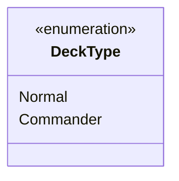

---
aliases:
  - DeckType
tags:
  - java/enum
  - module/forge-core
  - pkg/forge/card
fqn: forge.card.DraftOptions.DeckType
package: forge.card
module: forge-core
kind: Enum
---

# DeckType

**Package:** `forge.card`   **Module:** `forge-core`   **Kind:** Enum



## Design Description

DeckType is a small nested enumeration within `DraftOptions` (in the `forge.card` package of `forge-core`) that enumerates the supported deck construction modes: `Normal` for standard decks and `Commander` for the Commander format. As a Java enum it provides a closed, type-safe set of constants, replacing magic strings or integers when callers need to distinguish deck-building rules during deck selection and construction.

Its design intent is deliberately minimal: it carries no fields or behavior, serving purely as a discriminator that collaborates with the enclosing `DraftOptions` and downstream deck-selection and construction logic. Nesting it inside `DraftOptions` scopes the concept to where draft/deck configuration is defined, and the inline comments signal that `Commander` triggers special handling, leaving room to extend the set as additional formats are supported.

## Source
`forge-core/src/main/java/forge/card/DraftOptions.java` — declaration excerpt

```java
    public enum DeckType {
        Normal, // Standard deck, usually 40 cards
        Commander // Special deck type for Commander format. Important for selection/construction
    }
```
