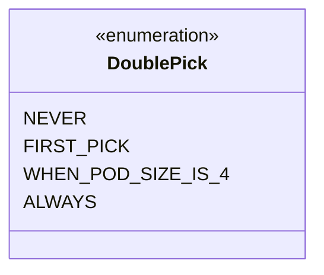

---
aliases:
  - DoublePick
tags:
  - java/enum
  - module/forge-core
  - pkg/forge/card
fqn: forge.card.DraftOptions.DoublePick
package: forge.card
module: forge-core
kind: Enum
---

# DoublePick

**Package:** `forge.card`   **Module:** `forge-core`   **Kind:** Enum



## Design Description

A SDD-style enumeration that captures a draft player's double-pick policy as a nested type within `DraftOptions`, modeling the four mutually exclusive rules governing when a drafter may take two cards from a pack: `NEVER`, only on the `FIRST_PICK` of each pack, only `WHEN_POD_SIZE_IS_4`, or `ALWAYS`. As an enum it constrains configuration to this fixed, well-defined set rather than relying on magic numbers or booleans, and its placement inside `DraftOptions` scopes it to the draft-configuration domain it collaborates with. The trailing comments encode the gameplay intent behind each constant, documenting the conditions under which the two-card pick applies.

## Source
`forge-core/src/main/java/forge/card/DraftOptions.java` — declaration excerpt

```java
    public enum DoublePick {
        NEVER,
        FIRST_PICK, // only first pick each pack
        WHEN_POD_SIZE_IS_4, // only when pod size is 4, so you can pick two cards each time
        ALWAYS // each time you receive a pack, you can pick two cards
    };
```
