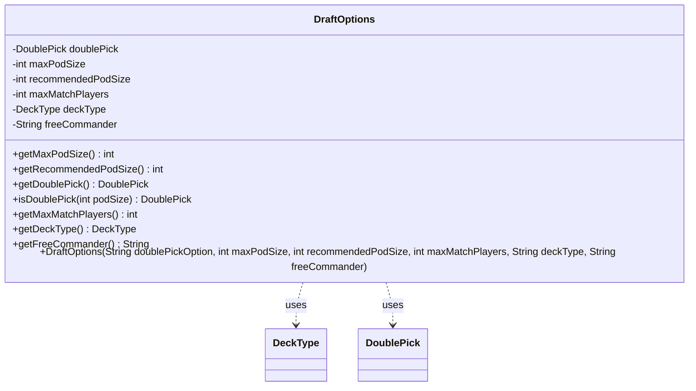

---
aliases:
  - DraftOptions
tags:
  - java/class
  - module/forge-core
  - pkg/forge/card
fqn: forge.card.DraftOptions
package: forge.card
module: forge-core
kind: Class
---

# DraftOptions

**Package:** `forge.card` &nbsp; **Module:** `forge-core` &nbsp; **Kind:** Class



## Relationships
**Uses:**
- [[forge.card.DraftOptions.DeckType|DeckType]]
- [[forge.card.DraftOptions.DoublePick|DoublePick]]


## Design Description

Here is the description:

DraftOptions is an immutable configuration object in the `forge-core` card package that bundles the rules governing a draft session: maximum and recommended pod sizes, the maximum players per match, the deck format to build, and an optional fixed commander. Nearly all state is `final`, set once in the constructor, which translates two string parameters into the package-local `DeckType` and `DoublePick` enums it collaborates with—shielding callers such as configuration loaders from the enum constants themselves.

Its central design intent is encoding draft "double pick" policy, which lets players take two cards per pack. Rather than storing a static answer, `isDoublePick(int podSize)` resolves the conditional `WHEN_POD_SIZE_IS_4` rule at query time, returning `ALWAYS` or `NEVER` against the actual pod size. Exposing only getters, the class presents itself as a read-only options bundle consumed by draft setup and matchmaking logic.

## Source
`forge-core/src/main/java/forge/card/DraftOptions.java`

```java
package forge.card;

public class DraftOptions {
    public enum DoublePick {
        NEVER,
        FIRST_PICK, // only first pick each pack
        WHEN_POD_SIZE_IS_4, // only when pod size is 4, so you can pick two cards each time
        ALWAYS // each time you receive a pack, you can pick two cards
    };
    public enum DeckType {
        Normal, // Standard deck, usually 40 cards
        Commander // Special deck type for Commander format. Important for selection/construction
    }

    private DoublePick doublePick = DoublePick.NEVER;
    private final int maxPodSize; // Usually 8, but could be smaller for cubes. I guess it could be larger too
    private final int recommendedPodSize; // Usually 8, but is 4 for new double pick
    private final int maxMatchPlayers; // Usually 2, but 4 for things like Commander or Conspiracy
    private final DeckType deckType; // Normal or Commander
    private final String freeCommander;

    public DraftOptions(String doublePickOption, int maxPodSize, int recommendedPodSize, int maxMatchPlayers, String deckType, String freeCommander) {
        this.maxPodSize = maxPodSize;
        this.recommendedPodSize = recommendedPodSize;
        this.maxMatchPlayers = maxMatchPlayers;
        this.deckType = DeckType.valueOf(deckType);
        this.freeCommander = freeCommander;
        if (doublePickOption != null) {
            switch (doublePickOption.toLowerCase()) {
                case "firstpick":
                    doublePick = DoublePick.FIRST_PICK;
                    break;
                case "always":
                    doublePick = DoublePick.ALWAYS;
                    break;
                case "whenpodsizeis4":
                    doublePick = DoublePick.WHEN_POD_SIZE_IS_4;
                    break;
            }
        }

    }
    public int getMaxPodSize() {
        return maxPodSize;
    }
    public int getRecommendedPodSize() {
        return recommendedPodSize;
    }
    public DoublePick getDoublePick() {
        return doublePick;
    }

    public DoublePick isDoublePick(int podSize) {
        if (doublePick == DoublePick.WHEN_POD_SIZE_IS_4) {
            if (podSize != 4) {
                return DoublePick.NEVER;
            }
            // only when pod size is 4, so you can pick two cards each time
            return DoublePick.ALWAYS;
        }

        return doublePick;
    }


    public int getMaxMatchPlayers() {
        return maxMatchPlayers;
    }
    public DeckType getDeckType() {
        return deckType;
    }
    public String getFreeCommander() {
        return freeCommander;
    }
}
```
