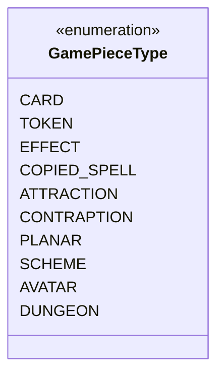

---
aliases:
  - GamePieceType
tags:
  - java/enum
  - module/forge-core
  - pkg/forge/card
fqn: forge.card.GamePieceType
package: forge.card
module: forge-core
kind: Enum
---

# GamePieceType

**Package:** `forge.card`   **Module:** `forge-core`   **Kind:** Enum




## Design Description

GamePieceType is a forge-core enumeration that classifies what physical kind of card represents a given game object, distinguishing traditional cards from tokens, effects, copied spells, and the various special pieces (attractions, contraptions, planes, schemes, avatars, and dungeons). Per its source documentation, the selected value governs which zones an object may legally occupy and which card back it displays, so it encodes core rules constraints rather than mere presentation.

As a self-contained enum in the `forge.card` package, it carries no behavior or fields—each constant is described purely by Javadoc—and serves as a lightweight, type-safe tag consumed by the card and game-object model to drive zone-legality and lifecycle decisions (for example, tokens ceasing to exist off the battlefield, or dungeons leaving the game when completed). Its design intent is to centralize these categorical distinctions in one stable, shared vocabulary across the engine.

## Source
`forge-core/src/main/java/forge/card/GamePieceType.java`

```java
package forge.card;

/**
 * Defines what kind of card physically represents a game object.
 * Influences what zones the object is allowed to exist in, and
 * what card back it should have.
 */
public enum GamePieceType {
    /**
     * A traditional card with traditional rules.
     */
    CARD,
    /**
     * A token that ceases to exist outside the battlefield.
     */
    TOKEN,
    /**
     * Intangible object that exists in the command zone.
     * Includes emblems and boons.
     */
    EFFECT,
    /**
     * A copy of a spell that exists only on the stack, and becomes
     * a token if it would enter the battlefield when it resolves.
     */
    COPIED_SPELL,
    /**
     * An attraction, which starts the game in the attraction deck
     * and goes to the junkyard when it leaves play.
     */
    ATTRACTION,
    /**
     * A contraption, which starts the game in the contraption deck
     * and goes to the scrapyard when it leaves play.
     */
    CONTRAPTION,
    /**
     * A planechase plane or phenomenon, which exists in the command zone
     * or in the planar deck (which is technically in the command zone).
     */
    PLANAR,
    /**
     * A scheme card, confined to either the command zone or the archenemy's
     * scheme deck.
     */
    SCHEME,
    /**
     * A Vanguard Avatar, which starts in the command zone and never leaves.
     */
    AVATAR,
    /**
     * A Dungeon, which is created in the command zone by effects,
     * and leaves the game when completed.
     */
    DUNGEON
}
```

## Python
`forge/card/GamePieceType.py`

```python
from enum import Enum, auto


class GamePieceType(Enum):
    """
    Defines what kind of card physically represents a game object.
    Influences what zones the object is allowed to exist in, and
    what card back it should have.
    """

    # A traditional card with traditional rules.
    CARD = auto()
    # A token that ceases to exist outside the battlefield.
    TOKEN = auto()
    # Intangible object that exists in the command zone.
    # Includes emblems and boons.
    EFFECT = auto()
    # A copy of a spell that exists only on the stack, and becomes
    # a token if it would enter the battlefield when it resolves.
    COPIED_SPELL = auto()
    # An attraction, which starts the game in the attraction deck
    # and goes to the junkyard when it leaves play.
    ATTRACTION = auto()
    # A contraption, which starts the game in the contraption deck
    # and goes to the scrapyard when it leaves play.
    CONTRAPTION = auto()
    # A planechase plane or phenomenon, which exists in the command zone
    # or in the planar deck (which is technically in the command zone).
    PLANAR = auto()
    # A scheme card, confined to either the command zone or the archenemy's
    # scheme deck.
    SCHEME = auto()
    # A Vanguard Avatar, which starts in the command zone and never leaves.
    AVATAR = auto()
    # A Dungeon, which is created in the command zone by effects,
    # and leaves the game when completed.
    DUNGEON = auto()
```
