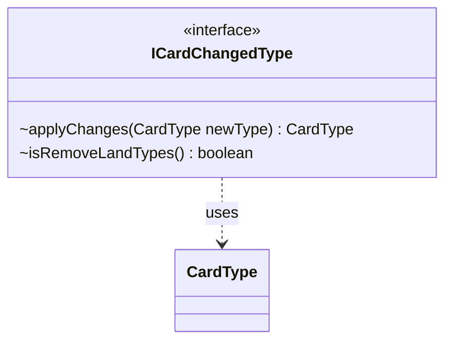

---
aliases:
  - ICardChangedType
tags:
  - java/interface
  - module/forge-core
  - pkg/forge/card
fqn: forge.card.ICardChangedType
package: forge.card
module: forge-core
kind: Interface
---

# ICardChangedType

**Package:** `forge.card` &nbsp; **Module:** `forge-core` &nbsp; **Kind:** Interface



## Relationships
**Uses:**
- [[forge.card.CardType|CardType]]


## Design Description

`ICardChangedType` is a minimal strategy interface in the `forge.card` package that captures a single, composable transformation of a card's type line. Implementers provide `applyChanges`, which receives a `CardType` and returns the modified `CardType`, letting the engine apply type-altering effects polymorphically without depending on any concrete effect implementation. Its only collaborator is `CardType`, keeping the contract lightweight and free of side effects at the interface level.

The companion `isRemoveLandTypes` query carries a `default` implementation returning `false`, so typical implementers need only supply the transformation while specialized ones can opt in to signal that land subtypes should be stripped. The single abstract method plus defaulted flag make this a clean, functional-style hook that callers can gather and apply in sequence, supporting Magic's layered, stackable type-changing effects.

## Source
`forge-core/src/main/java/forge/card/ICardChangedType.java`

```java
package forge.card;

public interface ICardChangedType {

    CardType applyChanges(CardType newType);
    default boolean isRemoveLandTypes() {
        return false;
    }
}
```
