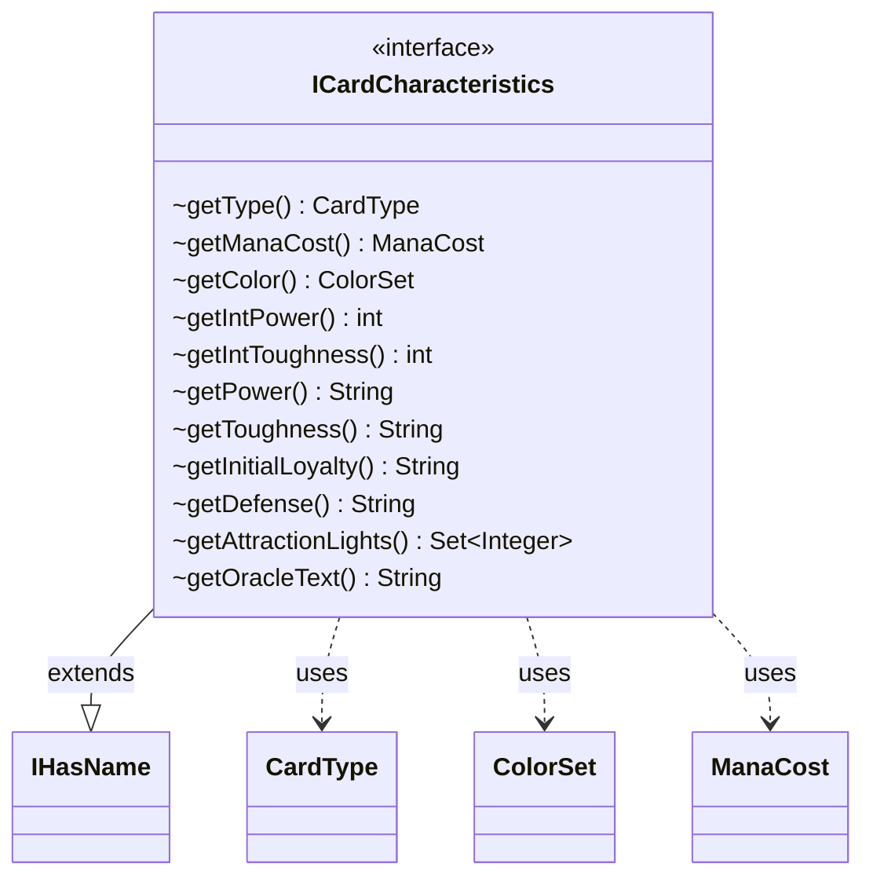

---
aliases:
  - ICardCharacteristics
tags:
  - java/interface
  - module/forge-core
  - pkg/forge/card
fqn: forge.card.ICardCharacteristics
package: forge.card
module: forge-core
kind: Interface
---

# ICardCharacteristics

**Package:** `forge.card` &nbsp; **Module:** `forge-core` &nbsp; **Kind:** Interface



## Relationships
**Extends:**
- [[forge.util.IHasName|IHasName]]
**Uses:**
- [[forge.card.CardType|CardType]]
- [[forge.card.ColorSet|ColorSet]]
- [[forge.card.mana.ManaCost|ManaCost]]


## Design Description

ICardCharacteristics defines the read-only contract for the intrinsic, printed attributes of a Magic card face, exposing accessors for its type line, mana cost, color identity, power/toughness (as both raw strings and parsed ints), planeswalker loyalty, battle defense, Unfinity attraction lights, and oracle text. By extending IHasName, it folds the card's name into the same characteristic abstraction.

As a pure interface it declares no state or behavior beyond getters, allowing any card representation—printed card data, in-game card state, or alternate faces—to supply these values uniformly so consumers can query characteristics without depending on a concrete implementation. It collaborates with the domain value types CardType, ManaCost, and ColorSet, delegating the modeling of those compound concepts to dedicated classes. The mix of typed (getIntPower) and string (getPower) accessors reflects MTG's need to represent both numeric values and special cases such as `*` or variable characteristics.

## Source
`forge-core/src/main/java/forge/card/ICardCharacteristics.java`

```java
package forge.card;

import forge.card.mana.ManaCost;
import forge.util.IHasName;

import java.util.Set;

public interface ICardCharacteristics extends IHasName {
    CardType getType();
    ManaCost getManaCost();
    ColorSet getColor();

    int    getIntPower();
    int    getIntToughness();
    String getPower();
    String getToughness();
    String getInitialLoyalty();
    String getDefense();
    Set<Integer> getAttractionLights();

    String getOracleText();
}
```
