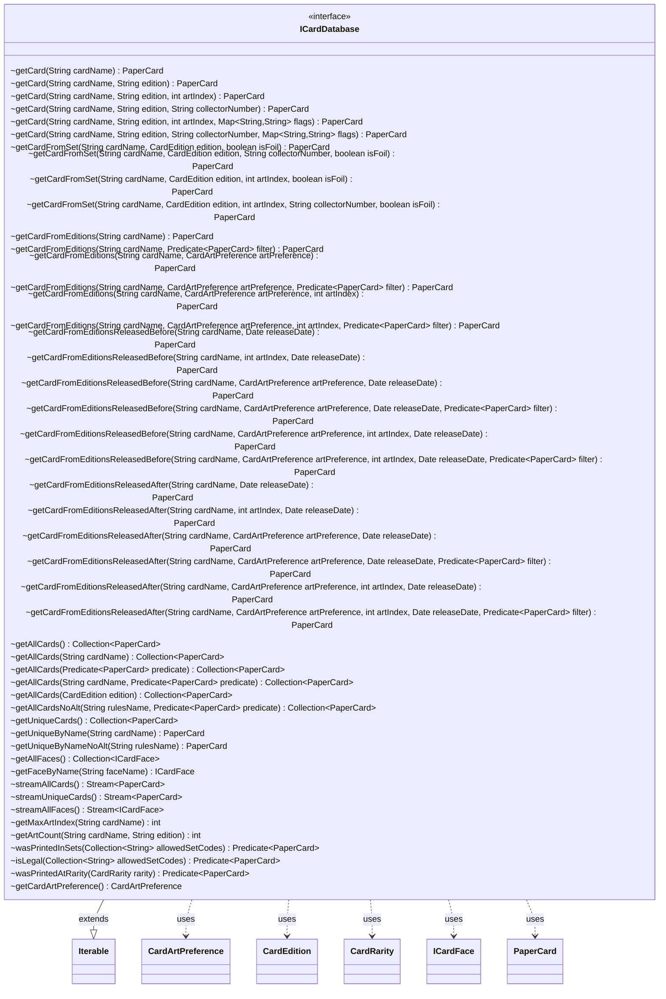

---
aliases:
  - ICardDatabase
tags:
  - java/interface
  - module/forge-core
  - pkg/forge/card
fqn: forge.card.ICardDatabase
package: forge.card
module: forge-core
kind: Interface
---

# ICardDatabase

**Package:** `forge.card` &nbsp; **Module:** `forge-core` &nbsp; **Kind:** Interface



## Relationships
**Uses:**
- [[forge.card.CardDb.CardArtPreference|CardArtPreference]]
- [[forge.card.CardEdition|CardEdition]]
- [[forge.card.CardRarity|CardRarity]]
- [[forge.card.ICardFace|ICardFace]]
- [[forge.item.PaperCard|PaperCard]]


## Design Description

`ICardDatabase` defines Forge's abstract card-database contract, providing a uniform API for looking up and retrieving Magic cards (`PaperCard` instances) and their faces (`ICardFace`). It extends `Iterable<PaperCard>` so the full catalog can be traversed directly. Single-card lookup is offered through three deliberately distinct strategies: `getCard` resolves by raw attributes (name, edition, art index, collector number), `getCardFromSet` targets a known expansion, and `getCardFromEditions` selects among reprints via a `CardArtPreference` policy with optional release-date bounds—the path used when no edition is specified, as in deck imports.

Collaborating with `CardEdition`, `CardRarity`, and `CardArtPreference`, it also exposes bulk and stream-based retrieval, unique-by-name access, art-counting utilities, and reusable `Predicate<PaperCard>` factories for legality, rarity, and set membership. Pervasive `default` methods funnel the many overloads onto a small set of core abstract operations, keeping implementations minimal while preserving a broad, convenient surface.

## Source
`forge-core/src/main/java/forge/card/ICardDatabase.java`

```java
package forge.card;

import forge.card.CardDb.CardArtPreference;
import forge.item.IPaperCard;
import forge.item.PaperCard;

import java.util.Collection;
import java.util.Date;
import java.util.Map;
import java.util.function.Predicate;
import java.util.stream.Stream;

/**
 * Magic Cards Database.
 * --------------------
 * This interface defines the general API for Database Access and Cards' Lookup.
 * <p>
 * Methods for single Card's lookup currently support three alternative strategies:
 * 1. [getCard]: Card search based on a single card's attributes
 *               (i.e. name, edition, art, collectorNumber)
 * <p>
 * 2. [getCardFromSet]: Card Lookup from a single Expansion set.
 *                     Particularly useful in Deck Editors when a specific Set is specified.
 * <p>
 * 3. [getCardFromEditions]: Card search considering a predefined `SetPreference` policy and/or a specified Date
 *                           when no expansion is specified for a card.
 *                           This method is particularly useful for Re-prints whenever no specific
 *                           Expansion is specified (e.g. in Deck Import) and a decision should be made
 *                           on which card to pick. This methods allows to adopt a SetPreference selection
 *                           policy to make this decision.
 * <p>
 * The API also includes methods to fetch Collection of Card (i.e. PaperCard instances):
 * - all cards (no filter)
 * - all unique cards (by name)
 * - all prints of a single card
 * - all cards from a single Expansion Set
 * - all cards compliant with a filter condition (i.e. Predicate)
 * <p>
 * Finally, various utility methods are supported:
 * - Get the foil version of a Card (if Any)
 * - Get the Order Number of a Card in an Expansion Set
 * - Get the number of Print/Arts for a card in a Set (useful for those exp. having multiple arts)
 * */
public interface ICardDatabase extends Iterable<PaperCard> {
    /* SINGLE CARD RETRIEVAL METHODS
    *  ============================= */
    // 1. Card Lookup by attributes
    PaperCard getCard(String cardName);
    PaperCard getCard(String cardName, String edition);
    PaperCard getCard(String cardName, String edition, int artIndex);
    // [NEW Methods] Including the card CollectorNumber as criterion for DB lookup
    PaperCard getCard(String cardName, String edition, String collectorNumber);
    PaperCard getCard(String cardName, String edition, int artIndex, Map<String, String> flags);
    PaperCard getCard(String cardName, String edition, String collectorNumber, Map<String, String> flags);

    // 2. Card Lookup from a single Expansion Set
    default PaperCard getCardFromSet(String cardName, CardEdition edition, boolean isFoil) {
        return getCardFromSet(cardName, edition, IPaperCard.NO_ART_INDEX, IPaperCard.NO_COLLECTOR_NUMBER, isFoil);
    }  // NOT yet used, included for API symmetry

    default PaperCard getCardFromSet(String cardName, CardEdition edition, String collectorNumber, boolean isFoil) {
        return getCardFromSet(cardName, edition, IPaperCard.NO_ART_INDEX, collectorNumber, isFoil);
    }

    default PaperCard getCardFromSet(String cardName, CardEdition edition, int artIndex, boolean isFoil) {
        return getCardFromSet(cardName, edition, artIndex, IPaperCard.NO_COLLECTOR_NUMBER, isFoil);
    }
    PaperCard getCardFromSet(String cardName, CardEdition edition, int artIndex, String collectorNumber, boolean isFoil);

    // 3. Card lookup based on CardArtPreference Selection Policy
    default PaperCard getCardFromEditions(String cardName)  {
        return getCardFromEditions(cardName, getCardArtPreference(), IPaperCard.NO_ART_INDEX, null);
    }
    default PaperCard getCardFromEditions(String cardName, Predicate<PaperCard> filter) {
        return getCardFromEditions(cardName, getCardArtPreference(), IPaperCard.NO_ART_INDEX, filter);
    }
    default PaperCard getCardFromEditions(String cardName, CardArtPreference artPreference)  {
        return getCardFromEditions(cardName, artPreference, IPaperCard.NO_ART_INDEX, null);
    }
    default PaperCard getCardFromEditions(String cardName, CardArtPreference artPreference, Predicate<PaperCard> filter) {
        return getCardFromEditions(cardName, artPreference, IPaperCard.NO_ART_INDEX, filter);
    }
    default PaperCard getCardFromEditions(String cardName, CardArtPreference artPreference, int artIndex)  {
        return getCardFromEditions(cardName, artPreference, artIndex, null);
    }
    PaperCard getCardFromEditions(String cardName, CardArtPreference artPreference, int artIndex, Predicate<PaperCard> filter);

    // 4. Specialised Card Lookup on CardArtPreference Selection and Release Date
    default PaperCard getCardFromEditionsReleasedBefore(String cardName, Date releaseDate) {
        return this.getCardFromEditionsReleasedBefore(cardName, getCardArtPreference(), PaperCard.DEFAULT_ART_INDEX, releaseDate, null);
    }
    default PaperCard getCardFromEditionsReleasedBefore(String cardName, int artIndex, Date releaseDate) {
        return this.getCardFromEditionsReleasedBefore(cardName, getCardArtPreference(), artIndex, releaseDate, null);
    }
    default PaperCard getCardFromEditionsReleasedBefore(String cardName, CardArtPreference artPreference, Date releaseDate) {
        return this.getCardFromEditionsReleasedBefore(cardName, artPreference, PaperCard.DEFAULT_ART_INDEX, releaseDate, null);
    }
    default PaperCard getCardFromEditionsReleasedBefore(String cardName, CardArtPreference artPreference, Date releaseDate, Predicate<PaperCard> filter) {
        return this.getCardFromEditionsReleasedBefore(cardName, artPreference, PaperCard.DEFAULT_ART_INDEX, releaseDate, filter);
    }
    default PaperCard getCardFromEditionsReleasedBefore(String cardName, CardArtPreference artPreference, int artIndex, Date releaseDate) {
        return this.getCardFromEditionsReleasedBefore(cardName, artPreference, artIndex, releaseDate, null);
    }
    PaperCard getCardFromEditionsReleasedBefore(String cardName, CardArtPreference artPreference, int artIndex, Date releaseDate, Predicate<PaperCard> filter);

    default PaperCard getCardFromEditionsReleasedAfter(String cardName, Date releaseDate) {
        return this.getCardFromEditionsReleasedAfter(cardName, getCardArtPreference(), PaperCard.DEFAULT_ART_INDEX, releaseDate, null);
    }
    default PaperCard getCardFromEditionsReleasedAfter(String cardName, int artIndex, Date releaseDate) {
        return this.getCardFromEditionsReleasedAfter(cardName, getCardArtPreference(), artIndex, releaseDate, null);
    }
    default PaperCard getCardFromEditionsReleasedAfter(String cardName, CardArtPreference artPreference, Date releaseDate)  {
        return this.getCardFromEditionsReleasedAfter(cardName, artPreference, PaperCard.DEFAULT_ART_INDEX, releaseDate, null);
    }
    default PaperCard getCardFromEditionsReleasedAfter(String cardName, CardArtPreference artPreference, Date releaseDate, Predicate<PaperCard> filter) {
        return this.getCardFromEditionsReleasedAfter(cardName, artPreference, PaperCard.DEFAULT_ART_INDEX, releaseDate, filter);
    }
    default PaperCard getCardFromEditionsReleasedAfter(String cardName, CardArtPreference artPreference, int artIndex, Date releaseDate) {
        return this.getCardFromEditionsReleasedAfter(cardName, artPreference, artIndex, releaseDate, null);
    }
    PaperCard getCardFromEditionsReleasedAfter(String cardName, CardArtPreference artPreference, int artIndex, Date releaseDate, Predicate<PaperCard> filter);

    /* CARDS COLLECTION RETRIEVAL METHODS
     * ================================== */
    Collection<PaperCard> getAllCards();
    Collection<PaperCard> getAllCards(String cardName);
    Collection<PaperCard> getAllCards(Predicate<PaperCard> predicate);
    Collection<PaperCard> getAllCards(String cardName,Predicate<PaperCard> predicate);
    Collection<PaperCard> getAllCards(CardEdition edition);
    Collection<PaperCard> getAllCardsNoAlt(String rulesName, Predicate<PaperCard> predicate);
    Collection<PaperCard> getUniqueCards();
    PaperCard getUniqueByName(String cardName);
    PaperCard getUniqueByNameNoAlt(String rulesName);
    Collection<ICardFace> getAllFaces();
    ICardFace getFaceByName(String faceName);

    Stream<PaperCard> streamAllCards();
    Stream<PaperCard> streamUniqueCards();
    Stream<ICardFace> streamAllFaces();

    /* UTILITY METHODS
     * =============== */
    int getMaxArtIndex(String cardName);
    int getArtCount(String cardName, String edition);
    // Utility Predicates
    Predicate<? super PaperCard> wasPrintedInSets(Collection<String> allowedSetCodes);
    Predicate<? super PaperCard> isLegal(Collection<String> allowedSetCodes);
    Predicate<? super PaperCard> wasPrintedAtRarity(CardRarity rarity);

    CardArtPreference getCardArtPreference();
}
```
