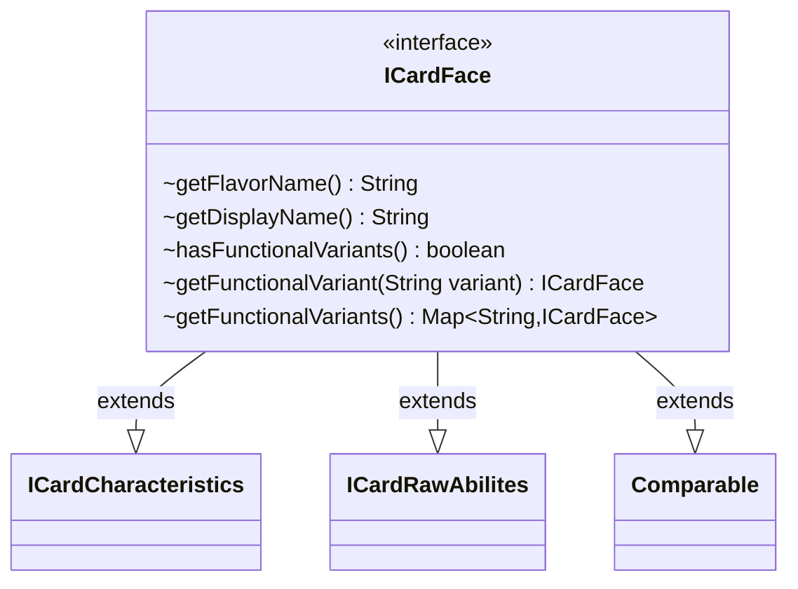

---
aliases:
  - ICardFace
tags:
  - java/interface
  - module/forge-core
  - pkg/forge/card
fqn: forge.card.ICardFace
package: forge.card
module: forge-core
kind: Interface
---

# ICardFace

**Package:** `forge.card` &nbsp; **Module:** `forge-core` &nbsp; **Kind:** Interface



## Relationships
**Extends:**
- [[forge.card.ICardCharacteristics|ICardCharacteristics]]
- [[forge.card.ICardRawAbilites|ICardRawAbilites]]


## Design Description

ICardFace defines the read-only contract for a single playable face of a Magic card, composing characteristic data (`ICardCharacteristics`), raw rules and ability text (`ICardRawAbilites`), and natural ordering (`Comparable<ICardFace>`) into one abstraction the engine uses to treat any face—normal card, split half, or transformed side—uniformly.

Beyond the inherited data, it layers in presentation and variant concerns. `getDisplayName()` is a default method that prefers a flavor name over the Oracle name, centralizing that fallback. The functional-variant accessors (`hasFunctionalVariants`, `getFunctionalVariant`, `getFunctionalVariants`) let a single face resolve to alternate, name-keyed versions; the wildcard `Map<String, ? extends ICardFace>` return type lets implementations expose their own concrete face subtype while honoring the interface contract.

## Source
`forge-core/src/main/java/forge/card/ICardFace.java`

```java
package forge.card;

import java.util.Map;

/**
 * TODO: Write javadoc for this type.
 *
 */
public interface ICardFace extends ICardCharacteristics, ICardRawAbilites, Comparable<ICardFace> {
    String getFlavorName();

    /**
     * @return this card's flavor name if it has one. Otherwise, the card's Oracle name.
     */
    default String getDisplayName() {
        if (this.getFlavorName() != null)
            return this.getFlavorName();
        return this.getName();
    }

    boolean hasFunctionalVariants();
    ICardFace getFunctionalVariant(String variant);
    Map<String, ? extends ICardFace> getFunctionalVariants();
}
```
