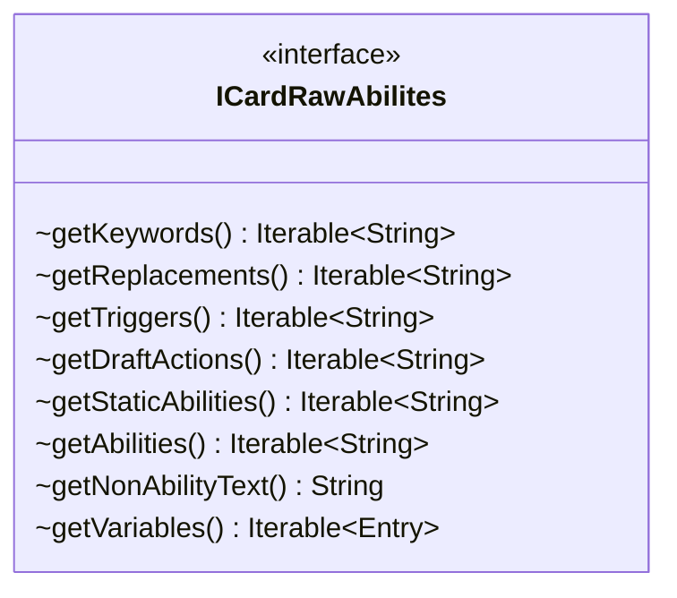

---
aliases:
  - ICardRawAbilites
tags:
  - java/interface
  - module/forge-core
  - pkg/forge/card
fqn: forge.card.ICardRawAbilites
package: forge.card
module: forge-core
kind: Interface
---

# ICardRawAbilites

**Package:** `forge.card`   **Module:** `forge-core`   **Kind:** Interface




## Design Description

The description is already written in the note. The user wants me to generate one — let me output the design description prose.

ICardRawAbilites defines the read-only contract for retrieving a card's raw, unparsed ability definitions exactly as they appear in Forge's card-script data. It exposes the textual building blocks of a Magic card's rules—keywords, replacement effects, triggers, draft actions, static abilities, activated and spell abilities, and free-form non-ability text—each returned as an `Iterable<String>` of script lines not yet compiled into runtime behavior, and additionally surfaces named SVar definitions through `getVariables()` as key/value `Entry` pairs.

As an interface, it cleanly separates the storage and supply of card rules text from the logic that parses and interprets it, letting diverse card-data sources be consumed uniformly by downstream parsing and factory code. The deliberate use of `Iterable` rather than concrete collections keeps the contract minimal and implementation-agnostic, exposing only sequential read access while hiding any underlying storage decisions.

## Source
`forge-core/src/main/java/forge/card/ICardRawAbilites.java`

```java
package forge.card;

import java.util.Map.Entry;

public interface ICardRawAbilites
{
    Iterable<String> getKeywords();
    Iterable<String> getReplacements();
    Iterable<String> getTriggers();
    Iterable<String> getDraftActions();
    Iterable<String> getStaticAbilities();
    Iterable<String> getAbilities();
    
    String getNonAbilityText();
    
    Iterable<Entry<String, String>> getVariables();
}
```

## Python
`forge/card/ICardRawAbilites.py`

```python
from abc import ABC, abstractmethod
from typing import Iterable, Tuple


class ICardRawAbilites(ABC):
    @abstractmethod
    def getKeywords(self) -> Iterable[str]:
        ...

    @abstractmethod
    def getReplacements(self) -> Iterable[str]:
        ...

    @abstractmethod
    def getTriggers(self) -> Iterable[str]:
        ...

    @abstractmethod
    def getDraftActions(self) -> Iterable[str]:
        ...

    @abstractmethod
    def getStaticAbilities(self) -> Iterable[str]:
        ...

    @abstractmethod
    def getAbilities(self) -> Iterable[str]:
        ...

    @abstractmethod
    def getNonAbilityText(self) -> str:
        ...

    @abstractmethod
    def getVariables(self) -> Iterable[Tuple[str, str]]:
        ...
```
