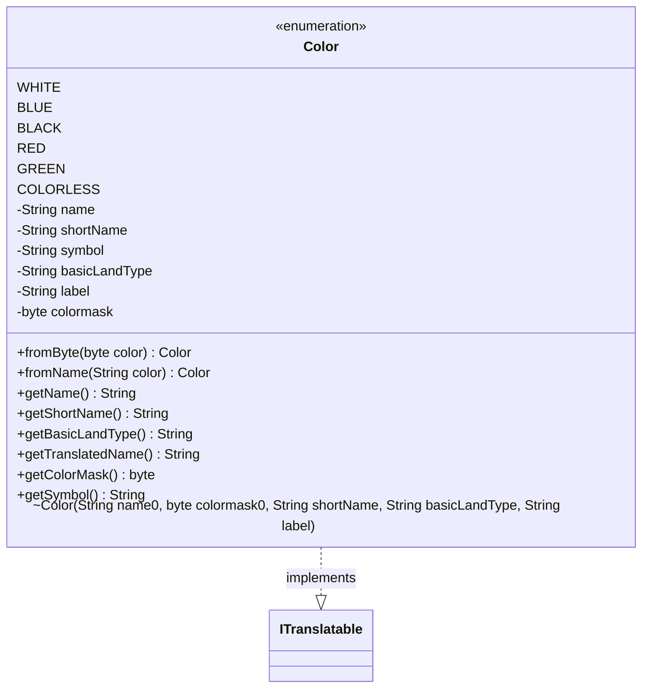

---
aliases:
  - Color
tags:
  - java/enum
  - module/forge-core
  - pkg/forge/card
fqn: forge.card.MagicColor.Color
package: forge.card
module: forge-core
kind: Enum
---

# Color

**Package:** `forge.card`   **Module:** `forge-core`   **Kind:** Enum



## Relationships
**Implements:**
- [[forge.util.ITranslatable|ITranslatable]]

## Design Description

White, blue, black, red, green, and a colorless sentinel constitute the fixed set of Magic colors, and this enum is forge-core's canonical representation of that set. Each constant bundles the data a color is identified by: a display name, a single-byte color mask used for bitwise color identity, a short code, the derived mana symbol (`{W}`, `{U}`, …), the matching basic land type, and a localization label. Lookup factories `fromByte` and `fromName` convert the engine's primitive byte masks and string names back into constants, with `COLORLESS` and `null` as the respective fall-throughs.

By implementing `ITranslatable`, each color supplies both a stable internal name via `getName()` and a UI-facing `getTranslatedName()` resolved through `Localizer`, keeping presentation text out of game logic. The enum is immutable and self-contained, serving as the shared vocabulary that higher-level card and mana types reference.

## Source
`forge-core/src/main/java/forge/card/MagicColor.java` — declaration excerpt

```java
    public enum Color implements ITranslatable {
        WHITE(Constant.WHITE, MagicColor.WHITE, "W", "Plains", "lblWhite"),
        BLUE(Constant.BLUE, MagicColor.BLUE, "U", "Island", "lblBlue"),
        BLACK(Constant.BLACK, MagicColor.BLACK, "B", "Swamp", "lblBlack"),
        RED(Constant.RED, MagicColor.RED, "R", "Mountain", "lblRed"),
        GREEN(Constant.GREEN, MagicColor.GREEN, "G", "Forest", "lblGreen"),
        COLORLESS(Constant.COLORLESS, MagicColor.COLORLESS, "C", null, "lblColorless");

        private final String name, shortName, symbol;
        private final String basicLandType;
        private final String label;
        private final byte colormask;

        Color(String name0, byte colormask0, String shortName, String basicLandType, String label) {
            name = name0;
            colormask = colormask0;
            this.shortName = shortName;
            symbol = "{" + shortName + "}";
            this.basicLandType = basicLandType;
            this.label = label;
        }

        public static Color fromByte(final byte color) {
            return switch (color) {
                case MagicColor.WHITE -> WHITE;
                case MagicColor.BLUE -> BLUE;
                case MagicColor.BLACK -> BLACK;
                case MagicColor.RED -> RED;
                case MagicColor.GREEN -> GREEN;
                default -> COLORLESS;
            };
        }
        public static Color fromName(final String color) {
            if (color == null) {
                return null;
            }
            return switch (color.toLowerCase(Locale.ROOT)) {
                case MagicColor.Constant.WHITE -> WHITE;
                case MagicColor.Constant.BLUE -> BLUE;
                case MagicColor.Constant.BLACK -> BLACK;
                case MagicColor.Constant.RED -> RED;
                case MagicColor.Constant.GREEN -> GREEN;
                case MagicColor.Constant.COLORLESS -> COLORLESS;
                default -> null;
            };
        }

        @Override
        public String getName() {
            return name;
        }
        public String getShortName() {
            return shortName;
        }
        public String getBasicLandType() {
            return basicLandType;
        }

        @Override
        public String getTranslatedName() {
            return Localizer.getInstance().getMessage(label);
        }

        public byte getColorMask() {
            return colormask;
        }
        public String getSymbol() {
            return symbol;
        }
    }
```
