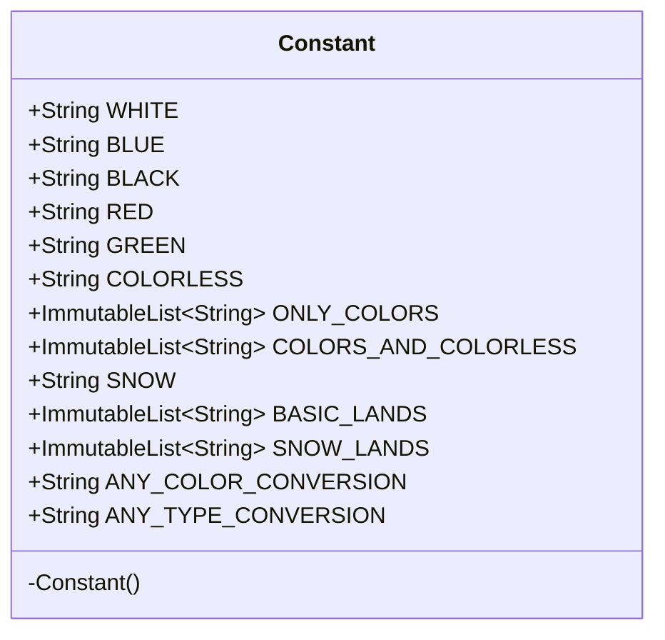

---
aliases:
  - Constant
tags:
  - java/class
  - module/forge-core
  - pkg/forge/card
fqn: forge.card.MagicColor.Constant
package: forge.card
module: forge-core
kind: Class
---

# Constant

**Package:** `forge.card`   **Module:** `forge-core`   **Kind:** Class



## Design Description

A static utility class nesting color-related string constants and predefined collections within the `MagicColor` class. It centralizes the canonical string identifiers for Magic: The Gathering's five colors (white, blue, black, red, green), colorless, and snow, alongside immutable lists grouping them—`ONLY_COLORS`, `COLORS_AND_COLORLESS`—plus the basic and snow-covered land names and special mana-conversion tokens.

Declared `final` with a private constructor, it is designed purely as a non-instantiable namespace for shared constants rather than a behavioral type, exposing no methods or state beyond its `public static final` fields. Its use of Guava's `ImmutableList` enforces that the grouped collections cannot be mutated by callers, guaranteeing these foundational values remain stable references shared across the engine's card and color-handling code.

## Source
`forge-core/src/main/java/forge/card/MagicColor.java` — declaration excerpt

```java
    /**
     * The Interface Color.
     */
    public static final class Constant {
        /** The White. */
        public static final String WHITE = "white";

        /** The Blue. */
        public static final String BLUE = "blue";

        /** The Black. */
        public static final String BLACK = "black";

        /** The Red. */
        public static final String RED = "red";

        /** The Green. */
        public static final String GREEN = "green";

        /** The Colorless. */
        public static final String COLORLESS = "colorless";

        /** The only colors. */
        public static final ImmutableList<String> ONLY_COLORS = ImmutableList.of(WHITE, BLUE, BLACK, RED, GREEN);
        public static final ImmutableList<String> COLORS_AND_COLORLESS = ImmutableList.of(WHITE, BLUE, BLACK, RED, GREEN, COLORLESS);

        /** The Snow. */
        public static final String SNOW = "snow";

        /** The Basic lands. */
        public static final ImmutableList<String> BASIC_LANDS = ImmutableList.of("Plains", "Island", "Swamp", "Mountain", "Forest");
        public static final ImmutableList<String> SNOW_LANDS = ImmutableList.of("Snow-Covered Plains", "Snow-Covered Island", "Snow-Covered Swamp", "Snow-Covered Mountain", "Snow-Covered Forest");

        public static final String ANY_COLOR_CONVERSION = "AnyType->AnyColor";
        public static final String ANY_TYPE_CONVERSION = "AnyType->AnyType";
        /**
         * Private constructor to prevent instantiation.
         */
        private Constant() {
        }
    }
```
