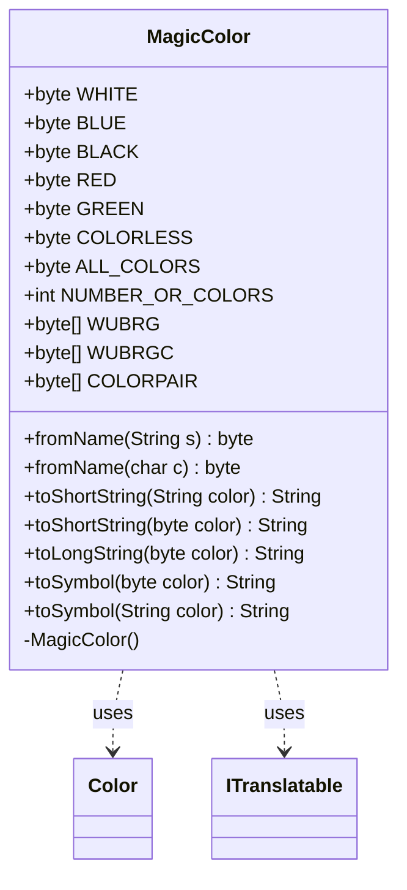

---
aliases:
  - MagicColor
tags:
  - java/class
  - module/forge-core
  - pkg/forge/card
fqn: forge.card.MagicColor
package: forge.card
module: forge-core
kind: Class
---

# MagicColor

**Package:** `forge.card` &nbsp; **Module:** `forge-core` &nbsp; **Kind:** Class



## Relationships
**Uses:**
- [[forge.card.MagicColor.Color|Color]]
- [[forge.util.ITranslatable|ITranslatable]]


## Design Description

MagicColor is a final, non-instantiable utility class in `forge.card` that centralizes Magic: The Gathering's color model for the engine. It encodes the five colors plus colorless as single-bit `byte` flags, so multi-color identities (color pairs, all-colors) compose naturally through bitwise OR, and it publishes reusable constant arrays (WUBRG, WUBRGC, COLORPAIR) and canonical string literals via its nested `Constant` class. Its static converters translate freely among names, characters, short codes, symbols, and bytes, making it the engine's single point of truth for color identity.

It delegates richer per-color metadata to the nested `Color` enum, which maps each bitmask to display names, symbols, and basic land types and implements `ITranslatable` (through `Localizer`) for localized labels. This split keeps the lightweight bitmask API stable and fast while the enum carries heavier, translatable data—a deliberate choice favoring compact `byte` flags in performance-sensitive color logic.

## Source
`forge-core/src/main/java/forge/card/MagicColor.java`

```java
package forge.card;

import java.util.Locale;

import com.google.common.collect.ImmutableList;

import forge.util.ITranslatable;
import forge.util.Localizer;

/**
 * Holds byte values for each color magic has.
 */
public final class MagicColor {

    // Colorless value synchronized with value in ManaAtom
    public static final byte WHITE     = 1 << 0;
    public static final byte BLUE      = 1 << 1;
    public static final byte BLACK     = 1 << 2;
    public static final byte RED       = 1 << 3;
    public static final byte GREEN     = 1 << 4;
    // Colorless values for MagicColor needs to be the absence of any color
    // Any comparison between colorless cards and colorless mana need to be adjusted appropriately.
    public static final byte COLORLESS = 0;

    public static final byte ALL_COLORS = WHITE | BLUE | BLACK | RED | GREEN;

    public static final int NUMBER_OR_COLORS = 5;

    public static final byte[] WUBRG  = new byte[] { WHITE, BLUE, BLACK, RED, GREEN };
    public static final byte[] WUBRGC = new byte[] { WHITE, BLUE, BLACK, RED, GREEN, COLORLESS };
    public static final byte[] COLORPAIR  = new byte[] { WHITE | BLUE, BLUE | BLACK, BLACK | RED, RED | GREEN, GREEN | WHITE,
            WHITE | BLACK, BLUE | RED, BLACK | GREEN, RED | WHITE, GREEN | BLUE };

    /**
     * Private constructor to prevent instantiation.
     */
    private MagicColor() {
    }

    public static byte fromName(String s) {
        if (s == null) {
            return 0;
        }
        if (s.equals("all")) {
            return MagicColor.ALL_COLORS;
        }
        if (s.length() == 2) { //if name is two characters, check for combination of two colors
            return (byte)(fromName(s.charAt(0)) | fromName(s.charAt(1)));
        }
        s = s.toLowerCase();
        if (s.length() == 1) {
            switch (s) {
                case "w": return MagicColor.WHITE;
                case "u": return MagicColor.BLUE;
                case "b": return MagicColor.BLACK;
                case "r": return MagicColor.RED;
                case "g": return MagicColor.GREEN;
                case "c": return MagicColor.COLORLESS;
            }
        } else {
            switch (s) {
                case Constant.WHITE: return MagicColor.WHITE;
                case Constant.BLUE: return MagicColor.BLUE;
                case Constant.BLACK: return MagicColor.BLACK;
                case Constant.RED: return MagicColor.RED;
                case Constant.GREEN: return MagicColor.GREEN;
                case Constant.COLORLESS: return MagicColor.COLORLESS;
            }
        }
        return 0; // colorless
    }

    public static byte fromName(final char c) {
        return switch (Character.toLowerCase(c)) {
            case 'w' -> MagicColor.WHITE;
            case 'u' -> MagicColor.BLUE;
            case 'b' -> MagicColor.BLACK;
            case 'r' -> MagicColor.RED;
            case 'g' -> MagicColor.GREEN;
            default  -> 0; // unknown means 'colorless'
        };
    }

    // This probably should be in ManaAtom since it cares about Mana, not Color.
    public static String toShortString(final String color) {
        if (color.equalsIgnoreCase(Constant.SNOW)) {
            return "S";
        } // compatibility
        return toShortString(fromName(color));
    }

    public static String toShortString(final byte color) {
        return Color.fromByte(color).getShortName();
    }

    public static String toLongString(final byte color) {
        return Color.fromByte(color).getName();
    }

    public static String toSymbol(final byte color) {
        return Color.fromByte(color).getSymbol();
    }

    public static String toSymbol(final String color) {
        return toSymbol(fromName(color));
    }

    /**
     * The Interface Color.
     */
    public static final class Constant {
        /** The White. */
        public static final String WHITE = "white";

        /** The Blue. */
        public static final String BLUE = "blue";

        /** The Black. */
        public static final String BLACK = "black";

        /** The Red. */
        public static final String RED = "red";

        /** The Green. */
        public static final String GREEN = "green";

        /** The Colorless. */
        public static final String COLORLESS = "colorless";

        /** The only colors. */
        public static final ImmutableList<String> ONLY_COLORS = ImmutableList.of(WHITE, BLUE, BLACK, RED, GREEN);
        public static final ImmutableList<String> COLORS_AND_COLORLESS = ImmutableList.of(WHITE, BLUE, BLACK, RED, GREEN, COLORLESS);

        /** The Snow. */
        public static final String SNOW = "snow";

        /** The Basic lands. */
        public static final ImmutableList<String> BASIC_LANDS = ImmutableList.of("Plains", "Island", "Swamp", "Mountain", "Forest");
        public static final ImmutableList<String> SNOW_LANDS = ImmutableList.of("Snow-Covered Plains", "Snow-Covered Island", "Snow-Covered Swamp", "Snow-Covered Mountain", "Snow-Covered Forest");

        public static final String ANY_COLOR_CONVERSION = "AnyType->AnyColor";
        public static final String ANY_TYPE_CONVERSION = "AnyType->AnyType";
        /**
         * Private constructor to prevent instantiation.
         */
        private Constant() {
        }
    }

    public enum Color implements ITranslatable {
        WHITE(Constant.WHITE, MagicColor.WHITE, "W", "Plains", "lblWhite"),
        BLUE(Constant.BLUE, MagicColor.BLUE, "U", "Island", "lblBlue"),
        BLACK(Constant.BLACK, MagicColor.BLACK, "B", "Swamp", "lblBlack"),
        RED(Constant.RED, MagicColor.RED, "R", "Mountain", "lblRed"),
        GREEN(Constant.GREEN, MagicColor.GREEN, "G", "Forest", "lblGreen"),
        COLORLESS(Constant.COLORLESS, MagicColor.COLORLESS, "C", null, "lblColorless");

        private final String name, shortName, symbol;
        private final String basicLandType;
        private final String label;
        private final byte colormask;

        Color(String name0, byte colormask0, String shortName, String basicLandType, String label) {
            name = name0;
            colormask = colormask0;
            this.shortName = shortName;
            symbol = "{" + shortName + "}";
            this.basicLandType = basicLandType;
            this.label = label;
        }

        public static Color fromByte(final byte color) {
            return switch (color) {
                case MagicColor.WHITE -> WHITE;
                case MagicColor.BLUE -> BLUE;
                case MagicColor.BLACK -> BLACK;
                case MagicColor.RED -> RED;
                case MagicColor.GREEN -> GREEN;
                default -> COLORLESS;
            };
        }
        public static Color fromName(final String color) {
            if (color == null) {
                return null;
            }
            return switch (color.toLowerCase(Locale.ROOT)) {
                case MagicColor.Constant.WHITE -> WHITE;
                case MagicColor.Constant.BLUE -> BLUE;
                case MagicColor.Constant.BLACK -> BLACK;
                case MagicColor.Constant.RED -> RED;
                case MagicColor.Constant.GREEN -> GREEN;
                case MagicColor.Constant.COLORLESS -> COLORLESS;
                default -> null;
            };
        }

        @Override
        public String getName() {
            return name;
        }
        public String getShortName() {
            return shortName;
        }
        public String getBasicLandType() {
            return basicLandType;
        }

        @Override
        public String getTranslatedName() {
            return Localizer.getInstance().getMessage(label);
        }

        public byte getColorMask() {
            return colormask;
        }
        public String getSymbol() {
            return symbol;
        }
    }

}
```
