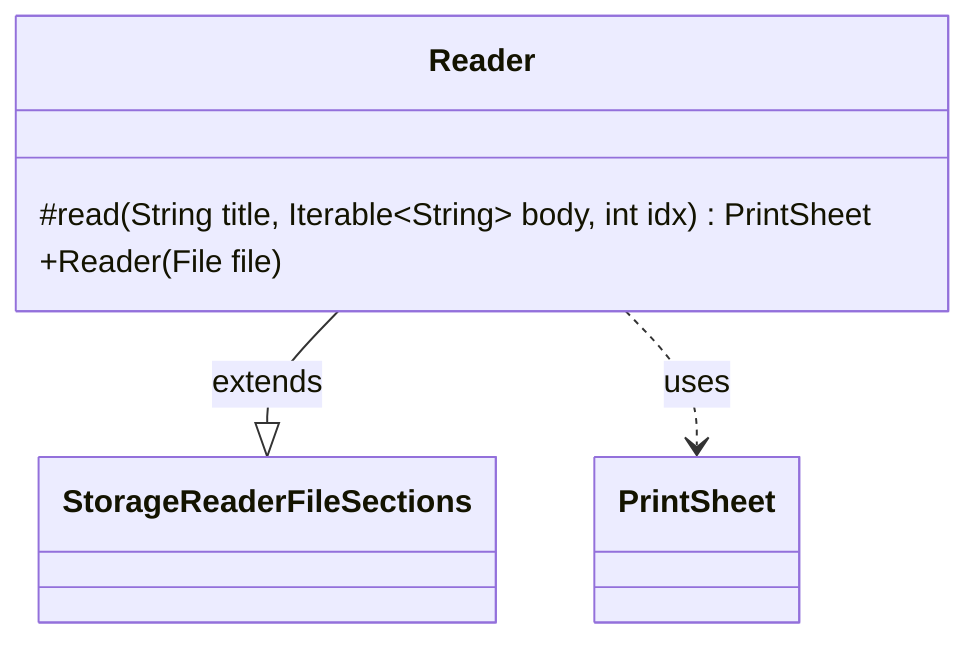

---
aliases:
  - Reader
tags:
  - java/class
  - module/forge-core
  - pkg/forge/card
fqn: forge.card.PrintSheet.Reader
package: forge.card
module: forge-core
kind: Class
---

# Reader

**Package:** `forge.card`   **Module:** `forge-core`   **Kind:** Class



## Relationships
**Extends:**
- [[forge.util.storage.StorageReaderFileSections|StorageReaderFileSections]]
**Uses:**
- [[forge.card.PrintSheet|PrintSheet]]

## Design Description

A `PrintSheet.Reader` is a nested loader that reads `PrintSheet` definitions from a sectioned text file, where each section corresponds to one named print sheet. As a subclass of `StorageReaderFileSections<PrintSheet>`, it plugs into Forge's generic file-backed storage framework: the superclass handles file parsing and section splitting, while `Reader` supplies the two specialization points. The constructor passes `PrintSheet::getName` to tell the storage layer how to key each loaded object, and the overridden `read` method converts a single section—a title plus its body lines—into a `PrintSheet`, delegating card parsing to `CardPool.fromCardList`. This keeps the I/O and indexing concerns in the reusable base class while `Reader` contributes only the format-specific knowledge of how a print sheet is named and constructed.

## Source
`forge-core/src/main/java/forge/card/PrintSheet.java` — declaration excerpt

```java
    public static class Reader extends StorageReaderFileSections<PrintSheet> {
        public Reader(File file) {
            super(file, PrintSheet::getName);
        }

        @Override
        protected PrintSheet read(String title, Iterable<String> body, int idx) {
            return new PrintSheet(title, CardPool.fromCardList(body));
        }

    }
```
