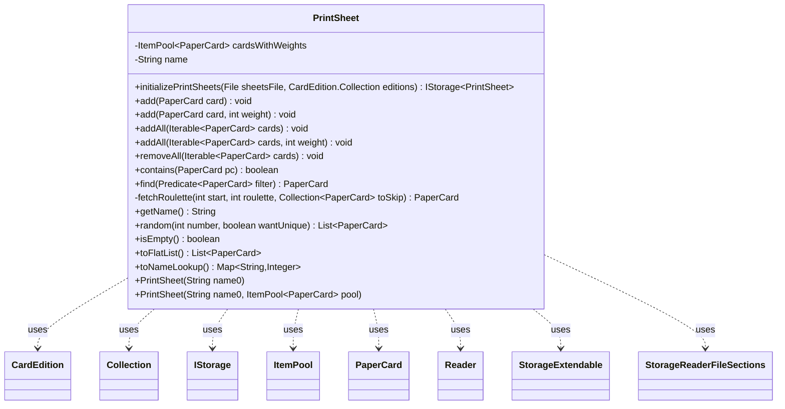

---
aliases:
  - PrintSheet
tags:
  - java/class
  - module/forge-core
  - pkg/forge/card
fqn: forge.card.PrintSheet
package: forge.card
module: forge-core
kind: Class
---

# PrintSheet

**Package:** `forge.card` &nbsp; **Module:** `forge-core` &nbsp; **Kind:** Class



## Relationships
**Uses:**
- [[forge.card.CardEdition|CardEdition]]
- [[forge.card.CardEdition.Collection|Collection]]
- [[forge.card.PrintSheet.Reader|Reader]]
- [[forge.item.PaperCard|PaperCard]]
- [[forge.util.ItemPool|ItemPool]]
- [[forge.util.storage.IStorage|IStorage]]
- [[forge.util.storage.StorageExtendable|StorageExtendable]]
- [[forge.util.storage.StorageReaderFileSections|StorageReaderFileSections]]


## Design Description

PrintSheet represents a named, weight-keyed pool of `PaperCard`s used to drive randomized card generation for special print runs, boosters, cubes, and fatpacks. It delegates storage to an `ItemPool<PaperCard>`, layering on mutation (`add`, `addAll`, `removeAll`), query (`contains`, `find`, `isEmpty`), and conversion (`toFlatList`, `toNameLookup`) helpers, but its central service is `random`, a weighted roulette-wheel draw that optionally enforces uniqueness and replicates the whole sheet when more cards are requested than the sheet holds distinctly.

For persistence it collaborates with the storage layer: the static `initializePrintSheets` builds a `StorageExtendable`-backed `IStorage<PrintSheet>` and merges per-edition sheets from `CardEdition`, while the nested `Reader` extends `StorageReaderFileSections` to parse file sections into instances via `CardPool.fromCardList`. The design fixes identity through a final `name` and pool yet keeps contents mutable, and the recursive `fetchRoulette` restart-with-skip logic resolves uniqueness, throwing only when distinct cards are insufficient.

## Source
`forge-core/src/main/java/forge/card/PrintSheet.java`

```java
package forge.card;

import forge.deck.CardPool;
import forge.item.PaperCard;
import forge.util.ItemPool;
import forge.util.MyRandom;
import forge.util.storage.IStorage;
import forge.util.storage.StorageExtendable;
import forge.util.storage.StorageReaderFileSections;

import java.io.File;
import java.util.*;
import java.util.Map.Entry;
import java.util.function.Predicate;

/**
 * TODO: Write javadoc for this type.
 *
 */
public class PrintSheet {

    public static final IStorage<PrintSheet> initializePrintSheets(File sheetsFile, CardEdition.Collection editions) {
        IStorage<PrintSheet> sheets = new StorageExtendable<>("Special print runs", new PrintSheet.Reader(sheetsFile));

        for (CardEdition edition : editions) {
            for (PrintSheet ps : edition.getPrintSheetsBySection()) {
                sheets.add(ps.name, ps);
            }
        }

        return sheets;
    }

    private final ItemPool<PaperCard> cardsWithWeights;

    private final String name;
    public PrintSheet(String name0) {
        this(name0, null);
    }

    public PrintSheet(String name0, ItemPool<PaperCard> pool) {
        name = name0;
        cardsWithWeights = pool != null ? pool : new ItemPool<>(PaperCard.class);
    }

    public void add(PaperCard card) {
        add(card,1);
    }

    public void add(PaperCard card, int weight) {
        cardsWithWeights.add(card, weight);
    }

    public void addAll(Iterable<PaperCard> cards) {
        addAll(cards, 1);
    }

    public void addAll(Iterable<PaperCard> cards, int weight) {
        for (PaperCard card : cards)
            cardsWithWeights.add(card, weight);
    }

    /** Cuts cards out of a sheet - they won't be printed again.
    * Please use mutable sheets for cubes only.*/
    public void removeAll(Iterable<PaperCard> cards) {
        for(PaperCard card : cards)
            cardsWithWeights.remove(card);
    }

    public boolean contains(PaperCard pc) {
        return cardsWithWeights.contains(pc);
    }
    public PaperCard find(Predicate<PaperCard> filter) {
        return cardsWithWeights.find(filter);
    }

    private PaperCard fetchRoulette(int start, int roulette, Collection<PaperCard> toSkip) {
        int sum = start;
        boolean isSecondRun = start > 0;
        for (Entry<PaperCard, Integer> cc : cardsWithWeights ) {
            sum += cc.getValue();
            if (sum > roulette) {
                if (toSkip != null && toSkip.contains(cc.getKey()))
                    continue;
                return cc.getKey();
            }
        }
        if (isSecondRun)
            throw new IllegalStateException("Print sheet does not have enough unique cards");

        return fetchRoulette(sum + 1, roulette, toSkip); // start over from beginning, in case last cards were to skip
    }

    public String getName() {
        return name;
    }

    public List<PaperCard> random(int number, boolean wantUnique) {
        List<PaperCard> result = new ArrayList<>();

        int totalWeight = cardsWithWeights.countAll();
        if (totalWeight == 0) {
            System.err.println("No cards were found on sheet " + name);
            return result;
        }

        // If they ask for 40 unique basic lands (to make a fatpack) out of 20 distinct possible, add the whole print run N times.
        int uniqueCards = cardsWithWeights.countDistinct();
        while (number >= uniqueCards) {
            for (Entry<PaperCard, Integer> kv : cardsWithWeights) {
                result.add(kv.getKey());
            }
            number -= uniqueCards;
        }

        List<PaperCard> uniques = wantUnique ? new ArrayList<>() : null;
        for (int iC = 0; iC < number; iC++) {
            int index = MyRandom.getRandom().nextInt(totalWeight);
            PaperCard toAdd = fetchRoulette(0, index, wantUnique ? uniques : null);
            result.add(toAdd);
            if (wantUnique)
                uniques.add(toAdd);
        }
        return result;
    }

    public boolean isEmpty() {
        return cardsWithWeights.isEmpty();
    }

    public List<PaperCard> toFlatList() {
        return cardsWithWeights.toFlatList();
    }

    public Map<String, Integer> toNameLookup() {
        return cardsWithWeights.toNameLookup();
    }

    public static class Reader extends StorageReaderFileSections<PrintSheet> {
        public Reader(File file) {
            super(file, PrintSheet::getName);
        }

        @Override
        protected PrintSheet read(String title, Iterable<String> body, int idx) {
            return new PrintSheet(title, CardPool.fromCardList(body));
        }

    }
}
```
