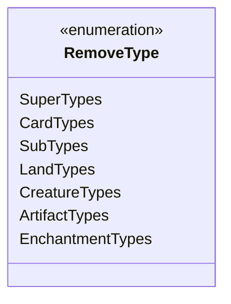

---
aliases:
  - RemoveType
tags:
  - java/enum
  - module/forge-core
  - pkg/forge/card
fqn: forge.card.RemoveType
package: forge.card
module: forge-core
kind: Enum
---

# RemoveType

**Package:** `forge.card`   **Module:** `forge-core`   **Kind:** Enum




## Design Description

RemoveType is a small enumeration in the `forge.card` package of the forge-core module that names the categories of type information a Magic: The Gathering card can carry on its type line. Its seven constants—SuperTypes, CardTypes, SubTypes, and the finer-grained LandTypes, CreatureTypes, ArtifactTypes, and EnchantmentTypes—identify which slice of a card's types an effect is permitted to strip away.

Carrying no fields or behavior, the enum acts as a type-safe selector consumed by the engine's card-type-manipulation logic, letting "remove type" effects declare exactly which type category to clear instead of relying on ad hoc string or boolean flags. Its flat, dependency-free design keeps it lightweight and broadly reusable across the card model wherever type removal must be expressed declaratively.

## Source
`forge-core/src/main/java/forge/card/RemoveType.java`

```java
package forge.card;

public enum RemoveType {
    SuperTypes,
    CardTypes,
    SubTypes,
    LandTypes,
    CreatureTypes,
    ArtifactTypes,
    EnchantmentTypes,
    ;
}
```

## Python
`forge/card/RemoveType.py`

```python
from enum import Enum, auto


class RemoveType(Enum):
    SuperTypes = auto()
    CardTypes = auto()
    SubTypes = auto()
    LandTypes = auto()
    CreatureTypes = auto()
    ArtifactTypes = auto()
    EnchantmentTypes = auto()
```
