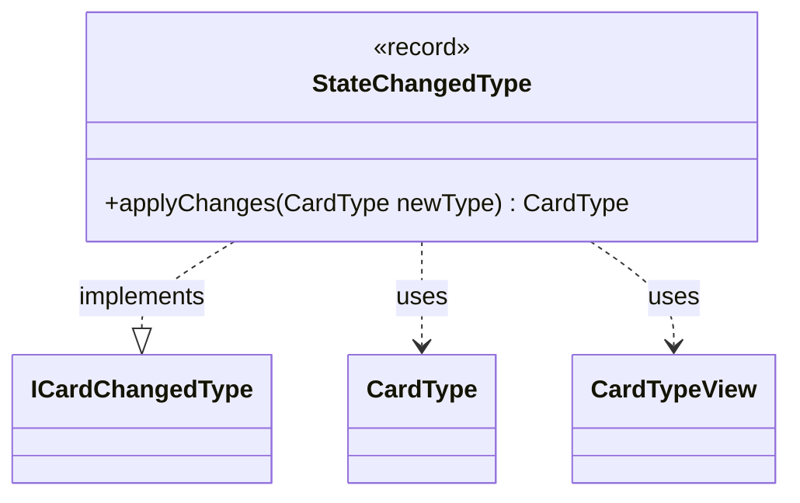

---
aliases:
  - StateChangedType
tags:
  - java/record
  - module/forge-core
  - pkg/forge/card
fqn: forge.card.StateChangedType
package: forge.card
module: forge-core
kind: Record
---

# StateChangedType

**Package:** `forge.card` &nbsp; **Module:** `forge-core` &nbsp; **Kind:** Record



## Relationships
**Implements:**
- [[forge.card.ICardChangedType|ICardChangedType]]
**Uses:**
- [[forge.card.CardType|CardType]]
- [[forge.card.CardTypeView|CardTypeView]]


## Design Description

StateChangedType is a minimal record wrapping a single `CardTypeView`, representing an effect that sets a card's type to a fixed, predetermined value. As an implementation of `ICardChangedType`, it slots into Forge's layered card-type modification pipeline, where each change object contributes to deriving a card's final type. Its `applyChanges` method deliberately ignores the incoming `newType` and returns a brand-new `CardType` built from the stored view, expressing an absolute "set" semantics that overrides rather than incrementally adjusts prior changes. Choosing the record form makes each instance immutable and value-based, so the type-setting effect is a self-contained, side-effect-free unit that collaborates with `CardType` and `CardTypeView` to produce its result.

## Source
`forge-core/src/main/java/forge/card/StateChangedType.java`

```java
package forge.card;

public record StateChangedType(CardTypeView type) implements ICardChangedType {

    @Override
    public CardType applyChanges(CardType newType) {
        return new CardType(type);
    }
}
```

## Python
`forge/card/StateChangedType.py`

```python
from forge.card.ICardChangedType import ICardChangedType
from forge.card.CardType import CardType
from forge.card.CardTypeView import CardTypeView


class StateChangedType(ICardChangedType):
    def __init__(self, type: CardTypeView):
        self.type = type

    def applyChanges(self, newType: CardType) -> CardType:
        return CardType(self.type)
```
