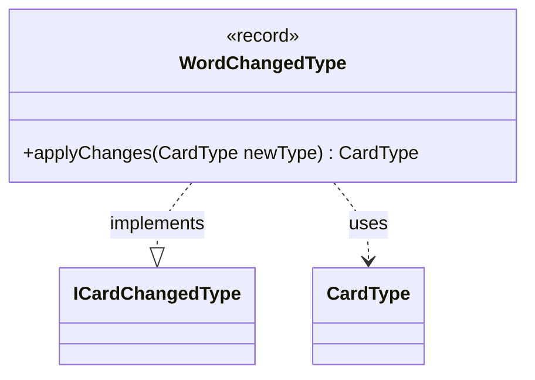

---
aliases:
  - WordChangedType
tags:
  - java/record
  - module/forge-core
  - pkg/forge/card
fqn: forge.card.WordChangedType
package: forge.card
module: forge-core
kind: Record
---

# WordChangedType

**Package:** `forge.card` &nbsp; **Module:** `forge-core` &nbsp; **Kind:** Record



## Relationships
**Implements:**
- [[forge.card.ICardChangedType|ICardChangedType]]
**Uses:**
- [[forge.card.CardType|CardType]]


## Design Description

`WordChangedType` is an immutable record that encapsulates a single text-substitution rule, pairing an `oldWord` with its replacement `newWord`. As one concrete implementation of the `ICardChangedType` interface, it participates in Forge's card type-modification pipeline, where heterogeneous change operations are applied uniformly through a common `applyChanges` contract. Its sole responsibility is to rewrite a card's subtypes: when the supplied `CardType` contains the old word as a string type, it swaps that subtype for the new one, then returns the mutated type.

The record form signals that the rule itself is a value object—two final words defining the transformation—while the actual state change is delegated to the passed-in `CardType` collaborator. The guard against `hasStringType` keeps the operation a safe no-op when the target word is absent, allowing such rules to be applied indiscriminately across cards without side effects on non-matching types.

## Source
`forge-core/src/main/java/forge/card/WordChangedType.java`

```java
package forge.card;

public record WordChangedType(String oldWord, String newWord) implements ICardChangedType {

    @Override
    public CardType applyChanges(CardType newType) {
        if (newType.hasStringType(oldWord)) {
            newType.subtypes.remove(oldWord);
            newType.subtypes.add(newWord);
        }
        return newType;
    }
}
```
