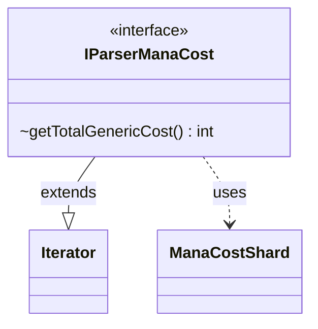

---
aliases:
  - IParserManaCost
tags:
  - java/interface
  - module/forge-core
  - pkg/forge/card/mana
fqn: forge.card.mana.IParserManaCost
package: forge.card.mana
module: forge-core
kind: Interface
---

# IParserManaCost

**Package:** `forge.card.mana` &nbsp; **Module:** `forge-core` &nbsp; **Kind:** Interface



## Relationships
**Uses:**
- [[forge.card.mana.ManaCostShard|ManaCostShard]]

## Design Description

`IParserManaCost` defines the contract for incrementally parsing a mana-cost string into its individual `ManaCostShard` symbols. By extending `Iterator<ManaCostShard>`, it models parsing as a lazy, forward traversal—each `next()` produces the next shard—so callers can consume a cost symbol-by-symbol without knowing how the underlying string is tokenized or buffering the full result. Its one extra method, `getTotalGenericCost()`, exposes the aggregate generic (colorless numeric) portion of the cost, a value that has no natural representation as a single shard.

The interface is deliberately minimal, separating the consumption of parsed shards from any concrete parser. This lets `ManaCost` and related types work with any parsing strategy through the familiar iterator idiom, keeping the parser implementation pluggable and shard-consuming code independent of how the cost was decoded.

## Source
`forge-core/src/main/java/forge/card/mana/IParserManaCost.java`

```java
package forge.card.mana;

import java.util.Iterator;


/**
 * The Interface ManaParser.
 */
public interface IParserManaCost extends Iterator<ManaCostShard> {
    int getTotalGenericCost();
}
```
