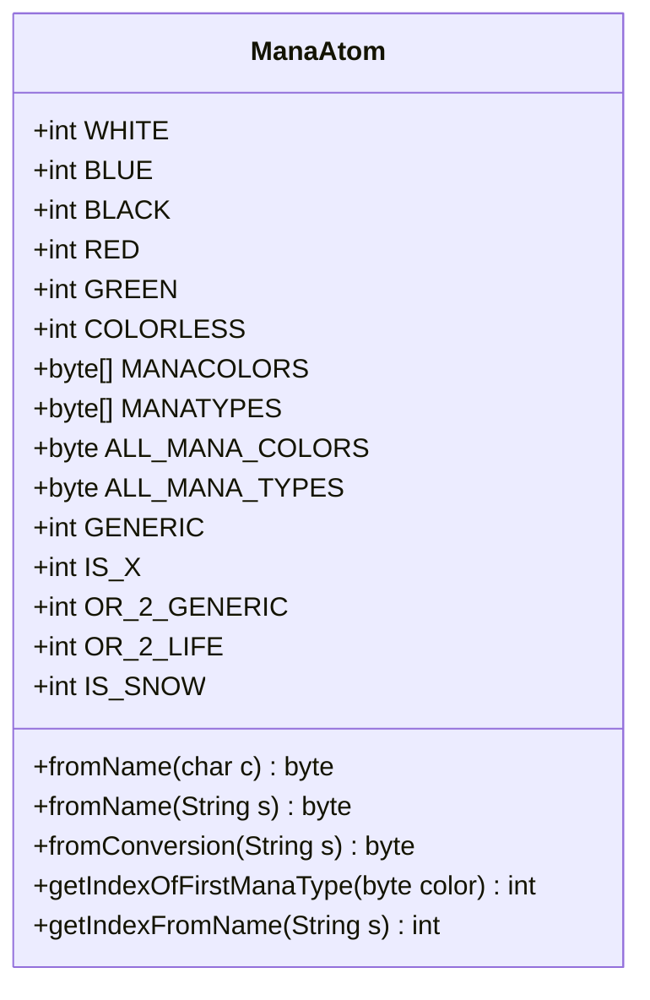

---
aliases:
  - ManaAtom
tags:
  - java/class
  - module/forge-core
  - pkg/forge/card/mana
fqn: forge.card.mana.ManaAtom
package: forge.card.mana
module: forge-core
kind: Class
---

# ManaAtom

**Package:** `forge.card.mana` &nbsp; **Module:** `forge-core` &nbsp; **Kind:** Class




## Design Description

ManaAtom is a non-instantiable utility class (declared `abstract` with only static members) that encodes every Magic: The Gathering mana symbol as an integer bitmask. It defines the canonical constants for the five colors, colorless, and generic—sourcing its base color bits from MagicColor—plus higher-bit modifier flags (IS_X, OR_2_GENERIC, OR_2_LIFE, IS_SNOW) deliberately placed above the byte boundary so they sit outside the color-packing range. Acting as a stateless constant-and-parser library for forge-core, it provides static helpers (`fromName`, `fromConversion`, `getIndexOfFirstManaType`, `getIndexFromName`) that translate textual notation—single characters, color words, two-letter color pairs, and "non"/"AnyColor"/"AnyType" expressions—into compact byte masks. Treating an unknown symbol as generic (0), it centralizes mana-symbol representation and conversion so the rest of the engine shares one authoritative encoding.

## Source
`forge-core/src/main/java/forge/card/mana/ManaAtom.java`

```java
package forge.card.mana;

import forge.card.MagicColor;

/** A bitmask to represent any mana symbol as an integer. */
public abstract class ManaAtom {
    public static final int WHITE = MagicColor.WHITE;
    public static final int BLUE = MagicColor.BLUE; 
    public static final int BLACK = MagicColor.BLACK; 
    public static final int RED = MagicColor.RED;
    public static final int GREEN = MagicColor.GREEN;
    public static final int COLORLESS = 1 << 5;

    public static final byte[] MANACOLORS = new byte[] { WHITE, BLUE, BLACK, RED, GREEN };
    public static final byte[] MANATYPES = new byte[] { WHITE, BLUE, BLACK, RED, GREEN, COLORLESS };

    public static final byte ALL_MANA_COLORS = WHITE | BLUE | BLACK | RED | GREEN;
    public static final byte ALL_MANA_TYPES = ALL_MANA_COLORS | COLORLESS;

    public static final int GENERIC = 1 << 6;

    // Below here skip due to byte conversion shenanigans
    public static final int IS_X = 1 << 8;
    public static final int OR_2_GENERIC = 1 << 9;
    public static final int OR_2_LIFE = 1 << 10;
    public static final int IS_SNOW = 1 << 11;

    public static byte fromName(final char c) {
        switch (Character.toLowerCase(c)) {
            case 'w': return WHITE;
            case 'u': return BLUE;
            case 'b': return BLACK;
            case 'r': return RED;
            case 'g': return GREEN;
            case 'c': return COLORLESS;
        }
        return 0; // unknown means 'generic'
    }

    public static byte fromName(String s) {
        if (s == null) {
            return 0;
        }
        if (s.length() == 2) { //if name is two characters, check for combination of two colors
            return (byte)(fromName(s.charAt(0)) | fromName(s.charAt(1)));
        } else if (s.length() == 1) {
            return fromName(s.charAt(0));
        }
        s = s.toLowerCase();

        switch (s) {
            case MagicColor.Constant.WHITE: return WHITE;
            case MagicColor.Constant.BLUE: return BLUE;
            case MagicColor.Constant.BLACK: return BLACK;
            case MagicColor.Constant.RED: return RED;
            case MagicColor.Constant.GREEN: return GREEN;
            case MagicColor.Constant.COLORLESS: return COLORLESS;
        }
        return 0; // generic
    }

    public static byte fromConversion(String s) {
        switch (s) {
            case "AnyColor": return ALL_MANA_COLORS;
            case "AnyType": return ALL_MANA_TYPES;
        }
        if (s.startsWith("non")) {
            return (byte) (fromName(s.substring(3)) ^ ALL_MANA_TYPES);
        }
        byte b = 0;
        if (s.length() > 2) {
            // check for color word
            b = fromName(s);
        }
        if (b == 0) {
            for (char c : s.toCharArray()) {
                b |= fromName(c);
            }
        }
        return b;
    }

    public static int getIndexOfFirstManaType(final byte color){
        for (int i = 0; i < MANATYPES.length; i++) {
            if ((color & MANATYPES[i]) != 0) {
                return i;
            }
        }
        return -1; // somehow the mana is not colored or colorless?
    }

    public static int getIndexFromName(final String s){
        return getIndexOfFirstManaType(fromName(s));
    }
}
```
