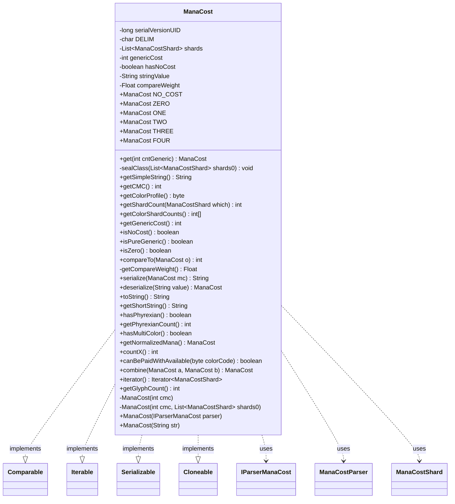

---
aliases:
  - ManaCost
tags:
  - java/class
  - module/forge-core
  - pkg/forge/card/mana
fqn: forge.card.mana.ManaCost
package: forge.card.mana
module: forge-core
kind: Class
---

# ManaCost

**Package:** `forge.card.mana`   **Module:** `forge-core`   **Kind:** Class



## Relationships
**Uses:**
- [[forge.card.mana.IParserManaCost|IParserManaCost]]
- [[forge.card.mana.ManaCostParser|ManaCostParser]]
- [[forge.card.mana.ManaCostShard|ManaCostShard]]


## Design Description

ManaCost is an immutable, `final` value object modeling a Magic card's mana cost as an unmodifiable list of `ManaCostShard` symbols plus a separate generic-mana count, with a `hasNoCost` flag that distinguishes truly costless cards (e.g. lands, stored as `-1`) from an explicit `{0}`. Instances are built from an `IParserManaCost` (typically `ManaCostParser`), and frequently used small costs are cached as static constants (`ZERO`–`FOUR`, `NO_COST`) and dispensed via `get` to limit allocation.

Implementing `Comparable`, `Iterable<ManaCostShard>`, `Serializable`, and `Cloneable`, it supports sorting through a lazily computed compare weight, shard iteration, and its own delimiter-based `serialize`/`deserialize`. The string form is precomputed at construction, and derived queries—CMC, color profile, shard counts, Phyrexian/multicolor/X detection, and payability—delegate per-symbol semantics to `ManaCostShard`, keeping ManaCost a self-contained, side-effect-free aggregate.

## Source
`forge-core/src/main/java/forge/card/mana/ManaCost.java`

```java
/*
 * Forge: Play Magic: the Gathering.
 * Copyright (C) 2011  Forge Team
 *
 * This program is free software: you can redistribute it and/or modify
 * it under the terms of the GNU General Public License as published by
 * the Free Software Foundation, either version 3 of the License, or
 * (at your option) any later version.
 * 
 * This program is distributed in the hope that it will be useful,
 * but WITHOUT ANY WARRANTY; without even the implied warranty of
 * MERCHANTABILITY or FITNESS FOR A PARTICULAR PURPOSE.  See the
 * GNU General Public License for more details.
 * 
 * You should have received a copy of the GNU General Public License
 * along with this program.  If not, see <http://www.gnu.org/licenses/>.
 */
package forge.card.mana;

import com.google.common.collect.Lists;
import org.apache.commons.lang3.StringUtils;

import java.io.Serializable;
import java.util.Collections;
import java.util.Iterator;
import java.util.List;

/**
 * <p>
 * CardManaCost class.
 * </p>
 * 
 * @author Forge
 * @version $Id: CardManaCost.java 9708 2011-08-09 19:34:12Z jendave $
 */

public final class ManaCost implements Comparable<ManaCost>, Iterable<ManaCostShard>, Serializable, Cloneable {
    private static final long serialVersionUID = -2477430496624149226L;

    private static final char DELIM = (char)6;

    private List<ManaCostShard> shards;
    private final int genericCost;
    private final boolean hasNoCost; // lands cost
    private String stringValue; // precalculated for toString;

    private Float compareWeight = null;

    public static final ManaCost NO_COST = new ManaCost(-1);
    public static final ManaCost ZERO = new ManaCost(0);
    public static final ManaCost ONE = new ManaCost(1);
    public static final ManaCost TWO = new ManaCost(2);
    public static final ManaCost THREE = new ManaCost(3);
    public static final ManaCost FOUR = new ManaCost(4);

    public static ManaCost get(int cntGeneric) {
        switch (cntGeneric) {
            case 0: return ZERO;
            case 1: return ONE;
            case 2: return TWO;
            case 3: return THREE;
            case 4: return FOUR;
        }
        return cntGeneric > 0 ? new ManaCost(cntGeneric) : NO_COST;
    }

    // pass mana cost parser here
    private ManaCost(int cmc) {
        this.hasNoCost = cmc < 0;
        this.genericCost = cmc < 0 ? 0 : cmc;
        sealClass(Lists.newArrayList());
    }
    
    private ManaCost(int cmc, List<ManaCostShard> shards0) {
        this.hasNoCost = cmc < 0;
        this.genericCost = cmc < 0 ? 0 : cmc;
        sealClass(shards0);
    }

    private void sealClass(List<ManaCostShard> shards0) {
        this.shards = Collections.unmodifiableList(shards0);
        this.stringValue = this.getSimpleString();
    }

    // public ctor, should give it a mana parser
    /**
     * Instantiates a new card mana cost.
     * 
     * @param parser
     *            the parser
     */
    public ManaCost(final IParserManaCost parser) {
        final List<ManaCostShard> shardsTemp = Lists.newArrayList();
        boolean xMana = false;
        while (parser.hasNext()) {
            final ManaCostShard shard = parser.next();
            if (shard != null && shard != ManaCostShard.GENERIC) {
                if (shard == ManaCostShard.X) {
                    xMana = true;
                }
                shardsTemp.add(shard);
            } // null is OK - that was generic mana
        }
        int generic = parser.getTotalGenericCost(); // collect generic mana here
        this.hasNoCost = !xMana && generic == -1;
        this.genericCost = hasNoCost ? 0 : generic;
        sealClass(shardsTemp);
    }

    public ManaCost(final String str) {
        this(new ManaCostParser(str));
    }

    public String getSimpleString() {
        if (this.hasNoCost) {
            return "no cost";
        }
        if (this.shards.isEmpty()) {
            return "{" + this.genericCost + "}";
        }

        final StringBuilder sb = new StringBuilder();
        if (this.genericCost > 0) {
            sb.append("{").append(this.genericCost).append("}");
        }
        for (final ManaCostShard s : this.shards) {
            if (s == ManaCostShard.X) {
                sb.insert(0, s);
            } else {
                sb.append(s.toString());
            }
        }
        // If the generic cost has been reduced below 0, display the reduction. (Only set for X cost spells)
        if (this.genericCost < 0) {
            sb.append(' ').append(this.genericCost);
        }
        return sb.toString();
    }

    /**
     * Gets the cMC.
     * 
     * @return the cMC
     */
    public int getCMC() {
        int sum = 0;
        for (final ManaCostShard s : this.shards) {
            sum += s.getCmc();
        }
        return sum + this.genericCost;
    }

    /**
     * Gets the color profile.
     * 
     * @return the color profile
     */
    public byte getColorProfile() {
        byte result = 0;
        for (final ManaCostShard s : this.shards) {
            result |= s.getColorMask();
        }
        return result;
    }

    public int getShardCount(ManaCostShard which) {
        if (which == ManaCostShard.GENERIC) {
            return genericCost;
        }

        int res = 0;
        for (ManaCostShard shard : shards) {
            if (shard == which) {
                res++;
            }
        }
        return res;
    }

    /**
     * Gets the amount of color shards in the card's mana cost.
     * 
     * @return an array of five integers containing the amount of color shards in the card's mana cost in WUBRG order 
     */
    public int[] getColorShardCounts() {
        int[] counts = new int[6]; // in WUBRGC order

        for (int i = 0; i < stringValue.length(); i++) {
            char symbol = stringValue.charAt(i);
            switch (symbol) {
                case 'W': 
                case 'U':
                case 'B':
                case 'R':
                case 'G':
                case 'C':
                    counts[ManaAtom.getIndexOfFirstManaType(ManaAtom.fromName(symbol))]++;
                    break;
            }
            
        }

        return counts;
    }

    /**
     * Gets the generic cost.
     * 
     * @return the generic cost
     */
    public int getGenericCost() {
        return this.genericCost;
    }

    /**
     * Checks if is empty.
     * 
     * @return true, if is empty
     */
    public boolean isNoCost() {
        return this.hasNoCost;
    }

    /**
     * Checks if is pure generic.
     * 
     * @return true, if is pure generic
     */
    public boolean isPureGeneric() {
        return this.shards.isEmpty() && !this.isNoCost();
    }

    public boolean isZero() {
        return genericCost == 0 && isPureGeneric();
    }

    /*
     * (non-Javadoc)
     * 
     * @see java.lang.Comparable#compareTo(java.lang.Object)
     */
    @Override
    public int compareTo(final ManaCost o) {
        return this.getCompareWeight().compareTo(o.getCompareWeight());
    }

    private Float getCompareWeight() {
        if (this.compareWeight == null) {
            float weight = this.genericCost;
            for (final ManaCostShard s : this.shards) {
                weight += s.getCmpc();
            }
            if (this.hasNoCost) {
                weight = -1; // for those who doesn't even have a 0 sign on card
            }
            this.compareWeight = weight;
        }
        return this.compareWeight;
    }

    public static String serialize(ManaCost mc) {
        StringBuilder builder = new StringBuilder();
        builder.append(mc.hasNoCost ? -1 : mc.genericCost);
        for (ManaCostShard shard : mc.shards) {
            builder.append(DELIM).append(shard.name());
        }
        return builder.toString();
    }
    public static ManaCost deserialize(String value) {
        String[] pieces = StringUtils.split(value, DELIM);
        ManaCost mc = new ManaCost(Integer.parseInt(pieces[0]));
        List<ManaCostShard> sh = Lists.newArrayList();
        for (int i = 1; i < pieces.length; i++) {
            sh.add(ManaCostShard.valueOf(pieces[i]));
        }
        mc.sealClass(sh);
        return mc;
    }

    /*
     * (non-Javadoc)
     * 
     * @see java.lang.Object#toString()
     */
    @Override
    public String toString() {
        return this.stringValue;
    }

    /**
     * TODO: Write javadoc for this method.
     * @return
     */
    public String getShortString() {
        if (isNoCost()) {
            return "-1";
        }
    	StringBuilder sb = new StringBuilder();
        int generic = getGenericCost();
        if (this.isZero()) {
            sb.append('0');
        }
        if (generic > 0) {
            sb.append(generic);
        }
        for (ManaCostShard s : this.shards) {
            sb.append(' ');
            sb.append(s);
        }
        // If the generic cost has been reduced below 0, display the reduction. (Only set for X cost spells)
        if (generic < 0) {
            sb.append(' ').append(generic);
        }
        return sb.toString().trim();
    }

    /**
     * TODO: Write javadoc for this method.
     * @return
     */
    public boolean hasPhyrexian() {
        for (ManaCostShard shard : shards) {
            if (shard.isPhyrexian()) {
                return true;
            }
        }
        return false;
    }
    
    public int getPhyrexianCount() {
        int i = 0;
        for (ManaCostShard shard : shards) {
            if (shard.isPhyrexian()) {
                i++;
            }
        }
        return i;
    }
    
    public boolean hasMultiColor() {
        for (ManaCostShard shard : shards) {
            if (shard.isMultiColor()) {
                return true;
            }
        }
        return false;
    }

    /**
     * works for Phyrexian Mana and 2Half mana, not for Hybrid mana
     * @return
     */
    public ManaCost getNormalizedMana() {
        List<ManaCostShard> list = Lists.newArrayList();
        for (ManaCostShard shard : shards) {
            list.add(ManaCostShard.valueOf(shard.getColorMask()));
        }
        
        return new ManaCost(this.genericCost, list);
    }

    /**
     * TODO: Write javadoc for this method.
     * @return
     */
    public int countX() {
        return getShardCount(ManaCostShard.X);
    }

    /**
     * Can this mana cost be paid with unlimited mana of given color set.
     * @param colorCode
     * @return
     */
    public boolean canBePaidWithAvailable(byte colorCode) {
        for (ManaCostShard shard : shards) {
            if (!shard.isPhyrexian() && !shard.canBePaidWithManaOfColor(colorCode)) {
                return false;
            }
        }
        return true;
    }

    /**
     * TODO: Write javadoc for this method.
     * @param a
     * @param b
     * @return
     */
    public static ManaCost combine(ManaCost a, ManaCost b) {
        ManaCost res = new ManaCost(a.genericCost + b.genericCost);
        List<ManaCostShard> sh = Lists.newArrayList();
        sh.addAll(a.shards);
        sh.addAll(b.shards);
        res.sealClass(sh);
        return res;
    }

    @Override
    public Iterator<ManaCostShard> iterator() {
        return this.shards.iterator();
    }

    public int getGlyphCount() { // counts all colored shards or 1 for {0} costs 
        int width = shards.size();
        if (genericCost > 0 || (genericCost == 0 && width == 0)) {
            width++;
        }
        // If the generic cost has been reduced below 0 (due to perpetual cost decrease effects)
        // and there is an X cost (so the below 0 generic cost actually does something) then
        // add space for an additional symbol to display the extra cost reduction.
        if (genericCost < 0 && countX() > 0) {
            width++;
        }
        return width;
    }
}
```

## Python
`forge/card/mana/ManaCost.py`

```python
from forge.card.mana.IParserManaCost import IParserManaCost
from forge.card.mana.ManaCostParser import ManaCostParser
from forge.card.mana.ManaCostShard import ManaCostShard
from forge.card.mana.ManaAtom import ManaAtom

from typing import Iterator, List, Optional


class ManaCost:
    serialVersionUID = -2477430496624149226

    DELIM = chr(6)

    NO_COST = None
    ZERO = None
    ONE = None
    TWO = None
    THREE = None
    FOUR = None

    @staticmethod
    def get(cntGeneric: int) -> "ManaCost":
        if cntGeneric == 0:
            return ManaCost.ZERO
        if cntGeneric == 1:
            return ManaCost.ONE
        if cntGeneric == 2:
            return ManaCost.TWO
        if cntGeneric == 3:
            return ManaCost.THREE
        if cntGeneric == 4:
            return ManaCost.FOUR
        return ManaCost(cntGeneric) if cntGeneric > 0 else ManaCost.NO_COST

    def __init__(self, arg, shards0: Optional[List[ManaCostShard]] = None):
        self.shards: List[ManaCostShard] = []
        self.genericCost: int = 0
        self.hasNoCost: bool = False
        self.stringValue: str = ""
        self.compareWeight: Optional[float] = None

        if isinstance(arg, str):
            # public ctor from string
            self._init_from_parser(ManaCostParser(arg))
        elif isinstance(arg, int):
            cmc = arg
            self.hasNoCost = cmc < 0
            self.genericCost = 0 if cmc < 0 else cmc
            self.sealClass(shards0 if shards0 is not None else [])
        else:
            # IParserManaCost
            self._init_from_parser(arg)

    def _init_from_parser(self, parser: IParserManaCost) -> None:
        shardsTemp: List[ManaCostShard] = []
        xMana = False
        while parser.hasNext():
            shard = parser.next()
            if shard is not None and shard != ManaCostShard.GENERIC:
                if shard == ManaCostShard.X:
                    xMana = True
                shardsTemp.append(shard)
            # null is OK - that was generic mana
        generic = parser.getTotalGenericCost()  # collect generic mana here
        self.hasNoCost = not xMana and generic == -1
        self.genericCost = 0 if self.hasNoCost else generic
        self.sealClass(shardsTemp)

    def sealClass(self, shards0: List[ManaCostShard]) -> None:
        self.shards = list(shards0)
        self.stringValue = self.getSimpleString()

    def getSimpleString(self) -> str:
        if self.hasNoCost:
            return "no cost"
        if len(self.shards) == 0:
            return "{" + str(self.genericCost) + "}"

        sb = []
        if self.genericCost > 0:
            sb.append("{" + str(self.genericCost) + "}")
        for s in self.shards:
            if s == ManaCostShard.X:
                sb.insert(0, str(s))
            else:
                sb.append(s.toString())
        # If the generic cost has been reduced below 0, display the reduction. (Only set for X cost spells)
        if self.genericCost < 0:
            sb.append(' ' + str(self.genericCost))
        return "".join(sb)

    def getCMC(self) -> int:
        sum = 0
        for s in self.shards:
            sum += s.getCmc()
        return sum + self.genericCost

    def getColorProfile(self) -> int:
        result = 0
        for s in self.shards:
            result |= s.getColorMask()
        return result

    def getShardCount(self, which: ManaCostShard) -> int:
        if which == ManaCostShard.GENERIC:
            return self.genericCost

        res = 0
        for shard in self.shards:
            if shard == which:
                res += 1
        return res

    def getColorShardCounts(self) -> List[int]:
        counts = [0] * 6  # in WUBRGC order

        for i in range(len(self.stringValue)):
            symbol = self.stringValue[i]
            if symbol in ('W', 'U', 'B', 'R', 'G', 'C'):
                counts[ManaAtom.getIndexOfFirstManaType(ManaAtom.fromName(symbol))] += 1

        return counts

    def getGenericCost(self) -> int:
        return self.genericCost

    def isNoCost(self) -> bool:
        return self.hasNoCost

    def isPureGeneric(self) -> bool:
        return len(self.shards) == 0 and not self.isNoCost()

    def isZero(self) -> bool:
        return self.genericCost == 0 and self.isPureGeneric()

    def compareTo(self, o: "ManaCost") -> int:
        a = self.getCompareWeight()
        b = o.getCompareWeight()
        return (a > b) - (a < b)

    def getCompareWeight(self) -> float:
        if self.compareWeight is None:
            weight = float(self.genericCost)
            for s in self.shards:
                weight += s.getCmpc()
            if self.hasNoCost:
                weight = -1  # for those who doesn't even have a 0 sign on card
            self.compareWeight = weight
        return self.compareWeight

    @staticmethod
    def serialize(mc: "ManaCost") -> str:
        builder = []
        builder.append(str(-1 if mc.hasNoCost else mc.genericCost))
        for shard in mc.shards:
            builder.append(ManaCost.DELIM + shard.name())
        return "".join(builder)

    @staticmethod
    def deserialize(value: str) -> "ManaCost":
        pieces = [p for p in value.split(ManaCost.DELIM) if p]
        mc = ManaCost(int(pieces[0]))
        sh: List[ManaCostShard] = []
        for i in range(1, len(pieces)):
            sh.append(ManaCostShard.valueOf(pieces[i]))
        mc.sealClass(sh)
        return mc

    def toString(self) -> str:
        return self.stringValue

    def __str__(self) -> str:
        return self.stringValue

    def getShortString(self) -> str:
        if self.isNoCost():
            return "-1"
        sb = []
        generic = self.getGenericCost()
        if self.isZero():
            sb.append('0')
        if generic > 0:
            sb.append(str(generic))
        for s in self.shards:
            sb.append(' ')
            sb.append(str(s))
        # If the generic cost has been reduced below 0, display the reduction. (Only set for X cost spells)
        if generic < 0:
            sb.append(' ' + str(generic))
        return "".join(sb).strip()

    def hasPhyrexian(self) -> bool:
        for shard in self.shards:
            if shard.isPhyrexian():
                return True
        return False

    def getPhyrexianCount(self) -> int:
        i = 0
        for shard in self.shards:
            if shard.isPhyrexian():
                i += 1
        return i

    def hasMultiColor(self) -> bool:
        for shard in self.shards:
            if shard.isMultiColor():
                return True
        return False

    def getNormalizedMana(self) -> "ManaCost":
        list_: List[ManaCostShard] = []
        for shard in self.shards:
            list_.append(ManaCostShard.valueOf(shard.getColorMask()))

        return ManaCost(self.genericCost, list_)

    def countX(self) -> int:
        return self.getShardCount(ManaCostShard.X)

    def canBePaidWithAvailable(self, colorCode: int) -> bool:
        for shard in self.shards:
            if not shard.isPhyrexian() and not shard.canBePaidWithManaOfColor(colorCode):
                return False
        return True

    @staticmethod
    def combine(a: "ManaCost", b: "ManaCost") -> "ManaCost":
        res = ManaCost(a.genericCost + b.genericCost)
        sh: List[ManaCostShard] = []
        sh.extend(a.shards)
        sh.extend(b.shards)
        res.sealClass(sh)
        return res

    def iterator(self) -> Iterator[ManaCostShard]:
        return iter(self.shards)

    def __iter__(self) -> Iterator[ManaCostShard]:
        return iter(self.shards)

    def getGlyphCount(self) -> int:  # counts all colored shards or 1 for {0} costs
        width = len(self.shards)
        if self.genericCost > 0 or (self.genericCost == 0 and width == 0):
            width += 1
        # If the generic cost has been reduced below 0 (due to perpetual cost decrease effects)
        # and there is an X cost (so the below 0 generic cost actually does something) then
        # add space for an additional symbol to display the extra cost reduction.
        if self.genericCost < 0 and self.countX() > 0:
            width += 1
        return width


ManaCost.NO_COST = ManaCost(-1)
ManaCost.ZERO = ManaCost(0)
ManaCost.ONE = ManaCost(1)
ManaCost.TWO = ManaCost(2)
ManaCost.THREE = ManaCost(3)
ManaCost.FOUR = ManaCost(4)
```
